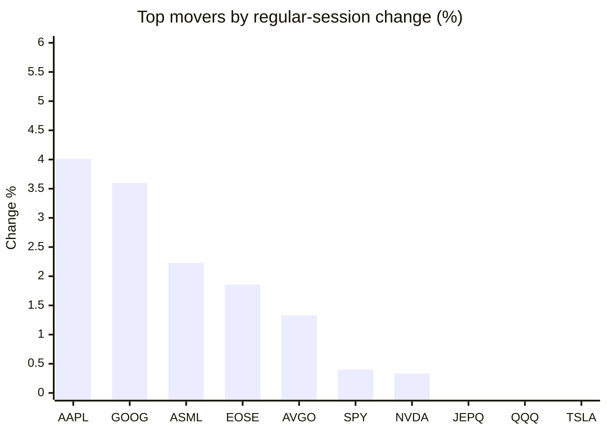
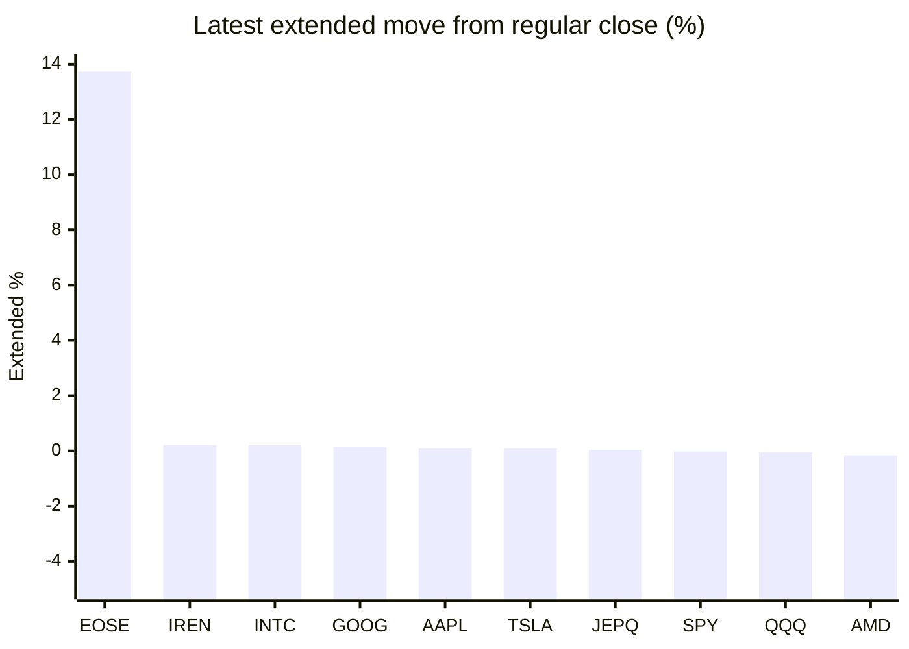

# Stock Brief - 2026-07-16

Generated at 2026-07-16 12:14 +07 from `watchlist.md`.
Prices are snapshots from Yahoo Finance public chart data. Extended/overnight is the latest available pre/post-market datapoint from the same feed.

## Market Snapshot

- SPY: close 754.81, latest extended 754.68, regular move +0.40%, extended move -0.02%
- QQQ: close 717.74, latest extended 717.41, regular move -0.27%, extended move -0.05%
- JEPQ: close 60.12, latest extended 60.14, regular move -0.12%, extended move +0.03%

## Watchlist Prices

| Ticker | Name | Regular close | Latest extended/overnight | Regular move | Extended move | Latest data time | Source |
|---|---|---:|---:|---:|---:|---|---|
| INTC | Intel Corporation | 102.99 USD | 103.20 USD | -4.43% | +0.20% | 2026-07-15 19:59 EDT | [Yahoo](https://finance.yahoo.com/quote/INTC/) |
| AVGO | Broadcom Inc. | 394.28 USD | 393.46 USD | +1.33% | -0.21% | 2026-07-15 19:59 EDT | [Yahoo](https://finance.yahoo.com/quote/AVGO/) |
| RKLB | Rocket Lab Corporation | 76.20 USD | 75.42 USD | -3.31% | -1.02% | 2026-07-15 19:59 EDT | [Yahoo](https://finance.yahoo.com/quote/RKLB/) |
| AAPL | Apple Inc. | 327.50 USD | 327.80 USD | +4.01% | +0.09% | 2026-07-15 19:59 EDT | [Yahoo](https://finance.yahoo.com/quote/AAPL/) |
| NVDA | NVIDIA Corporation | 212.50 USD | 211.25 USD | +0.33% | -0.59% | 2026-07-15 19:59 EDT | [Yahoo](https://finance.yahoo.com/quote/NVDA/) |
| TSLA | Tesla, Inc. | 394.46 USD | 394.80 USD | -0.43% | +0.09% | 2026-07-15 19:59 EDT | [Yahoo](https://finance.yahoo.com/quote/TSLA/) |
| SNDK | Sandisk Corporation | 1,615.00 USD | 1,575.00 USD | -8.12% | -2.48% | 2026-07-15 19:59 EDT | [Yahoo](https://finance.yahoo.com/quote/SNDK/) |
| QQQ | Invesco QQQ Trust, Series 1 | 717.74 USD | 717.41 USD | -0.27% | -0.05% | 2026-07-15 19:59 EDT | [Yahoo](https://finance.yahoo.com/quote/QQQ/) |
| SPY | State Street SPDR S&P 500 ETF T | 754.81 USD | 754.68 USD | +0.40% | -0.02% | 2026-07-15 19:59 EDT | [Yahoo](https://finance.yahoo.com/quote/SPY/) |
| JEPQ | JPMorgan Nasdaq Equity Premium  | 60.12 USD | 60.14 USD | -0.12% | +0.03% | 2026-07-15 19:59 EDT | [Yahoo](https://finance.yahoo.com/quote/JEPQ/) |
| ASTS | AST SpaceMobile, Inc. | 66.31 USD | 58.01 USD | -3.65% | -12.52% | 2026-07-15 19:59 EDT | [Yahoo](https://finance.yahoo.com/quote/ASTS/) |
| MU | Micron Technology, Inc. | 904.28 USD | 896.10 USD | -8.02% | -0.90% | 2026-07-15 19:59 EDT | [Yahoo](https://finance.yahoo.com/quote/MU/) |
| IREN | IREN LIMITED | 38.28 USD | 38.36 USD | -0.80% | +0.21% | 2026-07-15 19:59 EDT | [Yahoo](https://finance.yahoo.com/quote/IREN/) |
| EOSE | Eos Energy Enterprises, Inc. | 4.37 USD | 4.97 USD | +1.86% | +13.73% | 2026-07-15 19:59 EDT | [Yahoo](https://finance.yahoo.com/quote/EOSE/) |
| GOOG | Alphabet Inc. | 370.21 USD | 370.75 USD | +3.60% | +0.15% | 2026-07-15 20:00 EDT | [Yahoo](https://finance.yahoo.com/quote/GOOG/) |
| DRAM | Roundhill Memory ETF | 57.40 USD | 56.50 USD | -6.26% | -1.57% | 2026-07-15 19:59 EDT | [Yahoo](https://finance.yahoo.com/quote/DRAM/) |
| AMD | Advanced Micro Devices, Inc. | 529.14 USD | 528.27 USD | -3.46% | -0.16% | 2026-07-15 19:59 EDT | [Yahoo](https://finance.yahoo.com/quote/AMD/) |
| ASML | ASML Holding N.V. - New York Re | 1,815.27 USD | 1,809.49 USD | +2.23% | -0.32% | 2026-07-15 19:59 EDT | [Yahoo](https://finance.yahoo.com/quote/ASML/) |

## Charts

### Top Movers - Regular Session

### Extended / Overnight Move

### Quick Heatmap

| Group | Names in watchlist | Avg regular move | Avg extended move |
|---|---|---:|---:|
| Mega-cap tech | AVGO, AAPL, NVDA, TSLA, GOOG | +1.77% | -0.09% |
| Semis / memory | INTC, SNDK, MU, DRAM, AMD, ASML | -4.68% | -0.87% |
| Space / high beta | RKLB, ASTS, IREN, EOSE | -1.47% | +0.10% |
| ETFs | QQQ, SPY, JEPQ | +0.00% | -0.01% |

## News Headlines

- [QQQI Yields You Almost 14%, but Can It Survive a Dot-Com-Style Recession?](https://247wallst.com/investing/2026/07/16/qqqi-yields-you-almost-14-but-can-it-survive-a-dot-com-style-recession/?.tsrc=rss) (2026-07-16 12:04 Bangkok)
- [Nvidia partners with Japan robotics firms on AI development](https://finance.yahoo.com/technology/ai/articles/nvidia-partners-japan-robotics-firms-045556438.html?.tsrc=rss) (2026-07-16 11:55 Bangkok)
- [Veea Announces the VeeaONE Distributed Intelligence Platform, Enabling Cybersecure Sovereign Data Fabrics and Enterprise AI Grids for Physical AI](https://finance.yahoo.com/technology/ai/articles/veea-announces-veeaone-distributed-intelligence-043700382.html?.tsrc=rss) (2026-07-16 11:37 Bangkok)
- [Sandisk (SNDK) Launches Fab2 With Kioxia As BiCS10 Sampling Begins](https://finance.yahoo.com/markets/stocks/articles/sandisk-sndk-launches-fab2-kioxia-043328510.html?.tsrc=rss) (2026-07-16 11:33 Bangkok)
- [Prediction: Apple Will Become the Second Company in History to Reach a $5 Trillion Market Cap. Here's the Math.](https://www.fool.com/investing/2026/07/15/prediction-apple-will-become-just-the-second-compa/?.tsrc=rss) (2026-07-16 11:17 Bangkok)
- [Japan’s Robotics and Manufacturing Leaders Build on NVIDIA Cosmos to Advance Physical AI Frontier](https://finance.yahoo.com/technology/ai/articles/japan-robotics-manufacturing-leaders-build-034000583.html?.tsrc=rss) (2026-07-16 10:40 Bangkok)
- [Is Johnson & Johnson a Buy After Its Latest Earnings Report?](https://www.fool.com/investing/2026/07/15/is-johnson-johnson-a-buy-after-its-latest-earnings/?.tsrc=rss) (2026-07-16 10:39 Bangkok)
- [AAPL Stock Tops Nasdaq’s Modest Gains: Analyst Says Siri Finally Shows ‘AI Chops’ In iOS 27 Beta](https://stocktwits.com/news-articles/markets/equity/aapl-stock-tops-nasdaq-s-modest-gains-analyst-says-siri-finally-shows-ai-chops-in-i-os-27-beta/cZZ3x3yR7r8?.tsrc=rss) (2026-07-16 10:32 Bangkok)

## Caveats

- This is not investment advice. Extended-hours prices can be thin and volatile.
- Yahoo public endpoints may lag official exchange data.
