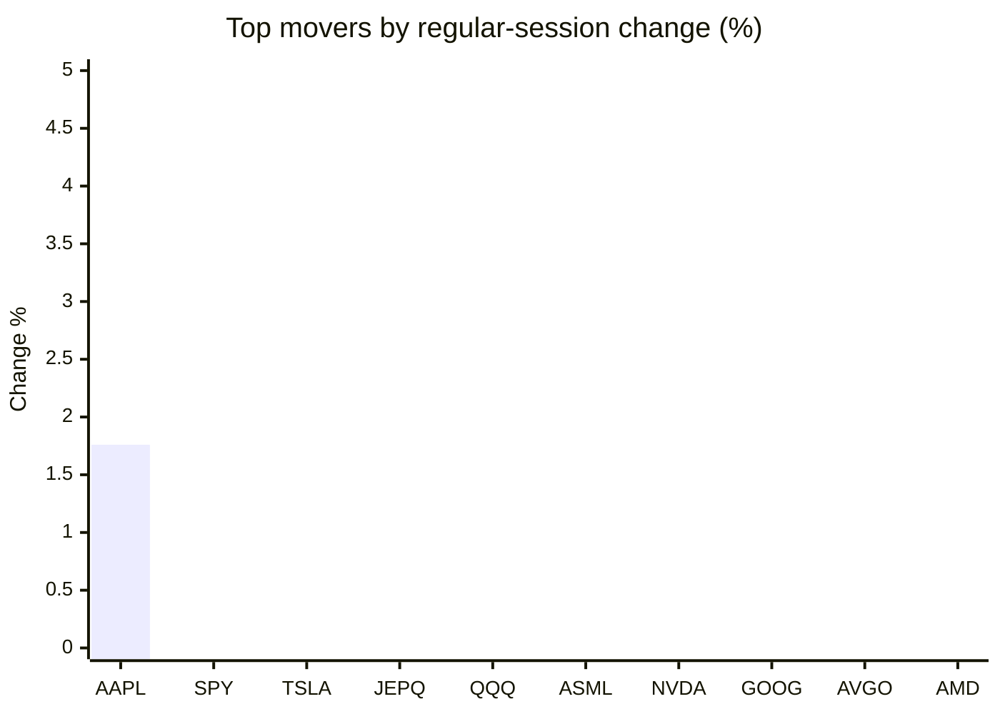
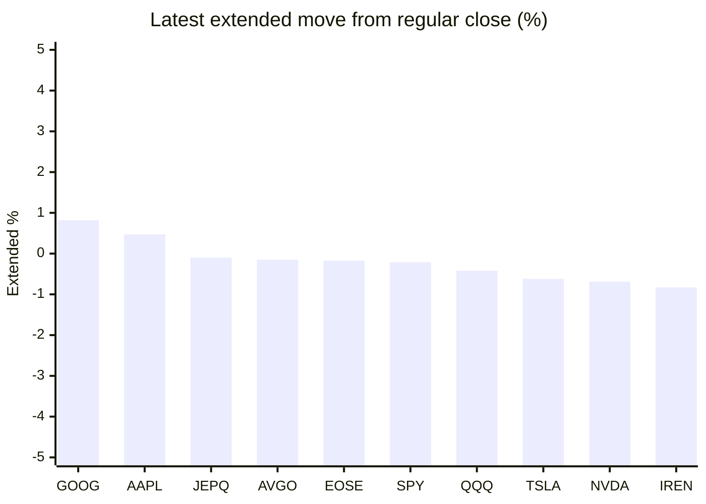

# Stock Brief - 2026-07-17

Generated at 2026-07-17 12:17 +07 from `watchlist.md`.
Prices are snapshots from Yahoo Finance public chart data. Extended/overnight is the latest available pre/post-market datapoint from the same feed.

## Market Snapshot

- SPY: close 750.72, latest extended 749.17, regular move -0.54%, extended move -0.21%
- QQQ: close 705.94, latest extended 702.94, regular move -1.64%, extended move -0.42%
- JEPQ: close 59.26, latest extended 59.20, regular move -1.43%, extended move -0.10%

## Watchlist Prices

| Ticker | Name | Regular close | Latest extended/overnight | Regular move | Extended move | Latest data time | Source |
|---|---|---:|---:|---:|---:|---|---|
| INTC | Intel Corporation | 96.98 USD | 95.17 USD | -5.84% | -1.87% | 2026-07-16 19:59 EDT | [Yahoo](https://finance.yahoo.com/quote/INTC/) |
| AVGO | Broadcom Inc. | 374.45 USD | 373.90 USD | -5.03% | -0.15% | 2026-07-16 19:59 EDT | [Yahoo](https://finance.yahoo.com/quote/AVGO/) |
| RKLB | Rocket Lab Corporation | 67.35 USD | 66.13 USD | -11.61% | -1.81% | 2026-07-16 19:59 EDT | [Yahoo](https://finance.yahoo.com/quote/RKLB/) |
| AAPL | Apple Inc. | 333.26 USD | 334.83 USD | +1.76% | +0.47% | 2026-07-16 19:59 EDT | [Yahoo](https://finance.yahoo.com/quote/AAPL/) |
| NVDA | NVIDIA Corporation | 207.40 USD | 205.97 USD | -2.40% | -0.69% | 2026-07-16 19:59 EDT | [Yahoo](https://finance.yahoo.com/quote/NVDA/) |
| TSLA | Tesla, Inc. | 391.06 USD | 388.65 USD | -0.86% | -0.62% | 2026-07-16 19:59 EDT | [Yahoo](https://finance.yahoo.com/quote/TSLA/) |
| SNDK | Sandisk Corporation | 1,411.08 USD | 1,366.00 USD | -12.63% | -3.19% | 2026-07-16 19:59 EDT | [Yahoo](https://finance.yahoo.com/quote/SNDK/) |
| QQQ | Invesco QQQ Trust, Series 1 | 705.94 USD | 702.94 USD | -1.64% | -0.42% | 2026-07-16 19:59 EDT | [Yahoo](https://finance.yahoo.com/quote/QQQ/) |
| SPY | State Street SPDR S&P 500 ETF T | 750.72 USD | 749.17 USD | -0.54% | -0.21% | 2026-07-16 19:59 EDT | [Yahoo](https://finance.yahoo.com/quote/SPY/) |
| JEPQ | JPMorgan Nasdaq Equity Premium  | 59.26 USD | 59.20 USD | -1.43% | -0.10% | 2026-07-16 19:59 EDT | [Yahoo](https://finance.yahoo.com/quote/JEPQ/) |
| ASTS | AST SpaceMobile, Inc. | 55.01 USD | 54.18 USD | -17.04% | -1.51% | 2026-07-16 19:59 EDT | [Yahoo](https://finance.yahoo.com/quote/ASTS/) |
| MU | Micron Technology, Inc. | 853.20 USD | 832.41 USD | -5.65% | -2.44% | 2026-07-16 19:59 EDT | [Yahoo](https://finance.yahoo.com/quote/MU/) |
| IREN | IREN LIMITED | 34.83 USD | 34.54 USD | -9.01% | -0.83% | 2026-07-16 19:59 EDT | [Yahoo](https://finance.yahoo.com/quote/IREN/) |
| EOSE | Eos Energy Enterprises, Inc. | 3.96 USD | 3.95 USD | -9.38% | -0.17% | 2026-07-16 19:59 EDT | [Yahoo](https://finance.yahoo.com/quote/EOSE/) |
| GOOG | Alphabet Inc. | 353.81 USD | 356.71 USD | -4.43% | +0.82% | 2026-07-16 19:59 EDT | [Yahoo](https://finance.yahoo.com/quote/GOOG/) |
| DRAM | Roundhill Memory ETF | 52.34 USD | 51.37 USD | -8.82% | -1.85% | 2026-07-16 19:59 EDT | [Yahoo](https://finance.yahoo.com/quote/DRAM/) |
| AMD | Advanced Micro Devices, Inc. | 500.94 USD | 494.30 USD | -5.33% | -1.33% | 2026-07-16 19:59 EDT | [Yahoo](https://finance.yahoo.com/quote/AMD/) |
| ASML | ASML Holding N.V. - New York Re | 1,784.87 USD | 1,769.48 USD | -1.67% | -0.86% | 2026-07-16 20:00 EDT | [Yahoo](https://finance.yahoo.com/quote/ASML/) |

## Charts

### Top Movers - Regular Session

### Extended / Overnight Move

### Quick Heatmap

| Group | Names in watchlist | Avg regular move | Avg extended move |
|---|---|---:|---:|
| Mega-cap tech | AVGO, AAPL, NVDA, TSLA, GOOG | -2.19% | -0.03% |
| Semis / memory | INTC, SNDK, MU, DRAM, AMD, ASML | -6.66% | -1.92% |
| Space / high beta | RKLB, ASTS, IREN, EOSE | -11.76% | -1.08% |
| ETFs | QQQ, SPY, JEPQ | -1.21% | -0.24% |

## News Headlines

- [Lucid Just Soared 29% After Calling Bankruptcy Rumors "Completely False." Here's What Its Balance Sheet Actually Shows.](https://www.fool.com/investing/2026/07/17/lucid-just-soared-29-after-calling-bankruptcy-rumo/?.tsrc=rss) (2026-07-17 12:01 Bangkok)
- [SpaceX, Alphabet, and SK Hynix Are Quietly Flashing a Bullish Signal Investors Should Not Ignore](https://www.fool.com/investing/2026/07/17/spacex-alphabet-and-sk-hynix-are-quietly-flashing/?.tsrc=rss) (2026-07-17 11:45 Bangkok)
- [NOK Stock Faces Worst Week In 5 Years – But Retail Traders Are Not Giving Up On Nokia’s 'AI RAN Technology' Push](https://stocktwits.com/news-articles/markets/equity/nok-stock-faces-worst-week-in-5-years-but-retail-traders-are-not-giving-up-on-nokia-s-ai-ran-technology-push/cZZ7dzoR7tJ?.tsrc=rss) (2026-07-17 11:34 Bangkok)
- [Down 26%, Is IBM Stock the Smartest Dividend Stock to Buy for the Second Half of 2026?](https://www.fool.com/investing/2026/07/17/down-26-is-ibm-stock-the-smartest-dividend-stock-t/?.tsrc=rss) (2026-07-17 11:20 Bangkok)
- [Chip Stock Selloff Deepens in Asia as TSMC Fails to Impress](https://finance.yahoo.com/markets/stocks/articles/chip-stock-selloff-deepens-asia-035114530.html?.tsrc=rss) (2026-07-17 10:51 Bangkok)
- [Netflix Reported Record Quarterly Revenue of $12.6 Billion, but Guidance Came in Below Expectations. Here’s What It Means for Investors.](https://www.fool.com/investing/2026/07/16/netflix-reported-record-quarterly-revenue-of-126-billion-but-guidance-came-in-below-expectations-heres-what-it-means-for-investors/?.tsrc=rss) (2026-07-17 10:49 Bangkok)
- [2 Stocks Down 44% and 30% to Buy Right Now and Hold for the Next Decade](https://www.fool.com/investing/2026/07/16/2-stocks-down-44-and-30-to-buy-right-now-and-hold/?.tsrc=rss) (2026-07-17 10:20 Bangkok)
- [Dow Jones Futures Fall, Netflix Dives, SpaceX Scrubs Launch After Latest AI Sell-Off](https://finance.yahoo.com/m/b5c1ad7a-e72b-3a9b-bb20-11f0979acb67/dow-jones-futures-fall%2C.html?.tsrc=rss) (2026-07-17 10:07 Bangkok)

## Caveats

- This is not investment advice. Extended-hours prices can be thin and volatile.
- Yahoo public endpoints may lag official exchange data.
