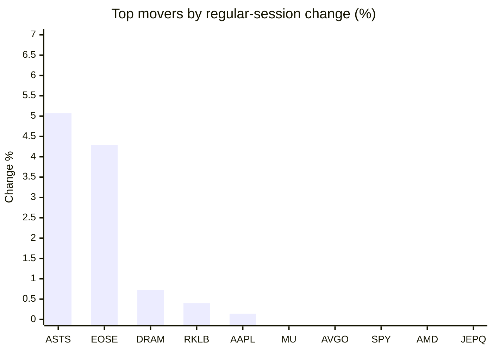
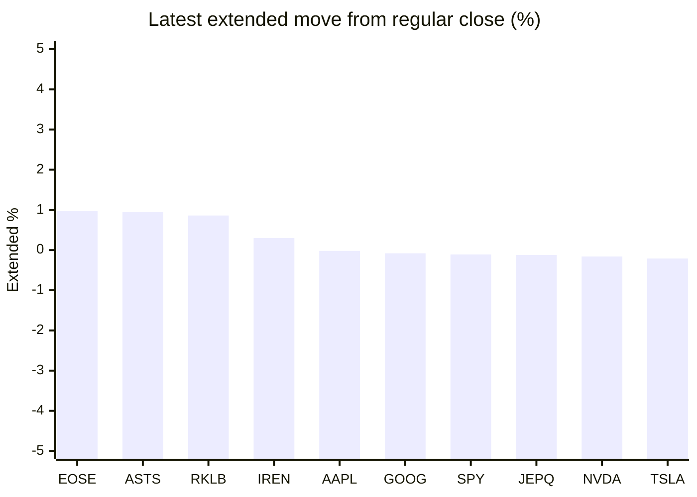

# Stock Brief - 2026-07-20

Generated at 2026-07-20 12:43 +07 from `watchlist.md`.
Prices are snapshots from Yahoo Finance public chart data. Extended/overnight is the latest available pre/post-market datapoint from the same feed.

## Market Snapshot

- SPY: close 743.29, latest extended 742.49, regular move -0.99%, extended move -0.11%
- QQQ: close 695.33, latest extended 693.76, regular move -1.50%, extended move -0.23%
- JEPQ: close 58.51, latest extended 58.44, regular move -1.27%, extended move -0.12%

## Watchlist Prices

| Ticker | Name | Regular close | Latest extended/overnight | Regular move | Extended move | Latest data time | Source |
|---|---|---:|---:|---:|---:|---|---|
| INTC | Intel Corporation | 95.04 USD | 93.97 USD | -2.00% | -1.13% | 2026-07-17 19:59 EDT | [Yahoo](https://finance.yahoo.com/quote/INTC/) |
| AVGO | Broadcom Inc. | 370.83 USD | 370.00 USD | -0.97% | -0.22% | 2026-07-17 19:59 EDT | [Yahoo](https://finance.yahoo.com/quote/AVGO/) |
| RKLB | Rocket Lab Corporation | 67.62 USD | 68.20 USD | +0.40% | +0.86% | 2026-07-17 19:59 EDT | [Yahoo](https://finance.yahoo.com/quote/RKLB/) |
| AAPL | Apple Inc. | 333.74 USD | 333.66 USD | +0.14% | -0.02% | 2026-07-17 19:59 EDT | [Yahoo](https://finance.yahoo.com/quote/AAPL/) |
| NVDA | NVIDIA Corporation | 202.81 USD | 202.49 USD | -2.21% | -0.16% | 2026-07-17 19:59 EDT | [Yahoo](https://finance.yahoo.com/quote/NVDA/) |
| TSLA | Tesla, Inc. | 380.84 USD | 380.03 USD | -2.61% | -0.21% | 2026-07-17 19:59 EDT | [Yahoo](https://finance.yahoo.com/quote/TSLA/) |
| SNDK | Sandisk Corporation | 1,354.82 USD | 1,350.21 USD | -3.99% | -0.34% | 2026-07-17 19:59 EDT | [Yahoo](https://finance.yahoo.com/quote/SNDK/) |
| QQQ | Invesco QQQ Trust, Series 1 | 695.33 USD | 693.76 USD | -1.50% | -0.23% | 2026-07-17 19:59 EDT | [Yahoo](https://finance.yahoo.com/quote/QQQ/) |
| SPY | State Street SPDR S&P 500 ETF T | 743.29 USD | 742.49 USD | -0.99% | -0.11% | 2026-07-17 19:59 EDT | [Yahoo](https://finance.yahoo.com/quote/SPY/) |
| JEPQ | JPMorgan Nasdaq Equity Premium  | 58.51 USD | 58.44 USD | -1.27% | -0.12% | 2026-07-17 19:59 EDT | [Yahoo](https://finance.yahoo.com/quote/JEPQ/) |
| ASTS | AST SpaceMobile, Inc. | 57.80 USD | 58.35 USD | +5.07% | +0.95% | 2026-07-17 19:59 EDT | [Yahoo](https://finance.yahoo.com/quote/ASTS/) |
| MU | Micron Technology, Inc. | 848.95 USD | 844.00 USD | -0.50% | -0.58% | 2026-07-17 19:59 EDT | [Yahoo](https://finance.yahoo.com/quote/MU/) |
| IREN | IREN LIMITED | 33.62 USD | 33.72 USD | -3.47% | +0.30% | 2026-07-17 19:59 EDT | [Yahoo](https://finance.yahoo.com/quote/IREN/) |
| EOSE | Eos Energy Enterprises, Inc. | 4.13 USD | 4.17 USD | +4.29% | +0.97% | 2026-07-17 19:59 EDT | [Yahoo](https://finance.yahoo.com/quote/EOSE/) |
| GOOG | Alphabet Inc. | 346.12 USD | 345.84 USD | -2.17% | -0.08% | 2026-07-17 19:59 EDT | [Yahoo](https://finance.yahoo.com/quote/GOOG/) |
| DRAM | Roundhill Memory ETF | 52.72 USD | 52.11 USD | +0.73% | -1.16% | 2026-07-17 19:59 EDT | [Yahoo](https://finance.yahoo.com/quote/DRAM/) |
| AMD | Advanced Micro Devices, Inc. | 495.76 USD | 492.50 USD | -1.03% | -0.66% | 2026-07-17 19:59 EDT | [Yahoo](https://finance.yahoo.com/quote/AMD/) |
| ASML | ASML Holding N.V. - New York Re | 1,747.58 USD | 1,741.31 USD | -2.09% | -0.36% | 2026-07-17 19:59 EDT | [Yahoo](https://finance.yahoo.com/quote/ASML/) |

## Charts

### Top Movers - Regular Session

### Extended / Overnight Move

### Quick Heatmap

| Group | Names in watchlist | Avg regular move | Avg extended move |
|---|---|---:|---:|
| Mega-cap tech | AVGO, AAPL, NVDA, TSLA, GOOG | -1.56% | -0.14% |
| Semis / memory | INTC, SNDK, MU, DRAM, AMD, ASML | -1.48% | -0.70% |
| Space / high beta | RKLB, ASTS, IREN, EOSE | +1.57% | +0.77% |
| ETFs | QQQ, SPY, JEPQ | -1.25% | -0.15% |

## News Headlines

- [Where Could Solana Be Headed Over the Next 3 Years?](https://www.fool.com/investing/2026/07/20/where-could-solana-be-headed-over-the-next-3-years/?.tsrc=rss) (2026-07-20 12:20 Bangkok)
- [Fed Chair Kevin Warsh Vowed to End 5 Years of High Inflation in First Congressional Testimony](https://www.fool.com/investing/2026/07/20/fed-chair-kevin-warsh-vowed-to-end-5-years-of-high/?.tsrc=rss) (2026-07-20 11:50 Bangkok)
- [Dow Jones Futures: Oil Prices Rise Amid Iran News; Google, Tesla Ahead](https://finance.yahoo.com/m/6c8dacfc-1037-32fc-a343-353600ff0076/dow-jones-futures%3A-oil-prices.html?.tsrc=rss) (2026-07-20 10:04 Bangkok)
- [Morgan Stanley Set a $300 Price Target on Elon Musk's SpaceX Stock](https://www.fool.com/investing/2026/07/19/morgan-stanley-set-a-300-price-target-on-elon-musk/?.tsrc=rss) (2026-07-20 09:50 Bangkok)
- [3 Reasons Circle Internet Group Could Soar in Value by 2030](https://www.fool.com/investing/2026/07/19/3-reasons-circle-internet-group-could-10x-in-value/?.tsrc=rss) (2026-07-20 09:35 Bangkok)
- [Micron's 30% Decline Is Dragging Down the iShares Semiconductor ETF (NASDAQ: SOXX). Here's a Low-Cost Vanguard ETF to Buy Instead.](https://www.fool.com/investing/2026/07/19/micron-30-decline-is-dragging-down-the-ishares-se/?.tsrc=rss) (2026-07-20 09:09 Bangkok)
- [Apple’s stunning Nvidia flip reveals where AI money is moving](https://www.thestreet.com/investing/apples-stunning-nvidia-flip-reveals-where-ai-money-is-moving?.tsrc=rss) (2026-07-20 09:03 Bangkok)
- [TSLA Stock Rises Overnight On Germany Ramp Ahead Of Q2: Analyst Sees 10% Delivery Jump This Year, Improving Margins](https://stocktwits.com/news-articles/markets/equity/tsla-germany-ramp-q2-analyst-delivery-jump-improving-margins/cZZLVILR7MZ?.tsrc=rss) (2026-07-20 08:57 Bangkok)

## Caveats

- This is not investment advice. Extended-hours prices can be thin and volatile.
- Yahoo public endpoints may lag official exchange data.
