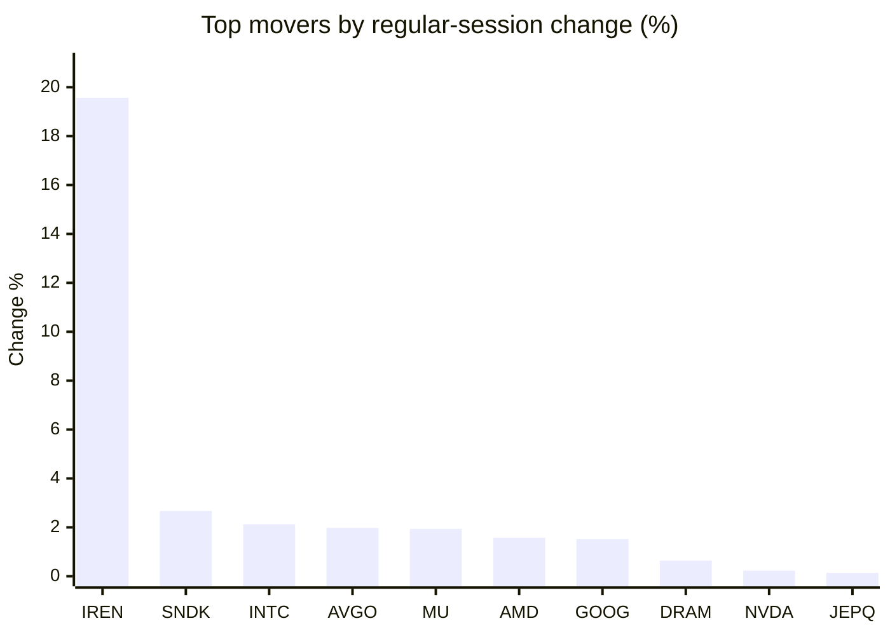
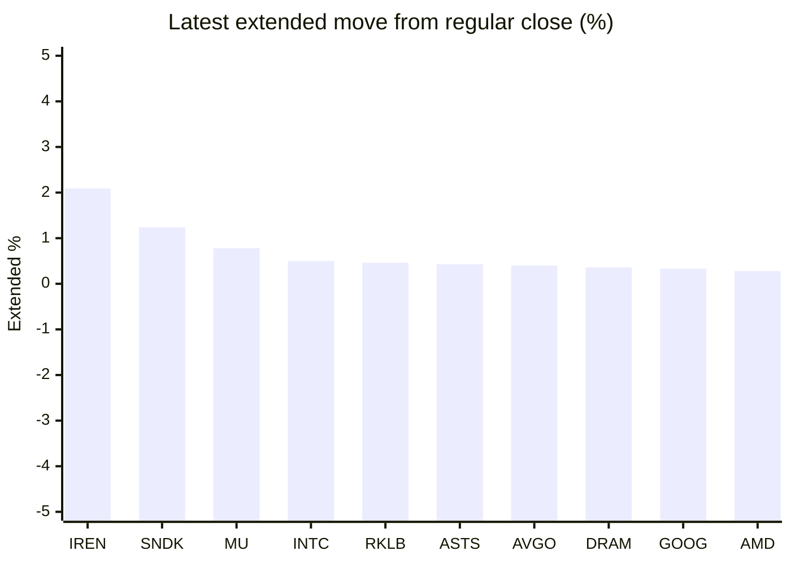

# Stock Brief - 2026-07-21

Generated at 2026-07-21 12:24 +07 from `watchlist.md`.
Prices are snapshots from Yahoo Finance public chart data. Extended/overnight is the latest available pre/post-market datapoint from the same feed.

## Market Snapshot

- SPY: close 742.09, latest extended 742.15, regular move -0.16%, extended move +0.01%
- QQQ: close 696.06, latest extended 695.86, regular move +0.10%, extended move -0.03%
- JEPQ: close 58.59, latest extended 58.70, regular move +0.14%, extended move +0.19%

## Watchlist Prices

| Ticker | Name | Regular close | Latest extended/overnight | Regular move | Extended move | Latest data time | Source |
|---|---|---:|---:|---:|---:|---|---|
| INTC | Intel Corporation | 97.06 USD | 97.55 USD | +2.13% | +0.50% | 2026-07-20 19:59 EDT | [Yahoo](https://finance.yahoo.com/quote/INTC/) |
| AVGO | Broadcom Inc. | 378.16 USD | 379.69 USD | +1.98% | +0.40% | 2026-07-20 19:59 EDT | [Yahoo](https://finance.yahoo.com/quote/AVGO/) |
| RKLB | Rocket Lab Corporation | 65.74 USD | 66.04 USD | -2.78% | +0.46% | 2026-07-20 19:59 EDT | [Yahoo](https://finance.yahoo.com/quote/RKLB/) |
| AAPL | Apple Inc. | 326.59 USD | 325.99 USD | -2.14% | -0.18% | 2026-07-20 19:59 EDT | [Yahoo](https://finance.yahoo.com/quote/AAPL/) |
| NVDA | NVIDIA Corporation | 203.28 USD | 203.09 USD | +0.23% | -0.09% | 2026-07-20 19:59 EDT | [Yahoo](https://finance.yahoo.com/quote/NVDA/) |
| TSLA | Tesla, Inc. | 369.57 USD | 370.50 USD | -2.96% | +0.25% | 2026-07-20 19:59 EDT | [Yahoo](https://finance.yahoo.com/quote/TSLA/) |
| SNDK | Sandisk Corporation | 1,390.95 USD | 1,408.24 USD | +2.67% | +1.24% | 2026-07-20 19:59 EDT | [Yahoo](https://finance.yahoo.com/quote/SNDK/) |
| QQQ | Invesco QQQ Trust, Series 1 | 696.06 USD | 695.86 USD | +0.10% | -0.03% | 2026-07-20 19:59 EDT | [Yahoo](https://finance.yahoo.com/quote/QQQ/) |
| SPY | State Street SPDR S&P 500 ETF T | 742.09 USD | 742.15 USD | -0.16% | +0.01% | 2026-07-20 19:59 EDT | [Yahoo](https://finance.yahoo.com/quote/SPY/) |
| JEPQ | JPMorgan Nasdaq Equity Premium  | 58.59 USD | 58.70 USD | +0.14% | +0.19% | 2026-07-20 19:59 EDT | [Yahoo](https://finance.yahoo.com/quote/JEPQ/) |
| ASTS | AST SpaceMobile, Inc. | 57.42 USD | 57.67 USD | -0.66% | +0.43% | 2026-07-20 19:59 EDT | [Yahoo](https://finance.yahoo.com/quote/ASTS/) |
| MU | Micron Technology, Inc. | 865.46 USD | 872.25 USD | +1.94% | +0.78% | 2026-07-20 19:59 EDT | [Yahoo](https://finance.yahoo.com/quote/MU/) |
| IREN | IREN LIMITED | 40.20 USD | 41.04 USD | +19.57% | +2.09% | 2026-07-20 19:59 EDT | [Yahoo](https://finance.yahoo.com/quote/IREN/) |
| EOSE | Eos Energy Enterprises, Inc. | 4.06 USD | 4.07 USD | -1.69% | +0.25% | 2026-07-20 19:57 EDT | [Yahoo](https://finance.yahoo.com/quote/EOSE/) |
| GOOG | Alphabet Inc. | 351.37 USD | 352.52 USD | +1.52% | +0.33% | 2026-07-20 19:59 EDT | [Yahoo](https://finance.yahoo.com/quote/GOOG/) |
| DRAM | Roundhill Memory ETF | 53.06 USD | 53.25 USD | +0.64% | +0.36% | 2026-07-20 19:59 EDT | [Yahoo](https://finance.yahoo.com/quote/DRAM/) |
| AMD | Advanced Micro Devices, Inc. | 503.57 USD | 505.00 USD | +1.58% | +0.28% | 2026-07-20 19:59 EDT | [Yahoo](https://finance.yahoo.com/quote/AMD/) |
| ASML | ASML Holding N.V. - New York Re | 1,739.02 USD | 1,738.00 USD | -0.49% | -0.06% | 2026-07-20 19:59 EDT | [Yahoo](https://finance.yahoo.com/quote/ASML/) |

## Charts

### Top Movers - Regular Session

### Extended / Overnight Move

### Quick Heatmap

| Group | Names in watchlist | Avg regular move | Avg extended move |
|---|---|---:|---:|
| Mega-cap tech | AVGO, AAPL, NVDA, TSLA, GOOG | -0.28% | +0.14% |
| Semis / memory | INTC, SNDK, MU, DRAM, AMD, ASML | +1.41% | +0.52% |
| Space / high beta | RKLB, ASTS, IREN, EOSE | +3.61% | +0.80% |
| ETFs | QQQ, SPY, JEPQ | +0.03% | +0.06% |

## News Headlines

- [Tesla (TSLA) Reports Q2: Everything You Need To Know Ahead Of Earnings](https://finance.yahoo.com/markets/stocks/articles/tesla-tsla-reports-q2-everything-051026350.html?.tsrc=rss) (2026-07-21 12:10 Bangkok)
- [Elon Musk's Tesla Delivered 480,126 Vehicles in Its Best Quarter in 2 Years](https://www.fool.com/investing/2026/07/21/elon-musks-tesla-delivered-480126-vehicles-in-its/?.tsrc=rss) (2026-07-21 11:50 Bangkok)
- [MU, SNDK Shake Off 3-Day Memory Slump: Retail Says Demand Narrative Is Intact](https://stocktwits.com/news-articles/markets/equity/mu-sndk-shake-off-3-day-memory-slump-retail-says-demand-narrative-is-intact/cZZ1DPQR7HK?.tsrc=rss) (2026-07-21 10:40 Bangkok)
- [Asia stocks up as chip stocks recover, oil eases](https://finance.yahoo.com/markets/world-indices/articles/asia-stocks-chip-stocks-recover-032902299.html?.tsrc=rss) (2026-07-21 10:29 Bangkok)
- [Cramer Says Dump Tech Before Intel, Tesla, Alphabet Earnings: Will Inverse-Cramer Strike?](https://beincrypto.com/cramer-dumps-tech-earnings-week/?.tsrc=rss) (2026-07-21 10:09 Bangkok)
- [Elon Musk just got a new rival on three fronts](https://www.thestreet.com/automotive/xpeng-rival-elon-musk-robots-robotaxis-flying-cars?.tsrc=rss) (2026-07-21 10:07 Bangkok)
- [SpaceX’s IPO Shine Fades, Taking ASTS And RKLB With It — But There Are 2 Surprise Winners This Month](https://stocktwits.com/news-articles/markets/equity/spacex-asts-rklb-2-surprise-winners-this-month/cZZ1w4pR7Hh?.tsrc=rss) (2026-07-21 10:05 Bangkok)
- [AI infrastructure stock surges after landing massive $2.8B win](https://www.thestreet.com/investing/stocks/iren-limited-stock-surges-2-billion-deal-microsoft-nvidia-perplexity-figure-ai?.tsrc=rss) (2026-07-21 09:47 Bangkok)

## Caveats

- This is not investment advice. Extended-hours prices can be thin and volatile.
- Yahoo public endpoints may lag official exchange data.
