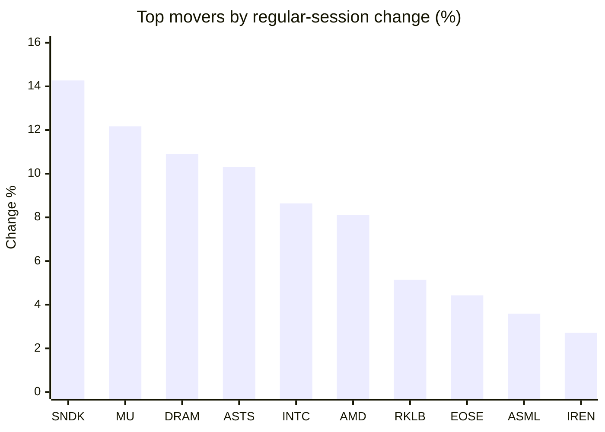
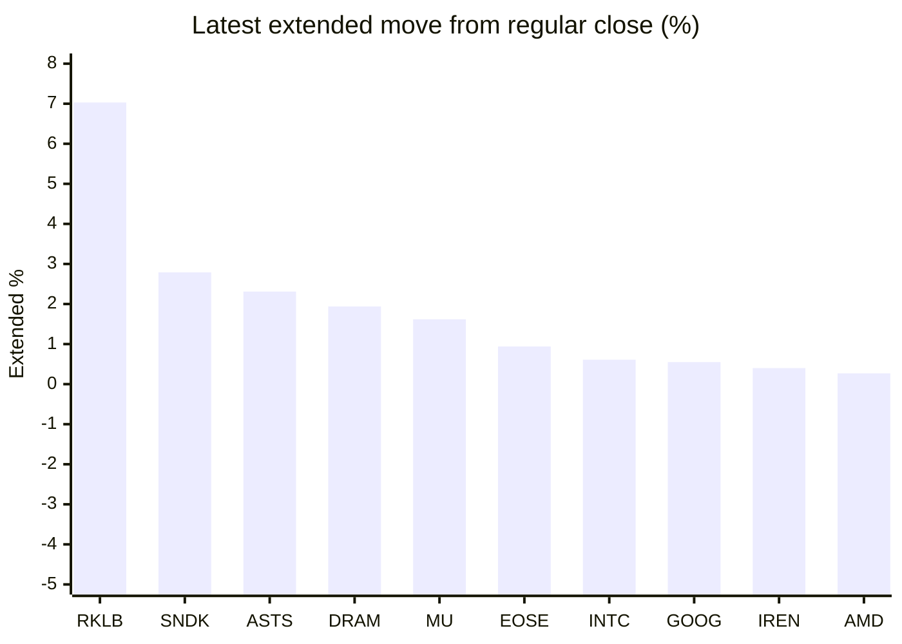

# Stock Brief - 2026-07-22

Generated at 2026-07-22 12:22 +07 from `watchlist.md`.
Prices are snapshots from Yahoo Finance public chart data. Extended/overnight is the latest available pre/post-market datapoint from the same feed.

## Market Snapshot

- SPY: close 748.28, latest extended 748.06, regular move +0.83%, extended move -0.03%
- QQQ: close 708.97, latest extended 708.62, regular move +1.85%, extended move -0.05%
- JEPQ: close 59.65, latest extended 59.60, regular move +1.81%, extended move -0.08%

## Watchlist Prices

| Ticker | Name | Regular close | Latest extended/overnight | Regular move | Extended move | Latest data time | Source |
|---|---|---:|---:|---:|---:|---|---|
| INTC | Intel Corporation | 105.45 USD | 106.09 USD | +8.64% | +0.61% | 2026-07-21 19:59 EDT | [Yahoo](https://finance.yahoo.com/quote/INTC/) |
| AVGO | Broadcom Inc. | 386.50 USD | 384.42 USD | +2.21% | -0.54% | 2026-07-21 19:59 EDT | [Yahoo](https://finance.yahoo.com/quote/AVGO/) |
| RKLB | Rocket Lab Corporation | 69.12 USD | 73.98 USD | +5.14% | +7.03% | 2026-07-21 19:59 EDT | [Yahoo](https://finance.yahoo.com/quote/RKLB/) |
| AAPL | Apple Inc. | 327.74 USD | 324.50 USD | +0.35% | -0.99% | 2026-07-21 19:59 EDT | [Yahoo](https://finance.yahoo.com/quote/AAPL/) |
| NVDA | NVIDIA Corporation | 207.29 USD | 206.35 USD | +1.97% | -0.45% | 2026-07-21 19:59 EDT | [Yahoo](https://finance.yahoo.com/quote/NVDA/) |
| TSLA | Tesla, Inc. | 378.93 USD | 379.50 USD | +2.53% | +0.15% | 2026-07-21 19:59 EDT | [Yahoo](https://finance.yahoo.com/quote/TSLA/) |
| SNDK | Sandisk Corporation | 1,589.40 USD | 1,633.68 USD | +14.27% | +2.79% | 2026-07-21 19:59 EDT | [Yahoo](https://finance.yahoo.com/quote/SNDK/) |
| QQQ | Invesco QQQ Trust, Series 1 | 708.97 USD | 708.62 USD | +1.85% | -0.05% | 2026-07-21 19:59 EDT | [Yahoo](https://finance.yahoo.com/quote/QQQ/) |
| SPY | State Street SPDR S&P 500 ETF T | 748.28 USD | 748.06 USD | +0.83% | -0.03% | 2026-07-21 19:59 EDT | [Yahoo](https://finance.yahoo.com/quote/SPY/) |
| JEPQ | JPMorgan Nasdaq Equity Premium  | 59.65 USD | 59.60 USD | +1.81% | -0.08% | 2026-07-21 19:59 EDT | [Yahoo](https://finance.yahoo.com/quote/JEPQ/) |
| ASTS | AST SpaceMobile, Inc. | 63.34 USD | 64.80 USD | +10.31% | +2.31% | 2026-07-21 19:59 EDT | [Yahoo](https://finance.yahoo.com/quote/ASTS/) |
| MU | Micron Technology, Inc. | 970.82 USD | 986.50 USD | +12.17% | +1.62% | 2026-07-21 19:59 EDT | [Yahoo](https://finance.yahoo.com/quote/MU/) |
| IREN | IREN LIMITED | 41.29 USD | 41.46 USD | +2.71% | +0.40% | 2026-07-21 19:59 EDT | [Yahoo](https://finance.yahoo.com/quote/IREN/) |
| EOSE | Eos Energy Enterprises, Inc. | 4.24 USD | 4.28 USD | +4.43% | +0.94% | 2026-07-21 19:59 EDT | [Yahoo](https://finance.yahoo.com/quote/EOSE/) |
| GOOG | Alphabet Inc. | 346.19 USD | 348.10 USD | -1.47% | +0.55% | 2026-07-21 19:59 EDT | [Yahoo](https://finance.yahoo.com/quote/GOOG/) |
| DRAM | Roundhill Memory ETF | 58.85 USD | 59.99 USD | +10.91% | +1.94% | 2026-07-21 19:59 EDT | [Yahoo](https://finance.yahoo.com/quote/DRAM/) |
| AMD | Advanced Micro Devices, Inc. | 544.43 USD | 545.88 USD | +8.11% | +0.27% | 2026-07-21 19:59 EDT | [Yahoo](https://finance.yahoo.com/quote/AMD/) |
| ASML | ASML Holding N.V. - New York Re | 1,801.51 USD | 1,802.00 USD | +3.59% | +0.03% | 2026-07-21 19:59 EDT | [Yahoo](https://finance.yahoo.com/quote/ASML/) |

## Charts

### Top Movers - Regular Session

### Extended / Overnight Move

### Quick Heatmap

| Group | Names in watchlist | Avg regular move | Avg extended move |
|---|---|---:|---:|
| Mega-cap tech | AVGO, AAPL, NVDA, TSLA, GOOG | +1.12% | -0.26% |
| Semis / memory | INTC, SNDK, MU, DRAM, AMD, ASML | +9.62% | +1.21% |
| Space / high beta | RKLB, ASTS, IREN, EOSE | +5.65% | +2.67% |
| ETFs | QQQ, SPY, JEPQ | +1.50% | -0.05% |

## News Headlines

- [ASML Lifts 2026 Outlook As High NA EUV Enters Intel Production Might Change The Case For Investing In ASML Holding (ENXTAM:ASML)](https://finance.yahoo.com/markets/stocks/articles/asml-lifts-2026-outlook-high-042931579.html?.tsrc=rss) (2026-07-22 11:29 Bangkok)
- [ASTS Stock Rises Overnight: CEO Says BlueBirds 8, 9 And 10 Are Fully Deployed — With 3 More Satellites Already At Cape](https://stocktwits.com/news-articles/markets/equity/asts-ceo-bluebirds-fully-deployed-3-satellites-cape/cZZm5SMR7w9?.tsrc=rss) (2026-07-22 11:27 Bangkok)
- [Why Upstart Stock Lost 19% in the First Half of 2026](https://www.fool.com/investing/2026/07/22/why-upstart-stock-lost-19-in-the-first-half-of-202/?.tsrc=rss) (2026-07-22 11:20 Bangkok)
- [Elon Musk Says the Short Sellers Betting Against SpaceX Have a "Very Low" Survival Probability. Their Bets Now Equal 32% of the Float.](https://www.fool.com/investing/2026/07/21/elon-musk-says-the-short-sellers-betting-against-s/?.tsrc=rss) (2026-07-22 10:43 Bangkok)
- [Is SK Hynix Buying Intel’s Ohio Fab? Korean Chipmaker Denies Report — Now All Eyes Are on Earnings](https://stocktwits.com/news-articles/markets/equity/s-sk-hynix-buying-intel-s-ohio-fab-korean-chipmaker-denies-report-now-all-eyes-are-on-earnings/cZZm2aDR7wJ?.tsrc=rss) (2026-07-22 10:42 Bangkok)
- [Why AMD Stock Jumped Today](https://www.fool.com/investing/2026/07/21/why-amd-stock-jumped-today/?.tsrc=rss) (2026-07-22 10:25 Bangkok)
- [SK Hynix Dismisses Intel Ohio Buyout Report: 'We Have No Plans for an Acquisition' (UPDATED)](https://finance.yahoo.com/markets/stocks/articles/sk-hynix-dismisses-intel-ohio-032029588.html?.tsrc=rss) (2026-07-22 10:20 Bangkok)
- [Dow Jones Futures: S&P 500 Regains 50-Day As Sandisk, Micron Soar; Google, Tesla Earnings Due](https://finance.yahoo.com/m/a3af1dc6-2e2e-3d9f-8f14-fa68af7a14c9/dow-jones-futures%3A-s%26p-500.html?.tsrc=rss) (2026-07-22 10:16 Bangkok)

## Caveats

- This is not investment advice. Extended-hours prices can be thin and volatile.
- Yahoo public endpoints may lag official exchange data.
