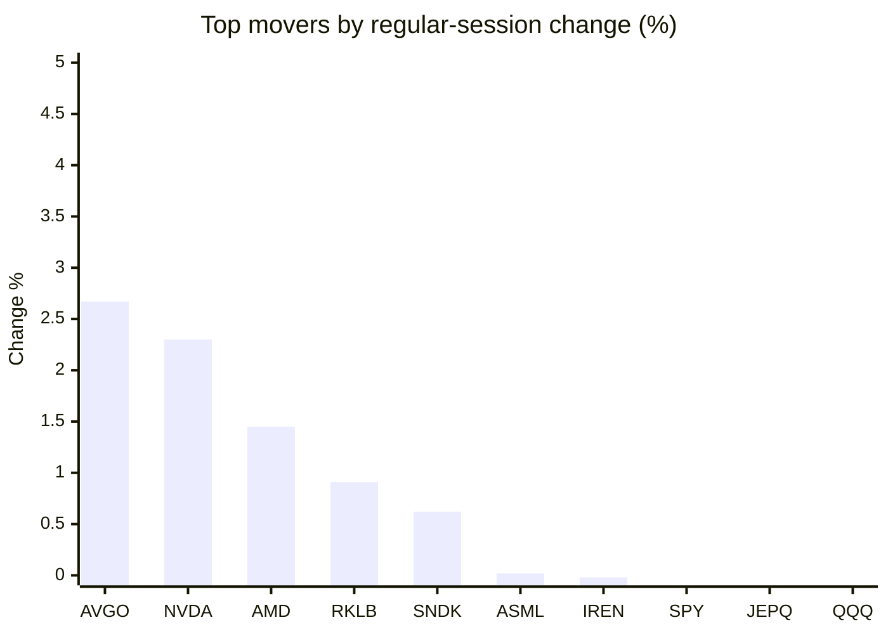
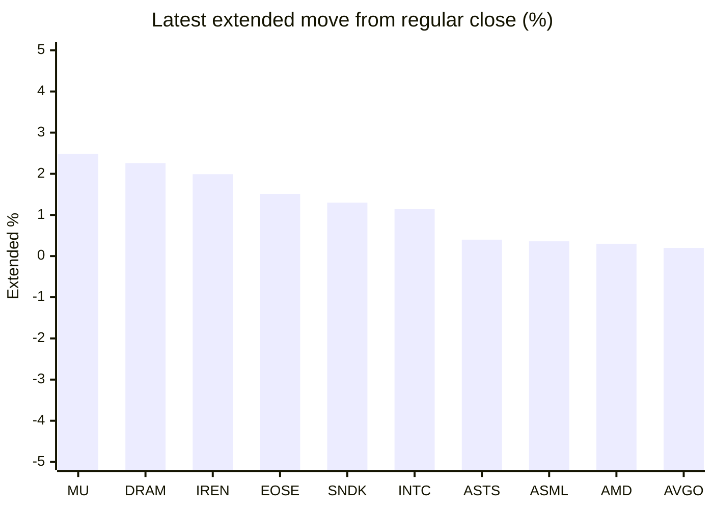

# Stock Brief - 2026-07-23

Generated at 2026-07-23 12:29 +07 from `watchlist.md`.
Prices are snapshots from Yahoo Finance public chart data. Extended/overnight is the latest available pre/post-market datapoint from the same feed.

## Market Snapshot

- SPY: close 747.41, latest extended 746.68, regular move -0.12%, extended move -0.10%
- QQQ: close 705.35, latest extended 704.78, regular move -0.51%, extended move -0.08%
- JEPQ: close 59.46, latest extended 59.46, regular move -0.32%, extended move +0.00%

## Watchlist Prices

| Ticker | Name | Regular close | Latest extended/overnight | Regular move | Extended move | Latest data time | Source |
|---|---|---:|---:|---:|---:|---|---|
| INTC | Intel Corporation | 102.62 USD | 103.79 USD | -2.68% | +1.14% | 2026-07-22 19:59 EDT | [Yahoo](https://finance.yahoo.com/quote/INTC/) |
| AVGO | Broadcom Inc. | 396.81 USD | 397.60 USD | +2.67% | +0.20% | 2026-07-22 19:59 EDT | [Yahoo](https://finance.yahoo.com/quote/AVGO/) |
| RKLB | Rocket Lab Corporation | 69.75 USD | 69.37 USD | +0.91% | -0.54% | 2026-07-22 19:59 EDT | [Yahoo](https://finance.yahoo.com/quote/RKLB/) |
| AAPL | Apple Inc. | 325.89 USD | 325.74 USD | -0.56% | -0.05% | 2026-07-22 19:59 EDT | [Yahoo](https://finance.yahoo.com/quote/AAPL/) |
| NVDA | NVIDIA Corporation | 212.06 USD | 212.04 USD | +2.30% | -0.01% | 2026-07-22 19:59 EDT | [Yahoo](https://finance.yahoo.com/quote/NVDA/) |
| TSLA | Tesla, Inc. | 374.01 USD | 358.80 USD | -1.30% | -4.07% | 2026-07-22 19:59 EDT | [Yahoo](https://finance.yahoo.com/quote/TSLA/) |
| SNDK | Sandisk Corporation | 1,599.27 USD | 1,620.00 USD | +0.62% | +1.30% | 2026-07-22 19:59 EDT | [Yahoo](https://finance.yahoo.com/quote/SNDK/) |
| QQQ | Invesco QQQ Trust, Series 1 | 705.35 USD | 704.78 USD | -0.51% | -0.08% | 2026-07-22 19:59 EDT | [Yahoo](https://finance.yahoo.com/quote/QQQ/) |
| SPY | State Street SPDR S&P 500 ETF T | 747.41 USD | 746.68 USD | -0.12% | -0.10% | 2026-07-22 19:59 EDT | [Yahoo](https://finance.yahoo.com/quote/SPY/) |
| JEPQ | JPMorgan Nasdaq Equity Premium  | 59.46 USD | 59.46 USD | -0.32% | +0.00% | 2026-07-22 19:59 EDT | [Yahoo](https://finance.yahoo.com/quote/JEPQ/) |
| ASTS | AST SpaceMobile, Inc. | 61.95 USD | 62.20 USD | -2.19% | +0.40% | 2026-07-22 19:59 EDT | [Yahoo](https://finance.yahoo.com/quote/ASTS/) |
| MU | Micron Technology, Inc. | 959.48 USD | 983.29 USD | -1.17% | +2.48% | 2026-07-22 19:59 EDT | [Yahoo](https://finance.yahoo.com/quote/MU/) |
| IREN | IREN LIMITED | 41.28 USD | 42.10 USD | -0.02% | +1.99% | 2026-07-22 19:59 EDT | [Yahoo](https://finance.yahoo.com/quote/IREN/) |
| EOSE | Eos Energy Enterprises, Inc. | 3.98 USD | 4.04 USD | -6.13% | +1.51% | 2026-07-22 19:59 EDT | [Yahoo](https://finance.yahoo.com/quote/EOSE/) |
| GOOG | Alphabet Inc. | 341.91 USD | 331.91 USD | -1.24% | -2.93% | 2026-07-22 19:59 EDT | [Yahoo](https://finance.yahoo.com/quote/GOOG/) |
| DRAM | Roundhill Memory ETF | 57.77 USD | 59.07 USD | -1.84% | +2.26% | 2026-07-22 19:59 EDT | [Yahoo](https://finance.yahoo.com/quote/DRAM/) |
| AMD | Advanced Micro Devices, Inc. | 552.33 USD | 554.00 USD | +1.45% | +0.30% | 2026-07-22 19:59 EDT | [Yahoo](https://finance.yahoo.com/quote/AMD/) |
| ASML | ASML Holding N.V. - New York Re | 1,801.86 USD | 1,808.43 USD | +0.02% | +0.36% | 2026-07-22 19:59 EDT | [Yahoo](https://finance.yahoo.com/quote/ASML/) |

## Charts

### Top Movers - Regular Session

### Extended / Overnight Move

### Quick Heatmap

| Group | Names in watchlist | Avg regular move | Avg extended move |
|---|---|---:|---:|
| Mega-cap tech | AVGO, AAPL, NVDA, TSLA, GOOG | +0.37% | -1.37% |
| Semis / memory | INTC, SNDK, MU, DRAM, AMD, ASML | -0.60% | +1.31% |
| Space / high beta | RKLB, ASTS, IREN, EOSE | -1.86% | +0.84% |
| ETFs | QQQ, SPY, JEPQ | -0.32% | -0.06% |

## News Headlines

- [Tesla Inc (TSLA) Q2 2026 Earnings Call Highlights: Record Deliveries and Strategic Investments ...](https://finance.yahoo.com/markets/stocks/articles/tesla-inc-tsla-q2-2026-050138649.html?.tsrc=rss) (2026-07-23 12:01 Bangkok)
- [Mega IPOs Like SpaceX Reshape Major Index Funds and ETFs](https://www.fool.com/investing/2026/07/23/mega-ipos-like-spacex-reshape-major-index-funds-an/?.tsrc=rss) (2026-07-23 11:50 Bangkok)
- [The American Chip Boom Picks Winners: TXN, INTC, and QRVO at Current Share Prices](https://247wallst.com/investing/2026/07/23/the-american-chip-boom-picks-winners-txn-intc-and-qrvo-at-current-prices/?.tsrc=rss) (2026-07-23 11:36 Bangkok)
- [NVIDIA is Acquiring ‘Dark Fiber’ Across the United States. Here’s Why That’s a Big Deal.](https://247wallst.com/investing/2026/07/23/nvidia-is-acquiring-dark-fiber-across-the-united-states-heres-why-thats-a-big-deal/?.tsrc=rss) (2026-07-23 11:16 Bangkok)
- [Jim Cramer reveals 4 surging chip stocks he likes best](https://www.thestreet.com/investing/stocks/micron-amd-intel-amat-jim-cramer-reveals-4-surging-chip-stocks-he-likes-best-ai-infrastructure?.tsrc=rss) (2026-07-23 11:03 Bangkok)
- [Prediction: Meta Platforms Will Soar on July 29 When It Makes This Announcement](https://www.fool.com/investing/2026/07/22/prediction-meta-platforms-will-soar-on-july-29-whe/?.tsrc=rss) (2026-07-23 10:53 Bangkok)
- [Jim Cramer's 'Finsuicide' Warning Says Chinese AI Accessing US Data Is a Bigger Threat Than Investors Realize: 'I Do Not Think That It Is a Total Coincidence...'](https://finance.yahoo.com/technology/ai/articles/jim-cramers-finsuicide-warning-says-033120765.html?.tsrc=rss) (2026-07-23 10:31 Bangkok)
- [Exclusive-Intel, AMD sign long-term server CPU deals with Chinese clients as prices surge, sources say](https://finance.yahoo.com/technology/articles/exclusive-intel-amd-sign-long-032439242.html?.tsrc=rss) (2026-07-23 10:24 Bangkok)

## Caveats

- This is not investment advice. Extended-hours prices can be thin and volatile.
- Yahoo public endpoints may lag official exchange data.
