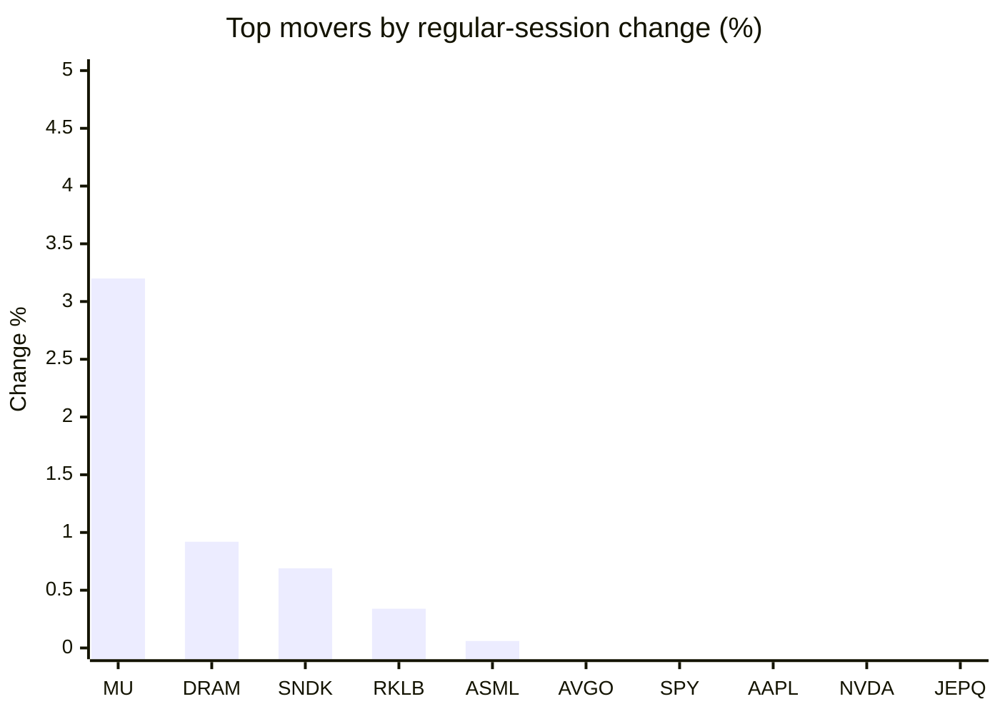
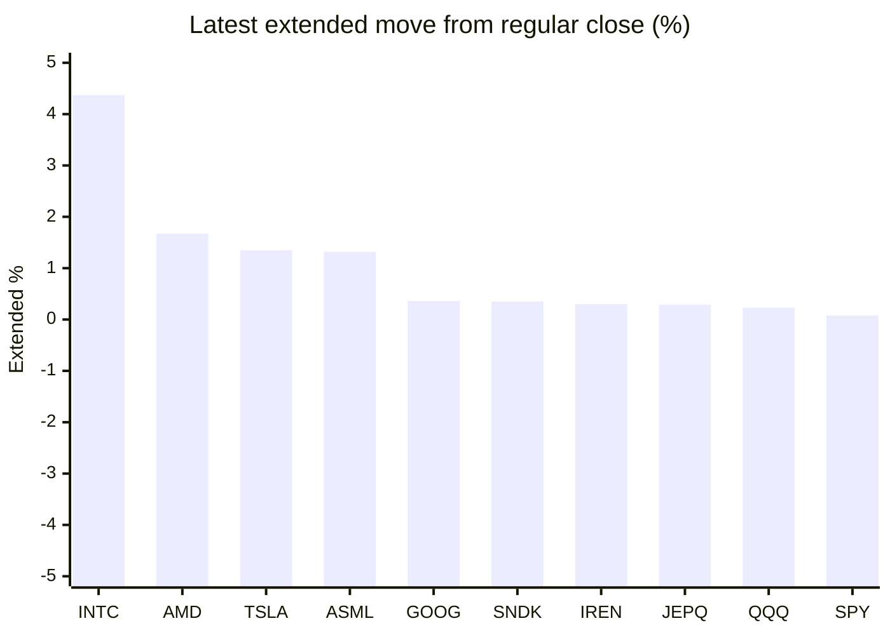

# Stock Brief - 2026-07-24

Generated at 2026-07-24 12:23 +07 from `watchlist.md`.
Prices are snapshots from Yahoo Finance public chart data. Extended/overnight is the latest available pre/post-market datapoint from the same feed.

## Market Snapshot

- SPY: close 738.18, latest extended 738.74, regular move -1.23%, extended move +0.08%
- QQQ: close 691.96, latest extended 693.54, regular move -1.90%, extended move +0.23%
- JEPQ: close 58.53, latest extended 58.70, regular move -1.56%, extended move +0.29%

## Watchlist Prices

| Ticker | Name | Regular close | Latest extended/overnight | Regular move | Extended move | Latest data time | Source |
|---|---|---:|---:|---:|---:|---|---|
| INTC | Intel Corporation | 100.23 USD | 104.61 USD | -2.33% | +4.37% | 2026-07-23 20:00 EDT | [Yahoo](https://finance.yahoo.com/quote/INTC/) |
| AVGO | Broadcom Inc. | 392.47 USD | 391.50 USD | -1.09% | -0.25% | 2026-07-23 19:59 EDT | [Yahoo](https://finance.yahoo.com/quote/AVGO/) |
| RKLB | Rocket Lab Corporation | 69.99 USD | 69.50 USD | +0.34% | -0.70% | 2026-07-23 19:59 EDT | [Yahoo](https://finance.yahoo.com/quote/RKLB/) |
| AAPL | Apple Inc. | 321.66 USD | 321.10 USD | -1.30% | -0.17% | 2026-07-23 19:59 EDT | [Yahoo](https://finance.yahoo.com/quote/AAPL/) |
| NVDA | NVIDIA Corporation | 208.76 USD | 207.99 USD | -1.56% | -0.37% | 2026-07-23 19:59 EDT | [Yahoo](https://finance.yahoo.com/quote/NVDA/) |
| TSLA | Tesla, Inc. | 319.69 USD | 324.00 USD | -14.52% | +1.35% | 2026-07-23 19:59 EDT | [Yahoo](https://finance.yahoo.com/quote/TSLA/) |
| SNDK | Sandisk Corporation | 1,610.33 USD | 1,615.99 USD | +0.69% | +0.35% | 2026-07-23 19:59 EDT | [Yahoo](https://finance.yahoo.com/quote/SNDK/) |
| QQQ | Invesco QQQ Trust, Series 1 | 691.96 USD | 693.54 USD | -1.90% | +0.23% | 2026-07-23 19:59 EDT | [Yahoo](https://finance.yahoo.com/quote/QQQ/) |
| SPY | State Street SPDR S&P 500 ETF T | 738.18 USD | 738.74 USD | -1.23% | +0.08% | 2026-07-23 19:59 EDT | [Yahoo](https://finance.yahoo.com/quote/SPY/) |
| JEPQ | JPMorgan Nasdaq Equity Premium  | 58.53 USD | 58.70 USD | -1.56% | +0.29% | 2026-07-23 19:59 EDT | [Yahoo](https://finance.yahoo.com/quote/JEPQ/) |
| ASTS | AST SpaceMobile, Inc. | 59.18 USD | 59.19 USD | -4.47% | +0.02% | 2026-07-23 19:59 EDT | [Yahoo](https://finance.yahoo.com/quote/ASTS/) |
| MU | Micron Technology, Inc. | 990.21 USD | 987.29 USD | +3.20% | -0.29% | 2026-07-23 19:59 EDT | [Yahoo](https://finance.yahoo.com/quote/MU/) |
| IREN | IREN LIMITED | 40.58 USD | 40.70 USD | -1.70% | +0.30% | 2026-07-23 19:59 EDT | [Yahoo](https://finance.yahoo.com/quote/IREN/) |
| EOSE | Eos Energy Enterprises, Inc. | 3.72 USD | 3.72 USD | -6.53% | -0.00% | 2026-07-23 19:59 EDT | [Yahoo](https://finance.yahoo.com/quote/EOSE/) |
| GOOG | Alphabet Inc. | 318.34 USD | 319.48 USD | -6.89% | +0.36% | 2026-07-23 19:59 EDT | [Yahoo](https://finance.yahoo.com/quote/GOOG/) |
| DRAM | Roundhill Memory ETF | 58.30 USD | 58.22 USD | +0.92% | -0.14% | 2026-07-23 19:59 EDT | [Yahoo](https://finance.yahoo.com/quote/DRAM/) |
| AMD | Advanced Micro Devices, Inc. | 539.69 USD | 548.70 USD | -2.29% | +1.67% | 2026-07-23 19:59 EDT | [Yahoo](https://finance.yahoo.com/quote/AMD/) |
| ASML | ASML Holding N.V. - New York Re | 1,803.00 USD | 1,826.71 USD | +0.06% | +1.32% | 2026-07-23 19:59 EDT | [Yahoo](https://finance.yahoo.com/quote/ASML/) |

## Charts

### Top Movers - Regular Session

### Extended / Overnight Move

### Quick Heatmap

| Group | Names in watchlist | Avg regular move | Avg extended move |
|---|---|---:|---:|
| Mega-cap tech | AVGO, AAPL, NVDA, TSLA, GOOG | -5.07% | +0.18% |
| Semis / memory | INTC, SNDK, MU, DRAM, AMD, ASML | +0.04% | +1.21% |
| Space / high beta | RKLB, ASTS, IREN, EOSE | -3.09% | -0.10% |
| ETFs | QQQ, SPY, JEPQ | -1.57% | +0.20% |

## News Headlines

- [Shares skid in Asia in sell-off of AI-related shares as Brent oil tops $100 per barrel](https://finance.yahoo.com/markets/articles/shares-skid-asia-sell-off-051338979.html?.tsrc=rss) (2026-07-24 12:13 Bangkok)
- [Intel Corp (INTC) Q2 2026 Earnings Call Highlights: Surpassing Expectations with Strong Revenue ...](https://finance.yahoo.com/markets/stocks/articles/intel-corp-intc-q2-2026-050108717.html?.tsrc=rss) (2026-07-24 12:01 Bangkok)
- [2 Top Growth Stocks to Buy Right Now Without Any Hesitation](https://www.fool.com/investing/2026/07/24/2-top-growth-stocks-to-buy-right-now-without-any-h/?.tsrc=rss) (2026-07-24 11:50 Bangkok)
- [Cathie Wood Just Bought More SpaceX Stock. Here's Why I Wouldn't Copy Her](https://www.fool.com/investing/2026/07/24/cathie-wood-just-bought-more-spacex-stock-heres-wh/?.tsrc=rss) (2026-07-24 11:35 Bangkok)
- [Nvidia Stock Is Barely Beating the S&P 500 Index in 2026 Despite Record Revenue. Here's What This Performance Might Suggest.](https://www.fool.com/investing/2026/07/24/nvidia-stock-is-barely-beating-the-sp-500-index-in/?.tsrc=rss) (2026-07-24 11:20 Bangkok)
- [MU Stock Loses Some Steam After Korea Chip Selloff — But Retail Is Eyeing Clean Rebound Above $1,000](https://stocktwits.com/news-articles/markets/equity/mu-stock-loses-some-steam-after-korea-chip-selloff-but-retail-is-eyeing-clean-rebound-above-1-000/cZZYSgYR7UC?.tsrc=rss) (2026-07-24 11:11 Bangkok)
- [3 Absurdly Cheap Dividend Stocks to Buy With $1,000 Right Now](https://www.fool.com/investing/2026/07/23/3-absurdly-cheap-dividend-stocks-to-buy-with-1000/?.tsrc=rss) (2026-07-24 10:50 Bangkok)
- [Alphabet Just Revealed a $94 Billion Stake in SpaceX -- and It Can't Sell a Single Share Yet](https://www.fool.com/investing/2026/07/23/alphabet-just-revealed-a-94-billion-stake-in-space/?.tsrc=rss) (2026-07-24 10:26 Bangkok)

## Caveats

- This is not investment advice. Extended-hours prices can be thin and volatile.
- Yahoo public endpoints may lag official exchange data.
