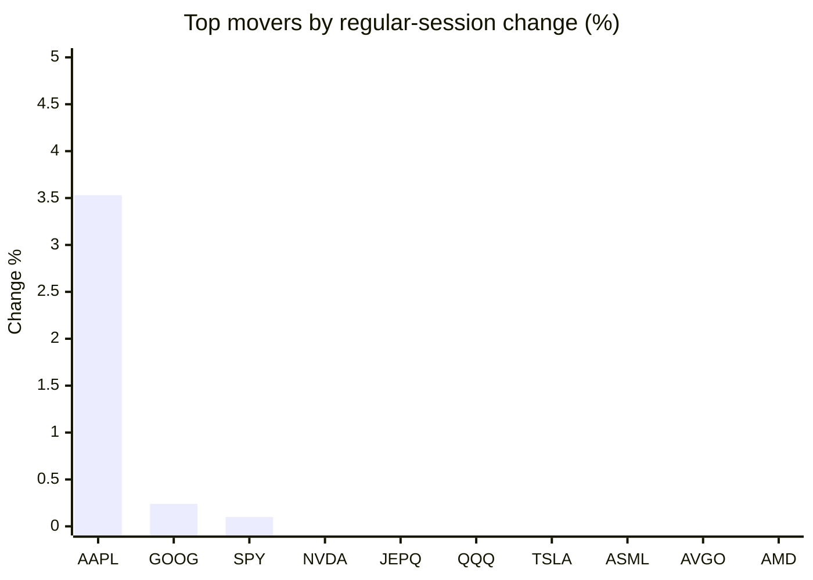
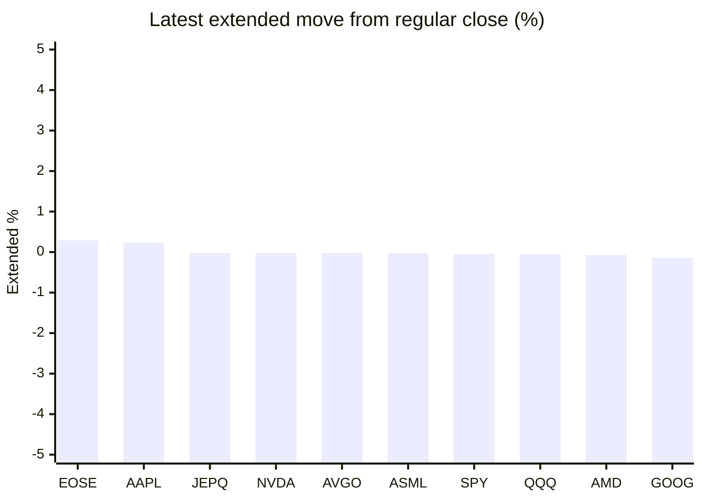

# Stock Brief - 2026-07-25

Generated at 2026-07-25 12:17 +07 from `watchlist.md`.
Prices are snapshots from Yahoo Finance public chart data. Extended/overnight is the latest available pre/post-market datapoint from the same feed.

## Market Snapshot

- SPY: close 738.93, latest extended 738.66, regular move +0.10%, extended move -0.04%
- QQQ: close 684.23, latest extended 683.96, regular move -1.12%, extended move -0.04%
- JEPQ: close 57.96, latest extended 57.95, regular move -0.97%, extended move -0.02%

## Watchlist Prices

| Ticker | Name | Regular close | Latest extended/overnight | Regular move | Extended move | Latest data time | Source |
|---|---|---:|---:|---:|---:|---|---|
| INTC | Intel Corporation | 92.32 USD | 91.53 USD | -7.89% | -0.85% | 2026-07-24 19:59 EDT | [Yahoo](https://finance.yahoo.com/quote/INTC/) |
| AVGO | Broadcom Inc. | 381.92 USD | 381.84 USD | -2.69% | -0.02% | 2026-07-24 19:59 EDT | [Yahoo](https://finance.yahoo.com/quote/AVGO/) |
| RKLB | Rocket Lab Corporation | 63.91 USD | 63.51 USD | -8.69% | -0.63% | 2026-07-24 19:59 EDT | [Yahoo](https://finance.yahoo.com/quote/RKLB/) |
| AAPL | Apple Inc. | 333.02 USD | 333.80 USD | +3.53% | +0.23% | 2026-07-24 19:59 EDT | [Yahoo](https://finance.yahoo.com/quote/AAPL/) |
| NVDA | NVIDIA Corporation | 206.84 USD | 206.80 USD | -0.92% | -0.02% | 2026-07-24 19:59 EDT | [Yahoo](https://finance.yahoo.com/quote/NVDA/) |
| TSLA | Tesla, Inc. | 313.03 USD | 311.38 USD | -2.08% | -0.53% | 2026-07-24 19:59 EDT | [Yahoo](https://finance.yahoo.com/quote/TSLA/) |
| SNDK | Sandisk Corporation | 1,436.56 USD | 1,433.01 USD | -10.79% | -0.25% | 2026-07-24 19:59 EDT | [Yahoo](https://finance.yahoo.com/quote/SNDK/) |
| QQQ | Invesco QQQ Trust, Series 1 | 684.23 USD | 683.96 USD | -1.12% | -0.04% | 2026-07-24 19:59 EDT | [Yahoo](https://finance.yahoo.com/quote/QQQ/) |
| SPY | State Street SPDR S&P 500 ETF T | 738.93 USD | 738.66 USD | +0.10% | -0.04% | 2026-07-24 19:59 EDT | [Yahoo](https://finance.yahoo.com/quote/SPY/) |
| JEPQ | JPMorgan Nasdaq Equity Premium  | 57.96 USD | 57.95 USD | -0.97% | -0.02% | 2026-07-24 19:59 EDT | [Yahoo](https://finance.yahoo.com/quote/JEPQ/) |
| ASTS | AST SpaceMobile, Inc. | 56.20 USD | 56.10 USD | -5.04% | -0.18% | 2026-07-24 19:59 EDT | [Yahoo](https://finance.yahoo.com/quote/ASTS/) |
| MU | Micron Technology, Inc. | 920.95 USD | 910.80 USD | -6.99% | -1.10% | 2026-07-24 19:59 EDT | [Yahoo](https://finance.yahoo.com/quote/MU/) |
| IREN | IREN LIMITED | 37.07 USD | 36.98 USD | -8.65% | -0.26% | 2026-07-24 19:59 EDT | [Yahoo](https://finance.yahoo.com/quote/IREN/) |
| EOSE | Eos Energy Enterprises, Inc. | 3.47 USD | 3.48 USD | -6.72% | +0.29% | 2026-07-24 19:59 EDT | [Yahoo](https://finance.yahoo.com/quote/EOSE/) |
| GOOG | Alphabet Inc. | 319.09 USD | 318.63 USD | +0.24% | -0.14% | 2026-07-24 19:59 EDT | [Yahoo](https://finance.yahoo.com/quote/GOOG/) |
| DRAM | Roundhill Memory ETF | 53.20 USD | 52.82 USD | -8.75% | -0.71% | 2026-07-24 19:59 EDT | [Yahoo](https://finance.yahoo.com/quote/DRAM/) |
| AMD | Advanced Micro Devices, Inc. | 521.95 USD | 521.60 USD | -3.29% | -0.07% | 2026-07-24 20:00 EDT | [Yahoo](https://finance.yahoo.com/quote/AMD/) |
| ASML | ASML Holding N.V. - New York Re | 1,757.09 USD | 1,756.50 USD | -2.55% | -0.03% | 2026-07-24 19:59 EDT | [Yahoo](https://finance.yahoo.com/quote/ASML/) |

## Charts

### Top Movers - Regular Session

### Extended / Overnight Move

### Quick Heatmap

| Group | Names in watchlist | Avg regular move | Avg extended move |
|---|---|---:|---:|
| Mega-cap tech | AVGO, AAPL, NVDA, TSLA, GOOG | -0.38% | -0.10% |
| Semis / memory | INTC, SNDK, MU, DRAM, AMD, ASML | -6.71% | -0.50% |
| Space / high beta | RKLB, ASTS, IREN, EOSE | -7.27% | -0.19% |
| ETFs | QQQ, SPY, JEPQ | -0.66% | -0.03% |

## News Headlines

- [NAVER, NVIDIA and Brookfield to Expand Korea’s National AI Factory Infrastructure Buildout](https://finance.yahoo.com/technology/ai/articles/naver-nvidia-brookfield-expand-korea-051000938.html?.tsrc=rss) (2026-07-25 12:10 Bangkok)
- [SK Group and NVIDIA Expand Strategic Partnership Across AI Factories and Next-Generation Memory](https://finance.yahoo.com/technology/ai/articles/sk-group-nvidia-expand-strategic-051000182.html?.tsrc=rss) (2026-07-25 12:10 Bangkok)
- [Bitcoin Just Hit a 30-Day High Above $65,000. Where Does BTC Go From Here?](https://www.fool.com/investing/2026/07/25/bitcoin-30-day-high-above-65000-btc-where-next/?.tsrc=rss) (2026-07-25 11:37 Bangkok)
- [Better Artificial Intelligence (AI) Buy: Micron Technology vs. Sandisk](https://www.fool.com/investing/2026/07/25/better-artificial-intelligence-ai-buy-micron-techn/?.tsrc=rss) (2026-07-25 11:20 Bangkok)
- [Should You Buy Roblox Stock Before July 30?](https://www.fool.com/investing/2026/07/24/should-you-buy-roblox-stock-before-july-30/?.tsrc=rss) (2026-07-25 11:16 Bangkok)
- [Trump faces Apple-Micron clash over Chinese memory chips - WSJ](https://finance.yahoo.com/economy/policy/articles/trump-faces-apple-micron-clash-030900453.html?.tsrc=rss) (2026-07-25 10:09 Bangkok)
- [Waymo vs. human drivers: Experts reveal which is safer](https://www.thestreet.com/automotive/waymo-vs-human-drivers-experts-reveal-which-is-safer?.tsrc=rss) (2026-07-25 10:07 Bangkok)
- [Why Apple Stock Is Up Today](https://www.fool.com/investing/2026/07/24/why-apple-stock-is-up-today/?.tsrc=rss) (2026-07-25 10:02 Bangkok)

## Caveats

- This is not investment advice. Extended-hours prices can be thin and volatile.
- Yahoo public endpoints may lag official exchange data.
