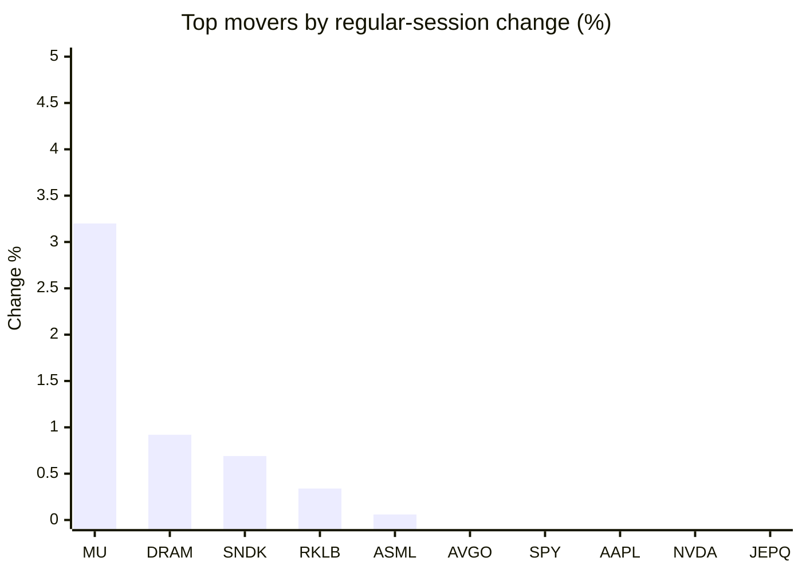
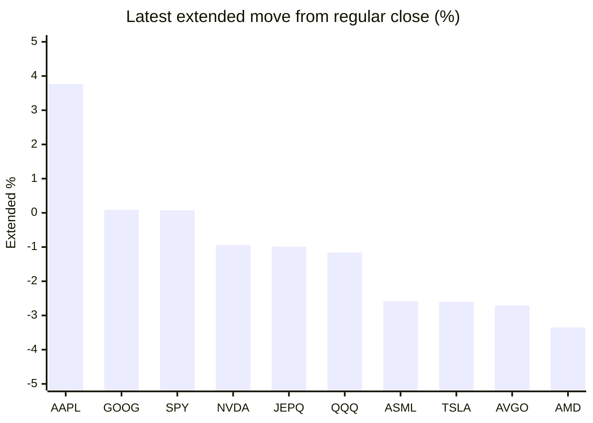

# Stock Brief - 2026-07-26

Generated at 2026-07-26 12:35 +07 from `watchlist.md`.
Prices are snapshots from Yahoo Finance public chart data. Extended/overnight is the latest available pre/post-market datapoint from the same feed.

## Market Snapshot

- SPY: close 738.18, latest extended 738.66, regular move -1.23%, extended move +0.07%
- QQQ: close 691.96, latest extended 683.96, regular move -1.90%, extended move -1.16%
- JEPQ: close 58.53, latest extended 57.95, regular move -1.56%, extended move -0.99%

## Watchlist Prices

| Ticker | Name | Regular close | Latest extended/overnight | Regular move | Extended move | Latest data time | Source |
|---|---|---:|---:|---:|---:|---|---|
| INTC | Intel Corporation | 100.23 USD | 91.53 USD | -2.33% | -8.68% | 2026-07-24 19:59 EDT | [Yahoo](https://finance.yahoo.com/quote/INTC/) |
| AVGO | Broadcom Inc. | 392.47 USD | 381.84 USD | -1.09% | -2.71% | 2026-07-24 19:59 EDT | [Yahoo](https://finance.yahoo.com/quote/AVGO/) |
| RKLB | Rocket Lab Corporation | 69.99 USD | 63.51 USD | +0.34% | -9.26% | 2026-07-24 19:59 EDT | [Yahoo](https://finance.yahoo.com/quote/RKLB/) |
| AAPL | Apple Inc. | 321.66 USD | 333.80 USD | -1.30% | +3.77% | 2026-07-24 19:59 EDT | [Yahoo](https://finance.yahoo.com/quote/AAPL/) |
| NVDA | NVIDIA Corporation | 208.76 USD | 206.80 USD | -1.56% | -0.94% | 2026-07-24 19:59 EDT | [Yahoo](https://finance.yahoo.com/quote/NVDA/) |
| TSLA | Tesla, Inc. | 319.69 USD | 311.38 USD | -14.52% | -2.60% | 2026-07-24 19:59 EDT | [Yahoo](https://finance.yahoo.com/quote/TSLA/) |
| SNDK | Sandisk Corporation | 1,610.33 USD | 1,433.01 USD | +0.69% | -11.01% | 2026-07-24 19:59 EDT | [Yahoo](https://finance.yahoo.com/quote/SNDK/) |
| QQQ | Invesco QQQ Trust, Series 1 | 691.96 USD | 683.96 USD | -1.90% | -1.16% | 2026-07-24 19:59 EDT | [Yahoo](https://finance.yahoo.com/quote/QQQ/) |
| SPY | State Street SPDR S&P 500 ETF T | 738.18 USD | 738.66 USD | -1.23% | +0.07% | 2026-07-24 19:59 EDT | [Yahoo](https://finance.yahoo.com/quote/SPY/) |
| JEPQ | JPMorgan Nasdaq Equity Premium  | 58.53 USD | 57.95 USD | -1.56% | -0.99% | 2026-07-24 19:59 EDT | [Yahoo](https://finance.yahoo.com/quote/JEPQ/) |
| ASTS | AST SpaceMobile, Inc. | 59.18 USD | 56.10 USD | -4.47% | -5.20% | 2026-07-24 19:59 EDT | [Yahoo](https://finance.yahoo.com/quote/ASTS/) |
| MU | Micron Technology, Inc. | 990.21 USD | 910.80 USD | +3.20% | -8.02% | 2026-07-24 19:59 EDT | [Yahoo](https://finance.yahoo.com/quote/MU/) |
| IREN | IREN LIMITED | 40.58 USD | 36.98 USD | -1.70% | -8.88% | 2026-07-24 19:59 EDT | [Yahoo](https://finance.yahoo.com/quote/IREN/) |
| EOSE | Eos Energy Enterprises, Inc. | 3.72 USD | 3.48 USD | -6.53% | -6.45% | 2026-07-24 19:59 EDT | [Yahoo](https://finance.yahoo.com/quote/EOSE/) |
| GOOG | Alphabet Inc. | 318.34 USD | 318.63 USD | -6.89% | +0.09% | 2026-07-24 19:59 EDT | [Yahoo](https://finance.yahoo.com/quote/GOOG/) |
| DRAM | Roundhill Memory ETF | 58.30 USD | 52.82 USD | +0.92% | -9.40% | 2026-07-24 19:59 EDT | [Yahoo](https://finance.yahoo.com/quote/DRAM/) |
| AMD | Advanced Micro Devices, Inc. | 539.69 USD | 521.60 USD | -2.29% | -3.35% | 2026-07-24 20:00 EDT | [Yahoo](https://finance.yahoo.com/quote/AMD/) |
| ASML | ASML Holding N.V. - New York Re | 1,803.00 USD | 1,756.50 USD | +0.06% | -2.58% | 2026-07-24 19:59 EDT | [Yahoo](https://finance.yahoo.com/quote/ASML/) |

## Charts

### Top Movers - Regular Session

### Extended / Overnight Move

### Quick Heatmap

| Group | Names in watchlist | Avg regular move | Avg extended move |
|---|---|---:|---:|
| Mega-cap tech | AVGO, AAPL, NVDA, TSLA, GOOG | -5.07% | -0.48% |
| Semis / memory | INTC, SNDK, MU, DRAM, AMD, ASML | +0.04% | -7.17% |
| Space / high beta | RKLB, ASTS, IREN, EOSE | -3.09% | -7.45% |
| ETFs | QQQ, SPY, JEPQ | -1.57% | -0.69% |

## News Headlines

- [Morgan Stanley resets Microsoft stock forecast ahead of earnings](https://www.thestreet.com/investing/stocks/morgan-stanley-microsoft-stock-forecast-ahead-of-earnings?.tsrc=rss) (2026-07-26 12:17 Bangkok)
- [President Trump's Strait of Hormuz Blockade Pushed the S&P 500 Down 0.79%](https://www.fool.com/investing/2026/07/26/president-trumps-strait-of-hormuz-blockade-pushed/?.tsrc=rss) (2026-07-26 11:50 Bangkok)
- [CXMT set for historic Shanghai debut after $9.8 billion IPO](https://finance.yahoo.com/markets/stocks/articles/cxmt-set-historic-shanghai-debut-043642218.html?.tsrc=rss) (2026-07-26 11:36 Bangkok)
- [3 Stocks Smart Quantum Computing Investors Are Buying](https://www.fool.com/investing/2026/07/26/3-stocks-smart-quantum-computing-investors-are-buy/?.tsrc=rss) (2026-07-26 11:20 Bangkok)
- [Some Investors Have Dropped Alphabet Stock Over the Delayed Release of Its Gemini 3.5 Pro Model. Here Are 900 Million Reasons Why They're Wrong.](https://www.fool.com/investing/2026/07/25/some-investors-have-dropped-alphabet-stock-over-th/?.tsrc=rss) (2026-07-26 10:35 Bangkok)
- [Cathie Wood buys $50.1 million of tumbling megacap stock](https://www.thestreet.com/investing/stocks/cathie-wood-buys-50-1-million-of-tumbling-megacap-stock-tesla-tsla?.tsrc=rss) (2026-07-26 09:47 Bangkok)
- [What Big Bank Earnings Just Revealed About the Health of the U.S. Consumer](https://www.fool.com/investing/2026/07/25/what-big-bank-earnings-just-revealed-about-the-hea/?.tsrc=rss) (2026-07-26 09:35 Bangkok)
- [Why RingCentral Stock Rocketed Higher This Week](https://www.fool.com/investing/2026/07/25/why-ringcentral-stock-rocketed-higher-this-week/?.tsrc=rss) (2026-07-26 09:08 Bangkok)

## Caveats

- This is not investment advice. Extended-hours prices can be thin and volatile.
- Yahoo public endpoints may lag official exchange data.
