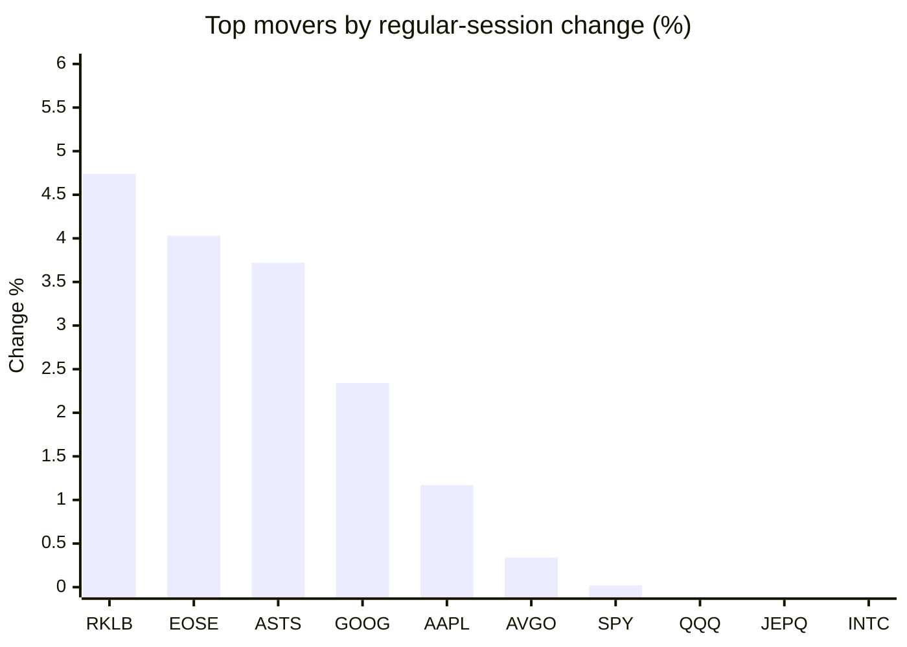
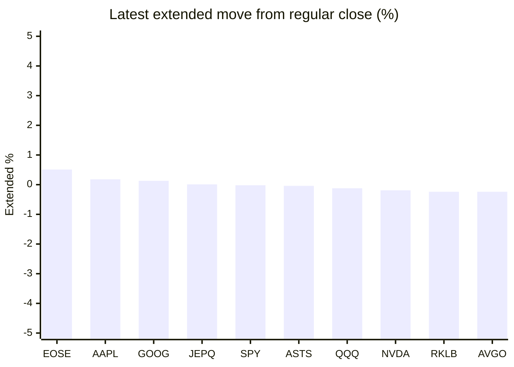

# Stock Brief - 2026-07-28

Generated at 2026-07-28 12:17 +07 from `watchlist.md`.
Prices are snapshots from Yahoo Finance public chart data. Extended/overnight is the latest available pre/post-market datapoint from the same feed.

## Market Snapshot

- SPY: close 739.09, latest extended 738.93, regular move +0.02%, extended move -0.02%
- QQQ: close 682.12, latest extended 681.33, regular move -0.31%, extended move -0.12%
- JEPQ: close 57.74, latest extended 57.75, regular move -0.38%, extended move +0.01%

## Watchlist Prices

| Ticker | Name | Regular close | Latest extended/overnight | Regular move | Extended move | Latest data time | Source |
|---|---|---:|---:|---:|---:|---|---|
| INTC | Intel Corporation | 91.67 USD | 90.96 USD | -0.70% | -0.77% | 2026-07-27 19:59 EDT | [Yahoo](https://finance.yahoo.com/quote/INTC/) |
| AVGO | Broadcom Inc. | 383.22 USD | 382.28 USD | +0.34% | -0.24% | 2026-07-27 19:59 EDT | [Yahoo](https://finance.yahoo.com/quote/AVGO/) |
| RKLB | Rocket Lab Corporation | 66.94 USD | 66.78 USD | +4.74% | -0.24% | 2026-07-27 19:59 EDT | [Yahoo](https://finance.yahoo.com/quote/RKLB/) |
| AAPL | Apple Inc. | 336.91 USD | 337.50 USD | +1.17% | +0.18% | 2026-07-27 19:59 EDT | [Yahoo](https://finance.yahoo.com/quote/AAPL/) |
| NVDA | NVIDIA Corporation | 196.51 USD | 196.14 USD | -4.99% | -0.19% | 2026-07-27 19:59 EDT | [Yahoo](https://finance.yahoo.com/quote/NVDA/) |
| TSLA | Tesla, Inc. | 309.22 USD | 308.10 USD | -1.22% | -0.36% | 2026-07-27 19:59 EDT | [Yahoo](https://finance.yahoo.com/quote/TSLA/) |
| SNDK | Sandisk Corporation | 1,278.23 USD | 1,246.54 USD | -11.02% | -2.48% | 2026-07-27 19:59 EDT | [Yahoo](https://finance.yahoo.com/quote/SNDK/) |
| QQQ | Invesco QQQ Trust, Series 1 | 682.12 USD | 681.33 USD | -0.31% | -0.12% | 2026-07-27 19:59 EDT | [Yahoo](https://finance.yahoo.com/quote/QQQ/) |
| SPY | State Street SPDR S&P 500 ETF T | 739.09 USD | 738.93 USD | +0.02% | -0.02% | 2026-07-27 19:59 EDT | [Yahoo](https://finance.yahoo.com/quote/SPY/) |
| JEPQ | JPMorgan Nasdaq Equity Premium  | 57.74 USD | 57.75 USD | -0.38% | +0.01% | 2026-07-27 19:59 EDT | [Yahoo](https://finance.yahoo.com/quote/JEPQ/) |
| ASTS | AST SpaceMobile, Inc. | 58.29 USD | 58.27 USD | +3.72% | -0.04% | 2026-07-27 19:59 EDT | [Yahoo](https://finance.yahoo.com/quote/ASTS/) |
| MU | Micron Technology, Inc. | 900.20 USD | 884.99 USD | -2.25% | -1.69% | 2026-07-27 19:59 EDT | [Yahoo](https://finance.yahoo.com/quote/MU/) |
| IREN | IREN LIMITED | 36.29 USD | 36.07 USD | -2.10% | -0.61% | 2026-07-27 19:59 EDT | [Yahoo](https://finance.yahoo.com/quote/IREN/) |
| EOSE | Eos Energy Enterprises, Inc. | 3.61 USD | 3.63 USD | +4.03% | +0.51% | 2026-07-27 19:59 EDT | [Yahoo](https://finance.yahoo.com/quote/EOSE/) |
| GOOG | Alphabet Inc. | 326.57 USD | 327.00 USD | +2.34% | +0.13% | 2026-07-27 19:59 EDT | [Yahoo](https://finance.yahoo.com/quote/GOOG/) |
| DRAM | Roundhill Memory ETF | 52.43 USD | 51.57 USD | -1.45% | -1.64% | 2026-07-27 19:59 EDT | [Yahoo](https://finance.yahoo.com/quote/DRAM/) |
| AMD | Advanced Micro Devices, Inc. | 494.95 USD | 491.48 USD | -5.17% | -0.70% | 2026-07-27 19:59 EDT | [Yahoo](https://finance.yahoo.com/quote/AMD/) |
| ASML | ASML Holding N.V. - New York Re | 1,655.26 USD | 1,648.98 USD | -5.80% | -0.38% | 2026-07-27 19:59 EDT | [Yahoo](https://finance.yahoo.com/quote/ASML/) |

## Charts

### Top Movers - Regular Session

### Extended / Overnight Move

### Quick Heatmap

| Group | Names in watchlist | Avg regular move | Avg extended move |
|---|---|---:|---:|
| Mega-cap tech | AVGO, AAPL, NVDA, TSLA, GOOG | -0.47% | -0.10% |
| Semis / memory | INTC, SNDK, MU, DRAM, AMD, ASML | -4.40% | -1.28% |
| Space / high beta | RKLB, ASTS, IREN, EOSE | +2.60% | -0.09% |
| ETFs | QQQ, SPY, JEPQ | -0.22% | -0.04% |

## News Headlines

- [Rocket Lab Debuts a Breakthrough Technology Investors Should Have on Their Radar](https://www.fool.com/investing/2026/07/28/rocket-lab-debuts-a-breakthrough-technology-invest/?.tsrc=rss) (2026-07-28 11:50 Bangkok)
- [Why Sandisk (SNDK) Is Down 8.1% After CXMT’s Blockbuster Shanghai IPO Intensifies Competition Concerns](https://finance.yahoo.com/markets/stocks/articles/why-sandisk-sndk-down-8-043035865.html?.tsrc=rss) (2026-07-28 11:30 Bangkok)
- [Micron Has Surged Nearly 700% Over the Past Year -- Here Is What the Valuation Says About Its Next Move](https://www.fool.com/investing/2026/07/28/micron-has-surged-nearly-700-over-the-past-year-he/?.tsrc=rss) (2026-07-28 11:20 Bangkok)
- [Is Tesla a Buy After Its Latest Earnings Report?](https://www.fool.com/investing/2026/07/27/is-tesla-a-buy-after-its-latest-earnings-report/?.tsrc=rss) (2026-07-28 11:16 Bangkok)
- [Nvidia behind $50 billion lease on Texas data center, FT reports](https://finance.yahoo.com/technology/articles/nvidia-behind-50-billion-lease-041340807.html?.tsrc=rss) (2026-07-28 11:13 Bangkok)
- [Bloom Energy Reports Earnings Tuesday and Is Still Up More Than 100% This Year.](https://www.fool.com/investing/2026/07/27/bloom-energy-reports-earnings-tuesday-and-is-still/?.tsrc=rss) (2026-07-28 11:12 Bangkok)
- [Cathie Wood’s ARK Buys The Dip As SpaceX Wipes Out Tesla-Sized Market Value Since Its Peak: Retail Bears Smell Blood](https://stocktwits.com/news-articles/markets/equity/cathie-wood-ark-spacex-tesla-sized-market-value-retail-bears-smell-blood/cZZC9sgRJGP?.tsrc=rss) (2026-07-28 11:04 Bangkok)
- [Why Nvidia Stock Fell Today](https://www.fool.com/investing/2026/07/27/why-nvidia-stock-nvda-fell-today/?.tsrc=rss) (2026-07-28 10:38 Bangkok)

## Caveats

- This is not investment advice. Extended-hours prices can be thin and volatile.
- Yahoo public endpoints may lag official exchange data.
