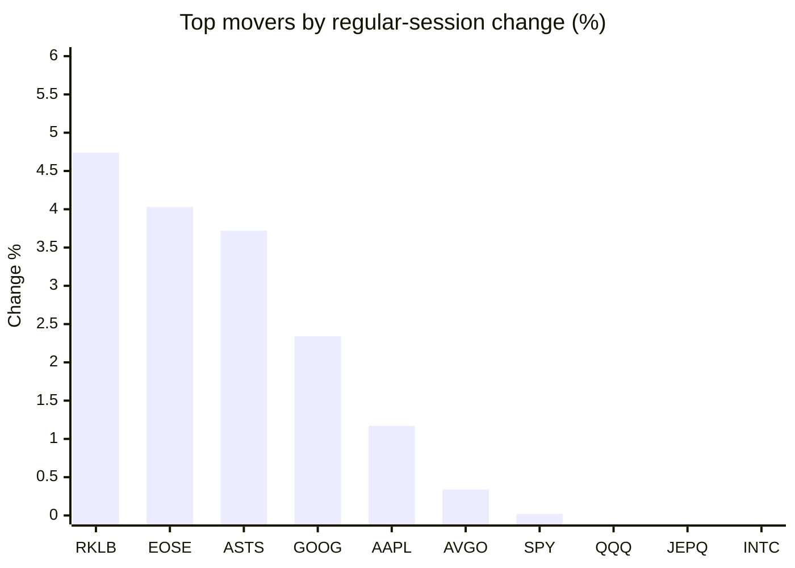
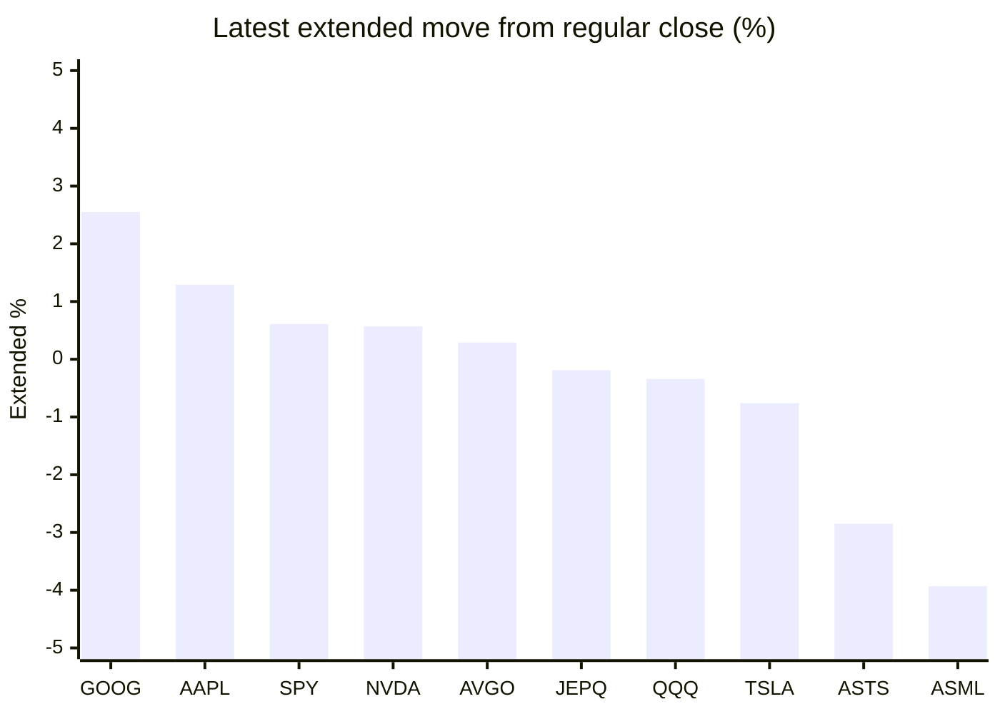

# Stock Brief - 2026-07-29

Generated at 2026-07-29 12:25 +07 from `watchlist.md`.
Prices are snapshots from Yahoo Finance public chart data. Extended/overnight is the latest available pre/post-market datapoint from the same feed.

## Market Snapshot

- SPY: close 739.09, latest extended 743.62, regular move +0.02%, extended move +0.61%
- QQQ: close 682.12, latest extended 679.80, regular move -0.31%, extended move -0.34%
- JEPQ: close 57.74, latest extended 57.63, regular move -0.38%, extended move -0.19%

## Watchlist Prices

| Ticker | Name | Regular close | Latest extended/overnight | Regular move | Extended move | Latest data time | Source |
|---|---|---:|---:|---:|---:|---|---|
| INTC | Intel Corporation | 91.67 USD | 87.54 USD | -0.70% | -4.51% | 2026-07-28 19:59 EDT | [Yahoo](https://finance.yahoo.com/quote/INTC/) |
| AVGO | Broadcom Inc. | 383.22 USD | 384.34 USD | +0.34% | +0.29% | 2026-07-28 19:59 EDT | [Yahoo](https://finance.yahoo.com/quote/AVGO/) |
| RKLB | Rocket Lab Corporation | 66.94 USD | 63.70 USD | +4.74% | -4.84% | 2026-07-28 19:59 EDT | [Yahoo](https://finance.yahoo.com/quote/RKLB/) |
| AAPL | Apple Inc. | 336.91 USD | 341.25 USD | +1.17% | +1.29% | 2026-07-28 19:59 EDT | [Yahoo](https://finance.yahoo.com/quote/AAPL/) |
| NVDA | NVIDIA Corporation | 196.51 USD | 197.63 USD | -4.99% | +0.57% | 2026-07-28 19:59 EDT | [Yahoo](https://finance.yahoo.com/quote/NVDA/) |
| TSLA | Tesla, Inc. | 309.22 USD | 306.86 USD | -1.22% | -0.76% | 2026-07-28 19:59 EDT | [Yahoo](https://finance.yahoo.com/quote/TSLA/) |
| SNDK | Sandisk Corporation | 1,278.23 USD | 1,118.77 USD | -11.02% | -12.48% | 2026-07-28 19:59 EDT | [Yahoo](https://finance.yahoo.com/quote/SNDK/) |
| QQQ | Invesco QQQ Trust, Series 1 | 682.12 USD | 679.80 USD | -0.31% | -0.34% | 2026-07-28 19:59 EDT | [Yahoo](https://finance.yahoo.com/quote/QQQ/) |
| SPY | State Street SPDR S&P 500 ETF T | 739.09 USD | 743.62 USD | +0.02% | +0.61% | 2026-07-28 19:59 EDT | [Yahoo](https://finance.yahoo.com/quote/SPY/) |
| JEPQ | JPMorgan Nasdaq Equity Premium  | 57.74 USD | 57.63 USD | -0.38% | -0.19% | 2026-07-28 19:59 EDT | [Yahoo](https://finance.yahoo.com/quote/JEPQ/) |
| ASTS | AST SpaceMobile, Inc. | 58.29 USD | 56.63 USD | +3.72% | -2.85% | 2026-07-28 19:59 EDT | [Yahoo](https://finance.yahoo.com/quote/ASTS/) |
| MU | Micron Technology, Inc. | 900.20 USD | 830.75 USD | -2.25% | -7.71% | 2026-07-28 19:59 EDT | [Yahoo](https://finance.yahoo.com/quote/MU/) |
| IREN | IREN LIMITED | 36.29 USD | 34.05 USD | -2.10% | -6.17% | 2026-07-28 19:59 EDT | [Yahoo](https://finance.yahoo.com/quote/IREN/) |
| EOSE | Eos Energy Enterprises, Inc. | 3.61 USD | 3.42 USD | +4.03% | -5.26% | 2026-07-28 19:59 EDT | [Yahoo](https://finance.yahoo.com/quote/EOSE/) |
| GOOG | Alphabet Inc. | 326.57 USD | 334.89 USD | +2.34% | +2.55% | 2026-07-28 19:59 EDT | [Yahoo](https://finance.yahoo.com/quote/GOOG/) |
| DRAM | Roundhill Memory ETF | 52.43 USD | 48.51 USD | -1.45% | -7.48% | 2026-07-28 19:59 EDT | [Yahoo](https://finance.yahoo.com/quote/DRAM/) |
| AMD | Advanced Micro Devices, Inc. | 494.95 USD | 460.40 USD | -5.17% | -6.98% | 2026-07-28 19:59 EDT | [Yahoo](https://finance.yahoo.com/quote/AMD/) |
| ASML | ASML Holding N.V. - New York Re | 1,655.26 USD | 1,590.18 USD | -5.80% | -3.93% | 2026-07-28 19:59 EDT | [Yahoo](https://finance.yahoo.com/quote/ASML/) |

## Charts

### Top Movers - Regular Session

### Extended / Overnight Move

### Quick Heatmap

| Group | Names in watchlist | Avg regular move | Avg extended move |
|---|---|---:|---:|
| Mega-cap tech | AVGO, AAPL, NVDA, TSLA, GOOG | -0.47% | +0.79% |
| Semis / memory | INTC, SNDK, MU, DRAM, AMD, ASML | -4.40% | -7.18% |
| Space / high beta | RKLB, ASTS, IREN, EOSE | +2.60% | -4.78% |
| ETFs | QQQ, SPY, JEPQ | -0.22% | +0.03% |

## News Headlines

- [Micron (MU) Stock Looks Above Fair Value On Cash Flow But Below Fair Value On Earnings](https://finance.yahoo.com/markets/stocks/articles/micron-mu-stock-looks-above-050834585.html?.tsrc=rss) (2026-07-29 12:08 Bangkok)
- [Micron CEO Sells More Stock Under Trading Plan As Memory Downturn Deepens](https://stocktwits.com/news-articles/markets/equity/micron-ceo-sells-more-stock-under-trading-plan-as-memory-downturn-deepens/cZNRjSIRJR3?.tsrc=rss) (2026-07-29 12:03 Bangkok)
- [A Tired Tech Trade Looks Set to Sink the Stock Market](https://finance.yahoo.com/m/1d5af187-c9ad-3635-bb86-7e61a0e8e64f/a-tired-tech-trade-looks-set.html?.tsrc=rss) (2026-07-29 12:00 Bangkok)
- [Stocks making big moves yesterday: Zoom, TransDigm, Elastic, Rocket Lab, and Tyson Foods](https://finance.yahoo.com/markets/stocks/articles/stocks-making-big-moves-yesterday-041302750.html?.tsrc=rss) (2026-07-29 11:13 Bangkok)
- [Qualcomm Is Down 37% From Its High and Reports Wednesday. Is the Stock a Buy?](https://www.fool.com/investing/2026/07/28/qualcomm-is-down-37-from-its-high-and-reports-wedn/?.tsrc=rss) (2026-07-29 11:07 Bangkok)
- [Gary Black Warns Tesla Stock Could Break Below $300, SpaceX Below $100 As AI Valuations Come Under Pressure](https://finance.yahoo.com/markets/stocks/articles/gary-black-warns-tesla-stock-040440681.html?.tsrc=rss) (2026-07-29 11:04 Bangkok)
- [SpaceX stock sends investors a signal they need to see](https://www.thestreet.com/investing/stocks/spacex-stock-investor-signal-price-decline?.tsrc=rss) (2026-07-29 11:03 Bangkok)
- [Is Avis Budget Group a Buy After Its Latest Earnings Report?](https://www.fool.com/investing/2026/07/28/is-avis-budget-group-a-buy-after-its-latest-earnings-report/?.tsrc=rss) (2026-07-29 10:59 Bangkok)

## Caveats

- This is not investment advice. Extended-hours prices can be thin and volatile.
- Yahoo public endpoints may lag official exchange data.
