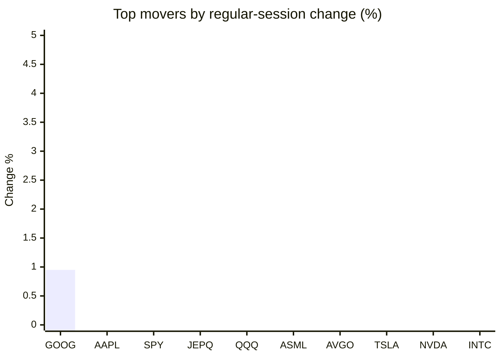
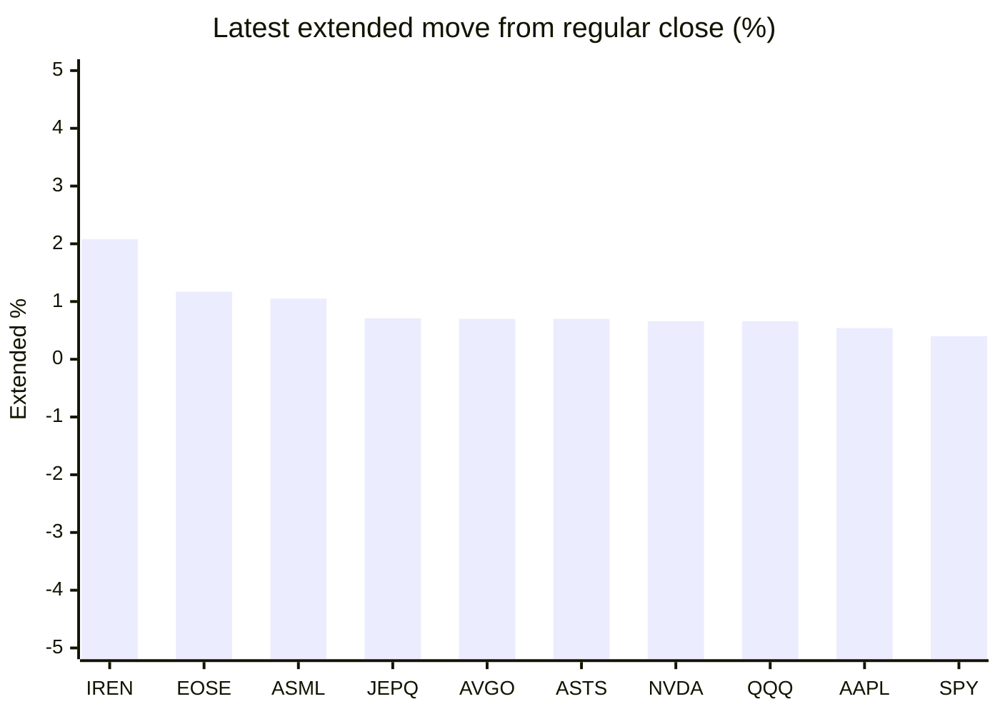

# Stock Brief - 2026-07-30

Generated at 2026-07-30 12:12 +07 from `watchlist.md`.
Prices are snapshots from Yahoo Finance public chart data. Extended/overnight is the latest available pre/post-market datapoint from the same feed.

## Market Snapshot

- SPY: close 729.46, latest extended 732.39, regular move -1.54%, extended move +0.40%
- QQQ: close 661.73, latest extended 666.07, regular move -2.04%, extended move +0.66%
- JEPQ: close 56.14, latest extended 56.54, regular move -1.85%, extended move +0.71%

## Watchlist Prices

| Ticker | Name | Regular close | Latest extended/overnight | Regular move | Extended move | Latest data time | Source |
|---|---|---:|---:|---:|---:|---|---|
| INTC | Intel Corporation | 81.88 USD | 81.19 USD | -5.12% | -0.84% | 2026-07-29 19:59 EDT | [Yahoo](https://finance.yahoo.com/quote/INTC/) |
| AVGO | Broadcom Inc. | 370.32 USD | 372.91 USD | -2.78% | +0.70% | 2026-07-29 19:59 EDT | [Yahoo](https://finance.yahoo.com/quote/AVGO/) |
| RKLB | Rocket Lab Corporation | 58.60 USD | 58.81 USD | -8.28% | +0.36% | 2026-07-29 19:59 EDT | [Yahoo](https://finance.yahoo.com/quote/RKLB/) |
| AAPL | Apple Inc. | 338.19 USD | 340.00 USD | -0.56% | +0.54% | 2026-07-29 19:59 EDT | [Yahoo](https://finance.yahoo.com/quote/AAPL/) |
| NVDA | NVIDIA Corporation | 190.01 USD | 191.26 USD | -3.55% | +0.66% | 2026-07-29 19:59 EDT | [Yahoo](https://finance.yahoo.com/quote/NVDA/) |
| TSLA | Tesla, Inc. | 298.32 USD | 296.90 USD | -2.97% | -0.48% | 2026-07-29 19:59 EDT | [Yahoo](https://finance.yahoo.com/quote/TSLA/) |
| SNDK | Sandisk Corporation | 1,015.89 USD | 1,008.75 USD | -7.32% | -0.70% | 2026-07-29 19:59 EDT | [Yahoo](https://finance.yahoo.com/quote/SNDK/) |
| QQQ | Invesco QQQ Trust, Series 1 | 661.73 USD | 666.07 USD | -2.04% | +0.66% | 2026-07-29 19:59 EDT | [Yahoo](https://finance.yahoo.com/quote/QQQ/) |
| SPY | State Street SPDR S&P 500 ETF T | 729.46 USD | 732.39 USD | -1.54% | +0.40% | 2026-07-29 19:59 EDT | [Yahoo](https://finance.yahoo.com/quote/SPY/) |
| JEPQ | JPMorgan Nasdaq Equity Premium  | 56.14 USD | 56.54 USD | -1.85% | +0.71% | 2026-07-29 19:59 EDT | [Yahoo](https://finance.yahoo.com/quote/JEPQ/) |
| ASTS | AST SpaceMobile, Inc. | 53.03 USD | 53.40 USD | -6.22% | +0.70% | 2026-07-29 19:59 EDT | [Yahoo](https://finance.yahoo.com/quote/ASTS/) |
| MU | Micron Technology, Inc. | 739.00 USD | 734.00 USD | -9.94% | -0.68% | 2026-07-29 19:59 EDT | [Yahoo](https://finance.yahoo.com/quote/MU/) |
| IREN | IREN LIMITED | 29.31 USD | 29.92 USD | -13.62% | +2.08% | 2026-07-29 19:59 EDT | [Yahoo](https://finance.yahoo.com/quote/IREN/) |
| EOSE | Eos Energy Enterprises, Inc. | 3.14 USD | 3.18 USD | -6.82% | +1.17% | 2026-07-29 19:59 EDT | [Yahoo](https://finance.yahoo.com/quote/EOSE/) |
| GOOG | Alphabet Inc. | 335.76 USD | 335.15 USD | +0.95% | -0.18% | 2026-07-29 19:59 EDT | [Yahoo](https://finance.yahoo.com/quote/GOOG/) |
| DRAM | Roundhill Memory ETF | 44.85 USD | 44.80 USD | -6.11% | -0.11% | 2026-07-29 19:59 EDT | [Yahoo](https://finance.yahoo.com/quote/DRAM/) |
| AMD | Advanced Micro Devices, Inc. | 429.56 USD | 427.75 USD | -5.51% | -0.42% | 2026-07-29 19:59 EDT | [Yahoo](https://finance.yahoo.com/quote/AMD/) |
| ASML | ASML Holding N.V. - New York Re | 1,550.69 USD | 1,567.00 USD | -2.04% | +1.05% | 2026-07-29 19:59 EDT | [Yahoo](https://finance.yahoo.com/quote/ASML/) |

## Charts

### Top Movers - Regular Session

### Extended / Overnight Move

### Quick Heatmap

| Group | Names in watchlist | Avg regular move | Avg extended move |
|---|---|---:|---:|
| Mega-cap tech | AVGO, AAPL, NVDA, TSLA, GOOG | -1.78% | +0.25% |
| Semis / memory | INTC, SNDK, MU, DRAM, AMD, ASML | -6.01% | -0.28% |
| Space / high beta | RKLB, ASTS, IREN, EOSE | -8.74% | +1.08% |
| ETFs | QQQ, SPY, JEPQ | -1.81% | +0.59% |

## News Headlines

- [Jensen Huang's Bullish Call on the AI Market Can Make Nvidia a $5 Trillion Company Again](https://www.fool.com/investing/2026/07/30/jensen-huangs-bullish-call-on-the-ai-market-can-ma/?.tsrc=rss) (2026-07-30 11:20 Bangkok)
- [Starbucks Just Raised Starbucks' Full-Year Profit Guidance by About 10%. Here's the Number Behind It.](https://www.fool.com/investing/2026/07/29/starbucks-just-raised-starbucks-full-year-profit-g/?.tsrc=rss) (2026-07-30 11:11 Bangkok)
- [AI data centre supplier Zhongji InnoLight tumbles on Hong Kong debut](https://finance.yahoo.com/markets/stocks/articles/ai-data-centre-supplier-zhongji-040541416.html?.tsrc=rss) (2026-07-30 11:05 Bangkok)
- [Johnson Controls International Q3 Earnings Call Highlights](https://www.marketbeat.com/instant-alerts/johnson-controls-international-q3-earnings-call-highlights-2026-07-29/?utm_source=yahoofinance&utm_medium=yahoofinance&.tsrc=rss) (2026-07-30 11:03 Bangkok)
- [Meta Generated $31.9 Billion in Operating Cash Flow Last Quarter and Kept Only $784 Million of It. Here's Where the Rest Went.](https://www.fool.com/investing/2026/07/29/meta-generated-319-billion-in-operating-cash-flow/?.tsrc=rss) (2026-07-30 10:42 Bangkok)
- [Trump FCC gives Tesla a leg up in critical technology race](https://www.thestreet.com/technology/trump-fcc-gives-tesla-a-leg-up-in-critical-technology-race?.tsrc=rss) (2026-07-30 10:33 Bangkok)
- [Even $64 Billion in Quarterly Profit Is a Disappointment for Chip Investors](https://www.wsj.com/tech/even-64-billion-in-quarterly-profit-is-a-disappointment-for-chip-investors-91dcb5c4?.tsrc=rss) (2026-07-30 09:47 Bangkok)
- [Why Lithia Stock Surged Today](https://www.fool.com/investing/2026/07/29/why-lithia-stock-surged-today/?.tsrc=rss) (2026-07-30 09:43 Bangkok)

## Caveats

- This is not investment advice. Extended-hours prices can be thin and volatile.
- Yahoo public endpoints may lag official exchange data.
