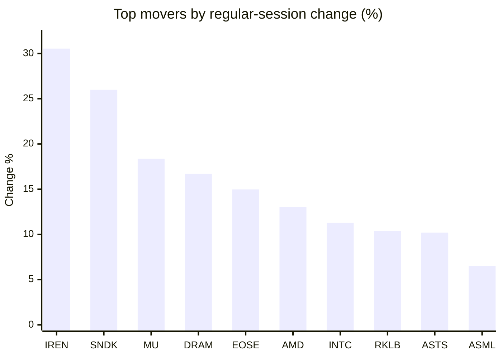
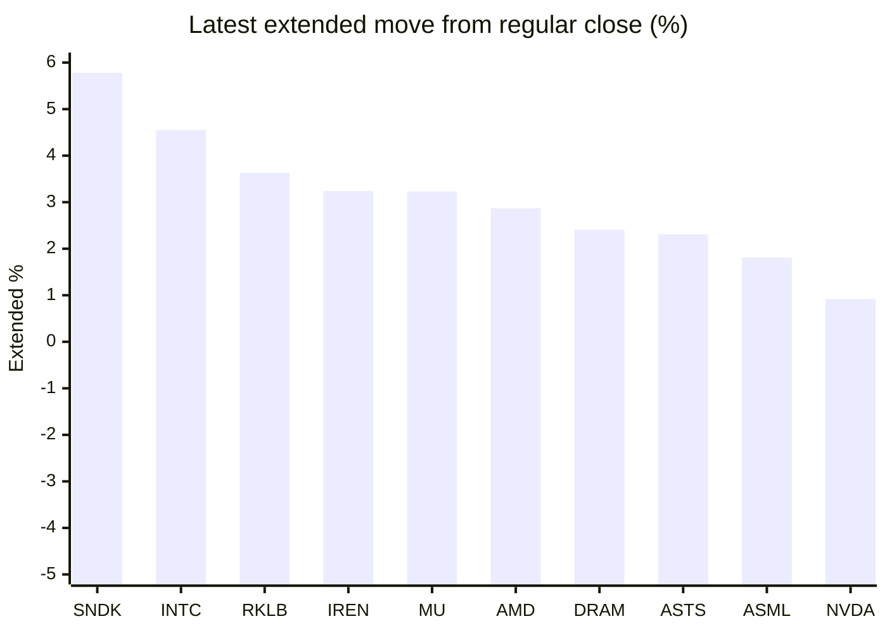

# Stock Brief - 2026-07-31

Generated at 2026-07-31 12:38 +07 from `watchlist.md`.
Prices are snapshots from Yahoo Finance public chart data. Extended/overnight is the latest available pre/post-market datapoint from the same feed.

## Market Snapshot

- SPY: close 741.69, latest extended 743.33, regular move +1.68%, extended move +0.22%
- QQQ: close 683.55, latest extended 688.25, regular move +3.30%, extended move +0.69%
- JEPQ: close 57.92, latest extended 58.33, regular move +3.17%, extended move +0.71%

## Watchlist Prices

| Ticker | Name | Regular close | Latest extended/overnight | Regular move | Extended move | Latest data time | Source |
|---|---|---:|---:|---:|---:|---|---|
| INTC | Intel Corporation | 91.13 USD | 95.28 USD | +11.30% | +4.55% | 2026-07-30 19:59 EDT | [Yahoo](https://finance.yahoo.com/quote/INTC/) |
| AVGO | Broadcom Inc. | 387.84 USD | 390.70 USD | +4.73% | +0.74% | 2026-07-30 19:59 EDT | [Yahoo](https://finance.yahoo.com/quote/AVGO/) |
| RKLB | Rocket Lab Corporation | 64.68 USD | 67.03 USD | +10.38% | +3.63% | 2026-07-30 19:59 EDT | [Yahoo](https://finance.yahoo.com/quote/RKLB/) |
| AAPL | Apple Inc. | 333.43 USD | 312.33 USD | -1.41% | -6.33% | 2026-07-30 19:59 EDT | [Yahoo](https://finance.yahoo.com/quote/AAPL/) |
| NVDA | NVIDIA Corporation | 195.04 USD | 196.84 USD | +2.65% | +0.92% | 2026-07-30 19:59 EDT | [Yahoo](https://finance.yahoo.com/quote/NVDA/) |
| TSLA | Tesla, Inc. | 308.85 USD | 309.10 USD | +3.53% | +0.08% | 2026-07-30 19:59 EDT | [Yahoo](https://finance.yahoo.com/quote/TSLA/) |
| SNDK | Sandisk Corporation | 1,279.96 USD | 1,354.00 USD | +25.99% | +5.78% | 2026-07-30 19:59 EDT | [Yahoo](https://finance.yahoo.com/quote/SNDK/) |
| QQQ | Invesco QQQ Trust, Series 1 | 683.55 USD | 688.25 USD | +3.30% | +0.69% | 2026-07-30 19:59 EDT | [Yahoo](https://finance.yahoo.com/quote/QQQ/) |
| SPY | State Street SPDR S&P 500 ETF T | 741.69 USD | 743.33 USD | +1.68% | +0.22% | 2026-07-30 19:59 EDT | [Yahoo](https://finance.yahoo.com/quote/SPY/) |
| JEPQ | JPMorgan Nasdaq Equity Premium  | 57.92 USD | 58.33 USD | +3.17% | +0.71% | 2026-07-30 19:58 EDT | [Yahoo](https://finance.yahoo.com/quote/JEPQ/) |
| ASTS | AST SpaceMobile, Inc. | 58.44 USD | 59.79 USD | +10.20% | +2.31% | 2026-07-30 19:59 EDT | [Yahoo](https://finance.yahoo.com/quote/ASTS/) |
| MU | Micron Technology, Inc. | 874.66 USD | 902.90 USD | +18.36% | +3.23% | 2026-07-30 20:00 EDT | [Yahoo](https://finance.yahoo.com/quote/MU/) |
| IREN | IREN LIMITED | 38.26 USD | 39.50 USD | +30.54% | +3.24% | 2026-07-30 19:59 EDT | [Yahoo](https://finance.yahoo.com/quote/IREN/) |
| EOSE | Eos Energy Enterprises, Inc. | 3.61 USD | 3.60 USD | +14.97% | -0.28% | 2026-07-30 19:59 EDT | [Yahoo](https://finance.yahoo.com/quote/EOSE/) |
| GOOG | Alphabet Inc. | 333.68 USD | 335.65 USD | -0.62% | +0.59% | 2026-07-30 19:59 EDT | [Yahoo](https://finance.yahoo.com/quote/GOOG/) |
| DRAM | Roundhill Memory ETF | 52.34 USD | 53.60 USD | +16.70% | +2.41% | 2026-07-30 20:00 EDT | [Yahoo](https://finance.yahoo.com/quote/DRAM/) |
| AMD | Advanced Micro Devices, Inc. | 485.39 USD | 499.30 USD | +13.00% | +2.87% | 2026-07-30 19:59 EDT | [Yahoo](https://finance.yahoo.com/quote/AMD/) |
| ASML | ASML Holding N.V. - New York Re | 1,651.44 USD | 1,681.40 USD | +6.50% | +1.81% | 2026-07-30 19:59 EDT | [Yahoo](https://finance.yahoo.com/quote/ASML/) |

## Charts

### Top Movers - Regular Session

### Extended / Overnight Move

### Quick Heatmap

| Group | Names in watchlist | Avg regular move | Avg extended move |
|---|---|---:|---:|
| Mega-cap tech | AVGO, AAPL, NVDA, TSLA, GOOG | +1.78% | -0.80% |
| Semis / memory | INTC, SNDK, MU, DRAM, AMD, ASML | +15.31% | +3.44% |
| Space / high beta | RKLB, ASTS, IREN, EOSE | +16.52% | +2.23% |
| ETFs | QQQ, SPY, JEPQ | +2.71% | +0.54% |

## News Headlines

- [Warren Buffett's 1 Recommendation for Most Investors Turned $10,000 Into More Than $40,000 in 10 Years](https://www.fool.com/investing/2026/07/31/warren-buffett-recommendation-turned-10000-40000/?.tsrc=rss) (2026-07-31 12:20 Bangkok)
- [Apple Inc (AAPL) (Q3 2026) Earnings Call Highlights: Record Revenue Amid Supply Constraints and ...](https://finance.yahoo.com/markets/stocks/articles/apple-inc-aapl-q3-2026-050211254.html?.tsrc=rss) (2026-07-31 12:02 Bangkok)
- [Billionaire Bill Ackman Called SpaceX's Starlink a "Near Monopoly" in Global Satellite Internet, But Said He Won't Buy the Stock.](https://www.fool.com/investing/2026/07/31/billionaire-bill-ackman-called-spacexs-starlink-a/?.tsrc=rss) (2026-07-31 11:50 Bangkok)
- [Astera Labs vs. Intel: Which Technology Stock Is a Better Buy in 2026?](https://www.fool.com/coverage/better-buy/2026/07/31/astera-labs-vs-intel-which-technology-stock-is-a-better-buy-in-2026/?.tsrc=rss) (2026-07-31 11:25 Bangkok)
- [Jensen Huang Says Memory Is Now AI's Biggest Bottleneck. Here's What That Means for Nvidia.](https://www.fool.com/investing/2026/07/31/jensen-huang-says-memory-is-now-ais-biggest-bottle/?.tsrc=rss) (2026-07-31 11:20 Bangkok)
- [TSLA Stock Jumps Overnight As Tesla Reportedly Readies China Split For SpaceX Merger — Retail Floats $450 Buyout Scenario](https://stocktwits.com/news-articles/markets/equity/tsla-stock-jumps-overnight-as-tesla-reportedly-readies-china-split-for-space-x-merger-retail-floats-450-buyout-scenario/cZNEwfNRJ2Z?.tsrc=rss) (2026-07-31 11:08 Bangkok)
- [Factbox-Tesla's China operations, the EV maker's global production powerhouse](https://finance.yahoo.com/markets/stocks/articles/factbox-teslas-china-operations-ev-035303367.html?.tsrc=rss) (2026-07-31 10:53 Bangkok)
- [Aschenbrenner Tried to Sell Private Stakes Before Citadel Deal](https://finance.yahoo.com/markets/stocks/articles/aschenbrenner-tried-sell-private-stakes-033919400.html?.tsrc=rss) (2026-07-31 10:39 Bangkok)

## Caveats

- This is not investment advice. Extended-hours prices can be thin and volatile.
- Yahoo public endpoints may lag official exchange data.
