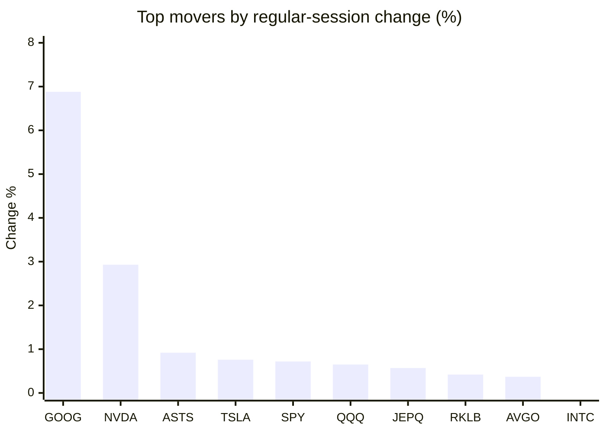
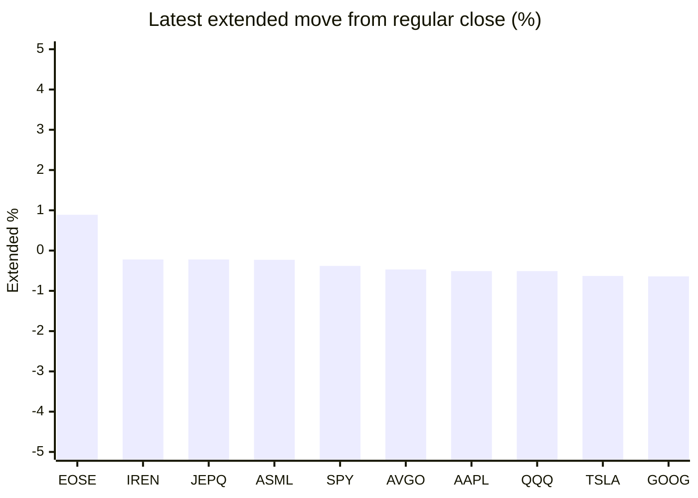

# Stock Brief - 2026-08-03

Generated at 2026-08-03 12:46 +07 from `watchlist.md`.
Prices are snapshots from Yahoo Finance public chart data. Extended/overnight is the latest available pre/post-market datapoint from the same feed.

## Market Snapshot

- SPY: close 747.03, latest extended 744.21, regular move +0.72%, extended move -0.38%
- QQQ: close 687.99, latest extended 684.47, regular move +0.65%, extended move -0.51%
- JEPQ: close 58.25, latest extended 58.12, regular move +0.57%, extended move -0.22%

## Watchlist Prices

| Ticker | Name | Regular close | Latest extended/overnight | Regular move | Extended move | Latest data time | Source |
|---|---|---:|---:|---:|---:|---|---|
| INTC | Intel Corporation | 90.20 USD | 89.23 USD | -1.02% | -1.08% | 2026-07-31 19:59 EDT | [Yahoo](https://finance.yahoo.com/quote/INTC/) |
| AVGO | Broadcom Inc. | 389.28 USD | 387.45 USD | +0.37% | -0.47% | 2026-07-31 19:59 EDT | [Yahoo](https://finance.yahoo.com/quote/AVGO/) |
| RKLB | Rocket Lab Corporation | 64.95 USD | 64.16 USD | +0.42% | -1.22% | 2026-07-31 19:59 EDT | [Yahoo](https://finance.yahoo.com/quote/RKLB/) |
| AAPL | Apple Inc. | 308.91 USD | 307.34 USD | -7.35% | -0.51% | 2026-07-31 19:59 EDT | [Yahoo](https://finance.yahoo.com/quote/AAPL/) |
| NVDA | NVIDIA Corporation | 200.75 USD | 198.95 USD | +2.93% | -0.90% | 2026-07-31 19:59 EDT | [Yahoo](https://finance.yahoo.com/quote/NVDA/) |
| TSLA | Tesla, Inc. | 311.21 USD | 309.26 USD | +0.76% | -0.63% | 2026-07-31 19:59 EDT | [Yahoo](https://finance.yahoo.com/quote/TSLA/) |
| SNDK | Sandisk Corporation | 1,214.83 USD | 1,205.00 USD | -5.09% | -0.81% | 2026-07-31 19:59 EDT | [Yahoo](https://finance.yahoo.com/quote/SNDK/) |
| QQQ | Invesco QQQ Trust, Series 1 | 687.99 USD | 684.47 USD | +0.65% | -0.51% | 2026-07-31 19:59 EDT | [Yahoo](https://finance.yahoo.com/quote/QQQ/) |
| SPY | State Street SPDR S&P 500 ETF T | 747.03 USD | 744.21 USD | +0.72% | -0.38% | 2026-07-31 19:59 EDT | [Yahoo](https://finance.yahoo.com/quote/SPY/) |
| JEPQ | JPMorgan Nasdaq Equity Premium  | 58.25 USD | 58.12 USD | +0.57% | -0.22% | 2026-07-31 19:59 EDT | [Yahoo](https://finance.yahoo.com/quote/JEPQ/) |
| ASTS | AST SpaceMobile, Inc. | 58.98 USD | 58.34 USD | +0.92% | -1.09% | 2026-07-31 19:59 EDT | [Yahoo](https://finance.yahoo.com/quote/ASTS/) |
| MU | Micron Technology, Inc. | 823.03 USD | 812.48 USD | -5.90% | -1.28% | 2026-07-31 19:59 EDT | [Yahoo](https://finance.yahoo.com/quote/MU/) |
| IREN | IREN LIMITED | 36.80 USD | 36.72 USD | -3.82% | -0.22% | 2026-07-31 19:59 EDT | [Yahoo](https://finance.yahoo.com/quote/IREN/) |
| EOSE | Eos Energy Enterprises, Inc. | 3.38 USD | 3.41 USD | -6.37% | +0.89% | 2026-07-31 19:59 EDT | [Yahoo](https://finance.yahoo.com/quote/EOSE/) |
| GOOG | Alphabet Inc. | 356.65 USD | 354.37 USD | +6.88% | -0.64% | 2026-07-31 19:59 EDT | [Yahoo](https://finance.yahoo.com/quote/GOOG/) |
| DRAM | Roundhill Memory ETF | 50.37 USD | 49.81 USD | -3.76% | -1.11% | 2026-07-31 19:59 EDT | [Yahoo](https://finance.yahoo.com/quote/DRAM/) |
| AMD | Advanced Micro Devices, Inc. | 476.15 USD | 472.12 USD | -1.90% | -0.85% | 2026-07-31 19:59 EDT | [Yahoo](https://finance.yahoo.com/quote/AMD/) |
| ASML | ASML Holding N.V. - New York Re | 1,629.00 USD | 1,625.19 USD | -1.36% | -0.23% | 2026-07-31 19:59 EDT | [Yahoo](https://finance.yahoo.com/quote/ASML/) |

## Charts

### Top Movers - Regular Session

### Extended / Overnight Move

### Quick Heatmap

| Group | Names in watchlist | Avg regular move | Avg extended move |
|---|---|---:|---:|
| Mega-cap tech | AVGO, AAPL, NVDA, TSLA, GOOG | +0.72% | -0.63% |
| Semis / memory | INTC, SNDK, MU, DRAM, AMD, ASML | -3.17% | -0.89% |
| Space / high beta | RKLB, ASTS, IREN, EOSE | -2.21% | -0.41% |
| ETFs | QQQ, SPY, JEPQ | +0.65% | -0.37% |

## News Headlines

- [Greg Abel Is Spending Berkshire Hathaway's Cash on Whole Companies Instead of Stocks. Here's What That Changes for Shareholders.](https://www.fool.com/investing/2026/08/03/greg-abel-is-spending-berkshire-hathaways-cash-on/?.tsrc=rss) (2026-08-03 12:35 Bangkok)
- [Apple's Hardware Is Ready for On-Device AI and PrismML Just Delivered a Real Breakthrough](https://www.fool.com/investing/2026/08/03/apples-hardware-is-ready-for-on-device-ai-and-pris/?.tsrc=rss) (2026-08-03 11:50 Bangkok)
- [MU, SNDK, SKHY, DRAM In Focus: Korean Stocks Dip Again, But Morgan Stanley Sees Sharp Growth Ahead](https://stocktwits.com/news-articles/markets/equity/mu-sndk-skhy-dram-in-focus-korean-stocks-dip-again-but-morgan-stanley-sees-sharp-growth-ahead/cZoR6JDRJ5o?.tsrc=rss) (2026-08-03 11:25 Bangkok)
- [Dow Jones Futures Rise, Oil Prices Dive As Trump Shifts On Iran; SpaceX, AMD, Sandisk, Eli Lilly Earnings Loom](https://finance.yahoo.com/m/a6fd7cc1-160f-33be-9c9b-10601e0fcebe/dow-jones-futures-rise%2C-oil.html?.tsrc=rss) (2026-08-03 11:21 Bangkok)
- [Down 48%, Is Oracle Stock a Buy Right Now?](https://www.fool.com/investing/2026/08/03/down-48-is-oracle-stock-a-buy-right-now/?.tsrc=rss) (2026-08-03 11:20 Bangkok)
- [ASTS Stock Jumps Overnight As Japan D2C Launch With Rakuten Nears — Guinness World Record Sparks Fresh Optimism](https://stocktwits.com/news-articles/markets/equity/asts-japan-d2c-rakuten-guinness-world-record/cZoRCU3RJ58?.tsrc=rss) (2026-08-03 11:12 Bangkok)
- [Micron’s 39% Plunge and SK Hynix, Samsung’s $1.3T Spending Worries US Chipmakers](https://beincrypto.com/micron-plunge-us-chipmakers-worry/?.tsrc=rss) (2026-08-03 11:00 Bangkok)
- [The Bond Market Is Doing Something for the First Time in Nearly 20 Years. Here's What It Means for Investors.](https://www.fool.com/investing/2026/08/02/bond-market-doing-something-first-time-20-years/?.tsrc=rss) (2026-08-03 10:50 Bangkok)

## Caveats

- This is not investment advice. Extended-hours prices can be thin and volatile.
- Yahoo public endpoints may lag official exchange data.
