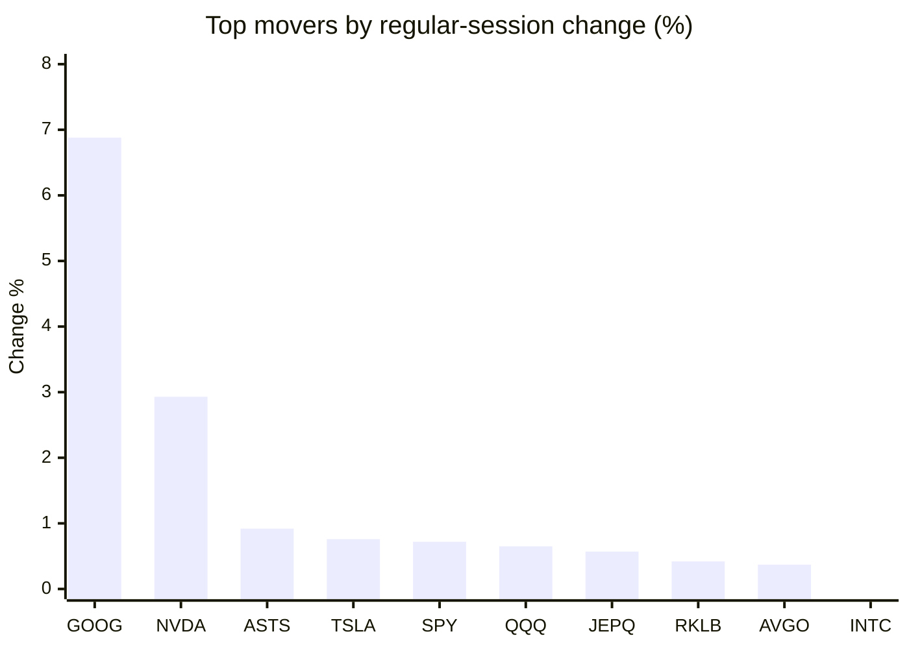
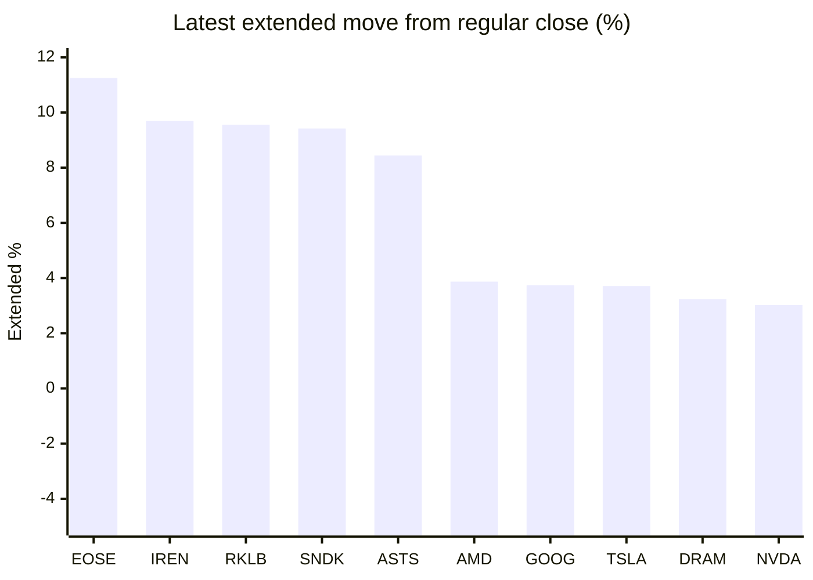

# Stock Brief - 2026-08-04

Generated at 2026-08-04 12:18 +07 from `watchlist.md`.
Prices are snapshots from Yahoo Finance public chart data. Extended/overnight is the latest available pre/post-market datapoint from the same feed.

## Market Snapshot

- SPY: close 747.03, latest extended 758.36, regular move +0.72%, extended move +1.52%
- QQQ: close 687.99, latest extended 701.80, regular move +0.65%, extended move +2.01%
- JEPQ: close 58.25, latest extended 58.40, regular move +0.57%, extended move +0.26%

## Watchlist Prices

| Ticker | Name | Regular close | Latest extended/overnight | Regular move | Extended move | Latest data time | Source |
|---|---|---:|---:|---:|---:|---|---|
| INTC | Intel Corporation | 90.20 USD | 92.40 USD | -1.02% | +2.44% | 2026-08-03 19:59 EDT | [Yahoo](https://finance.yahoo.com/quote/INTC/) |
| AVGO | Broadcom Inc. | 389.28 USD | 392.20 USD | +0.37% | +0.75% | 2026-08-03 19:59 EDT | [Yahoo](https://finance.yahoo.com/quote/AVGO/) |
| RKLB | Rocket Lab Corporation | 64.95 USD | 71.16 USD | +0.42% | +9.56% | 2026-08-03 19:59 EDT | [Yahoo](https://finance.yahoo.com/quote/RKLB/) |
| AAPL | Apple Inc. | 308.91 USD | 303.55 USD | -7.35% | -1.74% | 2026-08-03 19:59 EDT | [Yahoo](https://finance.yahoo.com/quote/AAPL/) |
| NVDA | NVIDIA Corporation | 200.75 USD | 206.80 USD | +2.93% | +3.02% | 2026-08-03 19:59 EDT | [Yahoo](https://finance.yahoo.com/quote/NVDA/) |
| TSLA | Tesla, Inc. | 311.21 USD | 322.76 USD | +0.76% | +3.71% | 2026-08-03 19:59 EDT | [Yahoo](https://finance.yahoo.com/quote/TSLA/) |
| SNDK | Sandisk Corporation | 1,214.83 USD | 1,329.31 USD | -5.09% | +9.42% | 2026-08-03 19:59 EDT | [Yahoo](https://finance.yahoo.com/quote/SNDK/) |
| QQQ | Invesco QQQ Trust, Series 1 | 687.99 USD | 701.80 USD | +0.65% | +2.01% | 2026-08-03 19:59 EDT | [Yahoo](https://finance.yahoo.com/quote/QQQ/) |
| SPY | State Street SPDR S&P 500 ETF T | 747.03 USD | 758.36 USD | +0.72% | +1.52% | 2026-08-03 19:59 EDT | [Yahoo](https://finance.yahoo.com/quote/SPY/) |
| JEPQ | JPMorgan Nasdaq Equity Premium  | 58.25 USD | 58.40 USD | +0.57% | +0.26% | 2026-08-03 19:59 EDT | [Yahoo](https://finance.yahoo.com/quote/JEPQ/) |
| ASTS | AST SpaceMobile, Inc. | 58.98 USD | 63.96 USD | +0.92% | +8.44% | 2026-08-03 19:59 EDT | [Yahoo](https://finance.yahoo.com/quote/ASTS/) |
| MU | Micron Technology, Inc. | 823.03 USD | 840.80 USD | -5.90% | +2.16% | 2026-08-03 19:59 EDT | [Yahoo](https://finance.yahoo.com/quote/MU/) |
| IREN | IREN LIMITED | 36.80 USD | 40.37 USD | -3.82% | +9.69% | 2026-08-03 19:59 EDT | [Yahoo](https://finance.yahoo.com/quote/IREN/) |
| EOSE | Eos Energy Enterprises, Inc. | 3.38 USD | 3.76 USD | -6.37% | +11.25% | 2026-08-03 19:59 EDT | [Yahoo](https://finance.yahoo.com/quote/EOSE/) |
| GOOG | Alphabet Inc. | 356.65 USD | 370.00 USD | +6.88% | +3.74% | 2026-08-03 19:59 EDT | [Yahoo](https://finance.yahoo.com/quote/GOOG/) |
| DRAM | Roundhill Memory ETF | 50.37 USD | 52.00 USD | -3.76% | +3.23% | 2026-08-03 19:59 EDT | [Yahoo](https://finance.yahoo.com/quote/DRAM/) |
| AMD | Advanced Micro Devices, Inc. | 476.15 USD | 494.60 USD | -1.90% | +3.87% | 2026-08-03 19:59 EDT | [Yahoo](https://finance.yahoo.com/quote/AMD/) |
| ASML | ASML Holding N.V. - New York Re | 1,629.00 USD | 1,651.29 USD | -1.36% | +1.37% | 2026-08-03 19:59 EDT | [Yahoo](https://finance.yahoo.com/quote/ASML/) |

## Charts

### Top Movers - Regular Session

### Extended / Overnight Move

### Quick Heatmap

| Group | Names in watchlist | Avg regular move | Avg extended move |
|---|---|---:|---:|
| Mega-cap tech | AVGO, AAPL, NVDA, TSLA, GOOG | +0.72% | +1.90% |
| Semis / memory | INTC, SNDK, MU, DRAM, AMD, ASML | -3.17% | +3.75% |
| Space / high beta | RKLB, ASTS, IREN, EOSE | -2.21% | +9.74% |
| ETFs | QQQ, SPY, JEPQ | +0.65% | +1.26% |

## News Headlines

- [Fitch Says: AI Market Correction Could Be a Big Risk to Corporate Credit. That Might Be Bad News for This Junk Bond ETF.](https://www.fool.com/investing/2026/08/04/fitch-says-ai-market-correction-could-be-a-big-ris/?.tsrc=rss) (2026-08-04 12:05 Bangkok)
- [Better Neocloud Stock: CoreWeave vs. Nebius](https://www.fool.com/investing/2026/08/04/better-neocloud-stock-nebius-vs-coreweave/?.tsrc=rss) (2026-08-04 11:20 Bangkok)
- [Why Sweetgreen Stock Fell 27% in July](https://www.fool.com/investing/2026/08/03/why-sweetgreen-stock-fell-27-in-july/?.tsrc=rss) (2026-08-04 11:18 Bangkok)
- [Ordinary Income Trap: Why JEPI’s Monthly Distributions Are Quietly Gutting Your After-Tax Returns](https://247wallst.com/investing/etf/2026/08/04/ordinary-income-trap-why-jepis-monthly-distributions-are-quietly-gutting-your-after-tax-returns/?.tsrc=rss) (2026-08-04 11:15 Bangkok)
- [Why Newell Brands Stock Keeps Rising](https://www.fool.com/investing/2026/08/03/why-newell-brands-stock-keeps-rising/?.tsrc=rss) (2026-08-04 10:44 Bangkok)
- [Elon Musk's Net Worth Down Nearly $700 Billion Amid Tesla, SpaceX Merger Rumors](https://finance.yahoo.com/markets/stocks/articles/elon-musks-net-worth-down-033017945.html?.tsrc=rss) (2026-08-04 10:30 Bangkok)
- [The Hidden Price of Monthly Income: DIVO’s Option Overlay Cost Investors Billions in Foregone Gains](https://247wallst.com/investing/etf/2026/08/03/the-hidden-price-of-monthly-income-divos-option-overlay-cost-investors-billions-in-foregone-gains/?.tsrc=rss) (2026-08-04 10:15 Bangkok)
- [Why Arm Holdings Stock Lost 34% in July](https://www.fool.com/investing/2026/08/03/why-arm-holdings-stock-lost-34-in-july/?.tsrc=rss) (2026-08-04 10:05 Bangkok)

## Caveats

- This is not investment advice. Extended-hours prices can be thin and volatile.
- Yahoo public endpoints may lag official exchange data.
