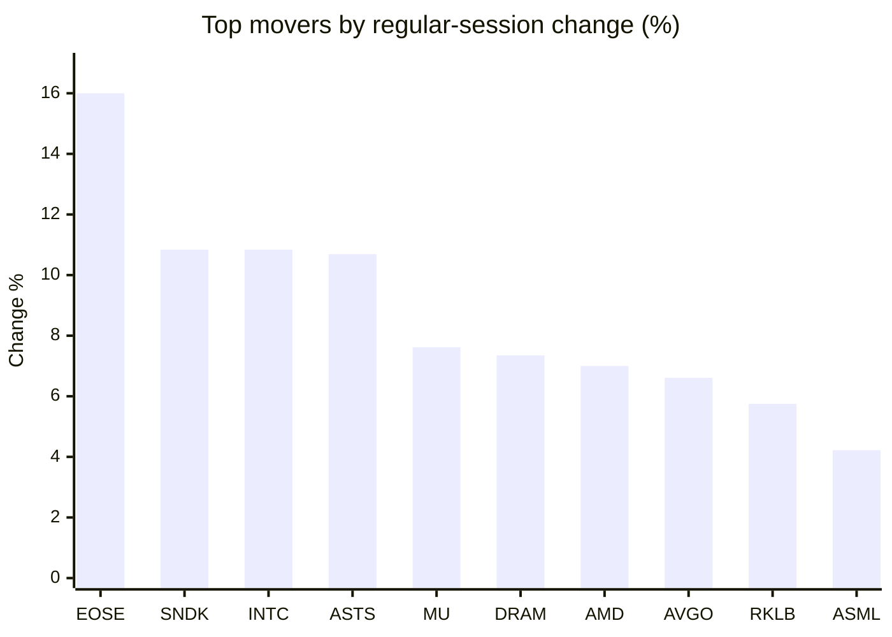
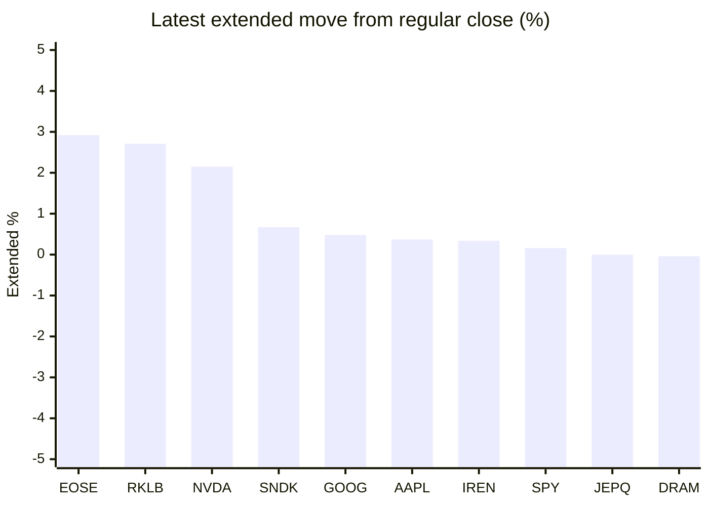

# Stock Brief - 2026-08-05

Generated at 2026-08-05 12:18 +07 from `watchlist.md`.
Prices are snapshots from Yahoo Finance public chart data. Extended/overnight is the latest available pre/post-market datapoint from the same feed.

## Market Snapshot

- SPY: close 771.33, latest extended 772.55, regular move +1.80%, extended move +0.16%
- QQQ: close 723.85, latest extended 722.77, regular move +3.40%, extended move -0.15%
- JEPQ: close 59.56, latest extended 59.56, regular move +2.09%, extended move -0.00%

## Watchlist Prices

| Ticker | Name | Regular close | Latest extended/overnight | Regular move | Extended move | Latest data time | Source |
|---|---|---:|---:|---:|---:|---|---|
| INTC | Intel Corporation | 100.86 USD | 97.65 USD | +10.84% | -3.18% | 2026-08-04 19:59 EDT | [Yahoo](https://finance.yahoo.com/quote/INTC/) |
| AVGO | Broadcom Inc. | 418.16 USD | 417.55 USD | +6.61% | -0.15% | 2026-08-04 19:59 EDT | [Yahoo](https://finance.yahoo.com/quote/AVGO/) |
| RKLB | Rocket Lab Corporation | 74.48 USD | 76.50 USD | +5.75% | +2.71% | 2026-08-04 19:59 EDT | [Yahoo](https://finance.yahoo.com/quote/RKLB/) |
| AAPL | Apple Inc. | 309.38 USD | 310.54 USD | +1.96% | +0.37% | 2026-08-04 19:59 EDT | [Yahoo](https://finance.yahoo.com/quote/AAPL/) |
| NVDA | NVIDIA Corporation | 211.94 USD | 216.50 USD | +2.56% | +2.15% | 2026-08-04 19:59 EDT | [Yahoo](https://finance.yahoo.com/quote/NVDA/) |
| TSLA | Tesla, Inc. | 327.35 USD | 325.38 USD | +1.64% | -0.60% | 2026-08-04 19:59 EDT | [Yahoo](https://finance.yahoo.com/quote/TSLA/) |
| SNDK | Sandisk Corporation | 1,427.62 USD | 1,437.14 USD | +10.84% | +0.67% | 2026-08-04 19:59 EDT | [Yahoo](https://finance.yahoo.com/quote/SNDK/) |
| QQQ | Invesco QQQ Trust, Series 1 | 723.85 USD | 722.77 USD | +3.40% | -0.15% | 2026-08-04 19:59 EDT | [Yahoo](https://finance.yahoo.com/quote/QQQ/) |
| SPY | State Street SPDR S&P 500 ETF T | 771.33 USD | 772.55 USD | +1.80% | +0.16% | 2026-08-04 19:59 EDT | [Yahoo](https://finance.yahoo.com/quote/SPY/) |
| JEPQ | JPMorgan Nasdaq Equity Premium  | 59.56 USD | 59.56 USD | +2.09% | -0.00% | 2026-08-04 19:59 EDT | [Yahoo](https://finance.yahoo.com/quote/JEPQ/) |
| ASTS | AST SpaceMobile, Inc. | 70.31 USD | 70.12 USD | +10.69% | -0.27% | 2026-08-04 19:59 EDT | [Yahoo](https://finance.yahoo.com/quote/ASTS/) |
| MU | Micron Technology, Inc. | 892.67 USD | 892.00 USD | +7.62% | -0.08% | 2026-08-04 19:59 EDT | [Yahoo](https://finance.yahoo.com/quote/MU/) |
| IREN | IREN LIMITED | 40.85 USD | 40.99 USD | +2.77% | +0.34% | 2026-08-04 19:59 EDT | [Yahoo](https://finance.yahoo.com/quote/IREN/) |
| EOSE | Eos Energy Enterprises, Inc. | 4.35 USD | 4.48 USD | +16.00% | +2.92% | 2026-08-04 19:59 EDT | [Yahoo](https://finance.yahoo.com/quote/EOSE/) |
| GOOG | Alphabet Inc. | 375.35 USD | 377.16 USD | +0.77% | +0.48% | 2026-08-04 19:59 EDT | [Yahoo](https://finance.yahoo.com/quote/GOOG/) |
| DRAM | Roundhill Memory ETF | 54.89 USD | 54.87 USD | +7.35% | -0.04% | 2026-08-04 19:59 EDT | [Yahoo](https://finance.yahoo.com/quote/DRAM/) |
| AMD | Advanced Micro Devices, Inc. | 518.58 USD | 472.85 USD | +7.00% | -8.82% | 2026-08-04 19:59 EDT | [Yahoo](https://finance.yahoo.com/quote/AMD/) |
| ASML | ASML Holding N.V. - New York Re | 1,711.89 USD | 1,707.30 USD | +4.22% | -0.27% | 2026-08-04 19:59 EDT | [Yahoo](https://finance.yahoo.com/quote/ASML/) |

## Charts

### Top Movers - Regular Session

### Extended / Overnight Move

### Quick Heatmap

| Group | Names in watchlist | Avg regular move | Avg extended move |
|---|---|---:|---:|
| Mega-cap tech | AVGO, AAPL, NVDA, TSLA, GOOG | +2.71% | +0.45% |
| Semis / memory | INTC, SNDK, MU, DRAM, AMD, ASML | +7.98% | -1.95% |
| Space / high beta | RKLB, ASTS, IREN, EOSE | +8.80% | +1.43% |
| ETFs | QQQ, SPY, JEPQ | +2.43% | +0.00% |

## News Headlines

- [Core DNA: Coreweave and Nebius Couldn’t Be More Different and Why It Matters](https://247wallst.com/investing/2026/08/05/core-dna-coreweave-and-nebius-couldnt-be-more-different-and-why-it-matters/?.tsrc=rss) (2026-08-05 11:46 Bangkok)
- [Does AST SpaceMobile (ASTS) Trade At A Premium After Its Satellite Launch?](https://finance.yahoo.com/markets/stocks/articles/does-ast-spacemobile-asts-trade-042844182.html?.tsrc=rss) (2026-08-05 11:28 Bangkok)
- [Is SK Hynix Quietly Winning the AI Memory Supercycle Against Micron and Sandisk?](https://www.fool.com/investing/2026/08/05/is-sk-hynix-quietly-winning-the-ai-memory-supercyc/?.tsrc=rss) (2026-08-05 11:20 Bangkok)
- [I’m Buying Broadcom Because It Sucks Up The Hyperscaler AI Capex That Doesn’t Go To Nvidia](https://247wallst.com/investing/2026/08/05/im-buying-broadcom-because-it-sucks-up-the-hyperscaler-ai-capex-that-doesnt-go-to-nvidia/?.tsrc=rss) (2026-08-05 11:19 Bangkok)
- [AMD Vs. Broadcom: Why Broadcom is Actually Nvidia’s Biggest Problem](https://247wallst.com/investing/2026/08/05/amd-vs-broadcom-why-broadcom-is-actually-nvidias-biggest-problem/?.tsrc=rss) (2026-08-05 11:16 Bangkok)
- [MSTY Investors Are Paying 1.03% in Fees While the Fund Collapses 67.45%—And That’s Not Even the Real Cost](https://247wallst.com/investing/etf/2026/08/05/msty-investors-are-paying-1-03-in-fees-while-the-fund-collapses-67-45-and-thats-not-even-the-real-cost/?.tsrc=rss) (2026-08-05 11:15 Bangkok)
- [Is Micron Stock Going Higher? You Need To Hear What Elon Musk Just Said](https://www.fool.com/investing/2026/08/04/is-micron-stock-going-higher-you-need-to-hear-what/?.tsrc=rss) (2026-08-05 10:35 Bangkok)
- [Elon Musk Says He's 'Not Against' Using Natural Gas as a Bridge to Solar, Backs Long-Term Role](https://finance.yahoo.com/energy/articles/elon-musk-says-hes-not-033111169.html?.tsrc=rss) (2026-08-05 10:31 Bangkok)

## Caveats

- This is not investment advice. Extended-hours prices can be thin and volatile.
- Yahoo public endpoints may lag official exchange data.
