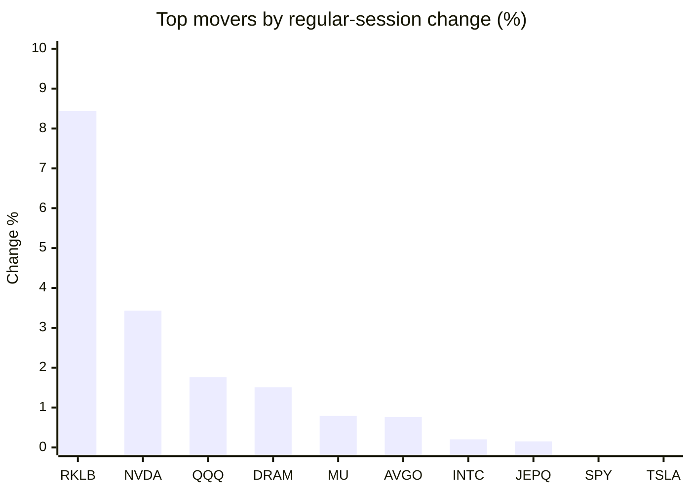
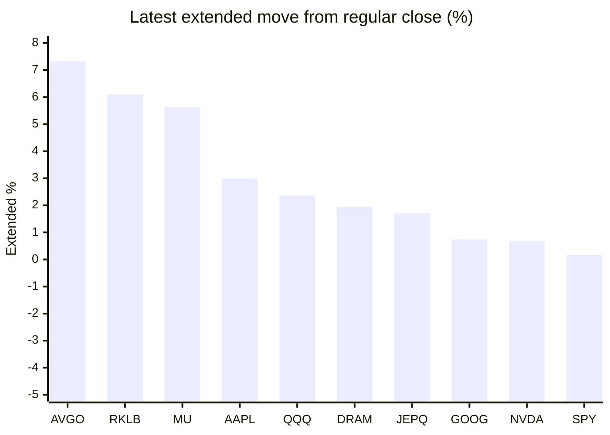

# Stock Brief - 2026-08-06

Generated at 2026-08-06 12:20 +07 from `watchlist.md`.
Prices are snapshots from Yahoo Finance public chart data. Extended/overnight is the latest available pre/post-market datapoint from the same feed.

## Market Snapshot

- SPY: close 769.79, latest extended 771.10, regular move -0.20%, extended move +0.17%
- QQQ: close 700.07, latest extended 716.57, regular move +1.76%, extended move +2.36%
- JEPQ: close 58.34, latest extended 59.34, regular move +0.15%, extended move +1.71%

## Watchlist Prices

| Ticker | Name | Regular close | Latest extended/overnight | Regular move | Extended move | Latest data time | Source |
|---|---|---:|---:|---:|---:|---|---|
| INTC | Intel Corporation | 101.06 USD | 100.90 USD | +0.20% | -0.16% | 2026-08-05 19:59 EDT | [Yahoo](https://finance.yahoo.com/quote/INTC/) |
| AVGO | Broadcom Inc. | 392.23 USD | 421.00 USD | +0.76% | +7.33% | 2026-08-05 19:59 EDT | [Yahoo](https://finance.yahoo.com/quote/AVGO/) |
| RKLB | Rocket Lab Corporation | 70.43 USD | 74.72 USD | +8.44% | +6.09% | 2026-08-05 19:59 EDT | [Yahoo](https://finance.yahoo.com/quote/RKLB/) |
| AAPL | Apple Inc. | 303.42 USD | 312.50 USD | -1.78% | +2.99% | 2026-08-05 19:59 EDT | [Yahoo](https://finance.yahoo.com/quote/AAPL/) |
| NVDA | NVIDIA Corporation | 219.22 USD | 220.74 USD | +3.43% | +0.69% | 2026-08-05 19:59 EDT | [Yahoo](https://finance.yahoo.com/quote/NVDA/) |
| TSLA | Tesla, Inc. | 321.55 USD | 321.50 USD | -1.77% | -0.02% | 2026-08-05 19:59 EDT | [Yahoo](https://finance.yahoo.com/quote/TSLA/) |
| SNDK | Sandisk Corporation | 1,350.50 USD | 1,243.00 USD | -5.40% | -7.96% | 2026-08-05 19:59 EDT | [Yahoo](https://finance.yahoo.com/quote/SNDK/) |
| QQQ | Invesco QQQ Trust, Series 1 | 700.07 USD | 716.57 USD | +1.76% | +2.36% | 2026-08-05 19:59 EDT | [Yahoo](https://finance.yahoo.com/quote/QQQ/) |
| SPY | State Street SPDR S&P 500 ETF T | 769.79 USD | 771.10 USD | -0.20% | +0.17% | 2026-08-05 19:59 EDT | [Yahoo](https://finance.yahoo.com/quote/SPY/) |
| JEPQ | JPMorgan Nasdaq Equity Premium  | 58.34 USD | 59.34 USD | +0.15% | +1.71% | 2026-08-05 19:59 EDT | [Yahoo](https://finance.yahoo.com/quote/JEPQ/) |
| ASTS | AST SpaceMobile, Inc. | 68.38 USD | 67.92 USD | -2.74% | -0.67% | 2026-08-05 19:59 EDT | [Yahoo](https://finance.yahoo.com/quote/ASTS/) |
| MU | Micron Technology, Inc. | 829.50 USD | 876.20 USD | +0.79% | +5.63% | 2026-08-05 19:59 EDT | [Yahoo](https://finance.yahoo.com/quote/MU/) |
| IREN | IREN LIMITED | 38.89 USD | 38.60 USD | -4.80% | -0.75% | 2026-08-05 19:59 EDT | [Yahoo](https://finance.yahoo.com/quote/IREN/) |
| EOSE | Eos Energy Enterprises, Inc. | 3.82 USD | 3.81 USD | -12.18% | -0.22% | 2026-08-05 19:59 EDT | [Yahoo](https://finance.yahoo.com/quote/EOSE/) |
| GOOG | Alphabet Inc. | 360.13 USD | 362.79 USD | -4.05% | +0.74% | 2026-08-05 19:59 EDT | [Yahoo](https://finance.yahoo.com/quote/GOOG/) |
| DRAM | Roundhill Memory ETF | 51.13 USD | 52.12 USD | +1.51% | +1.94% | 2026-08-05 19:59 EDT | [Yahoo](https://finance.yahoo.com/quote/DRAM/) |
| AMD | Advanced Micro Devices, Inc. | 482.05 USD | 481.20 USD | -7.04% | -0.18% | 2026-08-05 19:59 EDT | [Yahoo](https://finance.yahoo.com/quote/AMD/) |
| ASML | ASML Holding N.V. - New York Re | 1,678.22 USD | 1,679.99 USD | -1.97% | +0.11% | 2026-08-05 19:59 EDT | [Yahoo](https://finance.yahoo.com/quote/ASML/) |

## Charts

### Top Movers - Regular Session

### Extended / Overnight Move

### Quick Heatmap

| Group | Names in watchlist | Avg regular move | Avg extended move |
|---|---|---:|---:|
| Mega-cap tech | AVGO, AAPL, NVDA, TSLA, GOOG | -0.68% | +2.35% |
| Semis / memory | INTC, SNDK, MU, DRAM, AMD, ASML | -1.99% | -0.10% |
| Space / high beta | RKLB, ASTS, IREN, EOSE | -2.82% | +1.11% |
| ETFs | QQQ, SPY, JEPQ | +0.57% | +1.41% |

## News Headlines

- [SanDisk Corp (SNDK) (Q4 2026) Earnings Call Highlights: Record Revenue and EPS Driven by AI ...](https://finance.yahoo.com/technology/articles/sandisk-corp-sndk-q4-2026-050606559.html?.tsrc=rss) (2026-08-06 12:06 Bangkok)
- [Sandisk Q4 Earnings Call Highlights](https://www.marketbeat.com/instant-alerts/sandisk-q4-earnings-call-highlights-2026-08-06/?utm_source=yahoofinance&utm_medium=yahoofinance&.tsrc=rss) (2026-08-06 12:03 Bangkok)
- [Axon Just Delivered a Huge Beat-and-Raise. So Why Is the Stock Down?](https://www.fool.com/investing/2026/08/06/axon-just-delivered-a-huge-beat-and-raise-so-why-i/?.tsrc=rss) (2026-08-06 11:44 Bangkok)
- [Waymo CEO takes a not-so-subtle shot at Tesla Robotaxi over Lidar](https://www.thestreet.com/technology/waymo-ceo-tesla-robotaxis-need-lidar-to-work?.tsrc=rss) (2026-08-06 11:37 Bangkok)
- [Tesla (TSLA) Targets 1 Million Optimus Robots A Year](https://finance.yahoo.com/markets/stocks/articles/tesla-tsla-targets-1-million-043212925.html?.tsrc=rss) (2026-08-06 11:32 Bangkok)
- [Analysis-Samsung, SK Hynix shareholders call for bigger payouts from AI cash mountain](https://finance.yahoo.com/markets/stocks/articles/analysis-samsung-sk-hynix-shareholders-042824815.html?.tsrc=rss) (2026-08-06 11:28 Bangkok)
- [Marvell Is Positioned to Absorb a Disproportionate Amount of This AI Capex Surge, So I Keep Buying](https://247wallst.com/investing/2026/08/06/marvell-is-positioned-to-absorb-a-disproportionate-amount-of-this-ai-capex-surge-so-i-keep-buying/?.tsrc=rss) (2026-08-06 11:23 Bangkok)
- [One Massive AI Hardware Truth Keeps Me Loading Up On AMAT Ahead of Aug. 13 Earnings Print](https://247wallst.com/investing/2026/08/06/one-massive-ai-hardware-truth-keeps-me-loading-up-on-amat-ahead-of-aug-13-earnings-print/?.tsrc=rss) (2026-08-06 11:19 Bangkok)

## Caveats

- This is not investment advice. Extended-hours prices can be thin and volatile.
- Yahoo public endpoints may lag official exchange data.
