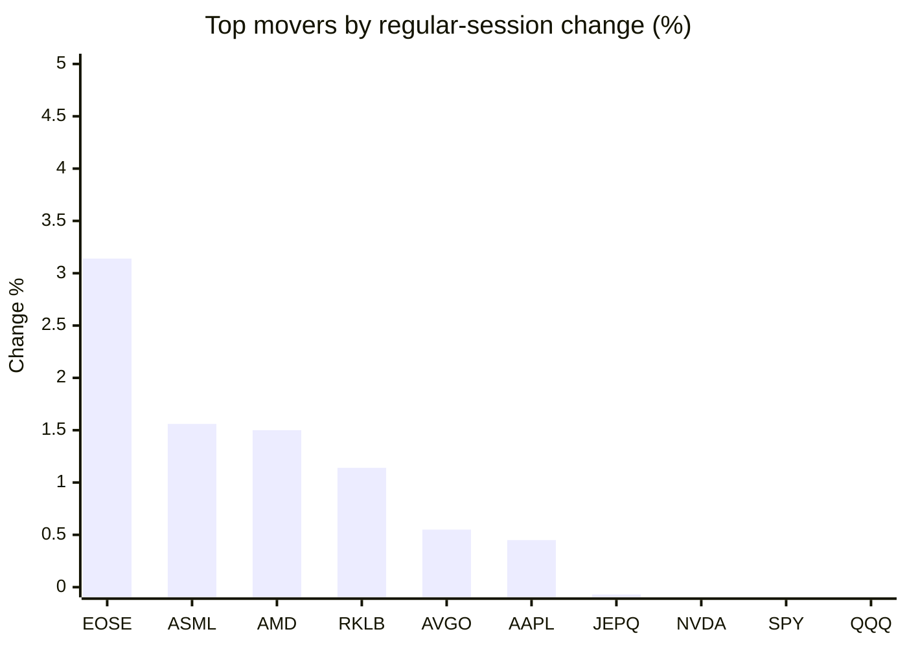
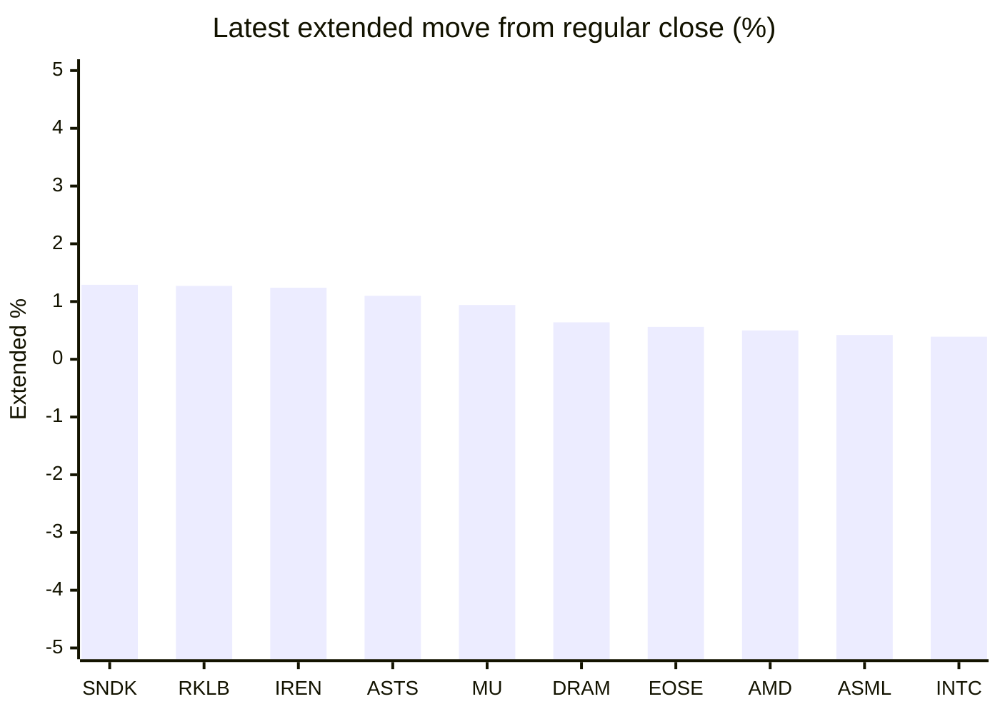

# Stock Brief - 2026-08-07

Generated at 2026-08-07 11:27 +07 from `watchlist.md`.
Prices are snapshots from Yahoo Finance public chart data. Extended/overnight is the latest available pre/post-market datapoint from the same feed.

## Market Snapshot

- SPY: close 768.56, latest extended 769.00, regular move -0.16%, extended move +0.06%
- QQQ: close 714.65, latest extended 717.02, regular move -0.37%, extended move +0.33%
- JEPQ: close 59.34, latest extended 59.47, regular move -0.07%, extended move +0.22%

## Watchlist Prices

| Ticker | Name | Regular close | Latest extended/overnight | Regular move | Extended move | Latest data time | Source |
|---|---|---:|---:|---:|---:|---|---|
| INTC | Intel Corporation | 99.81 USD | 100.20 USD | -1.24% | +0.39% | 2026-08-06 19:59 EDT | [Yahoo](https://finance.yahoo.com/quote/INTC/) |
| AVGO | Broadcom Inc. | 420.57 USD | 422.00 USD | +0.55% | +0.34% | 2026-08-06 19:59 EDT | [Yahoo](https://finance.yahoo.com/quote/AVGO/) |
| RKLB | Rocket Lab Corporation | 75.67 USD | 76.63 USD | +1.14% | +1.27% | 2026-08-06 19:59 EDT | [Yahoo](https://finance.yahoo.com/quote/RKLB/) |
| AAPL | Apple Inc. | 312.41 USD | 312.56 USD | +0.45% | +0.05% | 2026-08-06 19:59 EDT | [Yahoo](https://finance.yahoo.com/quote/AAPL/) |
| NVDA | NVIDIA Corporation | 218.99 USD | 219.42 USD | -0.10% | +0.20% | 2026-08-06 20:00 EDT | [Yahoo](https://finance.yahoo.com/quote/NVDA/) |
| TSLA | Tesla, Inc. | 319.53 USD | 320.47 USD | -0.63% | +0.29% | 2026-08-06 19:59 EDT | [Yahoo](https://finance.yahoo.com/quote/TSLA/) |
| SNDK | Sandisk Corporation | 1,258.58 USD | 1,274.88 USD | -6.81% | +1.29% | 2026-08-06 19:59 EDT | [Yahoo](https://finance.yahoo.com/quote/SNDK/) |
| QQQ | Invesco QQQ Trust, Series 1 | 714.65 USD | 717.02 USD | -0.37% | +0.33% | 2026-08-06 19:58 EDT | [Yahoo](https://finance.yahoo.com/quote/QQQ/) |
| SPY | State Street SPDR S&P 500 ETF T | 768.56 USD | 769.00 USD | -0.16% | +0.06% | 2026-08-06 19:59 EDT | [Yahoo](https://finance.yahoo.com/quote/SPY/) |
| JEPQ | JPMorgan Nasdaq Equity Premium  | 59.34 USD | 59.47 USD | -0.07% | +0.22% | 2026-08-06 19:57 EDT | [Yahoo](https://finance.yahoo.com/quote/JEPQ/) |
| ASTS | AST SpaceMobile, Inc. | 67.36 USD | 68.10 USD | -1.49% | +1.10% | 2026-08-06 19:59 EDT | [Yahoo](https://finance.yahoo.com/quote/ASTS/) |
| MU | Micron Technology, Inc. | 881.47 USD | 889.79 USD | -1.31% | +0.94% | 2026-08-06 19:59 EDT | [Yahoo](https://finance.yahoo.com/quote/MU/) |
| IREN | IREN LIMITED | 37.93 USD | 38.40 USD | -2.47% | +1.24% | 2026-08-06 19:59 EDT | [Yahoo](https://finance.yahoo.com/quote/IREN/) |
| EOSE | Eos Energy Enterprises, Inc. | 3.94 USD | 3.96 USD | +3.14% | +0.56% | 2026-08-06 19:59 EDT | [Yahoo](https://finance.yahoo.com/quote/EOSE/) |
| GOOG | Alphabet Inc. | 356.62 USD | 358.00 USD | -0.97% | +0.39% | 2026-08-06 19:59 EDT | [Yahoo](https://finance.yahoo.com/quote/GOOG/) |
| DRAM | Roundhill Memory ETF | 51.44 USD | 51.77 USD | -4.28% | +0.64% | 2026-08-06 19:59 EDT | [Yahoo](https://finance.yahoo.com/quote/DRAM/) |
| AMD | Advanced Micro Devices, Inc. | 489.28 USD | 491.71 USD | +1.50% | +0.50% | 2026-08-06 19:59 EDT | [Yahoo](https://finance.yahoo.com/quote/AMD/) |
| ASML | ASML Holding N.V. - New York Re | 1,704.37 USD | 1,711.46 USD | +1.56% | +0.42% | 2026-08-06 19:58 EDT | [Yahoo](https://finance.yahoo.com/quote/ASML/) |

## Charts

### Top Movers - Regular Session

### Extended / Overnight Move

### Quick Heatmap

| Group | Names in watchlist | Avg regular move | Avg extended move |
|---|---|---:|---:|
| Mega-cap tech | AVGO, AAPL, NVDA, TSLA, GOOG | -0.14% | +0.25% |
| Semis / memory | INTC, SNDK, MU, DRAM, AMD, ASML | -1.76% | +0.70% |
| Space / high beta | RKLB, ASTS, IREN, EOSE | +0.08% | +1.04% |
| ETFs | QQQ, SPY, JEPQ | -0.20% | +0.20% |

## News Headlines

- [Nvidia Is a Massive Investor in the Genius Artificial Intelligence (AI) Stock Up 170% This Year](https://www.fool.com/investing/2026/08/07/nvidia-is-a-massive-investor-in-the-genius-artific/?.tsrc=rss) (2026-08-07 11:20 Bangkok)
- [SNDK Stock Edges Up Overnight: Jefferies Slashes Price Target By Nearly 50% On Memory Growth Concerns](https://stocktwits.com/news-articles/markets/equity/sndk-stock-edges-up-overnight-jefferies-slashes-price-target-by-nearly-50-on-memory-growth-concerns/cZoOAccRJJz?.tsrc=rss) (2026-08-07 10:57 Bangkok)
- [TSLA Stock Eyes Weekly Comeback As Elon Musk Touts Terafab’s Colossal Scale — Analyst Flags A Big Intel Question Mark](https://stocktwits.com/news-articles/markets/equity/tsla-elon-musk-terafab-scale-analyst-intel-question-mark/cZoOpDMRJJU?.tsrc=rss) (2026-08-07 10:12 Bangkok)
- [Where Will Sandisk Stock Be in 5 Years?](https://www.fool.com/investing/2026/08/06/where-will-sandisk-stock-be-in-5-years/?.tsrc=rss) (2026-08-07 09:20 Bangkok)
- [How a 70-Year-Old Collects $6,500 a Month From Just Four Tickers: SCHD, JEPQ, O, and MAIN](https://247wallst.com/personal-finance/2026/08/06/how-a-70-year-old-collects-6500-a-month-from-just-four-tickers-schd-jepq-o-and-main/?.tsrc=rss) (2026-08-07 08:37 Bangkok)
- [Anthropic SPVs Stack $71 Billion in Chip-Lease Debt in 60 Days](https://finance.yahoo.com/technology/ai/articles/anthropic-spvs-stack-71-billion-000514097.html?.tsrc=rss) (2026-08-07 07:05 Bangkok)
- [Chasing 17.24% Yield? XDTE Holders Are Getting Their Own Money Back—and Paying for It](https://247wallst.com/investing/etf/2026/08/06/chasing-17-24-yield-xdte-holders-are-getting-their-own-money-back-and-paying-for-it/?.tsrc=rss) (2026-08-07 10:45 Bangkok)
- [Oklo Reports Friday Morning With Virtually No Revenue to Report. The Stock Trades 78% Below Its High.](https://www.fool.com/investing/2026/08/06/oklo-reports-friday-morning-with-virtually-no-reve/?.tsrc=rss) (2026-08-07 10:34 Bangkok)

## Caveats

- This is not investment advice. Extended-hours prices can be thin and volatile.
- Yahoo public endpoints may lag official exchange data.
