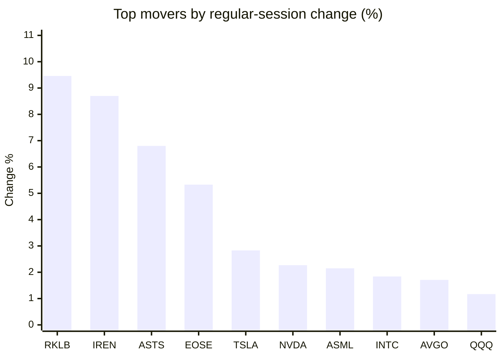
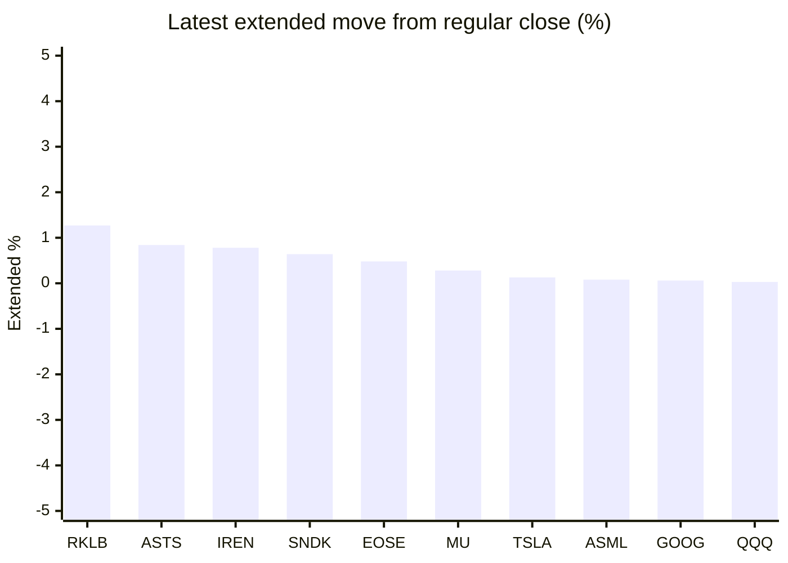

# Stock Brief - 2026-08-08

Generated at 2026-08-08 10:36 +07 from `watchlist.md`.
Prices are snapshots from Yahoo Finance public chart data. Extended/overnight is the latest available pre/post-market datapoint from the same feed.

## Market Snapshot

- SPY: close 773.26, latest extended 773.40, regular move +0.61%, extended move +0.02%
- QQQ: close 723.03, latest extended 723.26, regular move +1.17%, extended move +0.03%
- JEPQ: close 59.74, latest extended 59.72, regular move +0.67%, extended move -0.03%

## Watchlist Prices

| Ticker | Name | Regular close | Latest extended/overnight | Regular move | Extended move | Latest data time | Source |
|---|---|---:|---:|---:|---:|---|---|
| INTC | Intel Corporation | 101.65 USD | 101.68 USD | +1.84% | +0.03% | 2026-08-07 19:59 EDT | [Yahoo](https://finance.yahoo.com/quote/INTC/) |
| AVGO | Broadcom Inc. | 427.76 USD | 426.65 USD | +1.71% | -0.26% | 2026-08-07 19:59 EDT | [Yahoo](https://finance.yahoo.com/quote/AVGO/) |
| RKLB | Rocket Lab Corporation | 82.83 USD | 83.88 USD | +9.46% | +1.27% | 2026-08-07 19:59 EDT | [Yahoo](https://finance.yahoo.com/quote/RKLB/) |
| AAPL | Apple Inc. | 313.33 USD | 313.25 USD | +0.29% | -0.03% | 2026-08-07 19:59 EDT | [Yahoo](https://finance.yahoo.com/quote/AAPL/) |
| NVDA | NVIDIA Corporation | 223.96 USD | 223.76 USD | +2.27% | -0.09% | 2026-08-07 19:59 EDT | [Yahoo](https://finance.yahoo.com/quote/NVDA/) |
| TSLA | Tesla, Inc. | 328.58 USD | 329.00 USD | +2.83% | +0.13% | 2026-08-07 19:59 EDT | [Yahoo](https://finance.yahoo.com/quote/TSLA/) |
| SNDK | Sandisk Corporation | 1,212.21 USD | 1,219.99 USD | -3.68% | +0.64% | 2026-08-07 19:59 EDT | [Yahoo](https://finance.yahoo.com/quote/SNDK/) |
| QQQ | Invesco QQQ Trust, Series 1 | 723.03 USD | 723.26 USD | +1.17% | +0.03% | 2026-08-07 19:59 EDT | [Yahoo](https://finance.yahoo.com/quote/QQQ/) |
| SPY | State Street SPDR S&P 500 ETF T | 773.26 USD | 773.40 USD | +0.61% | +0.02% | 2026-08-07 19:59 EDT | [Yahoo](https://finance.yahoo.com/quote/SPY/) |
| JEPQ | JPMorgan Nasdaq Equity Premium  | 59.74 USD | 59.72 USD | +0.67% | -0.03% | 2026-08-07 19:57 EDT | [Yahoo](https://finance.yahoo.com/quote/JEPQ/) |
| ASTS | AST SpaceMobile, Inc. | 71.94 USD | 72.54 USD | +6.80% | +0.84% | 2026-08-07 19:59 EDT | [Yahoo](https://finance.yahoo.com/quote/ASTS/) |
| MU | Micron Technology, Inc. | 877.57 USD | 880.00 USD | -0.44% | +0.28% | 2026-08-07 19:59 EDT | [Yahoo](https://finance.yahoo.com/quote/MU/) |
| IREN | IREN LIMITED | 41.23 USD | 41.55 USD | +8.70% | +0.78% | 2026-08-07 19:59 EDT | [Yahoo](https://finance.yahoo.com/quote/IREN/) |
| EOSE | Eos Energy Enterprises, Inc. | 4.15 USD | 4.17 USD | +5.33% | +0.48% | 2026-08-07 19:59 EDT | [Yahoo](https://finance.yahoo.com/quote/EOSE/) |
| GOOG | Alphabet Inc. | 353.47 USD | 353.68 USD | -0.88% | +0.06% | 2026-08-07 19:59 EDT | [Yahoo](https://finance.yahoo.com/quote/GOOG/) |
| DRAM | Roundhill Memory ETF | 50.60 USD | 50.56 USD | -1.63% | -0.08% | 2026-08-07 19:59 EDT | [Yahoo](https://finance.yahoo.com/quote/DRAM/) |
| AMD | Advanced Micro Devices, Inc. | 483.36 USD | 483.18 USD | -1.21% | -0.04% | 2026-08-07 19:59 EDT | [Yahoo](https://finance.yahoo.com/quote/AMD/) |
| ASML | ASML Holding N.V. - New York Re | 1,740.99 USD | 1,742.46 USD | +2.15% | +0.08% | 2026-08-07 19:59 EDT | [Yahoo](https://finance.yahoo.com/quote/ASML/) |

## Charts

### Top Movers - Regular Session

### Extended / Overnight Move

### Quick Heatmap

| Group | Names in watchlist | Avg regular move | Avg extended move |
|---|---|---:|---:|
| Mega-cap tech | AVGO, AAPL, NVDA, TSLA, GOOG | +1.24% | -0.04% |
| Semis / memory | INTC, SNDK, MU, DRAM, AMD, ASML | -0.50% | +0.15% |
| Space / high beta | RKLB, ASTS, IREN, EOSE | +7.57% | +0.84% |
| ETFs | QQQ, SPY, JEPQ | +0.82% | +0.01% |

## News Headlines

- [Apple (AAPL) Q3 2026 Earnings Call Transcript](https://www.fool.com/earnings/call-transcripts/2026/08/07/apple-aapl-q3-2026-earnings-call-transcript/?.tsrc=rss) (2026-08-08 08:30 Bangkok)
- [SpaceX and Tesla choose Texas for AI chip manufacturing plant that will be world's largest building](https://www.foxbusiness.com/technology/spacex-tesla-choose-texas-ai-chip-manufacturing-plant-worlds-largest-building?.tsrc=rss) (2026-08-08 07:52 Bangkok)
- [Trump Tariff Refunds Just Topped $100 Billion, and These Companies Are Receiving Some of the Largest Checks](https://www.fool.com/investing/2026/08/07/trump-tariff-refunds-top-100-billion-large-checks/?.tsrc=rss) (2026-08-08 05:26 Bangkok)
- [Nvidia-backed company nearly doubles valuation in new funding round](https://www.thestreet.com/crypto/markets/nvidia-backed-company-nearly-doubles-valuation-in-new-funding-round?.tsrc=rss) (2026-08-08 05:20 Bangkok)
- [ISPY’s 0.56% Fee Hides a $38,000 Decade-Long Performance Gap Against SPY](https://247wallst.com/investing/etf/2026/08/07/ispys-0-56-fee-hides-a-38000-decade-long-performance-gap-against-spy/?.tsrc=rss) (2026-08-08 10:15 Bangkok)
- [What Does Intel (INTC) Gain From Its Texas Chip Facility Joint Venture?](https://finance.yahoo.com/technology/ai/articles/does-intel-intc-gain-texas-021111723.html?.tsrc=rss) (2026-08-08 09:11 Bangkok)
- [Osisko Metals (TSX:OM) Is Up 20.8% After Reporting Deepening 2026 Losses Has The Bull Case Changed?](https://finance.yahoo.com/markets/stocks/articles/osisko-metals-tsx-om-20-001723721.html?.tsrc=rss) (2026-08-08 07:17 Bangkok)
- [Why Genius Sports Popped by Almost 10% This Week](https://www.fool.com/investing/2026/08/07/why-genius-sports-popped-by-almost-10-this-week/?.tsrc=rss) (2026-08-08 07:14 Bangkok)

## Caveats

- This is not investment advice. Extended-hours prices can be thin and volatile.
- Yahoo public endpoints may lag official exchange data.
