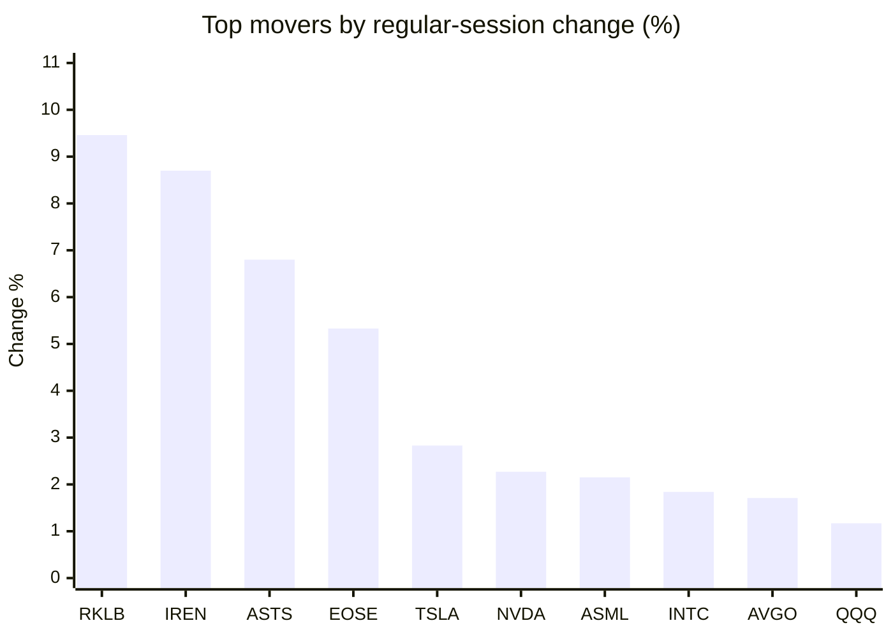
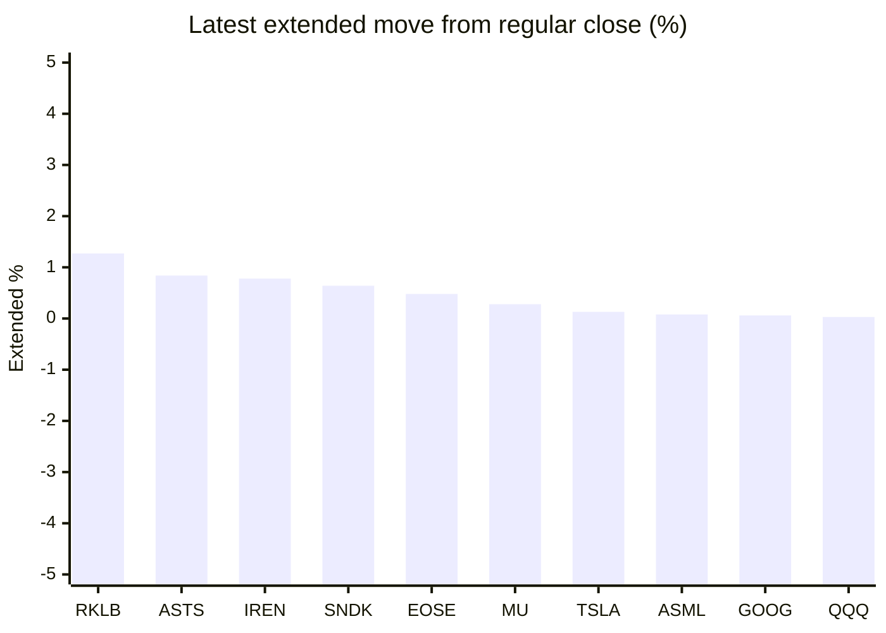

# Stock Brief - 2026-08-10

Generated at 2026-08-10 10:59 +07 from `watchlist.md`.
Prices are snapshots from Yahoo Finance public chart data. Extended/overnight is the latest available pre/post-market datapoint from the same feed.

## Market Snapshot

- SPY: close 773.26, latest extended 773.40, regular move +0.61%, extended move +0.02%
- QQQ: close 723.03, latest extended 723.26, regular move +1.17%, extended move +0.03%
- JEPQ: close 59.74, latest extended 59.72, regular move +0.67%, extended move -0.03%

## Watchlist Prices

| Ticker | Name | Regular close | Latest extended/overnight | Regular move | Extended move | Latest data time | Source |
|---|---|---:|---:|---:|---:|---|---|
| INTC | Intel Corporation | 101.65 USD | 101.68 USD | +1.84% | +0.03% | 2026-08-07 19:59 EDT | [Yahoo](https://finance.yahoo.com/quote/INTC/) |
| AVGO | Broadcom Inc. | 427.76 USD | 426.65 USD | +1.71% | -0.26% | 2026-08-07 19:59 EDT | [Yahoo](https://finance.yahoo.com/quote/AVGO/) |
| RKLB | Rocket Lab Corporation | 82.83 USD | 83.88 USD | +9.46% | +1.27% | 2026-08-07 19:59 EDT | [Yahoo](https://finance.yahoo.com/quote/RKLB/) |
| AAPL | Apple Inc. | 313.33 USD | 313.25 USD | +0.29% | -0.03% | 2026-08-07 19:59 EDT | [Yahoo](https://finance.yahoo.com/quote/AAPL/) |
| NVDA | NVIDIA Corporation | 223.96 USD | 223.76 USD | +2.27% | -0.09% | 2026-08-07 19:59 EDT | [Yahoo](https://finance.yahoo.com/quote/NVDA/) |
| TSLA | Tesla, Inc. | 328.58 USD | 329.00 USD | +2.83% | +0.13% | 2026-08-07 19:59 EDT | [Yahoo](https://finance.yahoo.com/quote/TSLA/) |
| SNDK | Sandisk Corporation | 1,212.21 USD | 1,219.99 USD | -3.68% | +0.64% | 2026-08-07 19:59 EDT | [Yahoo](https://finance.yahoo.com/quote/SNDK/) |
| QQQ | Invesco QQQ Trust, Series 1 | 723.03 USD | 723.26 USD | +1.17% | +0.03% | 2026-08-07 19:59 EDT | [Yahoo](https://finance.yahoo.com/quote/QQQ/) |
| SPY | State Street SPDR S&P 500 ETF T | 773.26 USD | 773.40 USD | +0.61% | +0.02% | 2026-08-07 19:59 EDT | [Yahoo](https://finance.yahoo.com/quote/SPY/) |
| JEPQ | JPMorgan Nasdaq Equity Premium  | 59.74 USD | 59.72 USD | +0.67% | -0.03% | 2026-08-07 19:57 EDT | [Yahoo](https://finance.yahoo.com/quote/JEPQ/) |
| ASTS | AST SpaceMobile, Inc. | 71.94 USD | 72.54 USD | +6.80% | +0.84% | 2026-08-07 19:59 EDT | [Yahoo](https://finance.yahoo.com/quote/ASTS/) |
| MU | Micron Technology, Inc. | 877.57 USD | 880.00 USD | -0.44% | +0.28% | 2026-08-07 19:59 EDT | [Yahoo](https://finance.yahoo.com/quote/MU/) |
| IREN | IREN LIMITED | 41.23 USD | 41.55 USD | +8.70% | +0.78% | 2026-08-07 19:59 EDT | [Yahoo](https://finance.yahoo.com/quote/IREN/) |
| EOSE | Eos Energy Enterprises, Inc. | 4.15 USD | 4.17 USD | +5.33% | +0.48% | 2026-08-07 19:59 EDT | [Yahoo](https://finance.yahoo.com/quote/EOSE/) |
| GOOG | Alphabet Inc. | 353.47 USD | 353.68 USD | -0.88% | +0.06% | 2026-08-07 19:59 EDT | [Yahoo](https://finance.yahoo.com/quote/GOOG/) |
| DRAM | Roundhill Memory ETF | 50.60 USD | 50.56 USD | -1.63% | -0.08% | 2026-08-07 19:59 EDT | [Yahoo](https://finance.yahoo.com/quote/DRAM/) |
| AMD | Advanced Micro Devices, Inc. | 483.36 USD | 483.18 USD | -1.21% | -0.04% | 2026-08-07 19:59 EDT | [Yahoo](https://finance.yahoo.com/quote/AMD/) |
| ASML | ASML Holding N.V. - New York Re | 1,740.99 USD | 1,742.46 USD | +2.15% | +0.08% | 2026-08-07 19:59 EDT | [Yahoo](https://finance.yahoo.com/quote/ASML/) |

## Charts

### Top Movers - Regular Session

### Extended / Overnight Move

### Quick Heatmap

| Group | Names in watchlist | Avg regular move | Avg extended move |
|---|---|---:|---:|
| Mega-cap tech | AVGO, AAPL, NVDA, TSLA, GOOG | +1.24% | -0.04% |
| Semis / memory | INTC, SNDK, MU, DRAM, AMD, ASML | -0.50% | +0.15% |
| Space / high beta | RKLB, ASTS, IREN, EOSE | +7.57% | +0.84% |
| ETFs | QQQ, SPY, JEPQ | +0.82% | +0.01% |

## News Headlines

- [Sandisk Has Surged More Than 3,000% in 12 Months. Is a Stock Split Coming?](https://www.fool.com/investing/2026/08/09/sandisk-has-surged-more-than-3000-in-12-months-is/?.tsrc=rss) (2026-08-10 09:35 Bangkok)
- [MU Outpaced SNDK, WDC This Week: Now, Retail Traders Bet On Outlook Raise At Key Analyst Event](https://stocktwits.com/news-articles/markets/equity/mu-outpaced-sndk-wdc-this-week-now-retail-traders-bet-on-outlook-raise-at-key-analyst-event/cZojBFpRJam?.tsrc=rss) (2026-08-10 09:09 Bangkok)
- [Micron Technology Just Bounced 10% Off Its Lows. History Reveals What a $5,000 Investment Will Be Worth by Mid-2027.](https://www.fool.com/investing/2026/08/09/micron-technology-just-bounced-10-off-its-lows-his/?.tsrc=rss) (2026-08-10 08:20 Bangkok)
- [Mark Cuban Compared Nvidia to a Dot-Com-Era IPO Machine "Funding Everyone and Anyone." Here's What That Means for AI Stocks.](https://www.fool.com/investing/2026/08/09/mark-cuban-compared-nvidia-to-a-dot-com-era-ipo-ma/?.tsrc=rss) (2026-08-10 07:50 Bangkok)
- [Meet the High-Yield Dividend Stock Bill Ackman Has Owned for Over a Decade. Here's Why It's a Great Buy in August.](https://www.fool.com/investing/2026/08/09/meet-the-high-yield-dividend-stock-bill-ackman-has/?.tsrc=rss) (2026-08-10 07:05 Bangkok)
- [SK Hynix and Samsung Just Sent a Major Warning to Micron Investors](https://www.fool.com/investing/2026/08/09/sk-hynix-and-samsung-just-sent-a-major-warning-to/?.tsrc=rss) (2026-08-10 06:50 Bangkok)
- [How a 61-Year-Old Built a $3,500 Monthly Paycheck From Just Two Funds: SCHD and JEPQ](https://247wallst.com/personal-finance/2026/08/09/how-a-61-year-old-built-a-3500-monthly-paycheck-from-just-two-funds-schd-and-jepq/?.tsrc=rss) (2026-08-10 05:32 Bangkok)
- [Apple tests Chinese memory chips](https://www.semafor.com/article/08/09/2026/apple-tests-chinese-memory-chips?.tsrc=rss) (2026-08-10 05:27 Bangkok)

## Caveats

- This is not investment advice. Extended-hours prices can be thin and volatile.
- Yahoo public endpoints may lag official exchange data.
