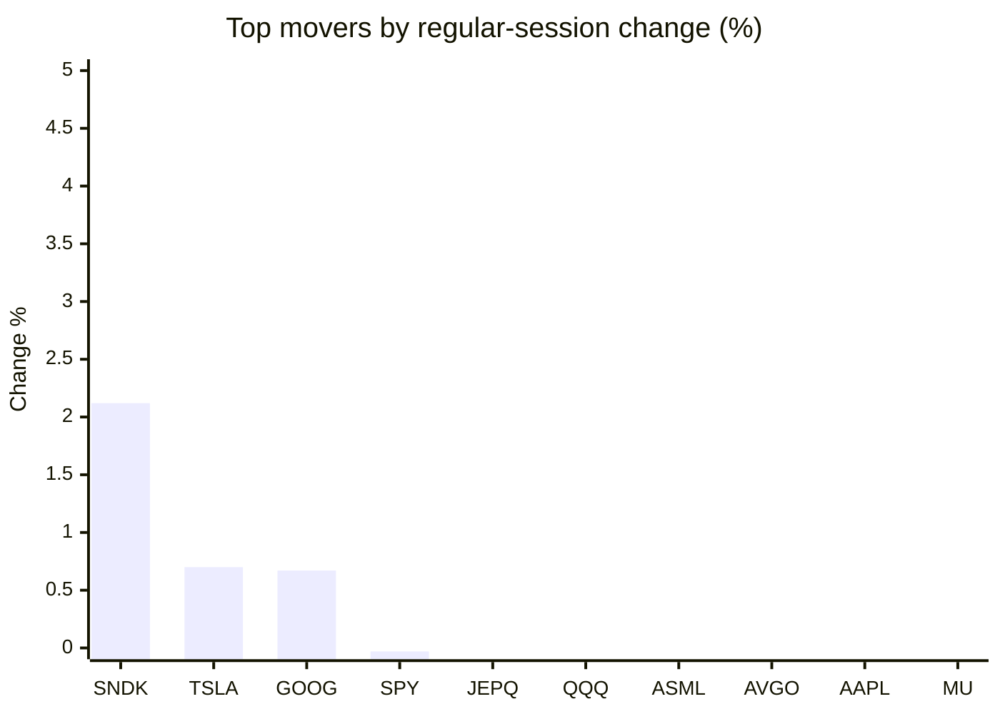
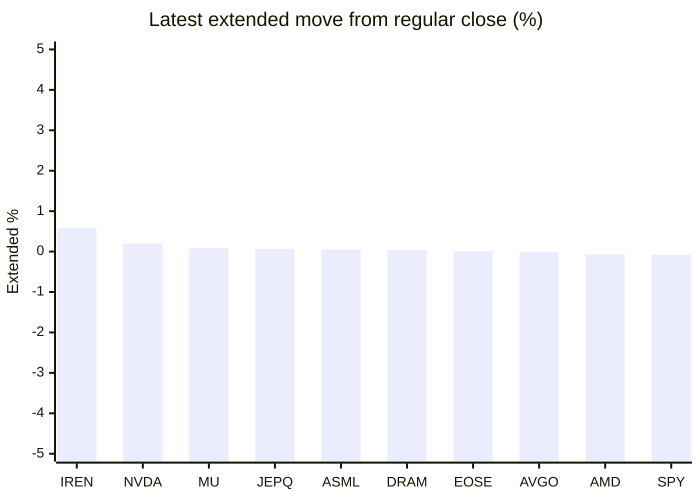

# Stock Brief - 2026-08-11

Generated at 2026-08-11 10:47 +07 from `watchlist.md`.
Prices are snapshots from Yahoo Finance public chart data. Extended/overnight is the latest available pre/post-market datapoint from the same feed.

## Market Snapshot

- SPY: close 773.03, latest extended 772.45, regular move -0.03%, extended move -0.08%
- QQQ: close 720.87, latest extended 719.96, regular move -0.30%, extended move -0.13%
- JEPQ: close 59.68, latest extended 59.72, regular move -0.10%, extended move +0.07%

## Watchlist Prices

| Ticker | Name | Regular close | Latest extended/overnight | Regular move | Extended move | Latest data time | Source |
|---|---|---:|---:|---:|---:|---|---|
| INTC | Intel Corporation | 97.52 USD | 97.31 USD | -4.06% | -0.22% | 2026-08-10 19:59 EDT | [Yahoo](https://finance.yahoo.com/quote/INTC/) |
| AVGO | Broadcom Inc. | 422.40 USD | 422.34 USD | -1.25% | -0.01% | 2026-08-10 19:59 EDT | [Yahoo](https://finance.yahoo.com/quote/AVGO/) |
| RKLB | Rocket Lab Corporation | 80.04 USD | 74.24 USD | -3.37% | -7.25% | 2026-08-10 19:59 EDT | [Yahoo](https://finance.yahoo.com/quote/RKLB/) |
| AAPL | Apple Inc. | 308.26 USD | 307.56 USD | -1.62% | -0.23% | 2026-08-10 19:59 EDT | [Yahoo](https://finance.yahoo.com/quote/AAPL/) |
| NVDA | NVIDIA Corporation | 217.55 USD | 217.99 USD | -2.86% | +0.20% | 2026-08-10 19:59 EDT | [Yahoo](https://finance.yahoo.com/quote/NVDA/) |
| TSLA | Tesla, Inc. | 330.88 USD | 330.30 USD | +0.70% | -0.18% | 2026-08-10 19:59 EDT | [Yahoo](https://finance.yahoo.com/quote/TSLA/) |
| SNDK | Sandisk Corporation | 1,237.92 USD | 1,234.58 USD | +2.12% | -0.27% | 2026-08-10 19:59 EDT | [Yahoo](https://finance.yahoo.com/quote/SNDK/) |
| QQQ | Invesco QQQ Trust, Series 1 | 720.87 USD | 719.96 USD | -0.30% | -0.13% | 2026-08-10 19:59 EDT | [Yahoo](https://finance.yahoo.com/quote/QQQ/) |
| SPY | State Street SPDR S&P 500 ETF T | 773.03 USD | 772.45 USD | -0.03% | -0.08% | 2026-08-10 19:59 EDT | [Yahoo](https://finance.yahoo.com/quote/SPY/) |
| JEPQ | JPMorgan Nasdaq Equity Premium  | 59.68 USD | 59.72 USD | -0.10% | +0.07% | 2026-08-10 19:58 EDT | [Yahoo](https://finance.yahoo.com/quote/JEPQ/) |
| ASTS | AST SpaceMobile, Inc. | 68.76 USD | 68.04 USD | -4.42% | -1.05% | 2026-08-10 19:59 EDT | [Yahoo](https://finance.yahoo.com/quote/ASTS/) |
| MU | Micron Technology, Inc. | 861.00 USD | 861.70 USD | -1.89% | +0.08% | 2026-08-10 19:59 EDT | [Yahoo](https://finance.yahoo.com/quote/MU/) |
| IREN | IREN LIMITED | 38.74 USD | 38.97 USD | -6.04% | +0.59% | 2026-08-10 19:59 EDT | [Yahoo](https://finance.yahoo.com/quote/IREN/) |
| EOSE | Eos Energy Enterprises, Inc. | 4.05 USD | 4.05 USD | -2.41% | +0.01% | 2026-08-10 19:58 EDT | [Yahoo](https://finance.yahoo.com/quote/EOSE/) |
| GOOG | Alphabet Inc. | 355.84 USD | 355.06 USD | +0.67% | -0.22% | 2026-08-10 19:59 EDT | [Yahoo](https://finance.yahoo.com/quote/GOOG/) |
| DRAM | Roundhill Memory ETF | 49.60 USD | 49.62 USD | -1.98% | +0.04% | 2026-08-10 19:59 EDT | [Yahoo](https://finance.yahoo.com/quote/DRAM/) |
| AMD | Advanced Micro Devices, Inc. | 469.56 USD | 469.22 USD | -2.86% | -0.07% | 2026-08-10 19:59 EDT | [Yahoo](https://finance.yahoo.com/quote/AMD/) |
| ASML | ASML Holding N.V. - New York Re | 1,733.48 USD | 1,734.35 USD | -0.43% | +0.05% | 2026-08-10 19:59 EDT | [Yahoo](https://finance.yahoo.com/quote/ASML/) |

## Charts

### Top Movers - Regular Session

### Extended / Overnight Move

### Quick Heatmap

| Group | Names in watchlist | Avg regular move | Avg extended move |
|---|---|---:|---:|
| Mega-cap tech | AVGO, AAPL, NVDA, TSLA, GOOG | -0.87% | -0.09% |
| Semis / memory | INTC, SNDK, MU, DRAM, AMD, ASML | -1.52% | -0.06% |
| Space / high beta | RKLB, ASTS, IREN, EOSE | -4.06% | -1.92% |
| ETFs | QQQ, SPY, JEPQ | -0.14% | -0.04% |

## News Headlines

- [Nvidia CEO Calls AI Data Centers 'Investable Assets' After Partnership With Wall Street Firms For $500B Financing Venture](https://stocktwits.com/news-articles/markets/equity/nvidia-ceo-calls-ai-data-centers-investable-assets-after-partnership-with-wall-street-firms-for-500-b-financing-venture/cZoZSVKRJfp?.tsrc=rss) (2026-08-11 10:17 Bangkok)
- [Apollo Global Management (APO) Joins $500 Billion AI Infrastructure Fund](https://finance.yahoo.com/technology/ai/articles/apollo-global-management-apo-joins-020925631.html?.tsrc=rss) (2026-08-11 09:09 Bangkok)
- [Dow Jones Futures: Trump Claims 'Control' Of Strait Of Hormuz; SpaceX Rival Rocket Lab Dives On Earnings](https://finance.yahoo.com/m/8edb4f71-ec17-31b7-b263-bc566a40aab3/dow-jones-futures%3A-trump.html?.tsrc=rss) (2026-08-11 09:08 Bangkok)
- [Nvidia's CEO just sent strong signal to stock market investors](https://www.thestreet.com/investing/stocks/nvidia-ceo-buy-the-dip-nvda?.tsrc=rss) (2026-08-11 08:47 Bangkok)
- [Intel Is Selling $15 Billion of Stock to Fund the AI Build-Out. The Dilution Is About 3%. The Premarket Hit Was 5%.](https://www.fool.com/investing/2026/08/10/intel-is-selling-15-billion-of-stock-to-fund-the-a/?.tsrc=rss) (2026-08-11 08:43 Bangkok)
- [HPQ Pays You More Cash Than Most Of The Market](https://www.trefis.com/articles/610730/hpq-pays-you-more-cash-than-most-of-the-market/2026-08-10?.tsrc=rss) (2026-08-11 08:33 Bangkok)
- [Why Intel Stock Is Down Today](https://www.fool.com/investing/2026/08/10/why-intel-stock-is-down-today/?.tsrc=rss) (2026-08-11 08:27 Bangkok)
- [Nanoveu secures US$300,000 EyeFly3D pilot order for India launch](https://www.proactiveinvestors.com/companies/news/1096842/nanoveu-secures-us-300-000-eyefly3d-pilot-order-for-india-launch-1096842.html?.tsrc=rss) (2026-08-11 08:26 Bangkok)

## Caveats

- This is not investment advice. Extended-hours prices can be thin and volatile.
- Yahoo public endpoints may lag official exchange data.
