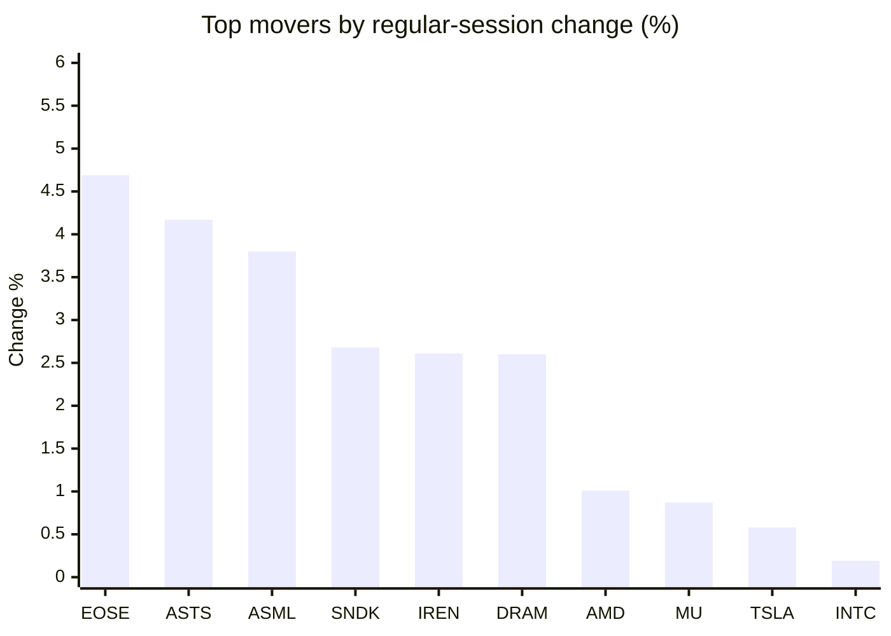
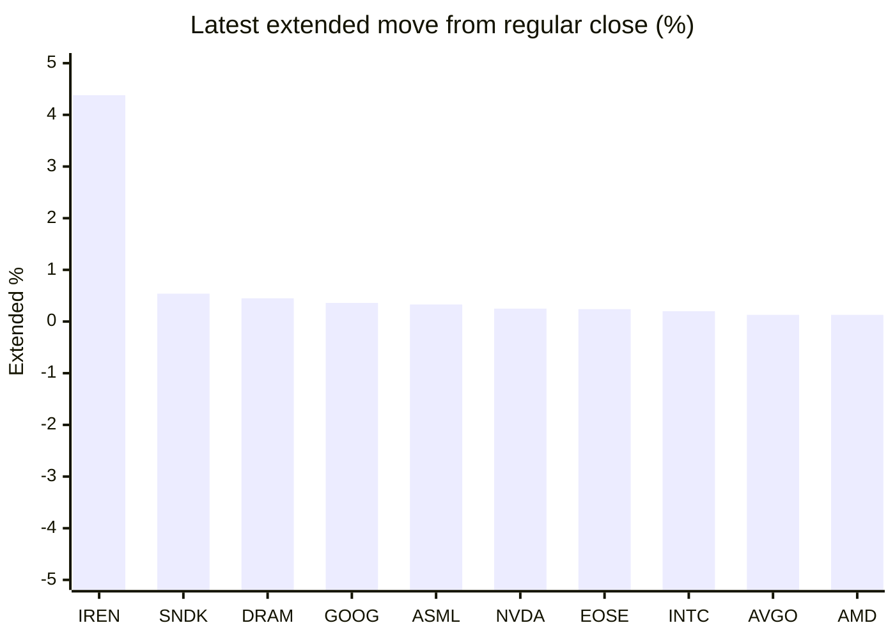

# Stock Brief - 2026-08-12

Generated at 2026-08-12 11:10 +07 from `watchlist.md`.
Prices are snapshots from Yahoo Finance public chart data. Extended/overnight is the latest available pre/post-market datapoint from the same feed.

## Market Snapshot

- SPY: close 770.56, latest extended 770.98, regular move -0.32%, extended move +0.05%
- QQQ: close 718.45, latest extended 718.94, regular move -0.34%, extended move +0.07%
- JEPQ: close 59.65, latest extended 59.69, regular move -0.05%, extended move +0.07%

## Watchlist Prices

| Ticker | Name | Regular close | Latest extended/overnight | Regular move | Extended move | Latest data time | Source |
|---|---|---:|---:|---:|---:|---|---|
| INTC | Intel Corporation | 97.71 USD | 97.91 USD | +0.19% | +0.20% | 2026-08-11 19:59 EDT | [Yahoo](https://finance.yahoo.com/quote/INTC/) |
| AVGO | Broadcom Inc. | 416.08 USD | 416.62 USD | -1.50% | +0.13% | 2026-08-11 19:59 EDT | [Yahoo](https://finance.yahoo.com/quote/AVGO/) |
| RKLB | Rocket Lab Corporation | 80.01 USD | 79.57 USD | -0.04% | -0.55% | 2026-08-11 19:59 EDT | [Yahoo](https://finance.yahoo.com/quote/RKLB/) |
| AAPL | Apple Inc. | 304.91 USD | 305.07 USD | -1.09% | +0.05% | 2026-08-11 19:59 EDT | [Yahoo](https://finance.yahoo.com/quote/AAPL/) |
| NVDA | NVIDIA Corporation | 217.50 USD | 218.04 USD | -0.02% | +0.25% | 2026-08-11 19:59 EDT | [Yahoo](https://finance.yahoo.com/quote/NVDA/) |
| TSLA | Tesla, Inc. | 332.81 USD | 332.99 USD | +0.58% | +0.05% | 2026-08-11 19:59 EDT | [Yahoo](https://finance.yahoo.com/quote/TSLA/) |
| SNDK | Sandisk Corporation | 1,271.05 USD | 1,277.97 USD | +2.68% | +0.54% | 2026-08-11 19:59 EDT | [Yahoo](https://finance.yahoo.com/quote/SNDK/) |
| QQQ | Invesco QQQ Trust, Series 1 | 718.45 USD | 718.94 USD | -0.34% | +0.07% | 2026-08-11 19:59 EDT | [Yahoo](https://finance.yahoo.com/quote/QQQ/) |
| SPY | State Street SPDR S&P 500 ETF T | 770.56 USD | 770.98 USD | -0.32% | +0.05% | 2026-08-11 19:59 EDT | [Yahoo](https://finance.yahoo.com/quote/SPY/) |
| JEPQ | JPMorgan Nasdaq Equity Premium  | 59.65 USD | 59.69 USD | -0.05% | +0.07% | 2026-08-11 19:58 EDT | [Yahoo](https://finance.yahoo.com/quote/JEPQ/) |
| ASTS | AST SpaceMobile, Inc. | 71.63 USD | 71.70 USD | +4.17% | +0.10% | 2026-08-11 19:59 EDT | [Yahoo](https://finance.yahoo.com/quote/ASTS/) |
| MU | Micron Technology, Inc. | 868.52 USD | 867.15 USD | +0.87% | -0.16% | 2026-08-11 19:59 EDT | [Yahoo](https://finance.yahoo.com/quote/MU/) |
| IREN | IREN LIMITED | 39.75 USD | 41.49 USD | +2.61% | +4.38% | 2026-08-11 19:59 EDT | [Yahoo](https://finance.yahoo.com/quote/IREN/) |
| EOSE | Eos Energy Enterprises, Inc. | 4.24 USD | 4.25 USD | +4.69% | +0.24% | 2026-08-11 19:59 EDT | [Yahoo](https://finance.yahoo.com/quote/EOSE/) |
| GOOG | Alphabet Inc. | 343.00 USD | 344.25 USD | -3.61% | +0.36% | 2026-08-11 19:59 EDT | [Yahoo](https://finance.yahoo.com/quote/GOOG/) |
| DRAM | Roundhill Memory ETF | 50.89 USD | 51.12 USD | +2.60% | +0.45% | 2026-08-11 19:59 EDT | [Yahoo](https://finance.yahoo.com/quote/DRAM/) |
| AMD | Advanced Micro Devices, Inc. | 474.32 USD | 474.93 USD | +1.01% | +0.13% | 2026-08-11 19:59 EDT | [Yahoo](https://finance.yahoo.com/quote/AMD/) |
| ASML | ASML Holding N.V. - New York Re | 1,799.38 USD | 1,805.36 USD | +3.80% | +0.33% | 2026-08-11 19:59 EDT | [Yahoo](https://finance.yahoo.com/quote/ASML/) |

## Charts

### Top Movers - Regular Session

### Extended / Overnight Move

### Quick Heatmap

| Group | Names in watchlist | Avg regular move | Avg extended move |
|---|---|---:|---:|
| Mega-cap tech | AVGO, AAPL, NVDA, TSLA, GOOG | -1.13% | +0.17% |
| Semis / memory | INTC, SNDK, MU, DRAM, AMD, ASML | +1.86% | +0.25% |
| Space / high beta | RKLB, ASTS, IREN, EOSE | +2.86% | +1.04% |
| ETFs | QQQ, SPY, JEPQ | -0.24% | +0.06% |

## News Headlines

- [Dow Jones Futures: 3 Nvidia Partners Lead Earnings Movers; CPI Inflation Data Due](https://finance.yahoo.com/m/7170c7f6-3bd3-35bf-bee2-a691a7f3afbd/dow-jones-futures%3A-3-nvidia.html?.tsrc=rss) (2026-08-12 11:08 Bangkok)
- [Helfie AI Appoints Heavyweight Tech and Governance Leaders to its Board of Directors](https://finance.yahoo.com/technology/ai/articles/helfie-ai-appoints-heavyweight-tech-033700840.html?.tsrc=rss) (2026-08-12 10:37 Bangkok)
- [BofA sends strong message on Nvidia's weak spot](https://www.thestreet.com/investing/bofa-says-nvidia-500-billion-plan-eases-financing-risk?.tsrc=rss) (2026-08-12 10:07 Bangkok)
- [Nvidia's $500 Billion Financing Plan Is 20 Times What the Telecom Bubble Ran On](https://www.fool.com/investing/2026/08/11/nvidias-500-billion-financing-plan-is-20-times-wha/?.tsrc=rss) (2026-08-12 10:01 Bangkok)
- [Boomers Are Getting Rich and Retiring Early. 1 No-Brainer Stock To Buy Now](https://www.fool.com/investing/2026/08/11/boomers-are-getting-rich-and-retiring-early-1-no-b/?.tsrc=rss) (2026-08-12 09:52 Bangkok)
- [Want to Read the Market Like Cramer? Ask These 3 Questions](https://beincrypto.com/cramer-3-questions-read-market/?.tsrc=rss) (2026-08-12 09:25 Bangkok)
- [CoreWeave Stock Surges Nearly 16% After Earnings, Analyst Says Old Nvidia GPUs Can 'Still Generate Revenue Nearly a Decade Later'](https://finance.yahoo.com/markets/stocks/articles/coreweave-stock-surges-nearly-16-021718062.html?.tsrc=rss) (2026-08-12 09:17 Bangkok)
- [Why Plug Power Stock Popped Today](https://www.fool.com/investing/2026/08/11/why-plug-power-stock-popped-today/?.tsrc=rss) (2026-08-12 08:51 Bangkok)

## Caveats

- This is not investment advice. Extended-hours prices can be thin and volatile.
- Yahoo public endpoints may lag official exchange data.
