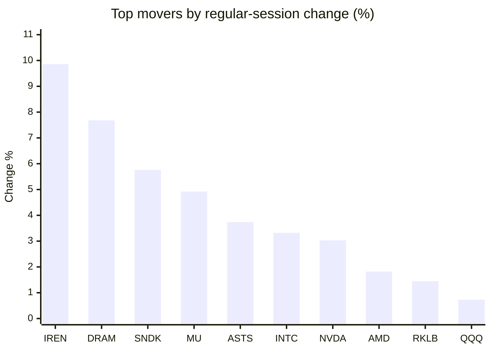
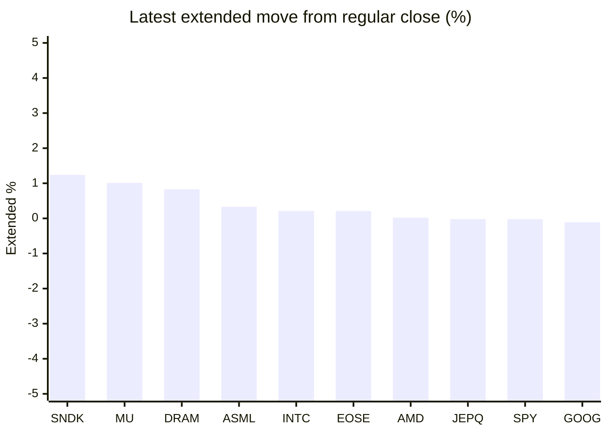

# Stock Brief - 2026-08-13

Generated at 2026-08-13 11:14 +07 from `watchlist.md`.
Prices are snapshots from Yahoo Finance public chart data. Extended/overnight is the latest available pre/post-market datapoint from the same feed.

## Market Snapshot

- SPY: close 772.49, latest extended 772.30, regular move +0.25%, extended move -0.02%
- QQQ: close 723.70, latest extended 722.58, regular move +0.73%, extended move -0.15%
- JEPQ: close 60.00, latest extended 59.99, regular move +0.59%, extended move -0.02%

## Watchlist Prices

| Ticker | Name | Regular close | Latest extended/overnight | Regular move | Extended move | Latest data time | Source |
|---|---|---:|---:|---:|---:|---|---|
| INTC | Intel Corporation | 100.95 USD | 101.17 USD | +3.32% | +0.21% | 2026-08-12 19:59 EDT | [Yahoo](https://finance.yahoo.com/quote/INTC/) |
| AVGO | Broadcom Inc. | 416.05 USD | 415.22 USD | -0.01% | -0.20% | 2026-08-12 19:59 EDT | [Yahoo](https://finance.yahoo.com/quote/AVGO/) |
| RKLB | Rocket Lab Corporation | 81.17 USD | 80.81 USD | +1.45% | -0.44% | 2026-08-12 19:59 EDT | [Yahoo](https://finance.yahoo.com/quote/RKLB/) |
| AAPL | Apple Inc. | 302.25 USD | 301.40 USD | -0.87% | -0.28% | 2026-08-12 19:59 EDT | [Yahoo](https://finance.yahoo.com/quote/AAPL/) |
| NVDA | NVIDIA Corporation | 224.09 USD | 223.74 USD | +3.03% | -0.16% | 2026-08-12 19:59 EDT | [Yahoo](https://finance.yahoo.com/quote/NVDA/) |
| TSLA | Tesla, Inc. | 327.51 USD | 326.97 USD | -1.59% | -0.16% | 2026-08-12 19:59 EDT | [Yahoo](https://finance.yahoo.com/quote/TSLA/) |
| SNDK | Sandisk Corporation | 1,344.29 USD | 1,361.00 USD | +5.76% | +1.24% | 2026-08-12 19:59 EDT | [Yahoo](https://finance.yahoo.com/quote/SNDK/) |
| QQQ | Invesco QQQ Trust, Series 1 | 723.70 USD | 722.58 USD | +0.73% | -0.15% | 2026-08-12 19:59 EDT | [Yahoo](https://finance.yahoo.com/quote/QQQ/) |
| SPY | State Street SPDR S&P 500 ETF T | 772.49 USD | 772.30 USD | +0.25% | -0.02% | 2026-08-12 19:59 EDT | [Yahoo](https://finance.yahoo.com/quote/SPY/) |
| JEPQ | JPMorgan Nasdaq Equity Premium  | 60.00 USD | 59.99 USD | +0.59% | -0.02% | 2026-08-12 19:59 EDT | [Yahoo](https://finance.yahoo.com/quote/JEPQ/) |
| ASTS | AST SpaceMobile, Inc. | 74.31 USD | 74.04 USD | +3.74% | -0.37% | 2026-08-12 19:59 EDT | [Yahoo](https://finance.yahoo.com/quote/ASTS/) |
| MU | Micron Technology, Inc. | 911.29 USD | 920.50 USD | +4.92% | +1.01% | 2026-08-12 19:59 EDT | [Yahoo](https://finance.yahoo.com/quote/MU/) |
| IREN | IREN LIMITED | 43.67 USD | 43.58 USD | +9.86% | -0.21% | 2026-08-12 19:59 EDT | [Yahoo](https://finance.yahoo.com/quote/IREN/) |
| EOSE | Eos Energy Enterprises, Inc. | 4.24 USD | 4.25 USD | +0.00% | +0.21% | 2026-08-12 19:58 EDT | [Yahoo](https://finance.yahoo.com/quote/EOSE/) |
| GOOG | Alphabet Inc. | 342.37 USD | 341.98 USD | -0.18% | -0.11% | 2026-08-12 19:59 EDT | [Yahoo](https://finance.yahoo.com/quote/GOOG/) |
| DRAM | Roundhill Memory ETF | 54.80 USD | 55.26 USD | +7.68% | +0.83% | 2026-08-12 19:59 EDT | [Yahoo](https://finance.yahoo.com/quote/DRAM/) |
| AMD | Advanced Micro Devices, Inc. | 482.93 USD | 483.01 USD | +1.82% | +0.02% | 2026-08-12 19:59 EDT | [Yahoo](https://finance.yahoo.com/quote/AMD/) |
| ASML | ASML Holding N.V. - New York Re | 1,810.07 USD | 1,816.00 USD | +0.59% | +0.33% | 2026-08-12 19:58 EDT | [Yahoo](https://finance.yahoo.com/quote/ASML/) |

## Charts

### Top Movers - Regular Session

### Extended / Overnight Move

### Quick Heatmap

| Group | Names in watchlist | Avg regular move | Avg extended move |
|---|---|---:|---:|
| Mega-cap tech | AVGO, AAPL, NVDA, TSLA, GOOG | +0.07% | -0.18% |
| Semis / memory | INTC, SNDK, MU, DRAM, AMD, ASML | +4.02% | +0.61% |
| Space / high beta | RKLB, ASTS, IREN, EOSE | +3.76% | -0.20% |
| ETFs | QQQ, SPY, JEPQ | +0.52% | -0.07% |

## News Headlines

- [Nvidia’s biggest risk may be coming from inside its customer base](https://www.thestreet.com/investing/nvidias-biggest-risk-may-be-coming-from-inside-its-customer-base?.tsrc=rss) (2026-08-13 09:37 Bangkok)
- [ASTS And RKLB Chase The SpaceX Playbook, But Analyst Flags ‘Very Inflated Valuations’ And Mounting Delays](https://stocktwits.com/news-articles/markets/equity/asts-rklb-chase-spacex-playbook-analyst-inflated-valuations-delays/cZopvXPRJhT?.tsrc=rss) (2026-08-13 09:19 Bangkok)
- [RKLB Stock Slips Overnight: Rocket Lab Tops 400 Archimedes Hot Fires, Neutron Engine Set Enters Production](https://stocktwits.com/news-articles/markets/equity/rklb-400-archimedes-hot-fires-neutron-engine-set-production/cZopMBGRJWU?.tsrc=rss) (2026-08-13 08:00 Bangkok)
- [Rocket Lab CEO Sees AI Data Centers Moving Into Space as Computing Demand Explodes: ‘Real Opportunity’ (UPDATED)](https://finance.yahoo.com/technology/ai/articles/rocket-lab-ceo-sees-ai-003104272.html?.tsrc=rss) (2026-08-13 07:31 Bangkok)
- [Apple Reportedly Negotiates Deals With Publishers For Real-Time Content To Power AI-Powered Siri](https://stocktwits.com/news-articles/markets/equity/apple-reportedly-negotiates-deals-with-publishers-for-real-time-content-to-power-ai-powered-siri/cZoprovRJWx?.tsrc=rss) (2026-08-13 07:01 Bangkok)
- [Anthropic in talks to buy Decart AI, source says](https://finance.yahoo.com/technology/ai/articles/anthropic-talks-buy-decart-ai-035155234.html?.tsrc=rss) (2026-08-13 10:51 Bangkok)
- [If a Stock Market Crash Comes in August, You'll Still Rest Easy Knowing You Bought This Dividend Stock](https://www.fool.com/investing/2026/08/12/if-a-stock-market-crash-comes-in-august-youll-stil/?.tsrc=rss) (2026-08-13 07:25 Bangkok)
- [Super Micro Guided Fiscal 2027 Revenue $16 Billion Above Wall Street and Missed the Quarter Anyway](https://www.fool.com/investing/2026/08/12/super-micro-guided-fiscal-2027-revenue-16-billion/?.tsrc=rss) (2026-08-13 10:39 Bangkok)

## Caveats

- This is not investment advice. Extended-hours prices can be thin and volatile.
- Yahoo public endpoints may lag official exchange data.
