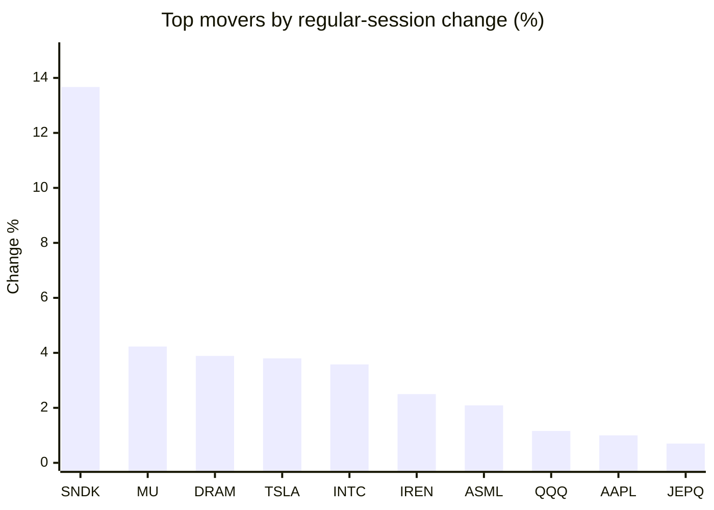
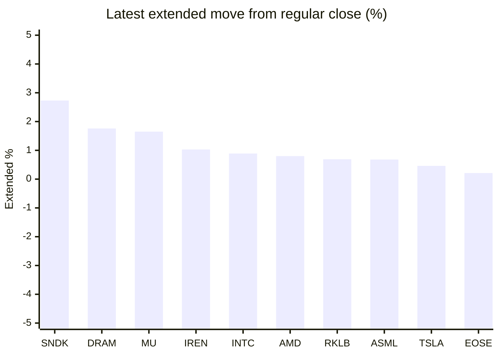

# Stock Brief - 2026-08-14

Generated at 2026-08-14 11:11 +07 from `watchlist.md`.
Prices are snapshots from Yahoo Finance public chart data. Extended/overnight is the latest available pre/post-market datapoint from the same feed.

## Market Snapshot

- SPY: close 777.88, latest extended 778.12, regular move +0.70%, extended move +0.03%
- QQQ: close 732.07, latest extended 732.23, regular move +1.16%, extended move +0.02%
- JEPQ: close 60.42, latest extended 60.43, regular move +0.70%, extended move +0.02%

## Watchlist Prices

| Ticker | Name | Regular close | Latest extended/overnight | Regular move | Extended move | Latest data time | Source |
|---|---|---:|---:|---:|---:|---|---|
| INTC | Intel Corporation | 104.56 USD | 105.49 USD | +3.58% | +0.89% | 2026-08-13 19:59 EDT | [Yahoo](https://finance.yahoo.com/quote/INTC/) |
| AVGO | Broadcom Inc. | 417.82 USD | 418.52 USD | +0.43% | +0.17% | 2026-08-13 19:59 EDT | [Yahoo](https://finance.yahoo.com/quote/AVGO/) |
| RKLB | Rocket Lab Corporation | 80.10 USD | 80.65 USD | -1.32% | +0.69% | 2026-08-13 19:59 EDT | [Yahoo](https://finance.yahoo.com/quote/RKLB/) |
| AAPL | Apple Inc. | 305.26 USD | 304.78 USD | +1.00% | -0.16% | 2026-08-13 19:59 EDT | [Yahoo](https://finance.yahoo.com/quote/AAPL/) |
| NVDA | NVIDIA Corporation | 225.30 USD | 225.43 USD | +0.54% | +0.06% | 2026-08-13 19:59 EDT | [Yahoo](https://finance.yahoo.com/quote/NVDA/) |
| TSLA | Tesla, Inc. | 339.96 USD | 341.51 USD | +3.80% | +0.46% | 2026-08-13 19:59 EDT | [Yahoo](https://finance.yahoo.com/quote/TSLA/) |
| SNDK | Sandisk Corporation | 1,528.11 USD | 1,569.84 USD | +13.67% | +2.73% | 2026-08-13 20:00 EDT | [Yahoo](https://finance.yahoo.com/quote/SNDK/) |
| QQQ | Invesco QQQ Trust, Series 1 | 732.07 USD | 732.23 USD | +1.16% | +0.02% | 2026-08-13 19:59 EDT | [Yahoo](https://finance.yahoo.com/quote/QQQ/) |
| SPY | State Street SPDR S&P 500 ETF T | 777.88 USD | 778.12 USD | +0.70% | +0.03% | 2026-08-13 19:59 EDT | [Yahoo](https://finance.yahoo.com/quote/SPY/) |
| JEPQ | JPMorgan Nasdaq Equity Premium  | 60.42 USD | 60.43 USD | +0.70% | +0.02% | 2026-08-13 19:59 EDT | [Yahoo](https://finance.yahoo.com/quote/JEPQ/) |
| ASTS | AST SpaceMobile, Inc. | 71.52 USD | 71.60 USD | -3.75% | +0.11% | 2026-08-13 19:59 EDT | [Yahoo](https://finance.yahoo.com/quote/ASTS/) |
| MU | Micron Technology, Inc. | 949.83 USD | 965.47 USD | +4.23% | +1.65% | 2026-08-13 19:59 EDT | [Yahoo](https://finance.yahoo.com/quote/MU/) |
| IREN | IREN LIMITED | 44.76 USD | 45.22 USD | +2.50% | +1.03% | 2026-08-13 19:59 EDT | [Yahoo](https://finance.yahoo.com/quote/IREN/) |
| EOSE | Eos Energy Enterprises, Inc. | 4.16 USD | 4.17 USD | -1.89% | +0.21% | 2026-08-13 19:59 EDT | [Yahoo](https://finance.yahoo.com/quote/EOSE/) |
| GOOG | Alphabet Inc. | 343.94 USD | 344.15 USD | +0.46% | +0.06% | 2026-08-13 19:59 EDT | [Yahoo](https://finance.yahoo.com/quote/GOOG/) |
| DRAM | Roundhill Memory ETF | 56.93 USD | 57.93 USD | +3.89% | +1.76% | 2026-08-13 19:59 EDT | [Yahoo](https://finance.yahoo.com/quote/DRAM/) |
| AMD | Advanced Micro Devices, Inc. | 483.01 USD | 486.85 USD | +0.02% | +0.80% | 2026-08-13 19:59 EDT | [Yahoo](https://finance.yahoo.com/quote/AMD/) |
| ASML | ASML Holding N.V. - New York Re | 1,847.90 USD | 1,860.38 USD | +2.09% | +0.68% | 2026-08-13 19:58 EDT | [Yahoo](https://finance.yahoo.com/quote/ASML/) |

## Charts

### Top Movers - Regular Session

### Extended / Overnight Move

### Quick Heatmap

| Group | Names in watchlist | Avg regular move | Avg extended move |
|---|---|---:|---:|
| Mega-cap tech | AVGO, AAPL, NVDA, TSLA, GOOG | +1.24% | +0.12% |
| Semis / memory | INTC, SNDK, MU, DRAM, AMD, ASML | +4.58% | +1.42% |
| Space / high beta | RKLB, ASTS, IREN, EOSE | -1.12% | +0.51% |
| ETFs | QQQ, SPY, JEPQ | +0.85% | +0.02% |

## News Headlines

- [Goldman in talks with investors on Nvidia financing deal after landing prized role, sources say](https://finance.yahoo.com/technology/ai/articles/goldman-talks-investors-nvidia-financing-040352701.html?.tsrc=rss) (2026-08-14 11:03 Bangkok)
- [Dow Jones Futures: S&P 500 Hits High On Workday, Sandisk, Oil Prices; Applied Materials Earnings Late](https://finance.yahoo.com/m/d77ca588-1019-36e1-8065-a36ae0ce7b6c/dow-jones-futures%3A-s%26p-500.html?.tsrc=rss) (2026-08-14 10:05 Bangkok)
- [Is the Reported $400 Billion AstraZeneca-Bristol Myers Squibb Megamerger a Slam Dunk -- or a Disaster Waiting to Happen?](https://www.fool.com/investing/2026/08/13/is-the-reported-400-billion-astrazeneca-bristol-my/?.tsrc=rss) (2026-08-14 09:20 Bangkok)
- [Trump Wanted Advanced Tech Made in America, Tim Cook Brought Mac Mini Production to Texas: 'Thank You' for the $600 Billion Commitment, Says Howard Lutnick](https://finance.yahoo.com/technology/articles/trump-wanted-advanced-tech-made-020749304.html?.tsrc=rss) (2026-08-14 09:07 Bangkok)
- [Nvidia CEO Jensen Huang Just Introduced a Bold $500 Billion Plan to Potentially Create Chip-Backed Securities. What Could Go Wrong?](https://www.fool.com/investing/2026/08/13/nvidia-ceo-jensen-huang-just-introduced-a-bold-500/?.tsrc=rss) (2026-08-14 08:50 Bangkok)
- [RKLB Stock Gains Overnight: Rocket Lab Advances Neutron’s ‘Hungry Hippo’ And Wins New Space Force Deal](https://stocktwits.com/news-articles/markets/equity/rklb-neutron-hungry-hippo-new-space-force-deal/cZotbjNRJiT?.tsrc=rss) (2026-08-14 08:43 Bangkok)
- [Michael Burry Calls Nvidia’s $500 Billion AI Financing Push a ‘Wall Street Stunt’: ‘Meet the New Boss…'](https://finance.yahoo.com/technology/ai/articles/michael-burry-calls-nvidia-500-013002467.html?.tsrc=rss) (2026-08-14 08:30 Bangkok)
- [Apple’s next iPhone battle just got more complicated](https://www.thestreet.com/investing/apple-next-iphone-battle-google-pixel-11?.tsrc=rss) (2026-08-14 08:17 Bangkok)

## Caveats

- This is not investment advice. Extended-hours prices can be thin and volatile.
- Yahoo public endpoints may lag official exchange data.
