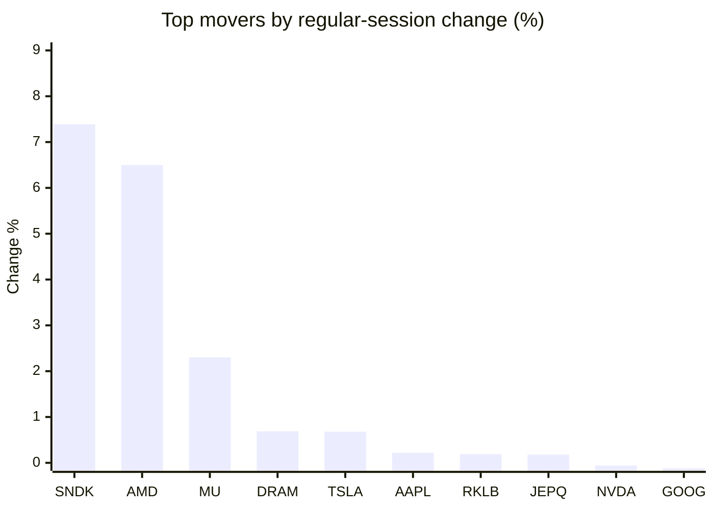
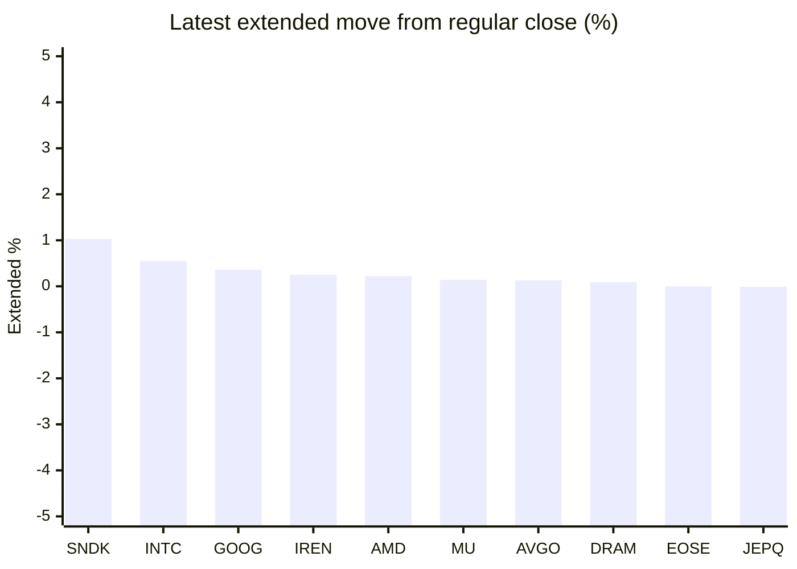

# Stock Brief - 2026-08-16

Generated at 2026-08-16 10:03 +07 from `watchlist.md`.
Prices are snapshots from Yahoo Finance public chart data. Extended/overnight is the latest available pre/post-market datapoint from the same feed.

## Market Snapshot

- SPY: close 776.34, latest extended 776.01, regular move -0.20%, extended move -0.04%
- QQQ: close 731.07, latest extended 730.85, regular move -0.14%, extended move -0.03%
- JEPQ: close 60.53, latest extended 60.53, regular move +0.18%, extended move -0.01%

## Watchlist Prices

| Ticker | Name | Regular close | Latest extended/overnight | Regular move | Extended move | Latest data time | Source |
|---|---|---:|---:|---:|---:|---|---|
| INTC | Intel Corporation | 102.50 USD | 103.06 USD | -1.97% | +0.55% | 2026-08-14 19:59 EDT | [Yahoo](https://finance.yahoo.com/quote/INTC/) |
| AVGO | Broadcom Inc. | 392.99 USD | 393.52 USD | -5.94% | +0.13% | 2026-08-14 19:59 EDT | [Yahoo](https://finance.yahoo.com/quote/AVGO/) |
| RKLB | Rocket Lab Corporation | 80.25 USD | 80.13 USD | +0.19% | -0.15% | 2026-08-14 19:59 EDT | [Yahoo](https://finance.yahoo.com/quote/RKLB/) |
| AAPL | Apple Inc. | 305.93 USD | 305.77 USD | +0.22% | -0.05% | 2026-08-14 19:59 EDT | [Yahoo](https://finance.yahoo.com/quote/AAPL/) |
| NVDA | NVIDIA Corporation | 225.16 USD | 224.72 USD | -0.06% | -0.20% | 2026-08-14 19:59 EDT | [Yahoo](https://finance.yahoo.com/quote/NVDA/) |
| TSLA | Tesla, Inc. | 342.27 USD | 341.65 USD | +0.68% | -0.18% | 2026-08-14 19:59 EDT | [Yahoo](https://finance.yahoo.com/quote/TSLA/) |
| SNDK | Sandisk Corporation | 1,641.11 USD | 1,658.00 USD | +7.39% | +1.03% | 2026-08-14 19:59 EDT | [Yahoo](https://finance.yahoo.com/quote/SNDK/) |
| QQQ | Invesco QQQ Trust, Series 1 | 731.07 USD | 730.85 USD | -0.14% | -0.03% | 2026-08-14 19:59 EDT | [Yahoo](https://finance.yahoo.com/quote/QQQ/) |
| SPY | State Street SPDR S&P 500 ETF T | 776.34 USD | 776.01 USD | -0.20% | -0.04% | 2026-08-14 19:59 EDT | [Yahoo](https://finance.yahoo.com/quote/SPY/) |
| JEPQ | JPMorgan Nasdaq Equity Premium  | 60.53 USD | 60.53 USD | +0.18% | -0.01% | 2026-08-14 19:59 EDT | [Yahoo](https://finance.yahoo.com/quote/JEPQ/) |
| ASTS | AST SpaceMobile, Inc. | 70.98 USD | 70.92 USD | -0.76% | -0.08% | 2026-08-14 19:59 EDT | [Yahoo](https://finance.yahoo.com/quote/ASTS/) |
| MU | Micron Technology, Inc. | 971.66 USD | 972.98 USD | +2.30% | +0.14% | 2026-08-14 19:59 EDT | [Yahoo](https://finance.yahoo.com/quote/MU/) |
| IREN | IREN LIMITED | 44.06 USD | 44.17 USD | -1.56% | +0.25% | 2026-08-14 19:59 EDT | [Yahoo](https://finance.yahoo.com/quote/IREN/) |
| EOSE | Eos Energy Enterprises, Inc. | 4.02 USD | 4.02 USD | -3.37% | +0.00% | 2026-08-14 19:59 EDT | [Yahoo](https://finance.yahoo.com/quote/EOSE/) |
| GOOG | Alphabet Inc. | 343.54 USD | 344.78 USD | -0.12% | +0.36% | 2026-08-14 19:59 EDT | [Yahoo](https://finance.yahoo.com/quote/GOOG/) |
| DRAM | Roundhill Memory ETF | 57.32 USD | 57.37 USD | +0.69% | +0.09% | 2026-08-14 19:59 EDT | [Yahoo](https://finance.yahoo.com/quote/DRAM/) |
| AMD | Advanced Micro Devices, Inc. | 514.39 USD | 515.50 USD | +6.50% | +0.22% | 2026-08-14 19:59 EDT | [Yahoo](https://finance.yahoo.com/quote/AMD/) |
| ASML | ASML Holding N.V. - New York Re | 1,844.08 USD | 1,841.01 USD | -0.21% | -0.17% | 2026-08-14 19:58 EDT | [Yahoo](https://finance.yahoo.com/quote/ASML/) |

## Charts

### Top Movers - Regular Session

### Extended / Overnight Move

### Quick Heatmap

| Group | Names in watchlist | Avg regular move | Avg extended move |
|---|---|---:|---:|
| Mega-cap tech | AVGO, AAPL, NVDA, TSLA, GOOG | -1.04% | +0.01% |
| Semis / memory | INTC, SNDK, MU, DRAM, AMD, ASML | +2.45% | +0.31% |
| Space / high beta | RKLB, ASTS, IREN, EOSE | -1.37% | +0.00% |
| ETFs | QQQ, SPY, JEPQ | -0.05% | -0.03% |

## News Headlines

- [AMD Just Borrowed $4.75 Billion, More Than Triple Its Last Bond Sale](https://www.fool.com/investing/2026/08/15/amd-just-borrowed-475-billion-more-than-triple-its/?.tsrc=rss) (2026-08-16 09:39 Bangkok)
- [If You've Saved This Much for Retirement by Age 50, You're Ahead of the Game](https://www.fool.com/retirement/2026/08/15/if-youve-saved-this-much-for-retirement-by-age-50/?.tsrc=rss) (2026-08-16 09:21 Bangkok)
- [Firefly Aerospace Is Awarded New Orbital Contract From Department of Defense](https://www.fool.com/investing/2026/08/15/firefly-aerospace-is-awarded-new-orbital-contract-from-department-of-defense/?.tsrc=rss) (2026-08-16 09:10 Bangkok)
- [Why Data Centers Are Turning Energy Stocks Into AI Plays](https://www.fool.com/investing/2026/08/15/why-data-centers-are-turning-energy-stocks-into-ai/?.tsrc=rss) (2026-08-16 09:05 Bangkok)
- [Could Investing $5,000 in SpaceX Help Make You a Millionaire?](https://www.fool.com/investing/2026/08/15/could-investing-5000-in-spacex-help-make-you-a-mil/?.tsrc=rss) (2026-08-16 08:50 Bangkok)
- [1 Industrials Stock Worth Your Attention and 2 That Underwhelm](https://finance.yahoo.com/markets/stocks/articles/1-industrials-stock-worth-attention-014100621.html?.tsrc=rss) (2026-08-16 08:41 Bangkok)
- [Wedbush isn't fully buying SanDisk's investor day pitch](https://www.thestreet.com/investing/stocks/sandisk-stock-wedbush-investor-day-analysis?.tsrc=rss) (2026-08-16 08:17 Bangkok)
- [Is Berkshire’s Bigger Bet on Delta (DAL) Altering The Investment Case For The Airline?](https://finance.yahoo.com/markets/stocks/articles/berkshire-bigger-bet-delta-dal-011615749.html?.tsrc=rss) (2026-08-16 08:16 Bangkok)

## Caveats

- This is not investment advice. Extended-hours prices can be thin and volatile.
- Yahoo public endpoints may lag official exchange data.
