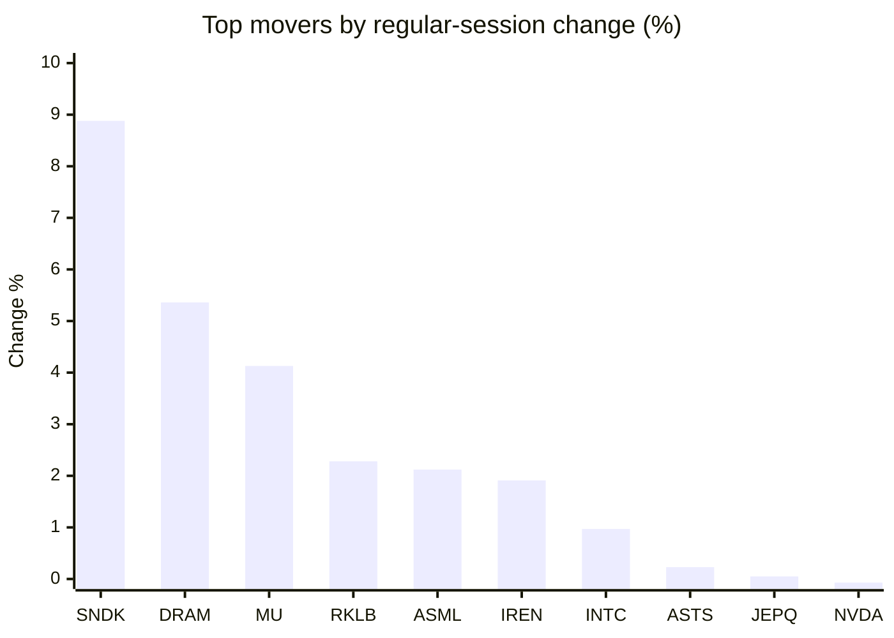
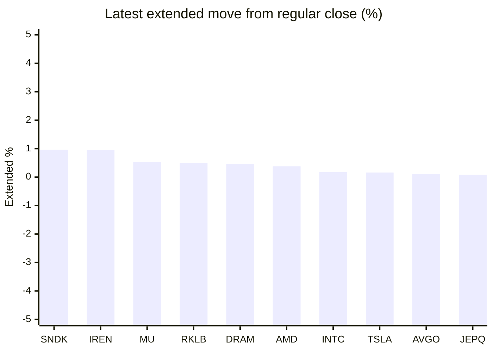

# Stock Brief - 2026-08-18

Generated at 2026-08-18 09:57 +07 from `watchlist.md`.
Prices are snapshots from Yahoo Finance public chart data. Extended/overnight is the latest available pre/post-market datapoint from the same feed.

## Market Snapshot

- SPY: close 772.67, latest extended 772.65, regular move -0.47%, extended move -0.00%
- QQQ: close 729.87, latest extended 729.98, regular move -0.16%, extended move +0.02%
- JEPQ: close 60.56, latest extended 60.61, regular move +0.05%, extended move +0.08%

## Watchlist Prices

| Ticker | Name | Regular close | Latest extended/overnight | Regular move | Extended move | Latest data time | Source |
|---|---|---:|---:|---:|---:|---|---|
| INTC | Intel Corporation | 103.49 USD | 103.68 USD | +0.97% | +0.18% | 2026-08-17 19:59 EDT | [Yahoo](https://finance.yahoo.com/quote/INTC/) |
| AVGO | Broadcom Inc. | 392.43 USD | 392.84 USD | -0.14% | +0.10% | 2026-08-17 19:59 EDT | [Yahoo](https://finance.yahoo.com/quote/AVGO/) |
| RKLB | Rocket Lab Corporation | 82.08 USD | 82.49 USD | +2.28% | +0.50% | 2026-08-17 19:59 EDT | [Yahoo](https://finance.yahoo.com/quote/RKLB/) |
| AAPL | Apple Inc. | 305.59 USD | 305.15 USD | -0.11% | -0.14% | 2026-08-17 19:59 EDT | [Yahoo](https://finance.yahoo.com/quote/AAPL/) |
| NVDA | NVIDIA Corporation | 225.01 USD | 225.15 USD | -0.07% | +0.06% | 2026-08-17 19:59 EDT | [Yahoo](https://finance.yahoo.com/quote/NVDA/) |
| TSLA | Tesla, Inc. | 339.30 USD | 339.85 USD | -0.87% | +0.16% | 2026-08-17 19:59 EDT | [Yahoo](https://finance.yahoo.com/quote/TSLA/) |
| SNDK | Sandisk Corporation | 1,786.85 USD | 1,804.00 USD | +8.88% | +0.96% | 2026-08-17 19:59 EDT | [Yahoo](https://finance.yahoo.com/quote/SNDK/) |
| QQQ | Invesco QQQ Trust, Series 1 | 729.87 USD | 729.98 USD | -0.16% | +0.02% | 2026-08-17 19:59 EDT | [Yahoo](https://finance.yahoo.com/quote/QQQ/) |
| SPY | State Street SPDR S&P 500 ETF T | 772.67 USD | 772.65 USD | -0.47% | -0.00% | 2026-08-17 19:59 EDT | [Yahoo](https://finance.yahoo.com/quote/SPY/) |
| JEPQ | JPMorgan Nasdaq Equity Premium  | 60.56 USD | 60.61 USD | +0.05% | +0.08% | 2026-08-17 19:57 EDT | [Yahoo](https://finance.yahoo.com/quote/JEPQ/) |
| ASTS | AST SpaceMobile, Inc. | 71.14 USD | 71.14 USD | +0.23% | +0.00% | 2026-08-17 19:59 EDT | [Yahoo](https://finance.yahoo.com/quote/ASTS/) |
| MU | Micron Technology, Inc. | 1,011.75 USD | 1,017.14 USD | +4.13% | +0.53% | 2026-08-17 19:59 EDT | [Yahoo](https://finance.yahoo.com/quote/MU/) |
| IREN | IREN LIMITED | 44.90 USD | 45.33 USD | +1.91% | +0.95% | 2026-08-17 19:59 EDT | [Yahoo](https://finance.yahoo.com/quote/IREN/) |
| EOSE | Eos Energy Enterprises, Inc. | 3.93 USD | 3.92 USD | -2.24% | -0.25% | 2026-08-17 19:59 EDT | [Yahoo](https://finance.yahoo.com/quote/EOSE/) |
| GOOG | Alphabet Inc. | 341.45 USD | 341.38 USD | -0.61% | -0.02% | 2026-08-17 19:59 EDT | [Yahoo](https://finance.yahoo.com/quote/GOOG/) |
| DRAM | Roundhill Memory ETF | 60.39 USD | 60.67 USD | +5.36% | +0.46% | 2026-08-17 19:59 EDT | [Yahoo](https://finance.yahoo.com/quote/DRAM/) |
| AMD | Advanced Micro Devices, Inc. | 506.00 USD | 507.90 USD | -1.63% | +0.38% | 2026-08-17 19:59 EDT | [Yahoo](https://finance.yahoo.com/quote/AMD/) |
| ASML | ASML Holding N.V. - New York Re | 1,883.12 USD | 1,884.51 USD | +2.12% | +0.07% | 2026-08-17 19:58 EDT | [Yahoo](https://finance.yahoo.com/quote/ASML/) |

## Charts

### Top Movers - Regular Session

### Extended / Overnight Move

### Quick Heatmap

| Group | Names in watchlist | Avg regular move | Avg extended move |
|---|---|---:|---:|
| Mega-cap tech | AVGO, AAPL, NVDA, TSLA, GOOG | -0.36% | +0.03% |
| Semis / memory | INTC, SNDK, MU, DRAM, AMD, ASML | +3.30% | +0.43% |
| Space / high beta | RKLB, ASTS, IREN, EOSE | +0.54% | +0.30% |
| ETFs | QQQ, SPY, JEPQ | -0.20% | +0.03% |

## News Headlines

- [Intel (INTC) Is Up 6.1% After $20 Billion Equity Raise To Fund AI Build-Out - What's Changed](https://finance.yahoo.com/technology/ai/articles/intel-intc-6-1-20-020946989.html?.tsrc=rss) (2026-08-18 09:09 Bangkok)
- [Dow Jones Futures: Trump Comments Spark Stock Market Losses; Elon Musk-Led SpaceX Rallies](https://finance.yahoo.com/m/161621c8-7f5e-35ac-89ec-13480079526c/dow-jones-futures%3A-trump.html?.tsrc=rss) (2026-08-18 09:08 Bangkok)
- [Micron Reclaims $1,000 Amid Fresh Memory Momentum: Jim Cramer Says MU Stock Can ‘Double Again’](https://stocktwits.com/news-articles/markets/equity/micron-reclaims-1-000-amid-fresh-memory-momentum-jim-cramer-says-mu-stock-can-double-again/cZYTMjsRJSe?.tsrc=rss) (2026-08-18 08:59 Bangkok)
- [Why HIVE Stock Popped Today](https://www.fool.com/investing/2026/08/17/why-hive-stock-popped-today/?.tsrc=rss) (2026-08-18 08:41 Bangkok)
- [ASTS Stock Halts 2-Day Skid: Ligado Still Awaits FCC Clearance To Use Its Spectrum Through 96 AST Satellites](https://stocktwits.com/news-articles/markets/equity/asts-ligado-fcc-clearance-spectrum-96-ast-satellites/cZYTtUARJS4?.tsrc=rss) (2026-08-18 08:36 Bangkok)
- [Nvidia Backs 8-GW Ohio AI Campus for OpenAI With $1.5 Billion Investment](https://finance.yahoo.com/technology/ai/articles/nvidia-backs-8-gw-ohio-013000089.html?.tsrc=rss) (2026-08-18 08:30 Bangkok)
- [Rocket Lab clears 1st hurdle in its biggest satellite deal](https://www.thestreet.com/technology/rocket-lab-mda-space-satellite-launch?.tsrc=rss) (2026-08-18 07:37 Bangkok)
- [AST SpaceMobile (ASTS) Q2 2026 Earnings Call Transcript](https://www.fool.com/earnings/call-transcripts/2026/08/17/ast-spacemobile-asts-q2-2026-earnings-call-transcript/?.tsrc=rss) (2026-08-18 06:29 Bangkok)

## Caveats

- This is not investment advice. Extended-hours prices can be thin and volatile.
- Yahoo public endpoints may lag official exchange data.
