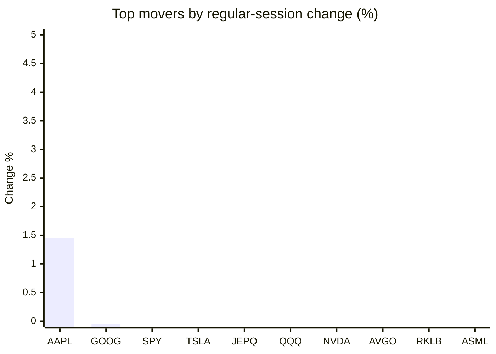
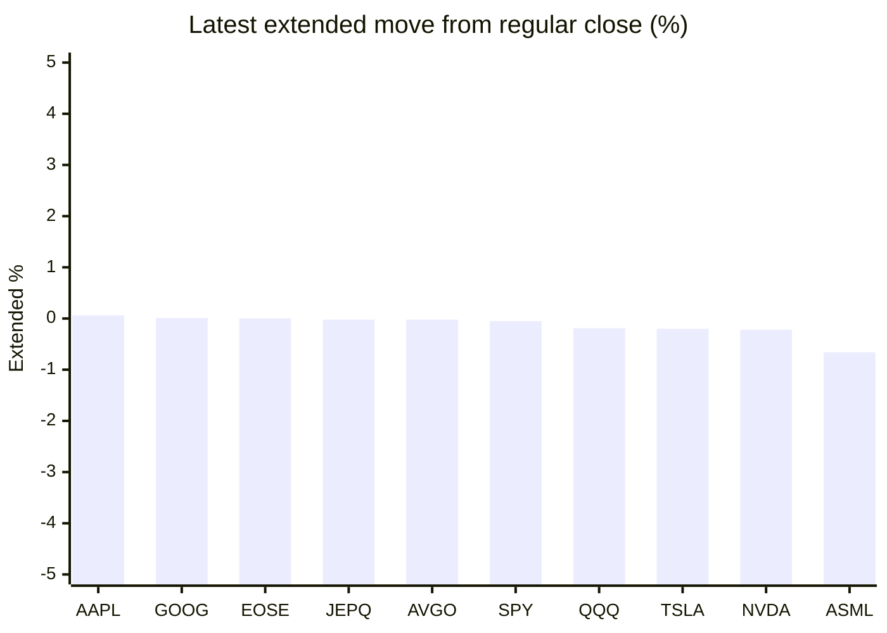

# Stock Brief - 2026-08-19

Generated at 2026-08-19 10:00 +07 from `watchlist.md`.
Prices are snapshots from Yahoo Finance public chart data. Extended/overnight is the latest available pre/post-market datapoint from the same feed.

## Market Snapshot

- SPY: close 767.45, latest extended 767.08, regular move -0.68%, extended move -0.05%
- QQQ: close 717.51, latest extended 716.18, regular move -1.69%, extended move -0.19%
- JEPQ: close 59.93, latest extended 59.92, regular move -1.04%, extended move -0.02%

## Watchlist Prices

| Ticker | Name | Regular close | Latest extended/overnight | Regular move | Extended move | Latest data time | Source |
|---|---|---:|---:|---:|---:|---|---|
| INTC | Intel Corporation | 96.68 USD | 95.71 USD | -6.58% | -1.01% | 2026-08-18 19:59 EDT | [Yahoo](https://finance.yahoo.com/quote/INTC/) |
| AVGO | Broadcom Inc. | 380.00 USD | 379.93 USD | -3.17% | -0.02% | 2026-08-18 19:59 EDT | [Yahoo](https://finance.yahoo.com/quote/AVGO/) |
| RKLB | Rocket Lab Corporation | 79.16 USD | 78.58 USD | -3.56% | -0.73% | 2026-08-18 19:59 EDT | [Yahoo](https://finance.yahoo.com/quote/RKLB/) |
| AAPL | Apple Inc. | 310.03 USD | 310.22 USD | +1.45% | +0.06% | 2026-08-18 19:59 EDT | [Yahoo](https://finance.yahoo.com/quote/AAPL/) |
| NVDA | NVIDIA Corporation | 219.74 USD | 219.25 USD | -2.34% | -0.22% | 2026-08-18 19:59 EDT | [Yahoo](https://finance.yahoo.com/quote/NVDA/) |
| TSLA | Tesla, Inc. | 336.87 USD | 336.18 USD | -0.72% | -0.20% | 2026-08-18 19:59 EDT | [Yahoo](https://finance.yahoo.com/quote/TSLA/) |
| SNDK | Sandisk Corporation | 1,625.78 USD | 1,586.00 USD | -9.01% | -2.45% | 2026-08-18 19:59 EDT | [Yahoo](https://finance.yahoo.com/quote/SNDK/) |
| QQQ | Invesco QQQ Trust, Series 1 | 717.51 USD | 716.18 USD | -1.69% | -0.19% | 2026-08-18 19:59 EDT | [Yahoo](https://finance.yahoo.com/quote/QQQ/) |
| SPY | State Street SPDR S&P 500 ETF T | 767.45 USD | 767.08 USD | -0.68% | -0.05% | 2026-08-18 19:59 EDT | [Yahoo](https://finance.yahoo.com/quote/SPY/) |
| JEPQ | JPMorgan Nasdaq Equity Premium  | 59.93 USD | 59.92 USD | -1.04% | -0.02% | 2026-08-18 19:59 EDT | [Yahoo](https://finance.yahoo.com/quote/JEPQ/) |
| ASTS | AST SpaceMobile, Inc. | 67.07 USD | 66.30 USD | -5.72% | -1.15% | 2026-08-18 19:59 EDT | [Yahoo](https://finance.yahoo.com/quote/ASTS/) |
| MU | Micron Technology, Inc. | 940.76 USD | 932.17 USD | -7.02% | -0.91% | 2026-08-18 19:59 EDT | [Yahoo](https://finance.yahoo.com/quote/MU/) |
| IREN | IREN LIMITED | 42.00 USD | 41.47 USD | -6.46% | -1.26% | 2026-08-18 19:59 EDT | [Yahoo](https://finance.yahoo.com/quote/IREN/) |
| EOSE | Eos Energy Enterprises, Inc. | 3.67 USD | 3.67 USD | -6.62% | +0.00% | 2026-08-18 19:59 EDT | [Yahoo](https://finance.yahoo.com/quote/EOSE/) |
| GOOG | Alphabet Inc. | 341.28 USD | 341.30 USD | -0.05% | +0.01% | 2026-08-18 19:59 EDT | [Yahoo](https://finance.yahoo.com/quote/GOOG/) |
| DRAM | Roundhill Memory ETF | 55.10 USD | 54.44 USD | -8.76% | -1.20% | 2026-08-18 19:59 EDT | [Yahoo](https://finance.yahoo.com/quote/DRAM/) |
| AMD | Advanced Micro Devices, Inc. | 484.39 USD | 479.40 USD | -4.27% | -1.03% | 2026-08-18 19:59 EDT | [Yahoo](https://finance.yahoo.com/quote/AMD/) |
| ASML | ASML Holding N.V. - New York Re | 1,802.98 USD | 1,791.13 USD | -4.26% | -0.66% | 2026-08-18 19:59 EDT | [Yahoo](https://finance.yahoo.com/quote/ASML/) |

## Charts

### Top Movers - Regular Session

### Extended / Overnight Move

### Quick Heatmap

| Group | Names in watchlist | Avg regular move | Avg extended move |
|---|---|---:|---:|
| Mega-cap tech | AVGO, AAPL, NVDA, TSLA, GOOG | -0.96% | -0.08% |
| Semis / memory | INTC, SNDK, MU, DRAM, AMD, ASML | -6.65% | -1.21% |
| Space / high beta | RKLB, ASTS, IREN, EOSE | -5.59% | -0.79% |
| ETFs | QQQ, SPY, JEPQ | -1.14% | -0.08% |

## News Headlines

- [Apple Shares Jump Tuesday While the Nasdaq Plummets: Here’s Why It Led Magnificent 7 Stocks](https://247wallst.com/investing/2026/08/18/apple-shares-jump-tuesday-while-the-nasdaq-plummets-heres-why-it-led-magnificent-7-stocks/?.tsrc=rss) (2026-08-19 09:52 Bangkok)
- [Dow Jones Futures Fall; After Sandisk, Micron, Credo Lead AI Losses, Market Rally Nears Key Test](https://finance.yahoo.com/m/ae8bbbcf-7a5d-37db-bb3e-baf2ff1d28ef/dow-jones-futures-fall%3B-after.html?.tsrc=rss) (2026-08-19 09:44 Bangkok)
- [Bank of America doubles down on Nvidia stock despite big risk](https://www.thestreet.com/investing/bank-of-america-doubles-down-on-nvidia-stock-despite-big-risk?.tsrc=rss) (2026-08-19 09:47 Bangkok)
- [AST SpaceMobile Supercharges BlueBird Production With Midland Expansion — But ASTS Faces Retail Bears](https://stocktwits.com/news-articles/markets/equity/ast-spacemobile-bluebird-production-midland-retail-bears/cZYdR26RJkR?.tsrc=rss) (2026-08-19 09:14 Bangkok)
- [RKLB Stock Rises Overnight After Cathie Wood’s ARK Loads Up — CFO Discloses $2.5M Share Gift Amid Space Force Wins](https://stocktwits.com/news-articles/markets/equity/rklb-cathie-wood-ark-cfo-share-gift-space-force-wins/cZYdGgfRJj6?.tsrc=rss) (2026-08-19 08:48 Bangkok)
- [Google Cloud Grew 82% Last Quarter. Azure Grew 43% and AWS Grew 37%.](https://www.fool.com/investing/2026/08/18/google-cloud-grew-82-last-quarter-azure-grew-43-and-aws-grew-37/?.tsrc=rss) (2026-08-19 08:46 Bangkok)
- [Why Kulicke & Soffa Stock Slumped by Nearly 10% Today](https://www.fool.com/investing/2026/08/18/why-kulicke-soffa-stock-slumped-by-nearly-10-today/?.tsrc=rss) (2026-08-19 07:21 Bangkok)
- [Rocket Lab Joins US Space Force Consortium and Secures $12M Satellite Contracts](https://stocktwits.com/news-articles/markets/equity/rocket-lab-joins-us-space-force-consortium-and-secures-12-m-satellite-contracts/cZYcqdbRJjy?.tsrc=rss) (2026-08-19 06:35 Bangkok)

## Caveats

- This is not investment advice. Extended-hours prices can be thin and volatile.
- Yahoo public endpoints may lag official exchange data.
