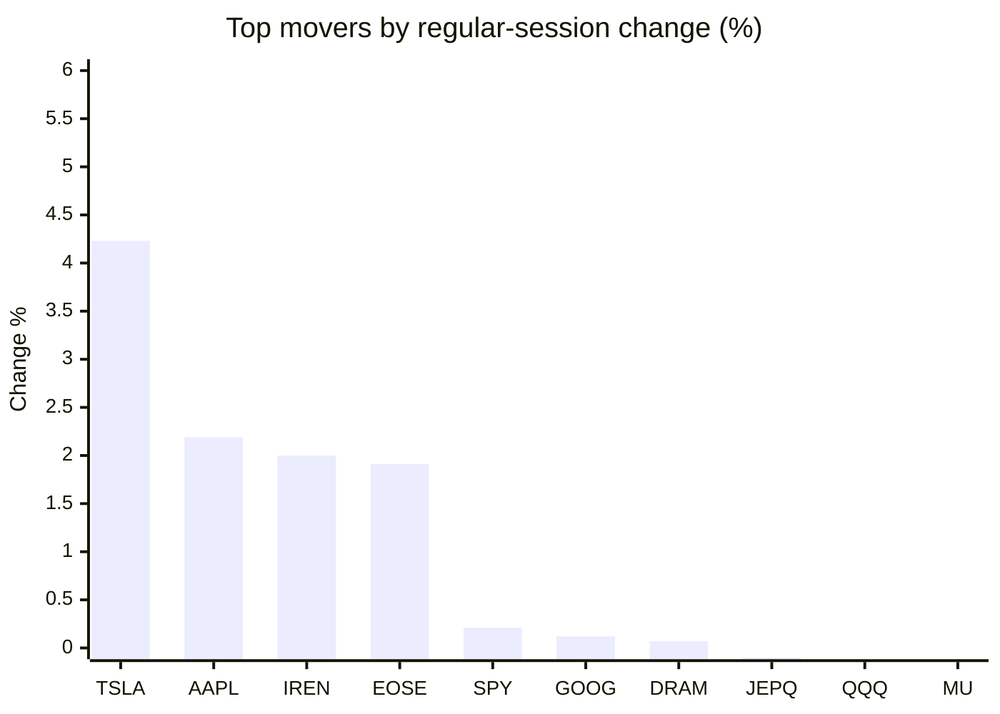
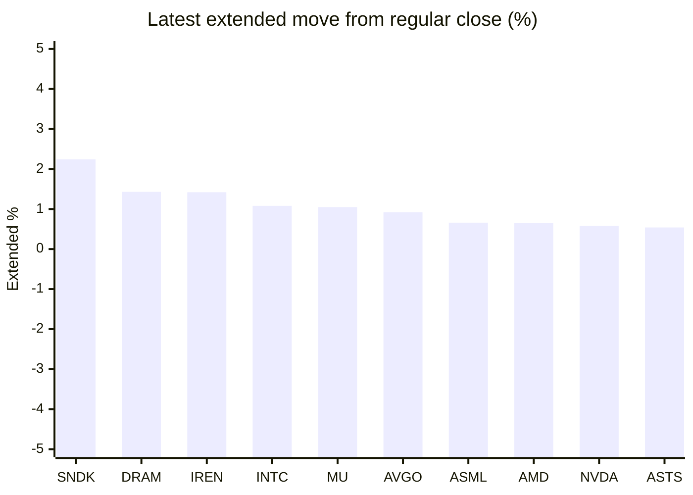

# Stock Brief - 2026-08-20

Generated at 2026-08-20 09:59 +07 from `watchlist.md`.
Prices are snapshots from Yahoo Finance public chart data. Extended/overnight is the latest available pre/post-market datapoint from the same feed.

## Market Snapshot

- SPY: close 769.06, latest extended 770.01, regular move +0.21%, extended move +0.12%
- QQQ: close 716.08, latest extended 718.69, regular move -0.20%, extended move +0.36%
- JEPQ: close 59.87, latest extended 60.04, regular move -0.10%, extended move +0.28%

## Watchlist Prices

| Ticker | Name | Regular close | Latest extended/overnight | Regular move | Extended move | Latest data time | Source |
|---|---|---:|---:|---:|---:|---|---|
| INTC | Intel Corporation | 92.80 USD | 93.80 USD | -4.02% | +1.08% | 2026-08-19 19:59 EDT | [Yahoo](https://finance.yahoo.com/quote/INTC/) |
| AVGO | Broadcom Inc. | 362.48 USD | 365.80 USD | -4.61% | +0.92% | 2026-08-19 19:59 EDT | [Yahoo](https://finance.yahoo.com/quote/AVGO/) |
| RKLB | Rocket Lab Corporation | 75.84 USD | 76.16 USD | -4.19% | +0.42% | 2026-08-19 19:59 EDT | [Yahoo](https://finance.yahoo.com/quote/RKLB/) |
| AAPL | Apple Inc. | 316.83 USD | 317.07 USD | +2.19% | +0.08% | 2026-08-19 19:59 EDT | [Yahoo](https://finance.yahoo.com/quote/AAPL/) |
| NVDA | NVIDIA Corporation | 217.56 USD | 218.82 USD | -0.99% | +0.58% | 2026-08-19 19:59 EDT | [Yahoo](https://finance.yahoo.com/quote/NVDA/) |
| TSLA | Tesla, Inc. | 351.12 USD | 350.80 USD | +4.23% | -0.09% | 2026-08-19 19:59 EDT | [Yahoo](https://finance.yahoo.com/quote/TSLA/) |
| SNDK | Sandisk Corporation | 1,568.87 USD | 1,604.08 USD | -3.50% | +2.24% | 2026-08-19 19:59 EDT | [Yahoo](https://finance.yahoo.com/quote/SNDK/) |
| QQQ | Invesco QQQ Trust, Series 1 | 716.08 USD | 718.69 USD | -0.20% | +0.36% | 2026-08-19 19:59 EDT | [Yahoo](https://finance.yahoo.com/quote/QQQ/) |
| SPY | State Street SPDR S&P 500 ETF T | 769.06 USD | 770.01 USD | +0.21% | +0.12% | 2026-08-19 19:59 EDT | [Yahoo](https://finance.yahoo.com/quote/SPY/) |
| JEPQ | JPMorgan Nasdaq Equity Premium  | 59.87 USD | 60.04 USD | -0.10% | +0.28% | 2026-08-19 19:59 EDT | [Yahoo](https://finance.yahoo.com/quote/JEPQ/) |
| ASTS | AST SpaceMobile, Inc. | 66.43 USD | 66.79 USD | -0.95% | +0.54% | 2026-08-19 19:58 EDT | [Yahoo](https://finance.yahoo.com/quote/ASTS/) |
| MU | Micron Technology, Inc. | 937.10 USD | 946.99 USD | -0.39% | +1.05% | 2026-08-19 19:59 EDT | [Yahoo](https://finance.yahoo.com/quote/MU/) |
| IREN | IREN LIMITED | 42.84 USD | 43.45 USD | +2.00% | +1.42% | 2026-08-19 19:59 EDT | [Yahoo](https://finance.yahoo.com/quote/IREN/) |
| EOSE | Eos Energy Enterprises, Inc. | 3.74 USD | 3.75 USD | +1.91% | +0.24% | 2026-08-19 19:59 EDT | [Yahoo](https://finance.yahoo.com/quote/EOSE/) |
| GOOG | Alphabet Inc. | 341.70 USD | 341.75 USD | +0.12% | +0.02% | 2026-08-19 19:59 EDT | [Yahoo](https://finance.yahoo.com/quote/GOOG/) |
| DRAM | Roundhill Memory ETF | 55.14 USD | 55.93 USD | +0.07% | +1.43% | 2026-08-19 19:59 EDT | [Yahoo](https://finance.yahoo.com/quote/DRAM/) |
| AMD | Advanced Micro Devices, Inc. | 466.42 USD | 469.43 USD | -3.71% | +0.65% | 2026-08-19 19:59 EDT | [Yahoo](https://finance.yahoo.com/quote/AMD/) |
| ASML | ASML Holding N.V. - New York Re | 1,751.73 USD | 1,763.21 USD | -2.84% | +0.66% | 2026-08-19 19:59 EDT | [Yahoo](https://finance.yahoo.com/quote/ASML/) |

## Charts

### Top Movers - Regular Session

### Extended / Overnight Move

### Quick Heatmap

| Group | Names in watchlist | Avg regular move | Avg extended move |
|---|---|---:|---:|
| Mega-cap tech | AVGO, AAPL, NVDA, TSLA, GOOG | +0.19% | +0.30% |
| Semis / memory | INTC, SNDK, MU, DRAM, AMD, ASML | -2.40% | +1.19% |
| Space / high beta | RKLB, ASTS, IREN, EOSE | -0.31% | +0.66% |
| ETFs | QQQ, SPY, JEPQ | -0.03% | +0.26% |

## News Headlines

- [Louis Navellier sets eye-opening Nvidia stock price target for rest of this year](https://www.thestreet.com/investing/louis-navellier-sets-eye-opening-nvidia-stock-price-target-for-rest-of-this-year?.tsrc=rss) (2026-08-20 09:03 Bangkok)
- [Jim Cramer makes aggressive Micron prediction, lists top memory buys](https://www.thestreet.com/investing/stocks/jim-cramer-micron-memory-stocks-ai-double-mu?.tsrc=rss) (2026-08-20 08:37 Bangkok)
- [Big Tech Is on Pace to Spend $735 Billion on AI Data Centers in 2026. These 3 Industrial Stocks Collect the Checks.](https://www.fool.com/investing/2026/08/19/big-tech-is-on-pace-to-spend-735-billion-on-ai-dat/?.tsrc=rss) (2026-08-20 08:20 Bangkok)
- [Nvidia Guided to $91 Billion. Wall Street Penciled In $92 Billion.](https://www.fool.com/investing/2026/08/19/nvidia-guided-to-usd91-billion-wall-street-penciled-in-usd92-billion/?.tsrc=rss) (2026-08-20 07:57 Bangkok)
- [SOXL Turns Every 1% Nvidia Move Into 3%. Here’s What $10,000 Did in the Last 12 Months](https://247wallst.com/investing/etf/2026/08/19/soxl-turns-every-1-nvidia-move-into-3-heres-what-10000-did-in-the-last-12-months/?.tsrc=rss) (2026-08-20 06:35 Bangkok)
- [Dow Jones Futures: S&P 500, Nasdaq Rise As Moderna, Merck, Gold Shine But Not These Techs](https://finance.yahoo.com/m/68a3e9b8-8858-3a96-8c98-dd4126c44fbe/dow-jones-futures%3A-s%26p-500%2C.html?.tsrc=rss) (2026-08-20 09:44 Bangkok)
- [Meta ran ads for an app that only needs one photo and no consent](https://www.thestreet.com/technology/meta-ran-ads-for-an-app-that-only-needs-one-photo-and-no-consent?.tsrc=rss) (2026-08-20 08:47 Bangkok)
- [Why Moderna Stock Skyrocketed Today](https://www.fool.com/investing/2026/08/19/why-moderna-stock-skyrocketed-today/?.tsrc=rss) (2026-08-20 07:27 Bangkok)

## Caveats

- This is not investment advice. Extended-hours prices can be thin and volatile.
- Yahoo public endpoints may lag official exchange data.
