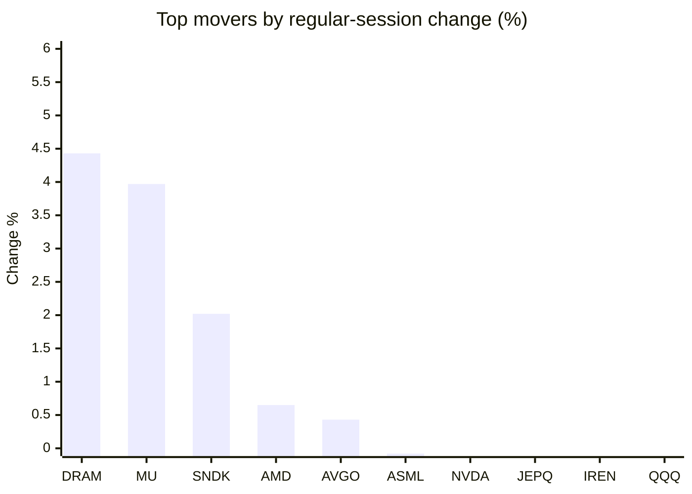
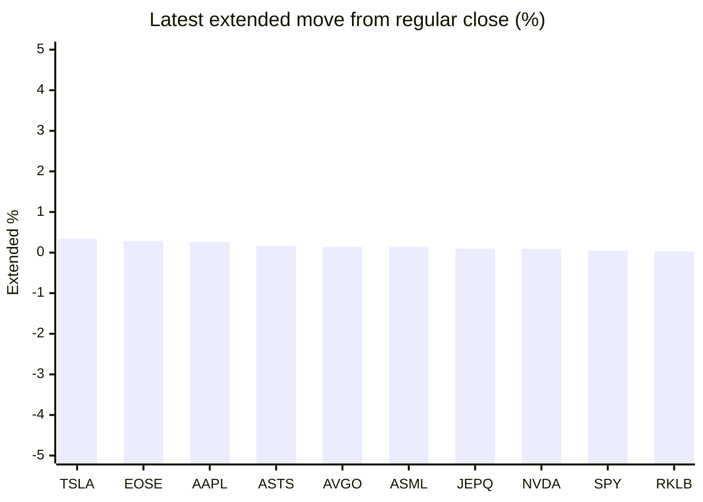

# Stock Brief - 2026-08-21

Generated at 2026-08-21 10:05 +07 from `watchlist.md`.
Prices are snapshots from Yahoo Finance public chart data. Extended/overnight is the latest available pre/post-market datapoint from the same feed.

## Market Snapshot

- SPY: close 762.60, latest extended 762.88, regular move -0.84%, extended move +0.04%
- QQQ: close 710.93, latest extended 710.80, regular move -0.72%, extended move -0.02%
- JEPQ: close 59.66, latest extended 59.72, regular move -0.35%, extended move +0.10%

## Watchlist Prices

| Ticker | Name | Regular close | Latest extended/overnight | Regular move | Extended move | Latest data time | Source |
|---|---|---:|---:|---:|---:|---|---|
| INTC | Intel Corporation | 92.13 USD | 91.92 USD | -0.72% | -0.22% | 2026-08-20 19:59 EDT | [Yahoo](https://finance.yahoo.com/quote/INTC/) |
| AVGO | Broadcom Inc. | 364.03 USD | 364.55 USD | +0.43% | +0.14% | 2026-08-20 19:59 EDT | [Yahoo](https://finance.yahoo.com/quote/AVGO/) |
| RKLB | Rocket Lab Corporation | 72.95 USD | 72.97 USD | -3.81% | +0.03% | 2026-08-20 19:59 EDT | [Yahoo](https://finance.yahoo.com/quote/RKLB/) |
| AAPL | Apple Inc. | 311.30 USD | 312.10 USD | -1.75% | +0.26% | 2026-08-20 19:59 EDT | [Yahoo](https://finance.yahoo.com/quote/AAPL/) |
| NVDA | NVIDIA Corporation | 216.85 USD | 217.05 USD | -0.33% | +0.09% | 2026-08-20 19:59 EDT | [Yahoo](https://finance.yahoo.com/quote/NVDA/) |
| TSLA | Tesla, Inc. | 345.13 USD | 346.30 USD | -1.71% | +0.34% | 2026-08-20 19:59 EDT | [Yahoo](https://finance.yahoo.com/quote/TSLA/) |
| SNDK | Sandisk Corporation | 1,600.62 USD | 1,578.10 USD | +2.02% | -1.41% | 2026-08-20 19:59 EDT | [Yahoo](https://finance.yahoo.com/quote/SNDK/) |
| QQQ | Invesco QQQ Trust, Series 1 | 710.93 USD | 710.80 USD | -0.72% | -0.02% | 2026-08-20 19:59 EDT | [Yahoo](https://finance.yahoo.com/quote/QQQ/) |
| SPY | State Street SPDR S&P 500 ETF T | 762.60 USD | 762.88 USD | -0.84% | +0.04% | 2026-08-20 19:59 EDT | [Yahoo](https://finance.yahoo.com/quote/SPY/) |
| JEPQ | JPMorgan Nasdaq Equity Premium  | 59.66 USD | 59.72 USD | -0.35% | +0.10% | 2026-08-20 19:59 EDT | [Yahoo](https://finance.yahoo.com/quote/JEPQ/) |
| ASTS | AST SpaceMobile, Inc. | 65.06 USD | 65.17 USD | -2.06% | +0.17% | 2026-08-20 19:59 EDT | [Yahoo](https://finance.yahoo.com/quote/ASTS/) |
| MU | Micron Technology, Inc. | 974.33 USD | 967.19 USD | +3.97% | -0.73% | 2026-08-20 19:59 EDT | [Yahoo](https://finance.yahoo.com/quote/MU/) |
| IREN | IREN LIMITED | 42.60 USD | 42.33 USD | -0.56% | -0.63% | 2026-08-20 19:59 EDT | [Yahoo](https://finance.yahoo.com/quote/IREN/) |
| EOSE | Eos Energy Enterprises, Inc. | 3.46 USD | 3.47 USD | -7.49% | +0.29% | 2026-08-20 19:58 EDT | [Yahoo](https://finance.yahoo.com/quote/EOSE/) |
| GOOG | Alphabet Inc. | 338.20 USD | 338.18 USD | -1.02% | -0.00% | 2026-08-20 19:59 EDT | [Yahoo](https://finance.yahoo.com/quote/GOOG/) |
| DRAM | Roundhill Memory ETF | 57.58 USD | 57.03 USD | +4.43% | -0.96% | 2026-08-20 19:59 EDT | [Yahoo](https://finance.yahoo.com/quote/DRAM/) |
| AMD | Advanced Micro Devices, Inc. | 469.45 USD | 467.90 USD | +0.65% | -0.33% | 2026-08-20 19:59 EDT | [Yahoo](https://finance.yahoo.com/quote/AMD/) |
| ASML | ASML Holding N.V. - New York Re | 1,750.31 USD | 1,752.70 USD | -0.08% | +0.14% | 2026-08-20 19:58 EDT | [Yahoo](https://finance.yahoo.com/quote/ASML/) |

## Charts

### Top Movers - Regular Session

### Extended / Overnight Move

### Quick Heatmap

| Group | Names in watchlist | Avg regular move | Avg extended move |
|---|---|---:|---:|
| Mega-cap tech | AVGO, AAPL, NVDA, TSLA, GOOG | -0.87% | +0.17% |
| Semis / memory | INTC, SNDK, MU, DRAM, AMD, ASML | +1.71% | -0.59% |
| Space / high beta | RKLB, ASTS, IREN, EOSE | -3.48% | -0.04% |
| ETFs | QQQ, SPY, JEPQ | -0.64% | +0.04% |

## News Headlines

- [Is a Financial Sector ETF a Better Buy Than Picking the Stocks Yourself?](https://www.fool.com/investing/2026/08/20/is-a-financial-sector-etf-a-better-buy-than-pickin/?.tsrc=rss) (2026-08-21 09:50 Bangkok)
- [Trump Targets Over 1,000 US Space Launches A Year — Could RKLB, ASTS, SPCX And LUNR Ride The Rocket Boom?](https://stocktwits.com/news-articles/markets/equity/trump-space-launches-rklb-asts-spcx-lunr-rocket-boom/cZYBic9RJZ6?.tsrc=rss) (2026-08-21 09:40 Bangkok)
- [Nvidia, AMD, and Intel: Wall Street Says to Buy 2 and Avoid 1. I Disagree.](https://www.fool.com/investing/2026/08/20/nvidia-amd-and-intel-wall-street-says-to-buy-2-and/?.tsrc=rss) (2026-08-21 09:20 Bangkok)
- [Micron CEO Says AI ‘Can’t Scale’ Without Memory – MU Stock Jumps On $10B Research Lab Initiative](https://stocktwits.com/news-articles/markets/equity/micron-ceo-says-ai-can-t-scale-without-memory-mu-stock-jumps-on-10-b-research-lab-initiative/cZYBLTPRJZx?.tsrc=rss) (2026-08-21 09:01 Bangkok)
- [Why MPLX Stock Is Suddenly Trending on Wall Street](https://www.fool.com/investing/2026/08/20/why-mplx-stock-is-suddenly-trending-on-wall/?.tsrc=rss) (2026-08-21 08:50 Bangkok)
- [ASTS Stock Rises Overnight: AST SpaceMobile And SpaceX Reportedly Chase Prized Satellite Spectrum](https://stocktwits.com/news-articles/markets/equity/asts-spacex-reportedly-chase-prized-satellite-spectrum/cZYBgpkRJZH?.tsrc=rss) (2026-08-21 08:11 Bangkok)
- [Which Streaming Stock Would Hold Up Better in a Recession: Netflix or Walt Disney?](https://www.fool.com/investing/2026/08/20/streaming-better-recession-netflix-walt-disney/?.tsrc=rss) (2026-08-21 07:25 Bangkok)
- [Tesla, Uber, and Waymo all get the OK to operate thousands of robotaxis in Nevada](https://finance.yahoo.com/technology/articles/tesla-uber-waymo-ok-operate-002336015.html?.tsrc=rss) (2026-08-21 07:23 Bangkok)

## Caveats

- This is not investment advice. Extended-hours prices can be thin and volatile.
- Yahoo public endpoints may lag official exchange data.
