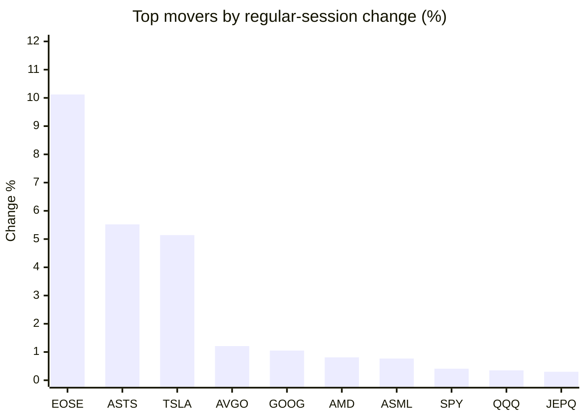
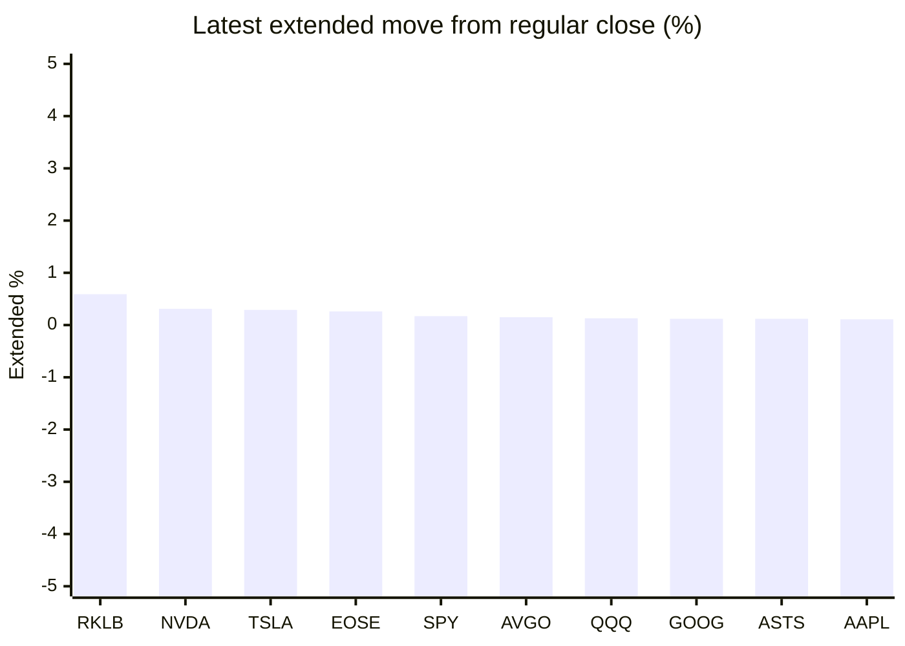

# Stock Brief - 2026-08-24

Generated at 2026-08-24 10:06 +07 from `watchlist.md`.
Prices are snapshots from Yahoo Finance public chart data. Extended/overnight is the latest available pre/post-market datapoint from the same feed.

## Market Snapshot

- SPY: close 765.72, latest extended 767.00, regular move +0.41%, extended move +0.17%
- QQQ: close 713.44, latest extended 714.35, regular move +0.35%, extended move +0.13%
- JEPQ: close 59.84, latest extended 59.90, regular move +0.30%, extended move +0.10%

## Watchlist Prices

| Ticker | Name | Regular close | Latest extended/overnight | Regular move | Extended move | Latest data time | Source |
|---|---|---:|---:|---:|---:|---|---|
| INTC | Intel Corporation | 90.07 USD | 89.86 USD | -2.24% | -0.23% | 2026-08-21 19:59 EDT | [Yahoo](https://finance.yahoo.com/quote/INTC/) |
| AVGO | Broadcom Inc. | 368.45 USD | 368.99 USD | +1.21% | +0.15% | 2026-08-21 19:59 EDT | [Yahoo](https://finance.yahoo.com/quote/AVGO/) |
| RKLB | Rocket Lab Corporation | 72.57 USD | 73.00 USD | -0.52% | +0.59% | 2026-08-21 19:59 EDT | [Yahoo](https://finance.yahoo.com/quote/RKLB/) |
| AAPL | Apple Inc. | 309.35 USD | 309.69 USD | -0.63% | +0.11% | 2026-08-21 19:59 EDT | [Yahoo](https://finance.yahoo.com/quote/AAPL/) |
| NVDA | NVIDIA Corporation | 214.72 USD | 215.38 USD | -0.98% | +0.31% | 2026-08-21 19:59 EDT | [Yahoo](https://finance.yahoo.com/quote/NVDA/) |
| TSLA | Tesla, Inc. | 362.86 USD | 363.93 USD | +5.14% | +0.29% | 2026-08-21 19:59 EDT | [Yahoo](https://finance.yahoo.com/quote/TSLA/) |
| SNDK | Sandisk Corporation | 1,596.08 USD | 1,593.20 USD | -0.28% | -0.18% | 2026-08-21 19:59 EDT | [Yahoo](https://finance.yahoo.com/quote/SNDK/) |
| QQQ | Invesco QQQ Trust, Series 1 | 713.44 USD | 714.35 USD | +0.35% | +0.13% | 2026-08-21 19:59 EDT | [Yahoo](https://finance.yahoo.com/quote/QQQ/) |
| SPY | State Street SPDR S&P 500 ETF T | 765.72 USD | 767.00 USD | +0.41% | +0.17% | 2026-08-21 19:59 EDT | [Yahoo](https://finance.yahoo.com/quote/SPY/) |
| JEPQ | JPMorgan Nasdaq Equity Premium  | 59.84 USD | 59.90 USD | +0.30% | +0.10% | 2026-08-21 19:58 EDT | [Yahoo](https://finance.yahoo.com/quote/JEPQ/) |
| ASTS | AST SpaceMobile, Inc. | 68.65 USD | 68.73 USD | +5.52% | +0.12% | 2026-08-21 19:59 EDT | [Yahoo](https://finance.yahoo.com/quote/ASTS/) |
| MU | Micron Technology, Inc. | 966.78 USD | 963.68 USD | -0.77% | -0.32% | 2026-08-21 19:59 EDT | [Yahoo](https://finance.yahoo.com/quote/MU/) |
| IREN | IREN LIMITED | 41.88 USD | 41.73 USD | -1.69% | -0.36% | 2026-08-21 19:59 EDT | [Yahoo](https://finance.yahoo.com/quote/IREN/) |
| EOSE | Eos Energy Enterprises, Inc. | 3.81 USD | 3.82 USD | +10.12% | +0.26% | 2026-08-21 19:59 EDT | [Yahoo](https://finance.yahoo.com/quote/EOSE/) |
| GOOG | Alphabet Inc. | 341.75 USD | 342.15 USD | +1.05% | +0.12% | 2026-08-21 19:59 EDT | [Yahoo](https://finance.yahoo.com/quote/GOOG/) |
| DRAM | Roundhill Memory ETF | 57.68 USD | 57.65 USD | +0.17% | -0.05% | 2026-08-21 19:59 EDT | [Yahoo](https://finance.yahoo.com/quote/DRAM/) |
| AMD | Advanced Micro Devices, Inc. | 473.25 USD | 472.31 USD | +0.81% | -0.20% | 2026-08-21 19:59 EDT | [Yahoo](https://finance.yahoo.com/quote/AMD/) |
| ASML | ASML Holding N.V. - New York Re | 1,763.76 USD | 1,763.39 USD | +0.77% | -0.02% | 2026-08-21 19:58 EDT | [Yahoo](https://finance.yahoo.com/quote/ASML/) |

## Charts

### Top Movers - Regular Session

### Extended / Overnight Move

### Quick Heatmap

| Group | Names in watchlist | Avg regular move | Avg extended move |
|---|---|---:|---:|
| Mega-cap tech | AVGO, AAPL, NVDA, TSLA, GOOG | +1.16% | +0.20% |
| Semis / memory | INTC, SNDK, MU, DRAM, AMD, ASML | -0.26% | -0.17% |
| Space / high beta | RKLB, ASTS, IREN, EOSE | +3.36% | +0.15% |
| ETFs | QQQ, SPY, JEPQ | +0.35% | +0.13% |

## News Headlines

- [Dow Jones Futures Waver; Nvidia, Tariffs, Warsh In Focus](https://finance.yahoo.com/m/0e4d198b-0fbe-345f-9a59-99f6074c2273/dow-jones-futures-waver%3B.html?.tsrc=rss) (2026-08-24 09:54 Bangkok)
- [Broadcom Has Seen Its Biggest Customer Drop a Key Chip Before. History Says What the Stock Did Next.](https://www.fool.com/investing/2026/08/23/broadcom-has-seen-its-biggest-customer-drop-a-key-chip-before-history-says-what-the-stock-did-next/?.tsrc=rss) (2026-08-24 09:46 Bangkok)
- [Bill Gates' Foundation Holds Berkshire Hathaway as Its Top Stock, a Signal of Its Preference for Steady Compounders Over Flashy Tech](https://www.fool.com/investing/2026/08/23/bill-gates-foundation-holds-berkshire-hathaway-as/?.tsrc=rss) (2026-08-24 09:35 Bangkok)
- [Anthropic makes quiet move Nvidia investors must consider](https://www.thestreet.com/technology/anthropic-silicon-team-amir-salek-hire?.tsrc=rss) (2026-08-24 09:33 Bangkok)
- [BABA, NVDA, MRVL, WMT, SPCX: Why Retail Traders Couldn’t Take Their Eyes Off These Stocks Last Week](https://stocktwits.com/news-articles/markets/equity/baba-nvda-mrvl-wmt-spcx-why-retail-traders-couldn-t-take-their-eyes-off-these-stocks-last-week/cZYKGYPRJV6?.tsrc=rss) (2026-08-24 09:09 Bangkok)
- [RKLB Stock Rockets Toward Best Month Since May: ‘Hungry Hippo’ Begins Flight-Like Testing Ahead Of Neutron Debut](https://stocktwits.com/news-articles/markets/equity/rklb-hungry-hippo-flight-like-testing-neutron-debut/cZY0CFRRJVy?.tsrc=rss) (2026-08-24 08:30 Bangkok)
- [Tesla just set a date for its riskiest launch yet](https://www.thestreet.com/automotive/tesla-just-set-a-date-for-its-riskiest-launch-yet?.tsrc=rss) (2026-08-24 08:03 Bangkok)
- [3 Growth Stocks That Could Skyrocket in the Second Half of 2026](https://www.fool.com/investing/2026/08/23/3-growth-stocks-that-could-skyrocket-in-the-second/?.tsrc=rss) (2026-08-24 07:32 Bangkok)

## Caveats

- This is not investment advice. Extended-hours prices can be thin and volatile.
- Yahoo public endpoints may lag official exchange data.
