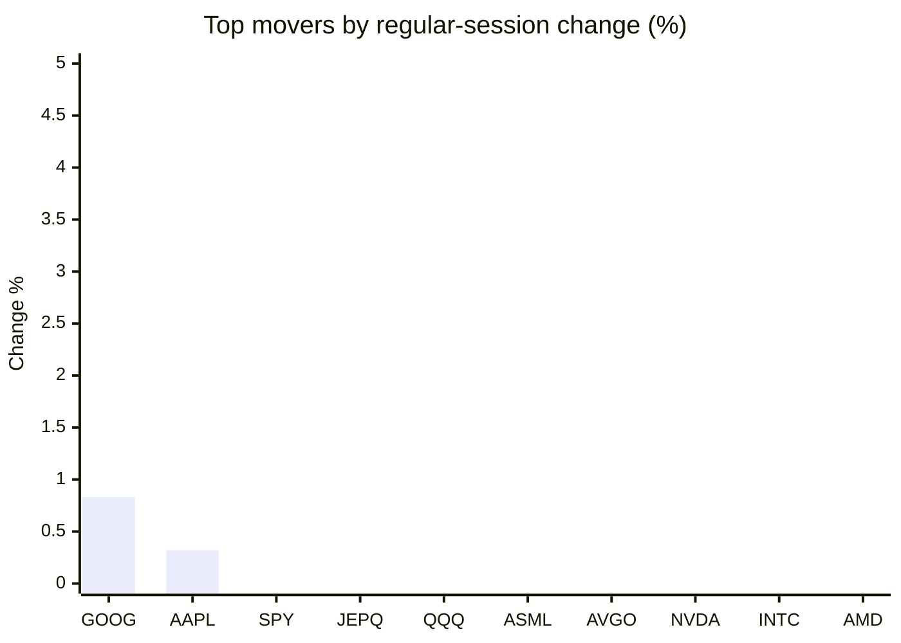
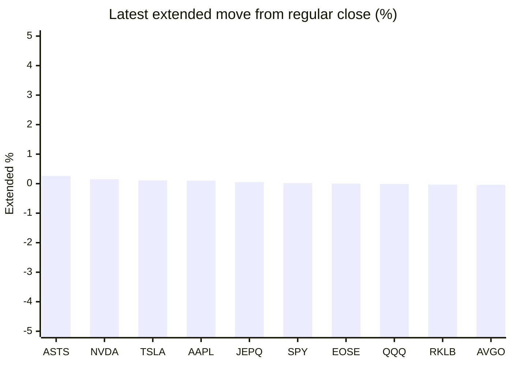

# Stock Brief - 2026-08-25

Generated at 2026-08-25 10:01 +07 from `watchlist.md`.
Prices are snapshots from Yahoo Finance public chart data. Extended/overnight is the latest available pre/post-market datapoint from the same feed.

## Market Snapshot

- SPY: close 763.47, latest extended 763.65, regular move -0.29%, extended move +0.02%
- QQQ: close 706.32, latest extended 706.26, regular move -1.00%, extended move -0.01%
- JEPQ: close 59.42, latest extended 59.45, regular move -0.70%, extended move +0.05%

## Watchlist Prices

| Ticker | Name | Regular close | Latest extended/overnight | Regular move | Extended move | Latest data time | Source |
|---|---|---:|---:|---:|---:|---|---|
| INTC | Intel Corporation | 87.26 USD | 87.08 USD | -3.12% | -0.21% | 2026-08-24 20:00 EDT | [Yahoo](https://finance.yahoo.com/quote/INTC/) |
| AVGO | Broadcom Inc. | 358.76 USD | 358.63 USD | -2.63% | -0.04% | 2026-08-24 19:59 EDT | [Yahoo](https://finance.yahoo.com/quote/AVGO/) |
| RKLB | Rocket Lab Corporation | 68.28 USD | 68.26 USD | -5.91% | -0.03% | 2026-08-24 19:59 EDT | [Yahoo](https://finance.yahoo.com/quote/RKLB/) |
| AAPL | Apple Inc. | 310.34 USD | 310.66 USD | +0.32% | +0.10% | 2026-08-24 19:59 EDT | [Yahoo](https://finance.yahoo.com/quote/AAPL/) |
| NVDA | NVIDIA Corporation | 208.48 USD | 208.80 USD | -2.91% | +0.15% | 2026-08-24 19:59 EDT | [Yahoo](https://finance.yahoo.com/quote/NVDA/) |
| TSLA | Tesla, Inc. | 348.95 USD | 349.34 USD | -3.83% | +0.11% | 2026-08-24 19:59 EDT | [Yahoo](https://finance.yahoo.com/quote/TSLA/) |
| SNDK | Sandisk Corporation | 1,493.12 USD | 1,473.51 USD | -6.45% | -1.31% | 2026-08-24 19:59 EDT | [Yahoo](https://finance.yahoo.com/quote/SNDK/) |
| QQQ | Invesco QQQ Trust, Series 1 | 706.32 USD | 706.26 USD | -1.00% | -0.01% | 2026-08-24 19:59 EDT | [Yahoo](https://finance.yahoo.com/quote/QQQ/) |
| SPY | State Street SPDR S&P 500 ETF T | 763.47 USD | 763.65 USD | -0.29% | +0.02% | 2026-08-24 19:59 EDT | [Yahoo](https://finance.yahoo.com/quote/SPY/) |
| JEPQ | JPMorgan Nasdaq Equity Premium  | 59.42 USD | 59.45 USD | -0.70% | +0.05% | 2026-08-24 19:59 EDT | [Yahoo](https://finance.yahoo.com/quote/JEPQ/) |
| ASTS | AST SpaceMobile, Inc. | 62.35 USD | 62.51 USD | -9.18% | +0.26% | 2026-08-24 19:59 EDT | [Yahoo](https://finance.yahoo.com/quote/ASTS/) |
| MU | Micron Technology, Inc. | 910.43 USD | 903.10 USD | -5.83% | -0.81% | 2026-08-24 19:59 EDT | [Yahoo](https://finance.yahoo.com/quote/MU/) |
| IREN | IREN LIMITED | 39.81 USD | 39.55 USD | -4.94% | -0.65% | 2026-08-24 19:59 EDT | [Yahoo](https://finance.yahoo.com/quote/IREN/) |
| EOSE | Eos Energy Enterprises, Inc. | 3.46 USD | 3.46 USD | -9.19% | -0.00% | 2026-08-24 19:59 EDT | [Yahoo](https://finance.yahoo.com/quote/EOSE/) |
| GOOG | Alphabet Inc. | 344.59 USD | 344.29 USD | +0.83% | -0.09% | 2026-08-24 19:59 EDT | [Yahoo](https://finance.yahoo.com/quote/GOOG/) |
| DRAM | Roundhill Memory ETF | 54.28 USD | 53.73 USD | -5.89% | -1.01% | 2026-08-24 19:59 EDT | [Yahoo](https://finance.yahoo.com/quote/DRAM/) |
| AMD | Advanced Micro Devices, Inc. | 456.74 USD | 454.59 USD | -3.49% | -0.47% | 2026-08-24 19:59 EDT | [Yahoo](https://finance.yahoo.com/quote/AMD/) |
| ASML | ASML Holding N.V. - New York Re | 1,740.13 USD | 1,738.00 USD | -1.34% | -0.12% | 2026-08-24 19:58 EDT | [Yahoo](https://finance.yahoo.com/quote/ASML/) |

## Charts

### Top Movers - Regular Session

### Extended / Overnight Move

### Quick Heatmap

| Group | Names in watchlist | Avg regular move | Avg extended move |
|---|---|---:|---:|
| Mega-cap tech | AVGO, AAPL, NVDA, TSLA, GOOG | -1.64% | +0.05% |
| Semis / memory | INTC, SNDK, MU, DRAM, AMD, ASML | -4.35% | -0.66% |
| Space / high beta | RKLB, ASTS, IREN, EOSE | -7.30% | -0.11% |
| ETFs | QQQ, SPY, JEPQ | -0.66% | +0.02% |

## News Headlines

- [Stocks stagger and oil rises as traders eye Iran threat, Nvidia results](https://finance.yahoo.com/markets/stocks/articles/stocks-stagger-oil-rises-traders-024603014.html?.tsrc=rss) (2026-08-25 09:46 Bangkok)
- [NVDA Stock’s 7-Day Losing Streak Sets Up Make-Or-Break AI Earnings Test: Retail Expects Yet Another Beat](https://stocktwits.com/news-articles/markets/equity/nvda-stock-s-7-day-losing-streak-sets-up-make-or-break-ai-earnings-test-retail-expects-yet-another-beat/cZYke4BRJFM?.tsrc=rss) (2026-08-25 09:22 Bangkok)
- [Dow Jones Futures: Trump, Bessent Comments Spark Tech Losses; Nvidia Sells Off Before Earnings](https://finance.yahoo.com/m/a28a6eae-87d9-3229-b7dc-430baf4250e1/dow-jones-futures%3A-trump%2C.html?.tsrc=rss) (2026-08-25 08:44 Bangkok)
- [Tesla (TSLA)’s Solar Roof Shutdown Raises Questions About its Energy Ambitions](https://finance.yahoo.com/energy/articles/tesla-tsla-solar-roof-shutdown-014101772.html?.tsrc=rss) (2026-08-25 08:41 Bangkok)
- [Berkshire Hathaway Rose While Every Major Chip Stock Fell Monday](https://www.fool.com/investing/2026/08/24/berkshire-hathaway-rose-while-every-major-chip-stock-fell-monday/?.tsrc=rss) (2026-08-25 08:07 Bangkok)
- [Nvidia’s $20 Billion Groq Bet Is Going Live Before the End of 2026. Here’s What It Means for Investors.](https://www.fool.com/investing/2026/08/24/nvidia-s-usd20-billion-groq-bet-is-going-live-before-the-end-of-2026-here-s-what-it-means-for-investors/?.tsrc=rss) (2026-08-25 06:03 Bangkok)
- [SK Hynix (NasdaqGS:SKHY) Stock Looks Cheap Following Its 9% Weekly Drop](https://finance.yahoo.com/markets/stocks/articles/sk-hynix-nasdaqgs-skhy-stock-020807222.html?.tsrc=rss) (2026-08-25 09:08 Bangkok)
- [Why IMAX Stock Climbed to a New All-Time High Today](https://www.fool.com/investing/2026/08/24/why-imax-stock-climbed-to-new-all-time-high-today/?.tsrc=rss) (2026-08-25 08:44 Bangkok)

## Caveats

- This is not investment advice. Extended-hours prices can be thin and volatile.
- Yahoo public endpoints may lag official exchange data.
