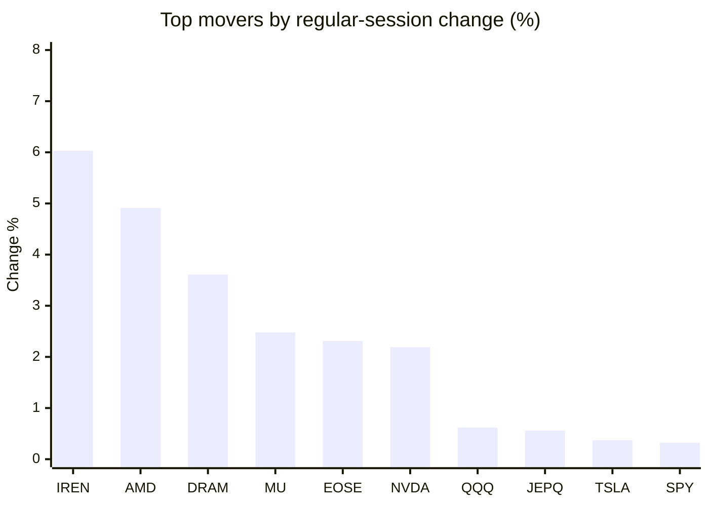
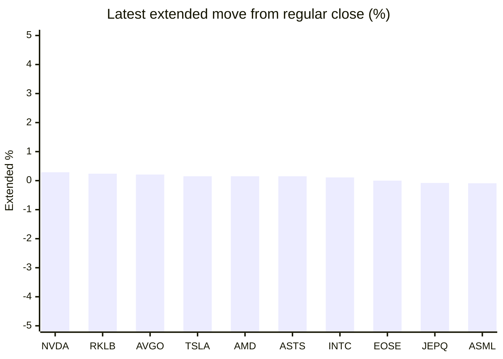

# Stock Brief - 2026-08-26

Generated at 2026-08-26 10:08 +07 from `watchlist.md`.
Prices are snapshots from Yahoo Finance public chart data. Extended/overnight is the latest available pre/post-market datapoint from the same feed.

## Market Snapshot

- SPY: close 765.91, latest extended 764.94, regular move +0.32%, extended move -0.13%
- QQQ: close 710.72, latest extended 709.16, regular move +0.62%, extended move -0.22%
- JEPQ: close 59.75, latest extended 59.70, regular move +0.56%, extended move -0.08%

## Watchlist Prices

| Ticker | Name | Regular close | Latest extended/overnight | Regular move | Extended move | Latest data time | Source |
|---|---|---:|---:|---:|---:|---|---|
| INTC | Intel Corporation | 87.48 USD | 87.58 USD | +0.25% | +0.11% | 2026-08-25 19:59 EDT | [Yahoo](https://finance.yahoo.com/quote/INTC/) |
| AVGO | Broadcom Inc. | 356.74 USD | 357.50 USD | -0.56% | +0.21% | 2026-08-25 19:59 EDT | [Yahoo](https://finance.yahoo.com/quote/AVGO/) |
| RKLB | Rocket Lab Corporation | 66.91 USD | 67.07 USD | -2.01% | +0.24% | 2026-08-25 19:59 EDT | [Yahoo](https://finance.yahoo.com/quote/RKLB/) |
| AAPL | Apple Inc. | 309.90 USD | 309.20 USD | -0.14% | -0.23% | 2026-08-25 19:59 EDT | [Yahoo](https://finance.yahoo.com/quote/AAPL/) |
| NVDA | NVIDIA Corporation | 213.05 USD | 213.67 USD | +2.19% | +0.29% | 2026-08-25 20:00 EDT | [Yahoo](https://finance.yahoo.com/quote/NVDA/) |
| TSLA | Tesla, Inc. | 350.25 USD | 350.78 USD | +0.37% | +0.15% | 2026-08-25 19:59 EDT | [Yahoo](https://finance.yahoo.com/quote/TSLA/) |
| SNDK | Sandisk Corporation | 1,480.77 USD | 1,477.24 USD | -0.83% | -0.24% | 2026-08-25 19:59 EDT | [Yahoo](https://finance.yahoo.com/quote/SNDK/) |
| QQQ | Invesco QQQ Trust, Series 1 | 710.72 USD | 709.16 USD | +0.62% | -0.22% | 2026-08-25 19:59 EDT | [Yahoo](https://finance.yahoo.com/quote/QQQ/) |
| SPY | State Street SPDR S&P 500 ETF T | 765.91 USD | 764.94 USD | +0.32% | -0.13% | 2026-08-25 19:59 EDT | [Yahoo](https://finance.yahoo.com/quote/SPY/) |
| JEPQ | JPMorgan Nasdaq Equity Premium  | 59.75 USD | 59.70 USD | +0.56% | -0.08% | 2026-08-25 19:58 EDT | [Yahoo](https://finance.yahoo.com/quote/JEPQ/) |
| ASTS | AST SpaceMobile, Inc. | 62.01 USD | 62.10 USD | -0.55% | +0.15% | 2026-08-25 19:58 EDT | [Yahoo](https://finance.yahoo.com/quote/ASTS/) |
| MU | Micron Technology, Inc. | 932.97 USD | 930.18 USD | +2.48% | -0.30% | 2026-08-25 19:59 EDT | [Yahoo](https://finance.yahoo.com/quote/MU/) |
| IREN | IREN LIMITED | 42.21 USD | 42.06 USD | +6.03% | -0.35% | 2026-08-25 19:59 EDT | [Yahoo](https://finance.yahoo.com/quote/IREN/) |
| EOSE | Eos Energy Enterprises, Inc. | 3.54 USD | 3.54 USD | +2.31% | +0.00% | 2026-08-25 19:58 EDT | [Yahoo](https://finance.yahoo.com/quote/EOSE/) |
| GOOG | Alphabet Inc. | 343.34 USD | 342.94 USD | -0.36% | -0.12% | 2026-08-25 19:59 EDT | [Yahoo](https://finance.yahoo.com/quote/GOOG/) |
| DRAM | Roundhill Memory ETF | 56.24 USD | 55.90 USD | +3.61% | -0.60% | 2026-08-25 19:59 EDT | [Yahoo](https://finance.yahoo.com/quote/DRAM/) |
| AMD | Advanced Micro Devices, Inc. | 479.18 USD | 479.90 USD | +4.91% | +0.15% | 2026-08-25 19:59 EDT | [Yahoo](https://finance.yahoo.com/quote/AMD/) |
| ASML | ASML Holding N.V. - New York Re | 1,744.16 USD | 1,742.54 USD | +0.23% | -0.09% | 2026-08-25 19:58 EDT | [Yahoo](https://finance.yahoo.com/quote/ASML/) |

## Charts

### Top Movers - Regular Session

### Extended / Overnight Move

### Quick Heatmap

| Group | Names in watchlist | Avg regular move | Avg extended move |
|---|---|---:|---:|
| Mega-cap tech | AVGO, AAPL, NVDA, TSLA, GOOG | +0.30% | +0.06% |
| Semis / memory | INTC, SNDK, MU, DRAM, AMD, ASML | +1.78% | -0.16% |
| Space / high beta | RKLB, ASTS, IREN, EOSE | +1.45% | +0.01% |
| ETFs | QQQ, SPY, JEPQ | +0.50% | -0.14% |

## News Headlines

- [Dow Jones Futures: Inflation Data, Nvidia Earnings Due; Robinhood In Buy Area](https://finance.yahoo.com/m/a1a5cb94-36b5-3bbd-869f-362442258823/dow-jones-futures%3A-inflation.html?.tsrc=rss) (2026-08-26 09:54 Bangkok)
- [Alphabet Spends About 60 Cents of Every Technical Infrastructure Dollar on Servers. Nvidia's Biggest Customers Were Just Told Prices Are Going Up More Than 15%.](https://www.fool.com/investing/2026/08/25/alphabet-spends-about-60-cents-of-every-technical-infrastructure-dollar-on-servers-nvidia-s-biggest-customers-were-just-told-prices-are-going-up-more-than-15/?.tsrc=rss) (2026-08-26 09:33 Bangkok)
- [Memory Companies Are Rewriting the Rules of AI Compute](https://247wallst.com/videos/memory-companies-are-rewriting-the-rules-of-ai-compute/?.tsrc=rss) (2026-08-26 09:24 Bangkok)
- [How Nvidia Is Secretly Funding the Next Wave of AI](https://247wallst.com/videos/why-nvidia-is-secretly-funding-the-next-wave-of-ai/?.tsrc=rss) (2026-08-26 09:21 Bangkok)
- [BMO sees writing on the wall for Broadcom stock after earnings](https://www.thestreet.com/investing/stocks/bmo-sets-broadcom-avgo-stock-target-to-455-outperform?.tsrc=rss) (2026-08-26 09:17 Bangkok)
- [What Could Sandisk (SNDK) Gain From Its New 2Tb AI Flash Launch?](https://finance.yahoo.com/technology/ai/articles/could-sandisk-sndk-gain-2tb-021539069.html?.tsrc=rss) (2026-08-26 09:15 Bangkok)
- [SpaceX just gave Nvidia investors a new reason to watch](https://www.thestreet.com/investing/stocks/spacex-nvidia-starmind-ai1-orbital-data-center?.tsrc=rss) (2026-08-26 09:03 Bangkok)
- [ASTS, RKLB, SPCX, LUNR Chase An August Win: What SpaceX’s Falcon 9 Wind-Down Means For Space Stocks](https://stocktwits.com/news-articles/markets/equity/asts-rklb-spcx-lunr-what-spacex-falcon-9-wind-down-means-space-stocks/cZYNgQLRJoV?.tsrc=rss) (2026-08-26 08:46 Bangkok)

## Caveats

- This is not investment advice. Extended-hours prices can be thin and volatile.
- Yahoo public endpoints may lag official exchange data.
