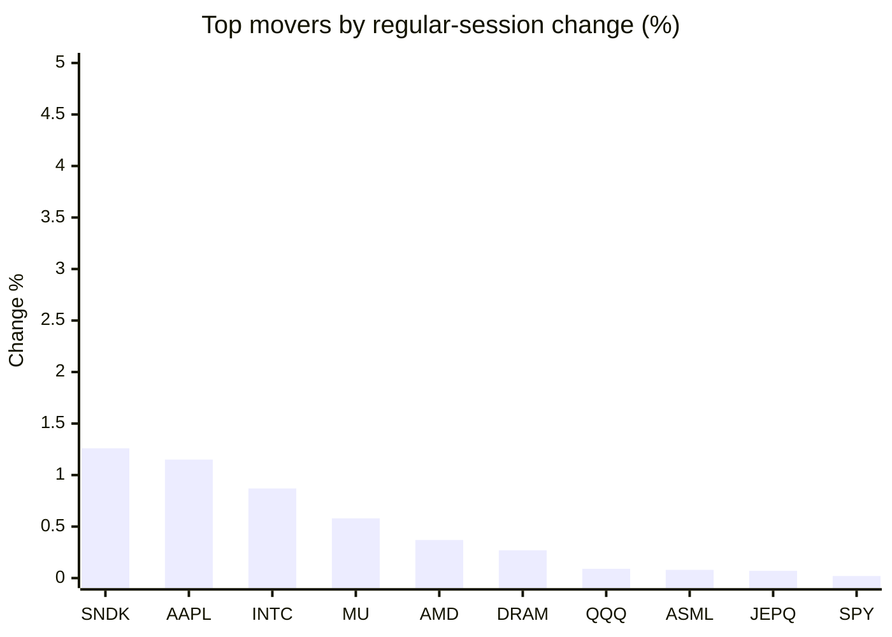
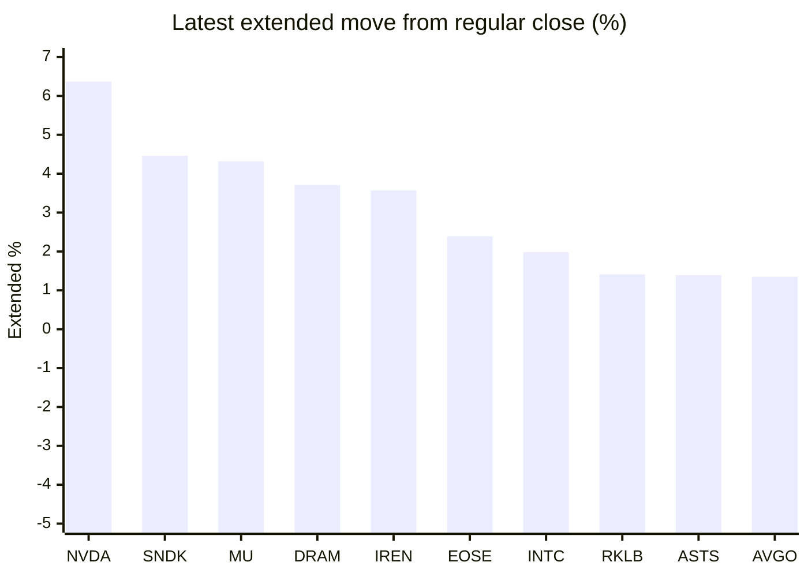

# Stock Brief - 2026-08-27

Generated at 2026-08-27 19:36 +07 from `watchlist.md`.
Prices are snapshots from Yahoo Finance public chart data. Extended/overnight is the latest available pre/post-market datapoint from the same feed.

## Market Snapshot

- SPY: close 766.08, latest extended 768.71, regular move +0.02%, extended move +0.34%
- QQQ: close 711.37, latest extended 717.97, regular move +0.09%, extended move +0.93%
- JEPQ: close 59.79, latest extended 60.23, regular move +0.07%, extended move +0.74%

## Watchlist Prices

| Ticker | Name | Regular close | Latest extended/overnight | Regular move | Extended move | Latest data time | Source |
|---|---|---:|---:|---:|---:|---|---|
| INTC | Intel Corporation | 88.24 USD | 89.99 USD | +0.87% | +1.98% | 2026-08-27 08:36 EDT | [Yahoo](https://finance.yahoo.com/quote/INTC/) |
| AVGO | Broadcom Inc. | 355.59 USD | 360.38 USD | -0.32% | +1.35% | 2026-08-27 08:36 EDT | [Yahoo](https://finance.yahoo.com/quote/AVGO/) |
| RKLB | Rocket Lab Corporation | 66.18 USD | 67.11 USD | -1.09% | +1.41% | 2026-08-27 08:36 EDT | [Yahoo](https://finance.yahoo.com/quote/RKLB/) |
| AAPL | Apple Inc. | 313.45 USD | 310.21 USD | +1.15% | -1.03% | 2026-08-27 08:36 EDT | [Yahoo](https://finance.yahoo.com/quote/AAPL/) |
| NVDA | NVIDIA Corporation | 209.66 USD | 223.02 USD | -1.59% | +6.37% | 2026-08-27 08:36 EDT | [Yahoo](https://finance.yahoo.com/quote/NVDA/) |
| TSLA | Tesla, Inc. | 345.82 USD | 345.76 USD | -1.26% | -0.02% | 2026-08-27 08:36 EDT | [Yahoo](https://finance.yahoo.com/quote/TSLA/) |
| SNDK | Sandisk Corporation | 1,499.37 USD | 1,566.29 USD | +1.26% | +4.46% | 2026-08-27 08:36 EDT | [Yahoo](https://finance.yahoo.com/quote/SNDK/) |
| QQQ | Invesco QQQ Trust, Series 1 | 711.37 USD | 717.97 USD | +0.09% | +0.93% | 2026-08-27 08:36 EDT | [Yahoo](https://finance.yahoo.com/quote/QQQ/) |
| SPY | State Street SPDR S&P 500 ETF T | 766.08 USD | 768.71 USD | +0.02% | +0.34% | 2026-08-27 08:36 EDT | [Yahoo](https://finance.yahoo.com/quote/SPY/) |
| JEPQ | JPMorgan Nasdaq Equity Premium  | 59.79 USD | 60.23 USD | +0.07% | +0.74% | 2026-08-27 08:36 EDT | [Yahoo](https://finance.yahoo.com/quote/JEPQ/) |
| ASTS | AST SpaceMobile, Inc. | 59.88 USD | 60.71 USD | -3.43% | +1.39% | 2026-08-27 08:36 EDT | [Yahoo](https://finance.yahoo.com/quote/ASTS/) |
| MU | Micron Technology, Inc. | 938.40 USD | 978.90 USD | +0.58% | +4.32% | 2026-08-27 08:36 EDT | [Yahoo](https://finance.yahoo.com/quote/MU/) |
| IREN | IREN LIMITED | 39.58 USD | 40.99 USD | -6.23% | +3.57% | 2026-08-27 08:36 EDT | [Yahoo](https://finance.yahoo.com/quote/IREN/) |
| EOSE | Eos Energy Enterprises, Inc. | 3.34 USD | 3.42 USD | -5.65% | +2.39% | 2026-08-27 08:36 EDT | [Yahoo](https://finance.yahoo.com/quote/EOSE/) |
| GOOG | Alphabet Inc. | 339.10 USD | 337.13 USD | -1.23% | -0.58% | 2026-08-27 08:36 EDT | [Yahoo](https://finance.yahoo.com/quote/GOOG/) |
| DRAM | Roundhill Memory ETF | 56.39 USD | 58.48 USD | +0.27% | +3.71% | 2026-08-27 08:36 EDT | [Yahoo](https://finance.yahoo.com/quote/DRAM/) |
| AMD | Advanced Micro Devices, Inc. | 480.93 USD | 486.53 USD | +0.37% | +1.16% | 2026-08-27 08:36 EDT | [Yahoo](https://finance.yahoo.com/quote/AMD/) |
| ASML | ASML Holding N.V. - New York Re | 1,745.64 USD | 1,761.07 USD | +0.08% | +0.88% | 2026-08-27 08:36 EDT | [Yahoo](https://finance.yahoo.com/quote/ASML/) |

## Charts

### Top Movers - Regular Session

### Extended / Overnight Move

### Quick Heatmap

| Group | Names in watchlist | Avg regular move | Avg extended move |
|---|---|---:|---:|
| Mega-cap tech | AVGO, AAPL, NVDA, TSLA, GOOG | -0.65% | +1.22% |
| Semis / memory | INTC, SNDK, MU, DRAM, AMD, ASML | +0.57% | +2.75% |
| Space / high beta | RKLB, ASTS, IREN, EOSE | -4.10% | +2.19% |
| ETFs | QQQ, SPY, JEPQ | +0.06% | +0.67% |

## News Headlines

- [Nvidia posted a blowout quarter. China remains a quagmire.](https://finance.yahoo.com/markets/stocks/article/nvidia-posted-a-blowout-quarter-china-remains-a-quagmire-122920310.html?.tsrc=rss) (2026-08-27 19:29 Bangkok)
- [Nvidia Earnings Keep AI ‘Jenga Puzzle’ Intact: Dan Ives Says MSFT, GOOGL, AMZN Could Lead Next Trade](https://stocktwits.com/news-articles/markets/equity/nvidia-earnings-ai-jenga-dan-ives-msft-googl-amzn-tech-rally/cZYobLyRJqb?.tsrc=rss) (2026-08-27 19:20 Bangkok)
- [The Best Gold ETF for 2027 Won't Surprise You. It's Still GLD.](https://www.fool.com/investing/2026/08/27/the-best-gold-etf-for-2027-wont-surprise-you-its-s/?.tsrc=rss) (2026-08-27 19:20 Bangkok)
- [U.S. probes Apex Logistics for alleged Nvidia chip smuggling to China](https://qz.com/apex-logistics-kuehne-nagel-nvidia-chip-smuggling-china-082726?.tsrc=rss) (2026-08-27 19:16 Bangkok)
- [Stocks Mostly Up Pre-Bell as Traders Parse Nvidia Results, Await Fed Chair's Speech](https://finance.yahoo.com/markets/stocks/articles/stocks-mostly-pre-bell-traders-121609609.html?.tsrc=rss) (2026-08-27 19:16 Bangkok)
- [Stock Market Today: Tech Futures Rally As Nvidia, Salesforce, CrowdStrike Surge On Earnings News (Live Coverage)](https://finance.yahoo.com/m/6d7dc3db-8243-32c1-b651-55ee5914f052/stock-market-today%3A-tech.html?.tsrc=rss) (2026-08-27 19:15 Bangkok)
- [Sandisk (SNDK) Stock Trades At A Premium To Fair Value](https://finance.yahoo.com/markets/stocks/articles/sandisk-sndk-stock-trades-premium-121550081.html?.tsrc=rss) (2026-08-27 19:15 Bangkok)
- [Dow Jones Futures: Techs Set To Run? Nvidia, CrowdStrike, Okta, Salesforce Jump On Earnings](https://finance.yahoo.com/m/c03ae35d-d27e-3caf-a89c-0c33467ec9c9/dow-jones-futures%3A-techs-set.html?.tsrc=rss) (2026-08-27 19:15 Bangkok)

## Caveats

- This is not investment advice. Extended-hours prices can be thin and volatile.
- Yahoo public endpoints may lag official exchange data.
