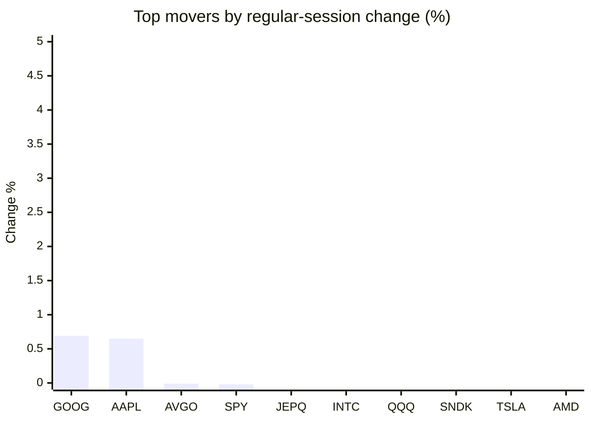
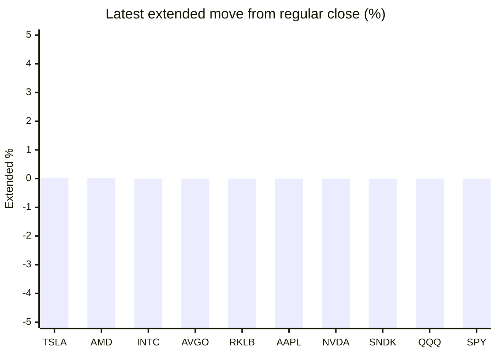

# Stock Brief - 2026-08-28

Generated at 2026-08-28 21:08 +07 from `watchlist.md`.
Prices are snapshots from Yahoo Finance public chart data. Extended/overnight is the latest available pre/post-market datapoint from the same feed.

## Market Snapshot

- SPY: close 770.98, latest extended 770.98, regular move -0.02%, extended move +0.00%
- QQQ: close 718.52, latest extended 718.52, regular move -0.36%, extended move +0.00%
- JEPQ: close 60.20, latest extended 60.20, regular move -0.18%, extended move +0.00%

## Watchlist Prices

| Ticker | Name | Regular close | Latest extended/overnight | Regular move | Extended move | Latest data time | Source |
|---|---|---:|---:|---:|---:|---|---|
| INTC | Intel Corporation | 91.79 USD | 91.79 USD | -0.33% | +0.00% | 2026-08-28 10:08 EDT | [Yahoo](https://finance.yahoo.com/quote/INTC/) |
| AVGO | Broadcom Inc. | 371.50 USD | 371.50 USD | -0.01% | +0.00% | 2026-08-28 10:08 EDT | [Yahoo](https://finance.yahoo.com/quote/AVGO/) |
| RKLB | Rocket Lab Corporation | 65.11 USD | 65.11 USD | -3.58% | +0.00% | 2026-08-28 10:08 EDT | [Yahoo](https://finance.yahoo.com/quote/RKLB/) |
| AAPL | Apple Inc. | 316.64 USD | 316.64 USD | +0.65% | +0.00% | 2026-08-28 10:08 EDT | [Yahoo](https://finance.yahoo.com/quote/AAPL/) |
| NVDA | NVIDIA Corporation | 224.52 USD | 224.52 USD | -1.52% | +0.00% | 2026-08-28 10:08 EDT | [Yahoo](https://finance.yahoo.com/quote/NVDA/) |
| TSLA | Tesla, Inc. | 352.85 USD | 352.95 USD | -0.55% | +0.03% | 2026-08-28 10:08 EDT | [Yahoo](https://finance.yahoo.com/quote/TSLA/) |
| SNDK | Sandisk Corporation | 1,479.42 USD | 1,479.42 USD | -0.37% | +0.00% | 2026-08-28 10:08 EDT | [Yahoo](https://finance.yahoo.com/quote/SNDK/) |
| QQQ | Invesco QQQ Trust, Series 1 | 718.52 USD | 718.52 USD | -0.36% | +0.00% | 2026-08-28 10:08 EDT | [Yahoo](https://finance.yahoo.com/quote/QQQ/) |
| SPY | State Street SPDR S&P 500 ETF T | 770.98 USD | 770.98 USD | -0.02% | +0.00% | 2026-08-28 10:08 EDT | [Yahoo](https://finance.yahoo.com/quote/SPY/) |
| JEPQ | JPMorgan Nasdaq Equity Premium  | 60.20 USD | 60.20 USD | -0.18% | +0.00% | 2026-08-28 10:08 EDT | [Yahoo](https://finance.yahoo.com/quote/JEPQ/) |
| ASTS | AST SpaceMobile, Inc. | 59.22 USD | 59.22 USD | -3.61% | +0.00% | 2026-08-28 10:08 EDT | [Yahoo](https://finance.yahoo.com/quote/ASTS/) |
| MU | Micron Technology, Inc. | 929.62 USD | 929.62 USD | -0.62% | +0.00% | 2026-08-28 10:08 EDT | [Yahoo](https://finance.yahoo.com/quote/MU/) |
| IREN | IREN LIMITED | 36.63 USD | 36.63 USD | -9.62% | +0.00% | 2026-08-28 10:08 EDT | [Yahoo](https://finance.yahoo.com/quote/IREN/) |
| EOSE | Eos Energy Enterprises, Inc. | 3.33 USD | 3.33 USD | -2.78% | +0.00% | 2026-08-28 10:08 EDT | [Yahoo](https://finance.yahoo.com/quote/EOSE/) |
| GOOG | Alphabet Inc. | 340.05 USD | 340.05 USD | +0.69% | +0.00% | 2026-08-28 10:08 EDT | [Yahoo](https://finance.yahoo.com/quote/GOOG/) |
| DRAM | Roundhill Memory ETF | 56.29 USD | 56.29 USD | -0.95% | +0.00% | 2026-08-28 10:08 EDT | [Yahoo](https://finance.yahoo.com/quote/DRAM/) |
| AMD | Advanced Micro Devices, Inc. | 473.80 USD | 473.89 USD | -0.60% | +0.02% | 2026-08-28 10:08 EDT | [Yahoo](https://finance.yahoo.com/quote/AMD/) |
| ASML | ASML Holding N.V. - New York Re | 1,722.34 USD | 1,722.34 USD | -0.73% | +0.00% | 2026-08-28 10:08 EDT | [Yahoo](https://finance.yahoo.com/quote/ASML/) |

## Charts

### Top Movers - Regular Session

### Extended / Overnight Move

### Quick Heatmap

| Group | Names in watchlist | Avg regular move | Avg extended move |
|---|---|---:|---:|
| Mega-cap tech | AVGO, AAPL, NVDA, TSLA, GOOG | -0.15% | +0.01% |
| Semis / memory | INTC, SNDK, MU, DRAM, AMD, ASML | -0.60% | +0.00% |
| Space / high beta | RKLB, ASTS, IREN, EOSE | -4.90% | +0.00% |
| ETFs | QQQ, SPY, JEPQ | -0.19% | +0.00% |

## News Headlines

- [Trump Calls Micron One of the World’s “Hottest” Companies a Day After Nvidia Disclosed $279 Billion in Supplier Commitments](https://247wallst.com/investing/2026/08/28/trump-calls-micron-one-of-the-worlds-hottest-companies-a-day-after-nvidia-disclosed-279-billion-in-supplier-commitments/?.tsrc=rss) (2026-08-28 21:01 Bangkok)
- [Here's Why Rocket Lab Corporation (RKLB) Could be Great Choice for a Bottom Fisher](https://finance.yahoo.com/markets/stocks/articles/heres-why-rocket-lab-corporation-135502370.html?.tsrc=rss) (2026-08-28 20:55 Bangkok)
- [Stocks advance with all eyes on Fed chair's speech](https://finance.yahoo.com/economy/policy/articles/most-asian-stocks-advance-attention-023917672.html?.tsrc=rss) (2026-08-28 20:51 Bangkok)
- [This Company Was Hacked by Rogue OpenAI Agents. Now Nvidia Wants to Buy It for $12.9 Billion.](https://www.entrepreneur.com/business-news/this-company-was-hacked-by-rogue-openai-agents-now-nvidia-wants-to-buy-it-for-12-9-billion?.tsrc=rss) (2026-08-28 20:45 Bangkok)
- [Nvidia’s Blockbuster Quarter Has One Ugly Loose End. $27 Billion of Free Cash Flow Vanished](https://247wallst.com/investing/2026/08/28/nvidias-blockbuster-quarter-has-one-ugly-loose-end-27-billion-of-free-cash-flow-vanished/?.tsrc=rss) (2026-08-28 20:41 Bangkok)
- [A Once-in-a-Decade Buying Opportunity: Sandisk and Micron Shares Are Dirt Cheap and Look Primed to Skyrocket](https://www.fool.com/investing/2026/08/28/a-once-in-a-decade-buying-opportunity-sandisk-and/?.tsrc=rss) (2026-08-28 20:40 Bangkok)
- [Gap Spikes 15% as Raised Profit Outlook Overrides Trimmed Sales Forecast, Abercrombie & Fitch Ticks Up](https://247wallst.com/investing/2026/08/28/gap-spikes-15-as-raised-profit-outlook-overrides-trimmed-sales-forecast-abercrombie-fitch-ticks-up/?.tsrc=rss) (2026-08-28 21:02 Bangkok)
- [Our Palantir Price Target Is Higher Than Wall Street’s](https://247wallst.com/investing/2026/08/28/our-palantir-price-target-is-higher-than-wall-streets/?.tsrc=rss) (2026-08-28 21:00 Bangkok)

## Caveats

- This is not investment advice. Extended-hours prices can be thin and volatile.
- Yahoo public endpoints may lag official exchange data.
