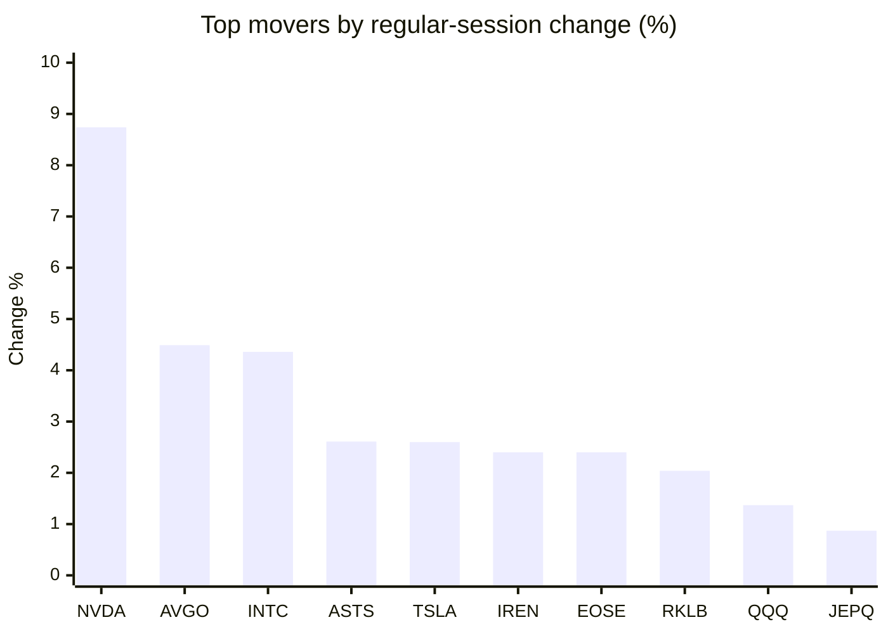
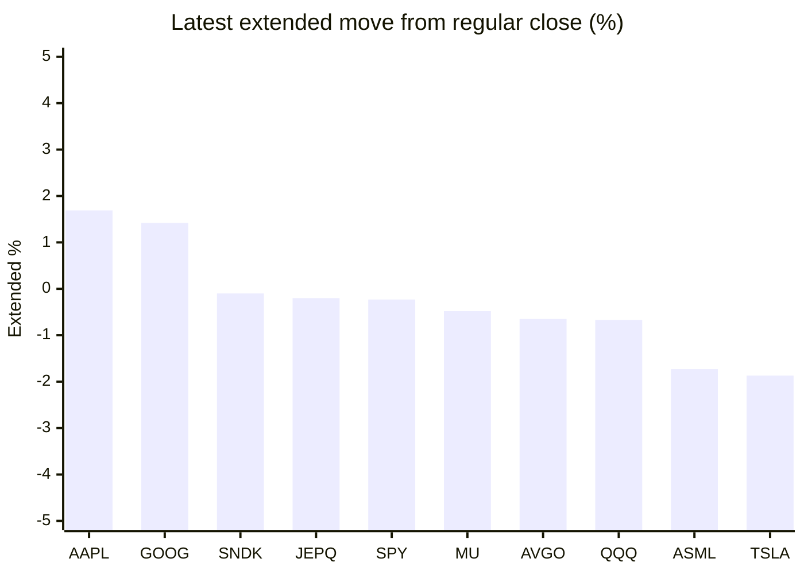

# Stock Brief - 2026-08-29

Generated at 2026-08-29 15:46 +07 from `watchlist.md`.
Prices are snapshots from Yahoo Finance public chart data. Extended/overnight is the latest available pre/post-market datapoint from the same feed.

## Market Snapshot

- SPY: close 771.10, latest extended 769.35, regular move +0.66%, extended move -0.23%
- QQQ: close 721.11, latest extended 716.25, regular move +1.37%, extended move -0.67%
- JEPQ: close 60.31, latest extended 60.19, regular move +0.87%, extended move -0.20%

## Watchlist Prices

| Ticker | Name | Regular close | Latest extended/overnight | Regular move | Extended move | Latest data time | Source |
|---|---|---:|---:|---:|---:|---|---|
| INTC | Intel Corporation | 92.09 USD | 89.25 USD | +4.36% | -3.08% | 2026-08-28 19:59 EDT | [Yahoo](https://finance.yahoo.com/quote/INTC/) |
| AVGO | Broadcom Inc. | 371.54 USD | 369.12 USD | +4.49% | -0.65% | 2026-08-28 19:59 EDT | [Yahoo](https://finance.yahoo.com/quote/AVGO/) |
| RKLB | Rocket Lab Corporation | 67.53 USD | 64.56 USD | +2.04% | -4.40% | 2026-08-28 19:59 EDT | [Yahoo](https://finance.yahoo.com/quote/RKLB/) |
| AAPL | Apple Inc. | 314.58 USD | 319.90 USD | +0.36% | +1.69% | 2026-08-28 19:59 EDT | [Yahoo](https://finance.yahoo.com/quote/AAPL/) |
| NVDA | NVIDIA Corporation | 227.98 USD | 217.89 USD | +8.74% | -4.43% | 2026-08-28 19:59 EDT | [Yahoo](https://finance.yahoo.com/quote/NVDA/) |
| TSLA | Tesla, Inc. | 354.81 USD | 348.19 USD | +2.60% | -1.87% | 2026-08-28 19:59 EDT | [Yahoo](https://finance.yahoo.com/quote/TSLA/) |
| SNDK | Sandisk Corporation | 1,484.95 USD | 1,483.42 USD | -0.96% | -0.10% | 2026-08-28 19:59 EDT | [Yahoo](https://finance.yahoo.com/quote/SNDK/) |
| QQQ | Invesco QQQ Trust, Series 1 | 721.11 USD | 716.25 USD | +1.37% | -0.67% | 2026-08-28 19:59 EDT | [Yahoo](https://finance.yahoo.com/quote/QQQ/) |
| SPY | State Street SPDR S&P 500 ETF T | 771.10 USD | 769.35 USD | +0.66% | -0.23% | 2026-08-28 19:59 EDT | [Yahoo](https://finance.yahoo.com/quote/SPY/) |
| JEPQ | JPMorgan Nasdaq Equity Premium  | 60.31 USD | 60.19 USD | +0.87% | -0.20% | 2026-08-28 19:59 EDT | [Yahoo](https://finance.yahoo.com/quote/JEPQ/) |
| ASTS | AST SpaceMobile, Inc. | 61.44 USD | 58.09 USD | +2.61% | -5.45% | 2026-08-28 19:59 EDT | [Yahoo](https://finance.yahoo.com/quote/ASTS/) |
| MU | Micron Technology, Inc. | 935.39 USD | 930.92 USD | -0.32% | -0.48% | 2026-08-28 19:59 EDT | [Yahoo](https://finance.yahoo.com/quote/MU/) |
| IREN | IREN LIMITED | 40.53 USD | 35.60 USD | +2.40% | -12.16% | 2026-08-28 19:59 EDT | [Yahoo](https://finance.yahoo.com/quote/IREN/) |
| EOSE | Eos Energy Enterprises, Inc. | 3.42 USD | 3.27 USD | +2.40% | -4.39% | 2026-08-28 19:57 EDT | [Yahoo](https://finance.yahoo.com/quote/EOSE/) |
| GOOG | Alphabet Inc. | 337.71 USD | 342.50 USD | -0.41% | +1.42% | 2026-08-28 19:59 EDT | [Yahoo](https://finance.yahoo.com/quote/GOOG/) |
| DRAM | Roundhill Memory ETF | 56.83 USD | 55.64 USD | +0.78% | -2.09% | 2026-08-28 19:59 EDT | [Yahoo](https://finance.yahoo.com/quote/DRAM/) |
| AMD | Advanced Micro Devices, Inc. | 476.67 USD | 466.05 USD | -0.89% | -2.23% | 2026-08-28 19:59 EDT | [Yahoo](https://finance.yahoo.com/quote/AMD/) |
| ASML | ASML Holding N.V. - New York Re | 1,735.01 USD | 1,704.99 USD | -0.61% | -1.73% | 2026-08-28 19:59 EDT | [Yahoo](https://finance.yahoo.com/quote/ASML/) |

## Charts

### Top Movers - Regular Session

### Extended / Overnight Move

### Quick Heatmap

| Group | Names in watchlist | Avg regular move | Avg extended move |
|---|---|---:|---:|
| Mega-cap tech | AVGO, AAPL, NVDA, TSLA, GOOG | +3.15% | -0.77% |
| Semis / memory | INTC, SNDK, MU, DRAM, AMD, ASML | +0.39% | -1.62% |
| Space / high beta | RKLB, ASTS, IREN, EOSE | +2.36% | -6.60% |
| ETFs | QQQ, SPY, JEPQ | +0.96% | -0.37% |

## News Headlines

- [President Donald Trump Claims "Prices Are Dropping Fast," but Trumpflation Data Tells a Different Story -- and That's Potentially Terrible News for Stocks](https://www.fool.com/investing/2026/08/29/trump-claim-prices-drop-fast-trumpflation-stocks/?.tsrc=rss) (2026-08-29 15:26 Bangkok)
- [How networking became the critical layer of AI](https://finance.yahoo.com/technology/ai/articles/networking-became-critical-layer-ai-071654651.html?.tsrc=rss) (2026-08-29 14:16 Bangkok)
- [Nvidia Just Locked In a $279 Billion Bet on Memory Chips](https://www.fool.com/investing/2026/08/29/nvidia-just-locked-in-a-279-billion-bet-on-memory/?.tsrc=rss) (2026-08-29 11:20 Bangkok)
- [Jim Cramer Explained What Turned The Tide For NVIDIA Corporation (NASDAQ:NVDA)’s Stock](https://finance.yahoo.com/markets/stocks/articles/jim-cramer-explained-turned-tide-033354732.html?.tsrc=rss) (2026-08-29 10:33 Bangkok)
- [Jim Cramer Shared Why Micron Technology, Inc. (NASDAQ:MU)’s Shares Didn’t Rise On Shortage News](https://finance.yahoo.com/markets/stocks/articles/jim-cramer-shared-why-micron-033253032.html?.tsrc=rss) (2026-08-29 10:32 Bangkok)
- [Nvidia CEO Jensen Huang Not Taking OpenAI's 'Jalapeño' Chip Personally: 'Lots of Projects Get Started. Lots of Projects Get Canceled'](https://finance.yahoo.com/technology/ai/articles/nvidia-ceo-jensen-huang-not-033121901.html?.tsrc=rss) (2026-08-29 10:31 Bangkok)
- [Apple implements price hikes for its TV streaming service and 'One' subscription bundle](https://www.foxbusiness.com/technology/apple-implements-price-hikes-tv-streaming-service-one-subscription-bundle?.tsrc=rss) (2026-08-29 09:09 Bangkok)
- [SpaceX vs. Alphabet: Which Is the Best Artificial Intelligence (AI) Stock to Buy Now?](https://www.fool.com/investing/2026/08/29/spacex-vs-alphabet-which-is-the-best-artificial-in/?.tsrc=rss) (2026-08-29 15:20 Bangkok)

## Caveats

- This is not investment advice. Extended-hours prices can be thin and volatile.
- Yahoo public endpoints may lag official exchange data.
