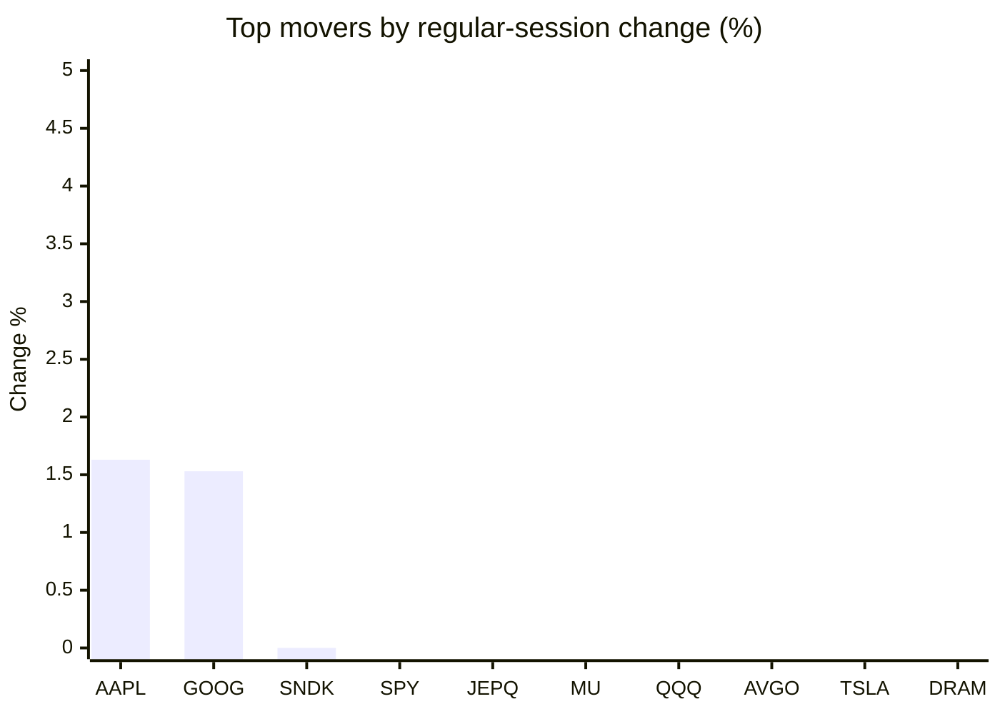
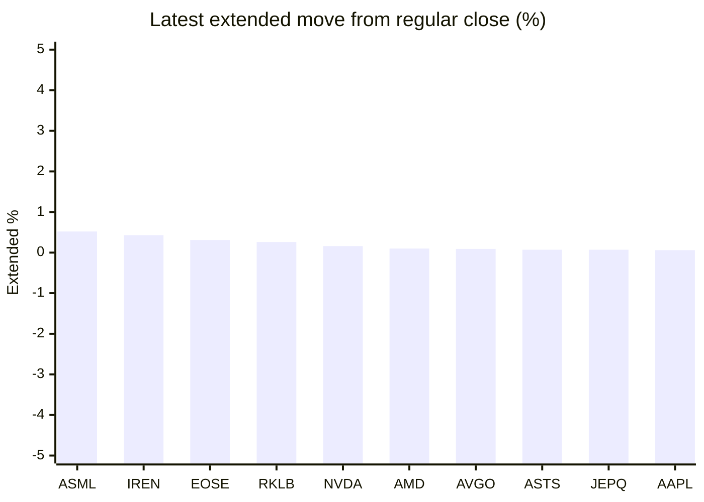

# Stock Brief - 2026-08-30

Generated at 2026-08-30 15:04 +07 from `watchlist.md`.
Prices are snapshots from Yahoo Finance public chart data. Extended/overnight is the latest available pre/post-market datapoint from the same feed.

## Market Snapshot

- SPY: close 769.35, latest extended 769.35, regular move -0.23%, extended move +0.00%
- QQQ: close 716.43, latest extended 716.25, regular move -0.65%, extended move -0.03%
- JEPQ: close 60.15, latest extended 60.19, regular move -0.27%, extended move +0.07%

## Watchlist Prices

| Ticker | Name | Regular close | Latest extended/overnight | Regular move | Extended move | Latest data time | Source |
|---|---|---:|---:|---:|---:|---|---|
| INTC | Intel Corporation | 89.47 USD | 89.25 USD | -2.85% | -0.25% | 2026-08-28 19:59 EDT | [Yahoo](https://finance.yahoo.com/quote/INTC/) |
| AVGO | Broadcom Inc. | 368.79 USD | 369.12 USD | -0.74% | +0.09% | 2026-08-28 19:59 EDT | [Yahoo](https://finance.yahoo.com/quote/AVGO/) |
| RKLB | Rocket Lab Corporation | 64.39 USD | 64.56 USD | -4.65% | +0.26% | 2026-08-28 19:59 EDT | [Yahoo](https://finance.yahoo.com/quote/RKLB/) |
| AAPL | Apple Inc. | 319.70 USD | 319.90 USD | +1.63% | +0.06% | 2026-08-28 19:59 EDT | [Yahoo](https://finance.yahoo.com/quote/AAPL/) |
| NVDA | NVIDIA Corporation | 217.55 USD | 217.89 USD | -4.57% | +0.16% | 2026-08-28 19:59 EDT | [Yahoo](https://finance.yahoo.com/quote/NVDA/) |
| TSLA | Tesla, Inc. | 348.75 USD | 348.19 USD | -1.71% | -0.16% | 2026-08-28 19:59 EDT | [Yahoo](https://finance.yahoo.com/quote/TSLA/) |
| SNDK | Sandisk Corporation | 1,484.98 USD | 1,483.42 USD | +0.00% | -0.10% | 2026-08-28 19:59 EDT | [Yahoo](https://finance.yahoo.com/quote/SNDK/) |
| QQQ | Invesco QQQ Trust, Series 1 | 716.43 USD | 716.25 USD | -0.65% | -0.03% | 2026-08-28 19:59 EDT | [Yahoo](https://finance.yahoo.com/quote/QQQ/) |
| SPY | State Street SPDR S&P 500 ETF T | 769.35 USD | 769.35 USD | -0.23% | +0.00% | 2026-08-28 19:59 EDT | [Yahoo](https://finance.yahoo.com/quote/SPY/) |
| JEPQ | JPMorgan Nasdaq Equity Premium  | 60.15 USD | 60.19 USD | -0.27% | +0.07% | 2026-08-28 19:59 EDT | [Yahoo](https://finance.yahoo.com/quote/JEPQ/) |
| ASTS | AST SpaceMobile, Inc. | 58.05 USD | 58.09 USD | -5.52% | +0.07% | 2026-08-28 19:59 EDT | [Yahoo](https://finance.yahoo.com/quote/ASTS/) |
| MU | Micron Technology, Inc. | 932.86 USD | 930.92 USD | -0.27% | -0.21% | 2026-08-28 19:59 EDT | [Yahoo](https://finance.yahoo.com/quote/MU/) |
| IREN | IREN LIMITED | 35.45 USD | 35.60 USD | -12.53% | +0.43% | 2026-08-28 19:59 EDT | [Yahoo](https://finance.yahoo.com/quote/IREN/) |
| EOSE | Eos Energy Enterprises, Inc. | 3.26 USD | 3.27 USD | -4.68% | +0.31% | 2026-08-28 19:57 EDT | [Yahoo](https://finance.yahoo.com/quote/EOSE/) |
| GOOG | Alphabet Inc. | 342.88 USD | 342.50 USD | +1.53% | -0.11% | 2026-08-28 19:59 EDT | [Yahoo](https://finance.yahoo.com/quote/GOOG/) |
| DRAM | Roundhill Memory ETF | 55.83 USD | 55.64 USD | -1.76% | -0.34% | 2026-08-28 19:59 EDT | [Yahoo](https://finance.yahoo.com/quote/DRAM/) |
| AMD | Advanced Micro Devices, Inc. | 465.58 USD | 466.05 USD | -2.33% | +0.10% | 2026-08-28 19:59 EDT | [Yahoo](https://finance.yahoo.com/quote/AMD/) |
| ASML | ASML Holding N.V. - New York Re | 1,696.16 USD | 1,704.99 USD | -2.24% | +0.52% | 2026-08-28 19:59 EDT | [Yahoo](https://finance.yahoo.com/quote/ASML/) |

## Charts

### Top Movers - Regular Session

### Extended / Overnight Move

### Quick Heatmap

| Group | Names in watchlist | Avg regular move | Avg extended move |
|---|---|---:|---:|
| Mega-cap tech | AVGO, AAPL, NVDA, TSLA, GOOG | -0.77% | +0.01% |
| Semis / memory | INTC, SNDK, MU, DRAM, AMD, ASML | -1.57% | -0.05% |
| Space / high beta | RKLB, ASTS, IREN, EOSE | -6.84% | +0.27% |
| ETFs | QQQ, SPY, JEPQ | -0.38% | +0.01% |

## News Headlines

- [History Says Amazon Stock's 2 Worst Years of the Past 15 Ended in Net Losses, and Both Rebounds Were Huge](https://www.fool.com/investing/2026/08/30/history-says-amazon-stock-s-2-worst-years-of-the-past-15-ended-in-net-losses-and-both-rebounds-were-huge/?.tsrc=rss) (2026-08-30 13:57 Bangkok)
- [Are Oklo and NuScale Power Still a Buy After Data Center Backlash?](https://www.fool.com/investing/2026/08/30/are-oklo-and-nuscale-power-still-a-buy-after-data/?.tsrc=rss) (2026-08-30 13:25 Bangkok)
- [The Most Active Stocks Today Include Tesla, Nvidia, and Apple: Here's My Contrarian Take on All Three](https://www.fool.com/investing/2026/08/30/the-most-active-stocks-today-include-tesla-nvidia/?.tsrc=rss) (2026-08-30 11:20 Bangkok)
- [Sandisk (SNDK) Backs $31 Billion Japan Flash Memory Expansion Through 2032](https://finance.yahoo.com/technology/articles/sandisk-sndk-backs-31-billion-030904294.html?.tsrc=rss) (2026-08-30 10:09 Bangkok)
- [If You'd Invested $1,000 in QQQ 20 Years Ago, Here's What You'd Have Today](https://www.fool.com/investing/2026/08/29/if-invested-1000-qqq-20-years-ago-what-have-today/?.tsrc=rss) (2026-08-30 08:20 Bangkok)
- [Peter Thiel's Fund Reported Zero Stocks for 2 Straight Quarters. Its $419 Million Comeback Put 72% Into Energy and Power.](https://www.fool.com/investing/2026/08/29/peter-thiel-s-fund-reported-zero-stocks-for-2-straight-quarters-its-usd419-million-comeback-put-72-into-energy-and-power/?.tsrc=rss) (2026-08-30 08:03 Bangkok)
- [John Ternus Becomes Apple's CEO on Sept. 1. Here's What History Says the First Year Does to the Stock.](https://www.fool.com/investing/2026/08/29/john-ternus-becomes-apple-s-ceo-on-sept-1-here-s-what-history-says-the-first-year-does-to-the-stock/?.tsrc=rss) (2026-08-30 07:01 Bangkok)
- [How a Couple Who Just Sold Their House Turned $810,000 Into a $4,900 Monthly Paycheck With JEPQ, WPC, and VZ](https://247wallst.com/personal-finance/2026/08/29/how-a-couple-who-just-sold-their-house-turned-810000-into-a-4900-monthly-paycheck-with-jepq-wpc-and-vz/?.tsrc=rss) (2026-08-30 06:58 Bangkok)

## Caveats

- This is not investment advice. Extended-hours prices can be thin and volatile.
- Yahoo public endpoints may lag official exchange data.
