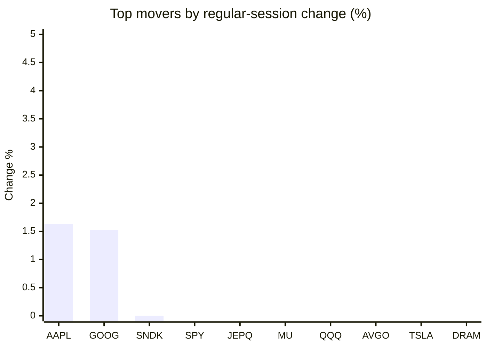
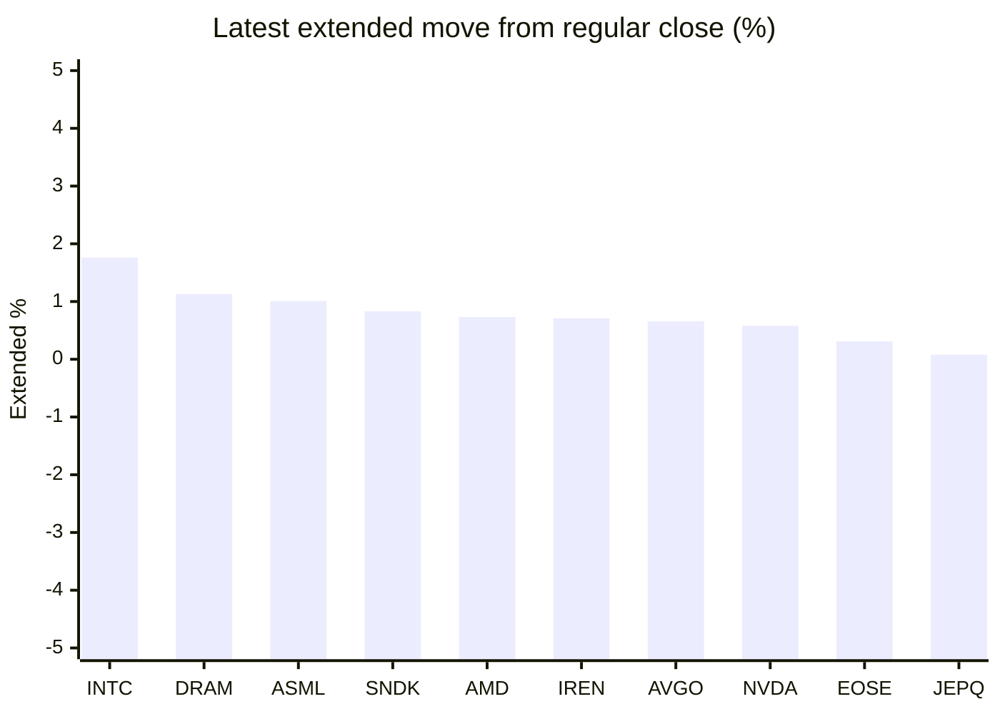

# Stock Brief - 2026-08-31

Generated at 2026-08-31 15:22 +07 from `watchlist.md`.
Prices are snapshots from Yahoo Finance public chart data. Extended/overnight is the latest available pre/post-market datapoint from the same feed.

## Market Snapshot

- SPY: close 769.35, latest extended 768.30, regular move -0.23%, extended move -0.14%
- QQQ: close 716.43, latest extended 716.65, regular move -0.65%, extended move +0.03%
- JEPQ: close 60.15, latest extended 60.20, regular move -0.27%, extended move +0.08%

## Watchlist Prices

| Ticker | Name | Regular close | Latest extended/overnight | Regular move | Extended move | Latest data time | Source |
|---|---|---:|---:|---:|---:|---|---|
| INTC | Intel Corporation | 89.47 USD | 91.05 USD | -2.85% | +1.76% | 2026-08-31 04:22 EDT | [Yahoo](https://finance.yahoo.com/quote/INTC/) |
| AVGO | Broadcom Inc. | 368.79 USD | 371.23 USD | -0.74% | +0.66% | 2026-08-31 04:21 EDT | [Yahoo](https://finance.yahoo.com/quote/AVGO/) |
| RKLB | Rocket Lab Corporation | 64.39 USD | 63.96 USD | -4.65% | -0.67% | 2026-08-31 04:22 EDT | [Yahoo](https://finance.yahoo.com/quote/RKLB/) |
| AAPL | Apple Inc. | 319.70 USD | 319.23 USD | +1.63% | -0.15% | 2026-08-31 04:22 EDT | [Yahoo](https://finance.yahoo.com/quote/AAPL/) |
| NVDA | NVIDIA Corporation | 217.55 USD | 218.82 USD | -4.57% | +0.58% | 2026-08-31 04:22 EDT | [Yahoo](https://finance.yahoo.com/quote/NVDA/) |
| TSLA | Tesla, Inc. | 348.75 USD | 348.32 USD | -1.71% | -0.12% | 2026-08-31 04:22 EDT | [Yahoo](https://finance.yahoo.com/quote/TSLA/) |
| SNDK | Sandisk Corporation | 1,484.98 USD | 1,497.36 USD | +0.00% | +0.83% | 2026-08-31 04:22 EDT | [Yahoo](https://finance.yahoo.com/quote/SNDK/) |
| QQQ | Invesco QQQ Trust, Series 1 | 716.43 USD | 716.65 USD | -0.65% | +0.03% | 2026-08-31 04:21 EDT | [Yahoo](https://finance.yahoo.com/quote/QQQ/) |
| SPY | State Street SPDR S&P 500 ETF T | 769.35 USD | 768.30 USD | -0.23% | -0.14% | 2026-08-31 04:21 EDT | [Yahoo](https://finance.yahoo.com/quote/SPY/) |
| JEPQ | JPMorgan Nasdaq Equity Premium  | 60.15 USD | 60.20 USD | -0.27% | +0.08% | 2026-08-31 04:21 EDT | [Yahoo](https://finance.yahoo.com/quote/JEPQ/) |
| ASTS | AST SpaceMobile, Inc. | 58.05 USD | 57.65 USD | -5.52% | -0.69% | 2026-08-31 04:21 EDT | [Yahoo](https://finance.yahoo.com/quote/ASTS/) |
| MU | Micron Technology, Inc. | 932.86 USD | 933.38 USD | -0.27% | +0.06% | 2026-08-31 04:22 EDT | [Yahoo](https://finance.yahoo.com/quote/MU/) |
| IREN | IREN LIMITED | 35.45 USD | 35.70 USD | -12.53% | +0.71% | 2026-08-31 04:22 EDT | [Yahoo](https://finance.yahoo.com/quote/IREN/) |
| EOSE | Eos Energy Enterprises, Inc. | 3.26 USD | 3.27 USD | -4.68% | +0.31% | 2026-08-31 04:20 EDT | [Yahoo](https://finance.yahoo.com/quote/EOSE/) |
| GOOG | Alphabet Inc. | 342.88 USD | 341.18 USD | +1.53% | -0.50% | 2026-08-31 04:21 EDT | [Yahoo](https://finance.yahoo.com/quote/GOOG/) |
| DRAM | Roundhill Memory ETF | 55.83 USD | 56.46 USD | -1.76% | +1.13% | 2026-08-31 04:22 EDT | [Yahoo](https://finance.yahoo.com/quote/DRAM/) |
| AMD | Advanced Micro Devices, Inc. | 465.58 USD | 468.98 USD | -2.33% | +0.73% | 2026-08-31 04:22 EDT | [Yahoo](https://finance.yahoo.com/quote/AMD/) |
| ASML | ASML Holding N.V. - New York Re | 1,696.16 USD | 1,713.30 USD | -2.24% | +1.01% | 2026-08-31 04:22 EDT | [Yahoo](https://finance.yahoo.com/quote/ASML/) |

## Charts

### Top Movers - Regular Session

### Extended / Overnight Move

### Quick Heatmap

| Group | Names in watchlist | Avg regular move | Avg extended move |
|---|---|---:|---:|
| Mega-cap tech | AVGO, AAPL, NVDA, TSLA, GOOG | -0.77% | +0.10% |
| Semis / memory | INTC, SNDK, MU, DRAM, AMD, ASML | -1.57% | +0.92% |
| Space / high beta | RKLB, ASTS, IREN, EOSE | -6.84% | -0.09% |
| ETFs | QQQ, SPY, JEPQ | -0.38% | -0.01% |

## News Headlines

- [Analogue Computing Market Outlook Report 2026-2030 Featuring Profiles of Analog Devices, Texas Instruments, and Intel](https://finance.yahoo.com/technology/articles/analogue-computing-market-outlook-report-080900733.html?.tsrc=rss) (2026-08-31 15:09 Bangkok)
- [Global $71+ Billion Computer-Based Sensing Market Outlook 2026-2030 - Featuring Profiles of IBM, Intel, Microsoft and Other Key Players](https://finance.yahoo.com/technology/articles/global-71-billion-computer-based-080700388.html?.tsrc=rss) (2026-08-31 15:07 Bangkok)
- [Tesla Cybercab Hype Builds: Cathie Wood, Chamath Cheer Musk’s AI, Energy Push — But One Analyst Calls The Bull Case ‘Absurd’](https://stocktwits.com/news-articles/markets/equity/tesla-cybercab-cathie-wood-chamath-ai-energy-push-analyst-bull-case-absurd/cZYyNaMRJrU?.tsrc=rss) (2026-08-31 14:31 Bangkok)
- [The Stock Market Is Uncertain Right Now. History Says That's Actually Good News for Long-Term Investors.](https://www.fool.com/investing/2026/08/31/market-uncertain-history-says-good-news-investors/?.tsrc=rss) (2026-08-31 14:20 Bangkok)
- [Analysts Expect AI Capex to Reach $800 Billion in 2026. That Number Could Actually Surpass $1 Trillion. Here Are 2 Stocks That Will Benefit.](https://www.fool.com/investing/2026/08/31/analysts-expect-ai-capex-to-reach-800-billion-in-2/?.tsrc=rss) (2026-08-31 13:50 Bangkok)
- [RKLB Stock Slips Overnight: Strong Winds Delay Electron Launch, Insiders Sell $2.8M Worth Of Shares](https://stocktwits.com/news-articles/markets/equity/rklb-strong-winds-delay-electron-insiders-sell-shares/cZYyk6BRJrs?.tsrc=rss) (2026-08-31 13:04 Bangkok)
- [Ternus Takes Over as Apple CEO With AAPL Near $320: History Shows Wild First-Year Swings](https://beincrypto.com/ternus-apple-ceo-aapl-stock-swings/?.tsrc=rss) (2026-08-31 13:02 Bangkok)
- [SWI becomes an NVIDIA Cloud Partner (NCP)](https://finance.yahoo.com/technology/ai/articles/swi-becomes-nvidia-cloud-partner-060000578.html?.tsrc=rss) (2026-08-31 13:00 Bangkok)

## Caveats

- This is not investment advice. Extended-hours prices can be thin and volatile.
- Yahoo public endpoints may lag official exchange data.
