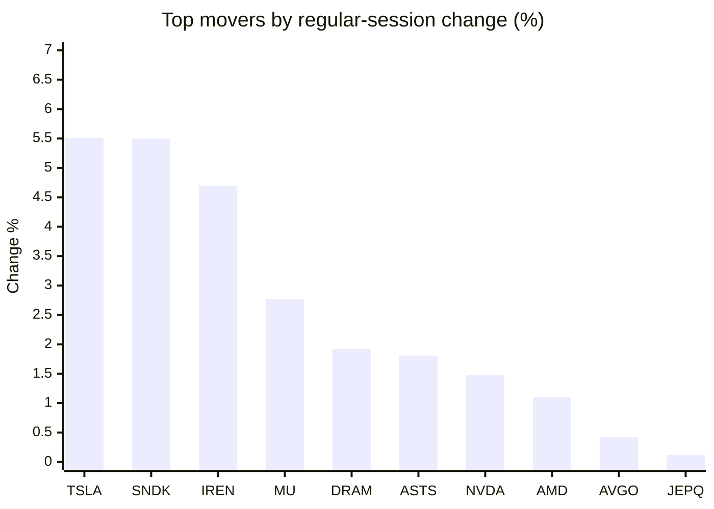
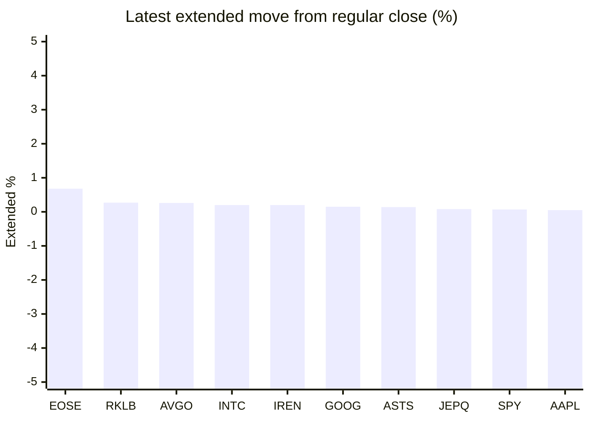

# Stock Brief - 2026-09-01

Generated at 2026-09-01 14:30 +07 from `watchlist.md`.
Prices are snapshots from Yahoo Finance public chart data. Extended/overnight is the latest available pre/post-market datapoint from the same feed.

## Market Snapshot

- SPY: close 767.05, latest extended 767.55, regular move -0.30%, extended move +0.07%
- QQQ: close 716.76, latest extended 716.70, regular move +0.05%, extended move -0.01%
- JEPQ: close 60.22, latest extended 60.27, regular move +0.12%, extended move +0.08%

## Watchlist Prices

| Ticker | Name | Regular close | Latest extended/overnight | Regular move | Extended move | Latest data time | Source |
|---|---|---:|---:|---:|---:|---|---|
| INTC | Intel Corporation | 89.51 USD | 89.69 USD | +0.04% | +0.20% | 2026-08-31 19:59 EDT | [Yahoo](https://finance.yahoo.com/quote/INTC/) |
| AVGO | Broadcom Inc. | 370.34 USD | 371.31 USD | +0.42% | +0.26% | 2026-08-31 19:59 EDT | [Yahoo](https://finance.yahoo.com/quote/AVGO/) |
| RKLB | Rocket Lab Corporation | 63.92 USD | 64.09 USD | -0.73% | +0.27% | 2026-08-31 19:59 EDT | [Yahoo](https://finance.yahoo.com/quote/RKLB/) |
| AAPL | Apple Inc. | 316.85 USD | 317.00 USD | -0.89% | +0.05% | 2026-08-31 19:59 EDT | [Yahoo](https://finance.yahoo.com/quote/AAPL/) |
| NVDA | NVIDIA Corporation | 220.78 USD | 220.27 USD | +1.48% | -0.23% | 2026-08-31 19:59 EDT | [Yahoo](https://finance.yahoo.com/quote/NVDA/) |
| TSLA | Tesla, Inc. | 367.95 USD | 367.42 USD | +5.51% | -0.14% | 2026-08-31 19:59 EDT | [Yahoo](https://finance.yahoo.com/quote/TSLA/) |
| SNDK | Sandisk Corporation | 1,566.70 USD | 1,550.65 USD | +5.50% | -1.02% | 2026-08-31 19:59 EDT | [Yahoo](https://finance.yahoo.com/quote/SNDK/) |
| QQQ | Invesco QQQ Trust, Series 1 | 716.76 USD | 716.70 USD | +0.05% | -0.01% | 2026-08-31 19:59 EDT | [Yahoo](https://finance.yahoo.com/quote/QQQ/) |
| SPY | State Street SPDR S&P 500 ETF T | 767.05 USD | 767.55 USD | -0.30% | +0.07% | 2026-08-31 19:59 EDT | [Yahoo](https://finance.yahoo.com/quote/SPY/) |
| JEPQ | JPMorgan Nasdaq Equity Premium  | 60.22 USD | 60.27 USD | +0.12% | +0.08% | 2026-08-31 19:58 EDT | [Yahoo](https://finance.yahoo.com/quote/JEPQ/) |
| ASTS | AST SpaceMobile, Inc. | 59.10 USD | 59.18 USD | +1.81% | +0.14% | 2026-08-31 19:59 EDT | [Yahoo](https://finance.yahoo.com/quote/ASTS/) |
| MU | Micron Technology, Inc. | 958.73 USD | 955.93 USD | +2.77% | -0.29% | 2026-08-31 19:59 EDT | [Yahoo](https://finance.yahoo.com/quote/MU/) |
| IREN | IREN LIMITED | 37.12 USD | 37.19 USD | +4.70% | +0.20% | 2026-08-31 19:59 EDT | [Yahoo](https://finance.yahoo.com/quote/IREN/) |
| EOSE | Eos Energy Enterprises, Inc. | 3.22 USD | 3.24 USD | -1.23% | +0.68% | 2026-08-31 19:59 EDT | [Yahoo](https://finance.yahoo.com/quote/EOSE/) |
| GOOG | Alphabet Inc. | 335.41 USD | 335.91 USD | -2.18% | +0.15% | 2026-08-31 19:59 EDT | [Yahoo](https://finance.yahoo.com/quote/GOOG/) |
| DRAM | Roundhill Memory ETF | 56.90 USD | 56.77 USD | +1.92% | -0.24% | 2026-08-31 19:59 EDT | [Yahoo](https://finance.yahoo.com/quote/DRAM/) |
| AMD | Advanced Micro Devices, Inc. | 470.72 USD | 469.60 USD | +1.10% | -0.24% | 2026-08-31 19:59 EDT | [Yahoo](https://finance.yahoo.com/quote/AMD/) |
| ASML | ASML Holding N.V. - New York Re | 1,696.01 USD | 1,692.98 USD | -2.25% | -0.18% | 2026-08-31 19:58 EDT | [Yahoo](https://finance.yahoo.com/quote/ASML/) |

## Charts

### Top Movers - Regular Session

### Extended / Overnight Move

### Quick Heatmap

| Group | Names in watchlist | Avg regular move | Avg extended move |
|---|---|---:|---:|
| Mega-cap tech | AVGO, AAPL, NVDA, TSLA, GOOG | +0.87% | +0.02% |
| Semis / memory | INTC, SNDK, MU, DRAM, AMD, ASML | +1.52% | -0.29% |
| Space / high beta | RKLB, ASTS, IREN, EOSE | +1.14% | +0.32% |
| ETFs | QQQ, SPY, JEPQ | -0.05% | +0.05% |

## News Headlines

- [Prediction: This Will Be Nvidia's Stock Price by the End of 2027, Based on Its Latest Forecast](https://www.fool.com/investing/2026/09/01/prediction-nvidia-stock-price-end-of-2027-latest-forecast/?.tsrc=rss) (2026-09-01 14:22 Bangkok)
- [Nano One Appoints Aleem Ladak as Director of Corporate Development](https://finance.yahoo.com/technology/articles/nano-one-appoints-aleem-ladak-070500458.html?.tsrc=rss) (2026-09-01 14:05 Bangkok)
- [AMD vs. Nvidia: SpaceX and Tesla CEO Elon Musk Weighs In on His Top Pick](https://www.fool.com/investing/2026/09/01/amd-vs-nvidia-spacex-and-tesla-ceo-elon-musk-weigh/?.tsrc=rss) (2026-09-01 12:50 Bangkok)
- [Tesla Stock Crushes Rivian, Chinese EV Rivals In August — Wall Street Sees More Upside Before Cybercab Event](https://stocktwits.com/news-articles/markets/equity/tesla-rivian-chinese-ev-rivals-wall-street-upside-cybercab-event/cZso7XHRJti?.tsrc=rss) (2026-09-01 12:34 Bangkok)
- [Can't Decide Between Investing in Rare-Earth Materials and Nuclear Energy? This Under-the-Radar Stock Provides Exposure to Both Industries.](https://www.fool.com/investing/2026/09/01/cant-decide-between-investing-in-rare-earths-and-n/?.tsrc=rss) (2026-09-01 11:50 Bangkok)
- [Apple’s new CEO inherits a fortune and an AI question](https://www.thestreet.com/technology/apples-new-ceo-inherits-a-fortune-and-an-ai-question?.tsrc=rss) (2026-09-01 11:37 Bangkok)
- [If You'd Invested $5,000 in the Vanguard S&P 500 ETF (VOO) a Decade Ago, Here's What You'd Have Today](https://www.fool.com/investing/2026/09/01/if-youd-invested-5000-in-vanguard-sp-500-etf-voo/?.tsrc=rss) (2026-09-01 11:35 Bangkok)
- [Tesla (TSLA) Gets First 2026 Delivery Timeline For Landmark 500 Semi Order](https://finance.yahoo.com/markets/stocks/articles/tesla-tsla-gets-first-2026-043420660.html?.tsrc=rss) (2026-09-01 11:34 Bangkok)

## Caveats

- This is not investment advice. Extended-hours prices can be thin and volatile.
- Yahoo public endpoints may lag official exchange data.
