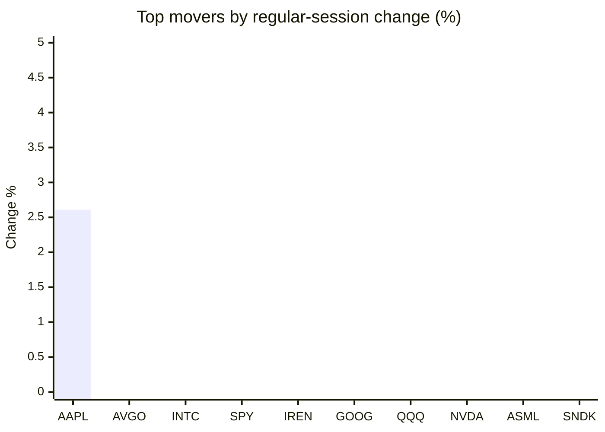
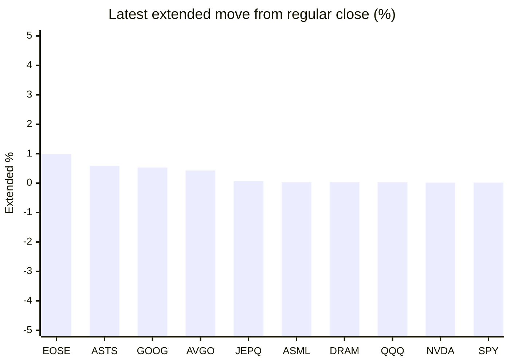

# Stock Brief - 2026-09-02

Generated at 2026-09-02 13:56 +07 from `watchlist.md`.
Prices are snapshots from Yahoo Finance public chart data. Extended/overnight is the latest available pre/post-market datapoint from the same feed.

## Market Snapshot

- SPY: close 761.78, latest extended 761.91, regular move -0.69%, extended move +0.02%
- QQQ: close 707.64, latest extended 707.83, regular move -1.27%, extended move +0.03%
- JEPQ: close 59.00, latest extended 59.04, regular move -2.03%, extended move +0.07%

## Watchlist Prices

| Ticker | Name | Regular close | Latest extended/overnight | Regular move | Extended move | Latest data time | Source |
|---|---|---:|---:|---:|---:|---|---|
| INTC | Intel Corporation | 88.97 USD | 88.90 USD | -0.60% | -0.08% | 2026-09-01 19:59 EDT | [Yahoo](https://finance.yahoo.com/quote/INTC/) |
| AVGO | Broadcom Inc. | 369.68 USD | 371.27 USD | -0.18% | +0.43% | 2026-09-01 19:59 EDT | [Yahoo](https://finance.yahoo.com/quote/AVGO/) |
| RKLB | Rocket Lab Corporation | 62.54 USD | 61.65 USD | -2.16% | -1.42% | 2026-09-01 19:59 EDT | [Yahoo](https://finance.yahoo.com/quote/RKLB/) |
| AAPL | Apple Inc. | 325.13 USD | 325.15 USD | +2.61% | +0.01% | 2026-09-01 19:59 EDT | [Yahoo](https://finance.yahoo.com/quote/AAPL/) |
| NVDA | NVIDIA Corporation | 217.44 USD | 217.48 USD | -1.51% | +0.02% | 2026-09-01 19:59 EDT | [Yahoo](https://finance.yahoo.com/quote/NVDA/) |
| TSLA | Tesla, Inc. | 356.09 USD | 355.97 USD | -3.22% | -0.03% | 2026-09-01 19:59 EDT | [Yahoo](https://finance.yahoo.com/quote/TSLA/) |
| SNDK | Sandisk Corporation | 1,536.87 USD | 1,532.00 USD | -1.90% | -0.32% | 2026-09-01 19:59 EDT | [Yahoo](https://finance.yahoo.com/quote/SNDK/) |
| QQQ | Invesco QQQ Trust, Series 1 | 707.64 USD | 707.83 USD | -1.27% | +0.03% | 2026-09-01 19:59 EDT | [Yahoo](https://finance.yahoo.com/quote/QQQ/) |
| SPY | State Street SPDR S&P 500 ETF T | 761.78 USD | 761.91 USD | -0.69% | +0.02% | 2026-09-01 19:59 EDT | [Yahoo](https://finance.yahoo.com/quote/SPY/) |
| JEPQ | JPMorgan Nasdaq Equity Premium  | 59.00 USD | 59.04 USD | -2.03% | +0.07% | 2026-09-01 19:59 EDT | [Yahoo](https://finance.yahoo.com/quote/JEPQ/) |
| ASTS | AST SpaceMobile, Inc. | 55.80 USD | 56.13 USD | -5.58% | +0.59% | 2026-09-01 19:59 EDT | [Yahoo](https://finance.yahoo.com/quote/ASTS/) |
| MU | Micron Technology, Inc. | 933.44 USD | 929.00 USD | -2.64% | -0.48% | 2026-09-01 19:59 EDT | [Yahoo](https://finance.yahoo.com/quote/MU/) |
| IREN | IREN LIMITED | 36.82 USD | 36.42 USD | -0.79% | -1.09% | 2026-09-01 19:59 EDT | [Yahoo](https://finance.yahoo.com/quote/IREN/) |
| EOSE | Eos Energy Enterprises, Inc. | 3.04 USD | 3.07 USD | -5.59% | +0.99% | 2026-09-01 19:59 EDT | [Yahoo](https://finance.yahoo.com/quote/EOSE/) |
| GOOG | Alphabet Inc. | 332.03 USD | 333.80 USD | -1.01% | +0.53% | 2026-09-01 19:59 EDT | [Yahoo](https://finance.yahoo.com/quote/GOOG/) |
| DRAM | Roundhill Memory ETF | 55.06 USD | 55.08 USD | -3.23% | +0.03% | 2026-09-01 19:59 EDT | [Yahoo](https://finance.yahoo.com/quote/DRAM/) |
| AMD | Advanced Micro Devices, Inc. | 459.61 USD | 459.50 USD | -2.36% | -0.02% | 2026-09-01 19:59 EDT | [Yahoo](https://finance.yahoo.com/quote/AMD/) |
| ASML | ASML Holding N.V. - New York Re | 1,665.14 USD | 1,665.70 USD | -1.82% | +0.03% | 2026-09-01 19:59 EDT | [Yahoo](https://finance.yahoo.com/quote/ASML/) |

## Charts

### Top Movers - Regular Session

### Extended / Overnight Move

### Quick Heatmap

| Group | Names in watchlist | Avg regular move | Avg extended move |
|---|---|---:|---:|
| Mega-cap tech | AVGO, AAPL, NVDA, TSLA, GOOG | -0.66% | +0.19% |
| Semis / memory | INTC, SNDK, MU, DRAM, AMD, ASML | -2.09% | -0.14% |
| Space / high beta | RKLB, ASTS, IREN, EOSE | -3.53% | -0.23% |
| ETFs | QQQ, SPY, JEPQ | -1.33% | +0.04% |

## News Headlines

- [Winamp Group Provides an Update on the U.S. Proceedings Involving NVIDIA and Suno](https://finance.yahoo.com/technology/ai/articles/winamp-group-provides-u-proceedings-063000922.html?.tsrc=rss) (2026-09-02 13:30 Bangkok)
- [Credit Card Delinquencies Run 6.4% at Small Banks and 2.9% Across All of Them](https://www.fool.com/investing/2026/09/02/credit-card-delinquencies-run-64-at-small-banks-an/?.tsrc=rss) (2026-09-02 12:50 Bangkok)
- [Tesla Stopped Reporting Solar Numbers 10 Quarters Ago. Now the Solar Roof Is Gone, Too.](https://www.fool.com/investing/2026/09/02/tesla-stopped-reporting-solar-numbers-10-quarters-ago-now-the-solar-roof-is-gone-too/?.tsrc=rss) (2026-09-02 12:01 Bangkok)
- [The Stock Market Is Historically Expensive Right Now. Here's Why I'm Still Investing.](https://www.fool.com/investing/2026/09/02/the-stock-market-is-historically-expensive-right-n/?.tsrc=rss) (2026-09-02 13:20 Bangkok)
- [Why CoreWeave Stock Gained 18% in August](https://www.fool.com/investing/2026/09/02/why-coreweave-stock-gained-18-in-august/?.tsrc=rss) (2026-09-02 12:20 Bangkok)
- [Dow Jones Futures: Dell, Credo, Palo Alto Are Earnings Movers Late; Oil Prices Keep Rising](https://finance.yahoo.com/m/3c8f786a-671c-3fb9-bb03-81fc8be4d3f0/dow-jones-futures%3A-dell%2C.html?.tsrc=rss) (2026-09-02 12:47 Bangkok)
- [Anthropic Could Steal SpaceX’s IPO Crown — If It Can Turn AI Growth Into Microsoft-Like Margins, Analyst Says](https://stocktwits.com/news-articles/markets/equity/anthropic-spacex-ipo-crown-ai-growth-microsoft-margins-analyst/cZsAKJTRJuX?.tsrc=rss) (2026-09-02 13:39 Bangkok)
- [Samsung Electronics (KOSE:A005930), Why Is The Market Taking A Closer Look?](https://finance.yahoo.com/markets/stocks/articles/samsung-electronics-kose-a005930-why-061124092.html?.tsrc=rss) (2026-09-02 13:11 Bangkok)

## Caveats

- This is not investment advice. Extended-hours prices can be thin and volatile.
- Yahoo public endpoints may lag official exchange data.
