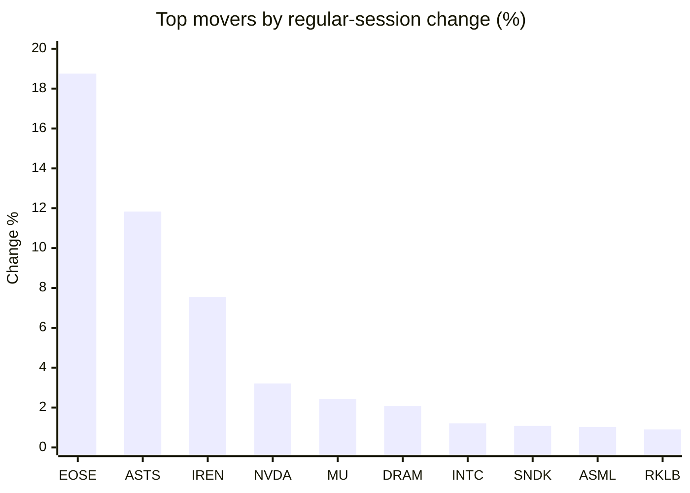
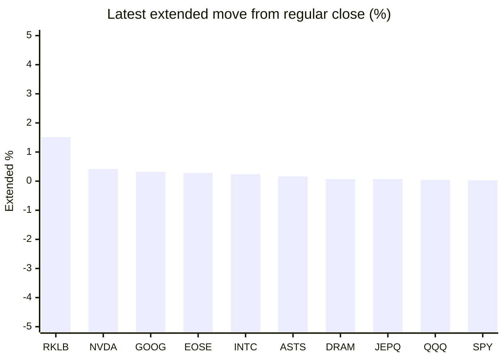

# Stock Brief - 2026-09-03

Generated at 2026-09-03 14:00 +07 from `watchlist.md`.
Prices are snapshots from Yahoo Finance public chart data. Extended/overnight is the latest available pre/post-market datapoint from the same feed.

## Market Snapshot

- SPY: close 765.16, latest extended 765.37, regular move +0.44%, extended move +0.03%
- QQQ: close 709.24, latest extended 709.55, regular move +0.23%, extended move +0.04%
- JEPQ: close 59.15, latest extended 59.19, regular move +0.25%, extended move +0.07%

## Watchlist Prices

| Ticker | Name | Regular close | Latest extended/overnight | Regular move | Extended move | Latest data time | Source |
|---|---|---:|---:|---:|---:|---|---|
| INTC | Intel Corporation | 90.05 USD | 90.27 USD | +1.21% | +0.24% | 2026-09-02 19:59 EDT | [Yahoo](https://finance.yahoo.com/quote/INTC/) |
| AVGO | Broadcom Inc. | 367.24 USD | 364.23 USD | -0.66% | -0.82% | 2026-09-02 19:59 EDT | [Yahoo](https://finance.yahoo.com/quote/AVGO/) |
| RKLB | Rocket Lab Corporation | 63.10 USD | 64.05 USD | +0.90% | +1.51% | 2026-09-02 19:59 EDT | [Yahoo](https://finance.yahoo.com/quote/RKLB/) |
| AAPL | Apple Inc. | 324.96 USD | 324.74 USD | -0.05% | -0.07% | 2026-09-02 19:59 EDT | [Yahoo](https://finance.yahoo.com/quote/AAPL/) |
| NVDA | NVIDIA Corporation | 224.41 USD | 225.35 USD | +3.21% | +0.42% | 2026-09-02 19:59 EDT | [Yahoo](https://finance.yahoo.com/quote/NVDA/) |
| TSLA | Tesla, Inc. | 357.01 USD | 356.85 USD | +0.26% | -0.04% | 2026-09-02 19:59 EDT | [Yahoo](https://finance.yahoo.com/quote/TSLA/) |
| SNDK | Sandisk Corporation | 1,553.40 USD | 1,546.14 USD | +1.08% | -0.47% | 2026-09-02 19:59 EDT | [Yahoo](https://finance.yahoo.com/quote/SNDK/) |
| QQQ | Invesco QQQ Trust, Series 1 | 709.24 USD | 709.55 USD | +0.23% | +0.04% | 2026-09-02 19:59 EDT | [Yahoo](https://finance.yahoo.com/quote/QQQ/) |
| SPY | State Street SPDR S&P 500 ETF T | 765.16 USD | 765.37 USD | +0.44% | +0.03% | 2026-09-02 19:59 EDT | [Yahoo](https://finance.yahoo.com/quote/SPY/) |
| JEPQ | JPMorgan Nasdaq Equity Premium  | 59.15 USD | 59.19 USD | +0.25% | +0.07% | 2026-09-02 19:59 EDT | [Yahoo](https://finance.yahoo.com/quote/JEPQ/) |
| ASTS | AST SpaceMobile, Inc. | 62.40 USD | 62.50 USD | +11.83% | +0.16% | 2026-09-02 19:59 EDT | [Yahoo](https://finance.yahoo.com/quote/ASTS/) |
| MU | Micron Technology, Inc. | 956.08 USD | 954.84 USD | +2.43% | -0.13% | 2026-09-02 19:59 EDT | [Yahoo](https://finance.yahoo.com/quote/MU/) |
| IREN | IREN LIMITED | 39.60 USD | 39.29 USD | +7.55% | -0.78% | 2026-09-02 19:59 EDT | [Yahoo](https://finance.yahoo.com/quote/IREN/) |
| EOSE | Eos Energy Enterprises, Inc. | 3.61 USD | 3.62 USD | +18.75% | +0.28% | 2026-09-02 19:59 EDT | [Yahoo](https://finance.yahoo.com/quote/EOSE/) |
| GOOG | Alphabet Inc. | 333.78 USD | 334.85 USD | +0.53% | +0.32% | 2026-09-02 19:59 EDT | [Yahoo](https://finance.yahoo.com/quote/GOOG/) |
| DRAM | Roundhill Memory ETF | 56.21 USD | 56.25 USD | +2.09% | +0.07% | 2026-09-02 19:59 EDT | [Yahoo](https://finance.yahoo.com/quote/DRAM/) |
| AMD | Advanced Micro Devices, Inc. | 457.06 USD | 456.73 USD | -0.55% | -0.07% | 2026-09-02 19:59 EDT | [Yahoo](https://finance.yahoo.com/quote/AMD/) |
| ASML | ASML Holding N.V. - New York Re | 1,682.30 USD | 1,677.72 USD | +1.03% | -0.27% | 2026-09-02 19:59 EDT | [Yahoo](https://finance.yahoo.com/quote/ASML/) |

## Charts

### Top Movers - Regular Session

### Extended / Overnight Move

### Quick Heatmap

| Group | Names in watchlist | Avg regular move | Avg extended move |
|---|---|---:|---:|
| Mega-cap tech | AVGO, AAPL, NVDA, TSLA, GOOG | +0.66% | -0.04% |
| Semis / memory | INTC, SNDK, MU, DRAM, AMD, ASML | +1.21% | -0.10% |
| Space / high beta | RKLB, ASTS, IREN, EOSE | +9.76% | +0.29% |
| ETFs | QQQ, SPY, JEPQ | +0.31% | +0.05% |

## News Headlines

- [Intel Stock Tripled in a Year, So Where Will It Be in 5 Years?](https://www.fool.com/investing/2026/09/03/intel-stock-tripled-in-a-year-so-where-will-it-be-in-5-years/?.tsrc=rss) (2026-09-03 13:11 Bangkok)
- [Nvidia's 8% Grip on the S&P 500 Is Unlike Anything Wall Street Has Seen: Jensen Huang-Led Chipmaker is 'Making History,' Says This Commentator](https://finance.yahoo.com/markets/stocks/articles/nvidias-8-grip-p-500-053416658.html?.tsrc=rss) (2026-09-03 12:34 Bangkok)
- [Nvidia CEO Jensen Huang Says the ‘Single Worst Outcome’ for Any Country Is Being Left Behind in AI: Don't Regulate 'Theoretical Harm'](https://finance.yahoo.com/technology/ai/articles/nvidia-ceo-jensen-huang-says-050258970.html?.tsrc=rss) (2026-09-03 12:02 Bangkok)
- [3 AI Stocks Up 500% or More in the Past Year That Could Have More Room to Run](https://www.fool.com/investing/2026/09/03/3-ai-stocks-up-500-or-more-in-the-past-year-that-c/?.tsrc=rss) (2026-09-03 11:50 Bangkok)
- [Does Caterpillar’s AI Robotics Push with FieldAI and NVIDIA Reshape the Bull Case for CAT?](https://finance.yahoo.com/technology/ai/articles/does-caterpillar-ai-robotics-push-032647238.html?.tsrc=rss) (2026-09-03 10:26 Bangkok)
- [Soros Fund Management Increased Micron Nearly Eightfold. Is AI Memory Still One of the Best Chip Trades?](https://finance.yahoo.com/technology/ai/articles/soros-fund-management-increased-micron-032555590.html?.tsrc=rss) (2026-09-03 10:25 Bangkok)
- [Billionaire Dan Loeb Exited Nvidia and Broadcom. Is He Calling the Top in AI Chips?](https://finance.yahoo.com/markets/stocks/articles/billionaire-dan-loeb-exited-nvidia-032353901.html?.tsrc=rss) (2026-09-03 10:23 Bangkok)
- [Bridgewater Cut Nvidia 18% and More Than Doubled Vistra. Is It Rotating From Chips to Power?](https://finance.yahoo.com/markets/stocks/articles/bridgewater-cut-nvidia-18-more-031929630.html?.tsrc=rss) (2026-09-03 10:19 Bangkok)

## Caveats

- This is not investment advice. Extended-hours prices can be thin and volatile.
- Yahoo public endpoints may lag official exchange data.
