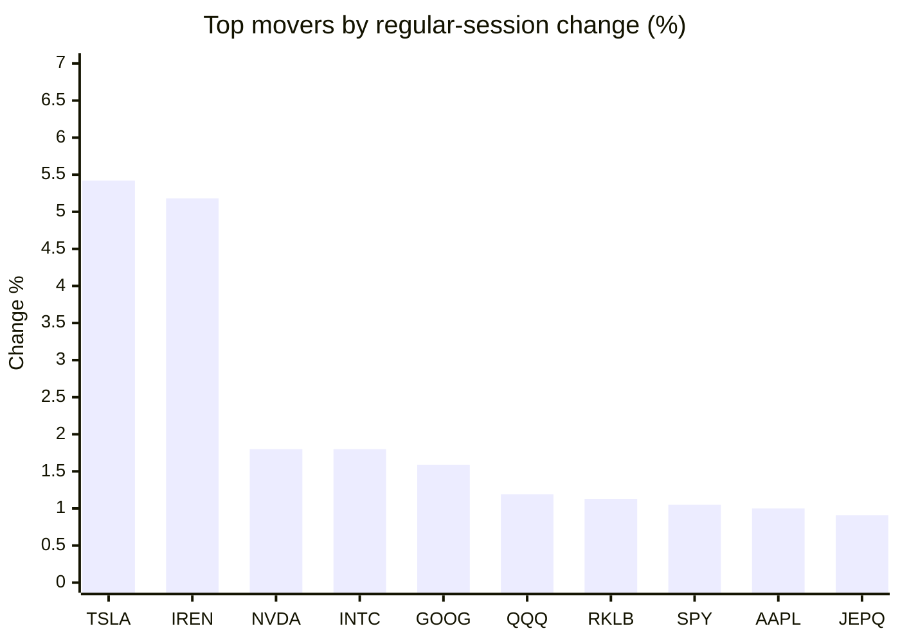
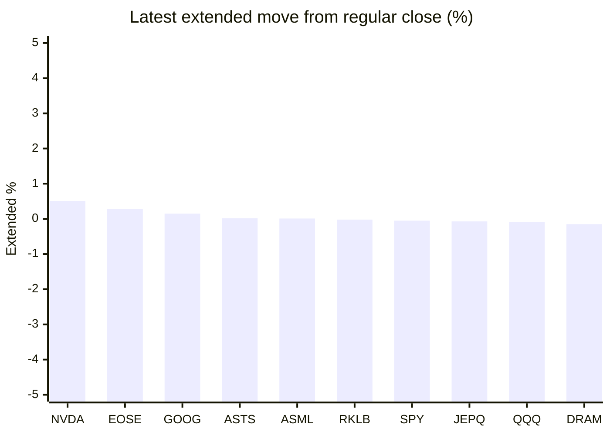

# Stock Brief - 2026-09-04

Generated at 2026-09-04 14:04 +07 from `watchlist.md`.
Prices are snapshots from Yahoo Finance public chart data. Extended/overnight is the latest available pre/post-market datapoint from the same feed.

## Market Snapshot

- SPY: close 773.17, latest extended 772.75, regular move +1.05%, extended move -0.05%
- QQQ: close 717.67, latest extended 717.03, regular move +1.19%, extended move -0.09%
- JEPQ: close 59.69, latest extended 59.65, regular move +0.91%, extended move -0.07%

## Watchlist Prices

| Ticker | Name | Regular close | Latest extended/overnight | Regular move | Extended move | Latest data time | Source |
|---|---|---:|---:|---:|---:|---|---|
| INTC | Intel Corporation | 91.67 USD | 91.48 USD | +1.80% | -0.21% | 2026-09-03 19:59 EDT | [Yahoo](https://finance.yahoo.com/quote/INTC/) |
| AVGO | Broadcom Inc. | 357.16 USD | 356.48 USD | -2.74% | -0.19% | 2026-09-03 19:59 EDT | [Yahoo](https://finance.yahoo.com/quote/AVGO/) |
| RKLB | Rocket Lab Corporation | 63.81 USD | 63.80 USD | +1.13% | -0.02% | 2026-09-03 19:59 EDT | [Yahoo](https://finance.yahoo.com/quote/RKLB/) |
| AAPL | Apple Inc. | 328.21 USD | 327.64 USD | +1.00% | -0.17% | 2026-09-03 19:59 EDT | [Yahoo](https://finance.yahoo.com/quote/AAPL/) |
| NVDA | NVIDIA Corporation | 228.45 USD | 229.62 USD | +1.80% | +0.51% | 2026-09-03 19:59 EDT | [Yahoo](https://finance.yahoo.com/quote/NVDA/) |
| TSLA | Tesla, Inc. | 376.37 USD | 374.64 USD | +5.42% | -0.46% | 2026-09-03 19:59 EDT | [Yahoo](https://finance.yahoo.com/quote/TSLA/) |
| SNDK | Sandisk Corporation | 1,554.99 USD | 1,549.40 USD | +0.10% | -0.36% | 2026-09-03 19:59 EDT | [Yahoo](https://finance.yahoo.com/quote/SNDK/) |
| QQQ | Invesco QQQ Trust, Series 1 | 717.67 USD | 717.03 USD | +1.19% | -0.09% | 2026-09-03 19:59 EDT | [Yahoo](https://finance.yahoo.com/quote/QQQ/) |
| SPY | State Street SPDR S&P 500 ETF T | 773.17 USD | 772.75 USD | +1.05% | -0.05% | 2026-09-03 19:59 EDT | [Yahoo](https://finance.yahoo.com/quote/SPY/) |
| JEPQ | JPMorgan Nasdaq Equity Premium  | 59.69 USD | 59.65 USD | +0.91% | -0.07% | 2026-09-03 19:59 EDT | [Yahoo](https://finance.yahoo.com/quote/JEPQ/) |
| ASTS | AST SpaceMobile, Inc. | 62.13 USD | 62.14 USD | -0.43% | +0.02% | 2026-09-03 19:59 EDT | [Yahoo](https://finance.yahoo.com/quote/ASTS/) |
| MU | Micron Technology, Inc. | 958.16 USD | 953.84 USD | +0.22% | -0.45% | 2026-09-03 19:59 EDT | [Yahoo](https://finance.yahoo.com/quote/MU/) |
| IREN | IREN LIMITED | 41.65 USD | 41.33 USD | +5.18% | -0.77% | 2026-09-03 19:59 EDT | [Yahoo](https://finance.yahoo.com/quote/IREN/) |
| EOSE | Eos Energy Enterprises, Inc. | 3.50 USD | 3.51 USD | -3.05% | +0.28% | 2026-09-03 19:58 EDT | [Yahoo](https://finance.yahoo.com/quote/EOSE/) |
| GOOG | Alphabet Inc. | 339.08 USD | 339.60 USD | +1.59% | +0.15% | 2026-09-03 19:59 EDT | [Yahoo](https://finance.yahoo.com/quote/GOOG/) |
| DRAM | Roundhill Memory ETF | 55.99 USD | 55.91 USD | -0.39% | -0.15% | 2026-09-03 19:59 EDT | [Yahoo](https://finance.yahoo.com/quote/DRAM/) |
| AMD | Advanced Micro Devices, Inc. | 456.16 USD | 455.09 USD | -0.20% | -0.23% | 2026-09-03 19:59 EDT | [Yahoo](https://finance.yahoo.com/quote/AMD/) |
| ASML | ASML Holding N.V. - New York Re | 1,646.19 USD | 1,646.28 USD | -2.15% | +0.01% | 2026-09-03 19:59 EDT | [Yahoo](https://finance.yahoo.com/quote/ASML/) |

## Charts

### Top Movers - Regular Session

### Extended / Overnight Move

### Quick Heatmap

| Group | Names in watchlist | Avg regular move | Avg extended move |
|---|---|---:|---:|
| Mega-cap tech | AVGO, AAPL, NVDA, TSLA, GOOG | +1.41% | -0.03% |
| Semis / memory | INTC, SNDK, MU, DRAM, AMD, ASML | -0.10% | -0.23% |
| Space / high beta | RKLB, ASTS, IREN, EOSE | +0.71% | -0.12% |
| ETFs | QQQ, SPY, JEPQ | +1.05% | -0.07% |

## News Headlines

- [Broadcom's Artificial Intelligence (AI) Chip Sales Surged 221% to $16.7 Billion Last Quarter: Is the Stock a Screaming Buy Right Now?](https://www.fool.com/investing/2026/09/04/broadcoms-artificial-intelligence-ai-chip-sales-su/?.tsrc=rss) (2026-09-04 14:00 Bangkok)
- [Bill Ackman Says Pershing Square Has Achieved a 20% Gross Annual Return Since Inception and Aims to Keep Beating That Bar. Can His Newly Launched Funds Live Up to the Track Record?](https://www.fool.com/investing/2026/09/04/bill-ackman-says-pershing-square-has-achieved-a-20/?.tsrc=rss) (2026-09-04 12:50 Bangkok)
- [Nvidia vs. Micron: Which Is the Better AI Semiconductor Stock to Own for the Next 5 Years?](https://www.fool.com/investing/2026/09/04/nvidia-vs-micron-which-is-the-better-ai-semiconduc/?.tsrc=rss) (2026-09-04 12:20 Bangkok)
- [Michael Burry Calls Nvidia-Hugging Face Deal A ‘No-Brainer’ — Wall Street Sees New Threat For OpenAI And Anthropic](https://stocktwits.com/news-articles/markets/equity/michael-burry-nvidia-hugging-face-no-brainer-wall-street-threat-openai-anthropic/cZswMddRJwJ?.tsrc=rss) (2026-09-04 12:08 Bangkok)
- [Is Rocket Lab Stock a Millionaire Maker?](https://www.fool.com/investing/2026/09/04/is-rocket-lab-stock-a-millionaire-maker/?.tsrc=rss) (2026-09-04 12:00 Bangkok)
- [Apple's Memory Costs Jump 400%, iPhone 18 Pro Price May Rise $100](https://beincrypto.com/iphone-18-pro-price-memory-costs/?.tsrc=rss) (2026-09-04 11:37 Bangkok)
- [Opinion: TSMC Is a Better Buy Than Any of the "Magnificent Seven" Stocks Right Now](https://www.fool.com/investing/2026/09/03/opinion-tsmc-is-a-better-buy-than-any-of-the-mag/?.tsrc=rss) (2026-09-04 10:20 Bangkok)
- [RKLB And FLY Investors, Take Note: Planet Labs Flags SpaceX Rideshare Crunch As Smaller Operators Seek Alternatives](https://stocktwits.com/news-articles/markets/equity/rklb-fly-investors-planet-labs-spacex-rideshare-crunch-smaller-operators-alternatives/cZswqIGRJw2?.tsrc=rss) (2026-09-04 10:18 Bangkok)

## Caveats

- This is not investment advice. Extended-hours prices can be thin and volatile.
- Yahoo public endpoints may lag official exchange data.
