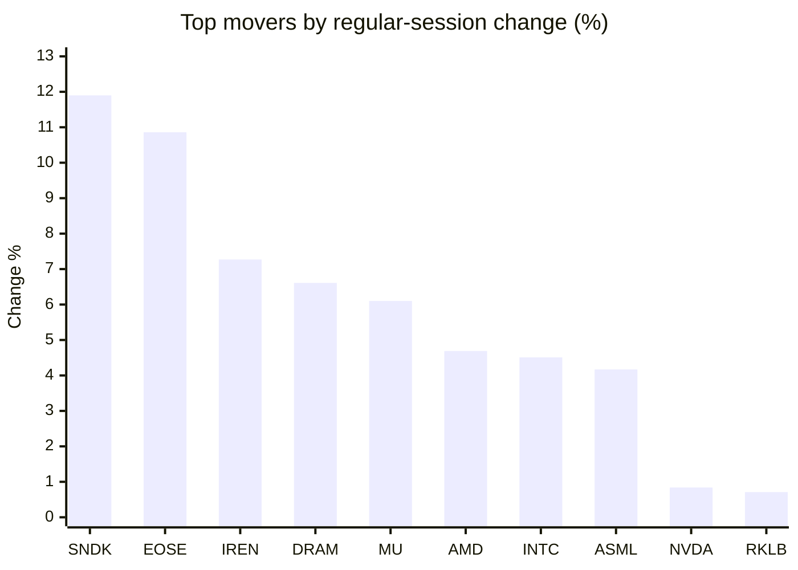
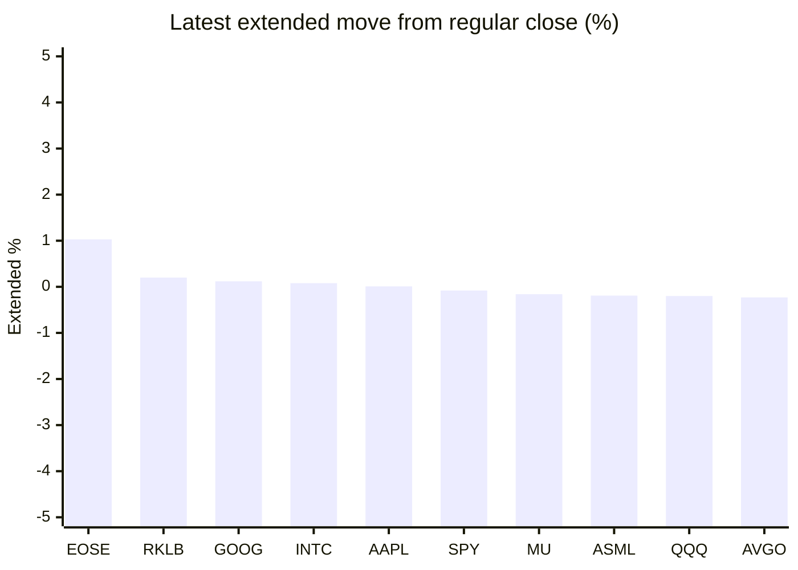

# Stock Brief - 2026-09-07

Generated at 2026-09-07 14:08 +07 from `watchlist.md`.
Prices are snapshots from Yahoo Finance public chart data. Extended/overnight is the latest available pre/post-market datapoint from the same feed.

## Market Snapshot

- SPY: close 770.19, latest extended 769.55, regular move -0.39%, extended move -0.08%
- QQQ: close 718.96, latest extended 717.54, regular move +0.18%, extended move -0.20%
- JEPQ: close 59.87, latest extended 59.72, regular move +0.30%, extended move -0.25%

## Watchlist Prices

| Ticker | Name | Regular close | Latest extended/overnight | Regular move | Extended move | Latest data time | Source |
|---|---|---:|---:|---:|---:|---|---|
| INTC | Intel Corporation | 95.80 USD | 95.88 USD | +4.51% | +0.08% | 2026-09-04 19:59 EDT | [Yahoo](https://finance.yahoo.com/quote/INTC/) |
| AVGO | Broadcom Inc. | 357.90 USD | 357.07 USD | +0.21% | -0.23% | 2026-09-04 19:59 EDT | [Yahoo](https://finance.yahoo.com/quote/AVGO/) |
| RKLB | Rocket Lab Corporation | 64.26 USD | 64.39 USD | +0.71% | +0.20% | 2026-09-04 19:59 EDT | [Yahoo](https://finance.yahoo.com/quote/RKLB/) |
| AAPL | Apple Inc. | 319.97 USD | 320.01 USD | -2.51% | +0.01% | 2026-09-04 19:59 EDT | [Yahoo](https://finance.yahoo.com/quote/AAPL/) |
| NVDA | NVIDIA Corporation | 230.36 USD | 229.50 USD | +0.84% | -0.37% | 2026-09-04 19:59 EDT | [Yahoo](https://finance.yahoo.com/quote/NVDA/) |
| TSLA | Tesla, Inc. | 354.08 USD | 352.89 USD | -5.92% | -0.34% | 2026-09-04 19:59 EDT | [Yahoo](https://finance.yahoo.com/quote/TSLA/) |
| SNDK | Sandisk Corporation | 1,740.00 USD | 1,734.01 USD | +11.90% | -0.34% | 2026-09-04 19:59 EDT | [Yahoo](https://finance.yahoo.com/quote/SNDK/) |
| QQQ | Invesco QQQ Trust, Series 1 | 718.96 USD | 717.54 USD | +0.18% | -0.20% | 2026-09-04 19:59 EDT | [Yahoo](https://finance.yahoo.com/quote/QQQ/) |
| SPY | State Street SPDR S&P 500 ETF T | 770.19 USD | 769.55 USD | -0.39% | -0.08% | 2026-09-04 19:59 EDT | [Yahoo](https://finance.yahoo.com/quote/SPY/) |
| JEPQ | JPMorgan Nasdaq Equity Premium  | 59.87 USD | 59.72 USD | +0.30% | -0.25% | 2026-09-04 19:59 EDT | [Yahoo](https://finance.yahoo.com/quote/JEPQ/) |
| ASTS | AST SpaceMobile, Inc. | 62.31 USD | 62.08 USD | +0.29% | -0.37% | 2026-09-04 19:59 EDT | [Yahoo](https://finance.yahoo.com/quote/ASTS/) |
| MU | Micron Technology, Inc. | 1,016.59 USD | 1,014.95 USD | +6.10% | -0.16% | 2026-09-04 19:59 EDT | [Yahoo](https://finance.yahoo.com/quote/MU/) |
| IREN | IREN LIMITED | 44.68 USD | 44.45 USD | +7.27% | -0.51% | 2026-09-04 19:59 EDT | [Yahoo](https://finance.yahoo.com/quote/IREN/) |
| EOSE | Eos Energy Enterprises, Inc. | 3.88 USD | 3.92 USD | +10.86% | +1.03% | 2026-09-04 19:59 EDT | [Yahoo](https://finance.yahoo.com/quote/EOSE/) |
| GOOG | Alphabet Inc. | 335.31 USD | 335.72 USD | -1.11% | +0.12% | 2026-09-04 19:59 EDT | [Yahoo](https://finance.yahoo.com/quote/GOOG/) |
| DRAM | Roundhill Memory ETF | 59.69 USD | 59.50 USD | +6.61% | -0.32% | 2026-09-04 19:59 EDT | [Yahoo](https://finance.yahoo.com/quote/DRAM/) |
| AMD | Advanced Micro Devices, Inc. | 477.57 USD | 476.25 USD | +4.69% | -0.28% | 2026-09-04 19:59 EDT | [Yahoo](https://finance.yahoo.com/quote/AMD/) |
| ASML | ASML Holding N.V. - New York Re | 1,714.88 USD | 1,711.66 USD | +4.17% | -0.19% | 2026-09-04 19:59 EDT | [Yahoo](https://finance.yahoo.com/quote/ASML/) |

## Charts

### Top Movers - Regular Session

### Extended / Overnight Move

### Quick Heatmap

| Group | Names in watchlist | Avg regular move | Avg extended move |
|---|---|---:|---:|
| Mega-cap tech | AVGO, AAPL, NVDA, TSLA, GOOG | -1.70% | -0.16% |
| Semis / memory | INTC, SNDK, MU, DRAM, AMD, ASML | +6.33% | -0.20% |
| Space / high beta | RKLB, ASTS, IREN, EOSE | +4.78% | +0.09% |
| ETFs | QQQ, SPY, JEPQ | +0.03% | -0.18% |

## News Headlines

- [Here's How Long the Average S&P 500 Bull Market Lasts, According to History. Should Investors Be Nervous?](https://www.fool.com/investing/2026/09/07/heres-how-long-the-average-sp-500-bull-market-last/?.tsrc=rss) (2026-09-07 12:20 Bangkok)
- [Nvidia’s $99 Billion Portfolio Is Turning Intel and CoreWeave Into an AI Stress Test](https://finance.yahoo.com/technology/ai/articles/nvidia-99-billion-portfolio-turning-034218904.html?.tsrc=rss) (2026-09-07 10:42 Bangkok)
- [History Says What Nvidia's Last Big Acquisition Became. Hugging Face Will Cost Nearly Twice as Much.](https://www.fool.com/investing/2026/09/06/history-says-what-nvidia-s-last-big-acquisition-became-hugging-face-will-cost-nearly-twice-as-much/?.tsrc=rss) (2026-09-07 10:38 Bangkok)
- [Dow Jones Futures Fall With Iran, Apple, Inflation In Focus; Nvidia, Micron, Sandisk Flash Buy Signals](https://finance.yahoo.com/m/d5001ca0-1c20-3379-83c3-ddca4526f9c2/dow-jones-futures-fall-with.html?.tsrc=rss) (2026-09-07 10:06 Bangkok)
- [This Vanguard ETF Is Up 27% This Year: Is It Still a Buy for Long-Term Investors?](https://www.fool.com/investing/2026/09/06/vanguard-etf-up-27-this-year-is-it-still-a-buy-for/?.tsrc=rss) (2026-09-07 08:26 Bangkok)
- [Cathie Wood's 2 Biggest Positions Are Both Elon Musk Companies. Together They Are 16% of the Fund.](https://www.fool.com/investing/2026/09/06/cathie-wood-s-2-biggest-positions-are-both-elon-musk-companies-together-they-are-16-of-the-fund/?.tsrc=rss) (2026-09-07 08:24 Bangkok)
- [Nvidia makes staggering $12.9 billion bet to protect AI empire](https://www.thestreet.com/investing/nvidia-hugging-face-acquisition-deal-to-protect-ai-empire?.tsrc=rss) (2026-09-07 07:03 Bangkok)
- [Apple (AAPL) Raises Apple TV and Apple One Prices Again in the U.S.](https://finance.yahoo.com/media-advertising/articles/apple-aapl-raises-apple-tv-224834727.html?.tsrc=rss) (2026-09-07 05:48 Bangkok)

## Caveats

- This is not investment advice. Extended-hours prices can be thin and volatile.
- Yahoo public endpoints may lag official exchange data.
