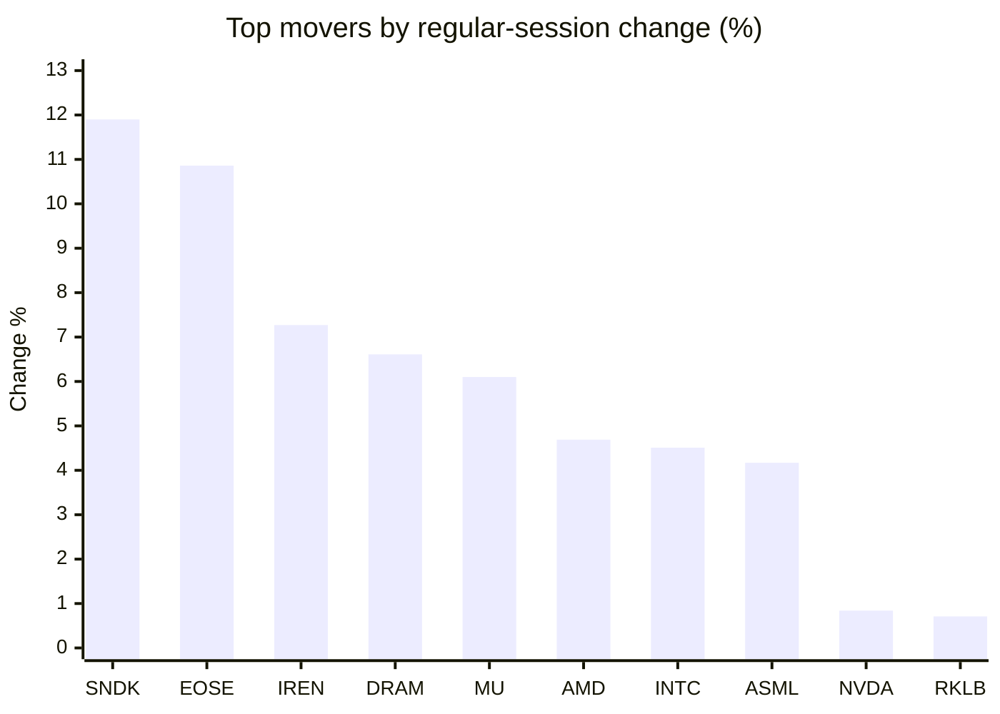
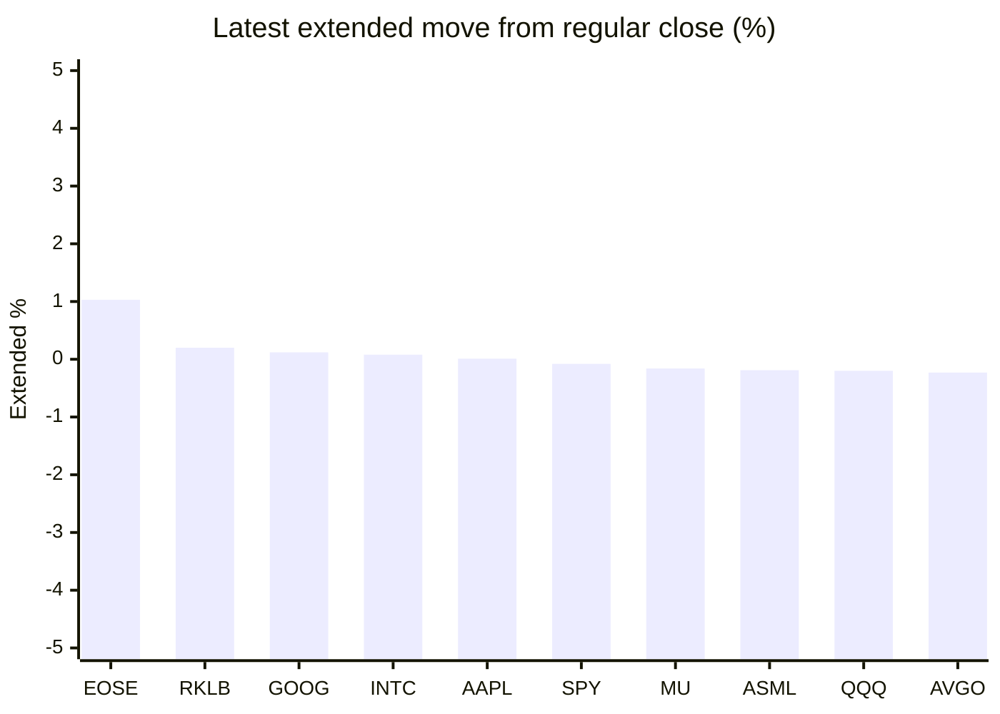

# Stock Brief - 2026-09-08

Generated at 2026-09-08 14:03 +07 from `watchlist.md`.
Prices are snapshots from Yahoo Finance public chart data. Extended/overnight is the latest available pre/post-market datapoint from the same feed.

## Market Snapshot

- SPY: close 770.19, latest extended 769.55, regular move -0.39%, extended move -0.08%
- QQQ: close 718.96, latest extended 717.54, regular move +0.18%, extended move -0.20%
- JEPQ: close 59.87, latest extended 59.72, regular move +0.30%, extended move -0.25%

## Watchlist Prices

| Ticker | Name | Regular close | Latest extended/overnight | Regular move | Extended move | Latest data time | Source |
|---|---|---:|---:|---:|---:|---|---|
| INTC | Intel Corporation | 95.80 USD | 95.88 USD | +4.51% | +0.08% | 2026-09-04 19:59 EDT | [Yahoo](https://finance.yahoo.com/quote/INTC/) |
| AVGO | Broadcom Inc. | 357.90 USD | 357.07 USD | +0.21% | -0.23% | 2026-09-04 19:59 EDT | [Yahoo](https://finance.yahoo.com/quote/AVGO/) |
| RKLB | Rocket Lab Corporation | 64.26 USD | 64.39 USD | +0.71% | +0.20% | 2026-09-04 19:59 EDT | [Yahoo](https://finance.yahoo.com/quote/RKLB/) |
| AAPL | Apple Inc. | 319.97 USD | 320.01 USD | -2.51% | +0.01% | 2026-09-04 19:59 EDT | [Yahoo](https://finance.yahoo.com/quote/AAPL/) |
| NVDA | NVIDIA Corporation | 230.36 USD | 229.50 USD | +0.84% | -0.37% | 2026-09-04 19:59 EDT | [Yahoo](https://finance.yahoo.com/quote/NVDA/) |
| TSLA | Tesla, Inc. | 354.08 USD | 352.89 USD | -5.92% | -0.34% | 2026-09-04 19:59 EDT | [Yahoo](https://finance.yahoo.com/quote/TSLA/) |
| SNDK | Sandisk Corporation | 1,740.00 USD | 1,734.01 USD | +11.90% | -0.34% | 2026-09-04 19:59 EDT | [Yahoo](https://finance.yahoo.com/quote/SNDK/) |
| QQQ | Invesco QQQ Trust, Series 1 | 718.96 USD | 717.54 USD | +0.18% | -0.20% | 2026-09-04 19:59 EDT | [Yahoo](https://finance.yahoo.com/quote/QQQ/) |
| SPY | State Street SPDR S&P 500 ETF T | 770.19 USD | 769.55 USD | -0.39% | -0.08% | 2026-09-04 19:59 EDT | [Yahoo](https://finance.yahoo.com/quote/SPY/) |
| JEPQ | JPMorgan Nasdaq Equity Premium  | 59.87 USD | 59.72 USD | +0.30% | -0.25% | 2026-09-04 19:59 EDT | [Yahoo](https://finance.yahoo.com/quote/JEPQ/) |
| ASTS | AST SpaceMobile, Inc. | 62.31 USD | 62.08 USD | +0.29% | -0.37% | 2026-09-04 19:59 EDT | [Yahoo](https://finance.yahoo.com/quote/ASTS/) |
| MU | Micron Technology, Inc. | 1,016.59 USD | 1,014.95 USD | +6.10% | -0.16% | 2026-09-04 19:59 EDT | [Yahoo](https://finance.yahoo.com/quote/MU/) |
| IREN | IREN LIMITED | 44.68 USD | 44.45 USD | +7.27% | -0.51% | 2026-09-04 19:59 EDT | [Yahoo](https://finance.yahoo.com/quote/IREN/) |
| EOSE | Eos Energy Enterprises, Inc. | 3.88 USD | 3.92 USD | +10.86% | +1.03% | 2026-09-04 19:59 EDT | [Yahoo](https://finance.yahoo.com/quote/EOSE/) |
| GOOG | Alphabet Inc. | 335.31 USD | 335.72 USD | -1.11% | +0.12% | 2026-09-04 19:59 EDT | [Yahoo](https://finance.yahoo.com/quote/GOOG/) |
| DRAM | Roundhill Memory ETF | 59.69 USD | 59.50 USD | +6.61% | -0.32% | 2026-09-04 19:59 EDT | [Yahoo](https://finance.yahoo.com/quote/DRAM/) |
| AMD | Advanced Micro Devices, Inc. | 477.57 USD | 476.25 USD | +4.69% | -0.28% | 2026-09-04 19:59 EDT | [Yahoo](https://finance.yahoo.com/quote/AMD/) |
| ASML | ASML Holding N.V. - New York Re | 1,714.88 USD | 1,711.66 USD | +4.17% | -0.19% | 2026-09-04 19:59 EDT | [Yahoo](https://finance.yahoo.com/quote/ASML/) |

## Charts

### Top Movers - Regular Session

### Extended / Overnight Move

### Quick Heatmap

| Group | Names in watchlist | Avg regular move | Avg extended move |
|---|---|---:|---:|
| Mega-cap tech | AVGO, AAPL, NVDA, TSLA, GOOG | -1.70% | -0.16% |
| Semis / memory | INTC, SNDK, MU, DRAM, AMD, ASML | +6.33% | -0.20% |
| Space / high beta | RKLB, ASTS, IREN, EOSE | +4.78% | +0.09% |
| ETFs | QQQ, SPY, JEPQ | +0.03% | -0.18% |

## News Headlines

- [Could Buying Nvidia Today Set You Up for Life?](https://www.fool.com/investing/2026/09/08/could-buying-nvidia-today-set-you-up-for-life/?.tsrc=rss) (2026-09-08 13:53 Bangkok)
- [Top M&A Deals In September: Nvidia, Dominion Energy, Nextera Energy, Vertiv In Focus](https://stocktwits.com/news-articles/markets/equity/top-m-and-a-deals-in-september-nvidia-dominion-energy-nextera-energy-vertiv-in-focus/cZt3nLIRJxy?.tsrc=rss) (2026-09-08 13:12 Bangkok)
- [INTC Jumps Overnight: Trump Touts Intel Stock In AI-Generated Trading Image, Claims He Made ‘Billions’ For US](https://stocktwits.com/news-articles/markets/equity/intc-jumps-overnight-trump-touts-intel-stock-in-ai-generated-trading-image-claims-he-made-billions-for-us/cZt3ndORJxU?.tsrc=rss) (2026-09-08 13:01 Bangkok)
- [Ross Gerber Recommends Tesla Owners Let TSLA ‘Take The Risk’ In Elon Musk’s Airbnb-Like Robotaxi Program](https://finance.yahoo.com/markets/stocks/articles/ross-gerber-recommends-tesla-owners-053655422.html?.tsrc=rss) (2026-09-08 12:36 Bangkok)
- [NVDA Rises Overnight After Strong Week: CEO Jensen Huang Pumps Nvidia Chips As ‘Highly Rentable’ Money-Minting Assets](https://stocktwits.com/news-articles/markets/equity/nvda-rises-overnight-after-strong-week-ceo-jensen-huang-pumps-nvidia-chips-as-highly-rentable-money-minting-assets/cZt3ZqARJxw?.tsrc=rss) (2026-09-08 12:09 Bangkok)
- [New Study Reveals Strongest State Economies, Only 1 State Was Better Than Texas](https://247wallst.com/investing/2026/07/13/new-study-reveals-strongest-state-economies-only-1-state-was-better-than-texas/?.tsrc=rss) (2026-09-08 10:00 Bangkok)
- [Is a Stock Market Crash Imminent Under President Donald Trump? Here's What History Says Could Come Next.](https://www.fool.com/investing/2026/09/07/is-a-stock-market-crash-imminent-under-president-d/?.tsrc=rss) (2026-09-08 08:50 Bangkok)
- [Intel Foundry and ASML Collaborate to Accelerate Industry Readiness for High NA EUV](https://finance.yahoo.com/technology/articles/intel-foundry-asml-collaborate-accelerate-060300456.html?.tsrc=rss) (2026-09-08 13:03 Bangkok)

## Caveats

- This is not investment advice. Extended-hours prices can be thin and volatile.
- Yahoo public endpoints may lag official exchange data.
