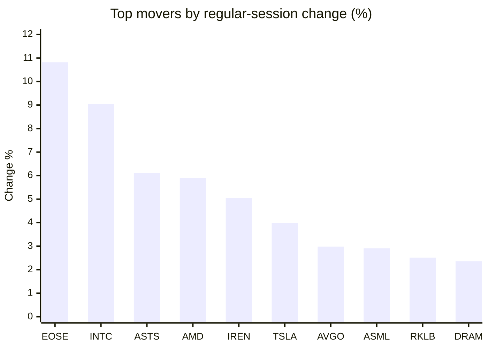
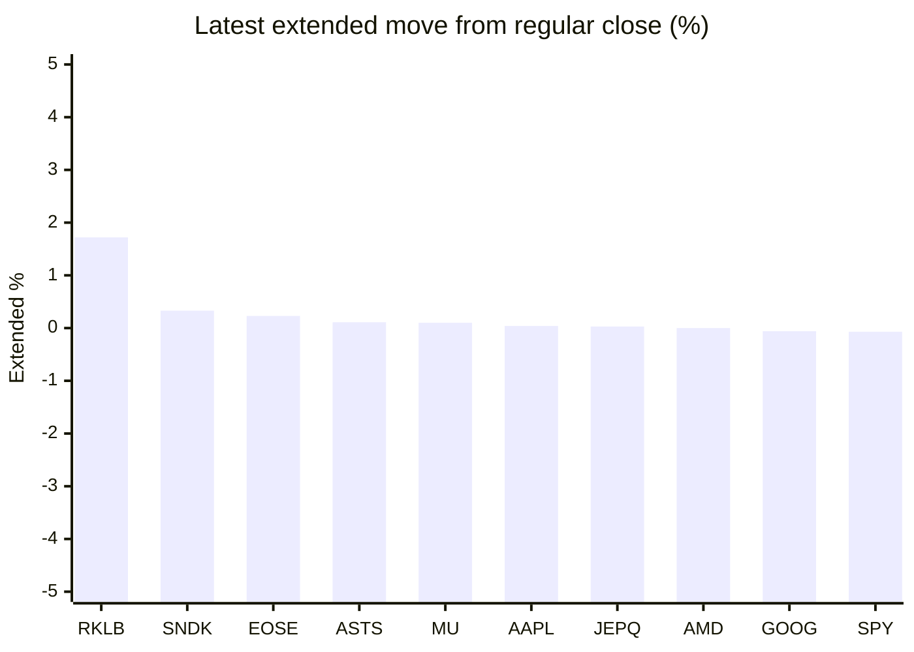

# Stock Brief - 2026-09-09

Generated at 2026-09-09 14:12 +07 from `watchlist.md`.
Prices are snapshots from Yahoo Finance public chart data. Extended/overnight is the latest available pre/post-market datapoint from the same feed.

## Market Snapshot

- SPY: close 765.96, latest extended 765.41, regular move -0.55%, extended move -0.07%
- QQQ: close 718.36, latest extended 717.42, regular move -0.08%, extended move -0.13%
- JEPQ: close 59.85, latest extended 59.87, regular move -0.03%, extended move +0.03%

## Watchlist Prices

| Ticker | Name | Regular close | Latest extended/overnight | Regular move | Extended move | Latest data time | Source |
|---|---|---:|---:|---:|---:|---|---|
| INTC | Intel Corporation | 104.47 USD | 104.03 USD | +9.05% | -0.42% | 2026-09-08 19:59 EDT | [Yahoo](https://finance.yahoo.com/quote/INTC/) |
| AVGO | Broadcom Inc. | 368.56 USD | 366.50 USD | +2.98% | -0.56% | 2026-09-08 19:59 EDT | [Yahoo](https://finance.yahoo.com/quote/AVGO/) |
| RKLB | Rocket Lab Corporation | 65.87 USD | 67.00 USD | +2.51% | +1.72% | 2026-09-08 19:59 EDT | [Yahoo](https://finance.yahoo.com/quote/RKLB/) |
| AAPL | Apple Inc. | 316.22 USD | 316.34 USD | -1.17% | +0.04% | 2026-09-08 19:59 EDT | [Yahoo](https://finance.yahoo.com/quote/AAPL/) |
| NVDA | NVIDIA Corporation | 225.73 USD | 225.31 USD | -2.01% | -0.19% | 2026-09-08 19:59 EDT | [Yahoo](https://finance.yahoo.com/quote/NVDA/) |
| TSLA | Tesla, Inc. | 368.16 USD | 366.65 USD | +3.98% | -0.41% | 2026-09-08 19:59 EDT | [Yahoo](https://finance.yahoo.com/quote/TSLA/) |
| SNDK | Sandisk Corporation | 1,737.99 USD | 1,743.68 USD | -0.12% | +0.33% | 2026-09-08 19:59 EDT | [Yahoo](https://finance.yahoo.com/quote/SNDK/) |
| QQQ | Invesco QQQ Trust, Series 1 | 718.36 USD | 717.42 USD | -0.08% | -0.13% | 2026-09-08 19:59 EDT | [Yahoo](https://finance.yahoo.com/quote/QQQ/) |
| SPY | State Street SPDR S&P 500 ETF T | 765.96 USD | 765.41 USD | -0.55% | -0.07% | 2026-09-08 19:59 EDT | [Yahoo](https://finance.yahoo.com/quote/SPY/) |
| JEPQ | JPMorgan Nasdaq Equity Premium  | 59.85 USD | 59.87 USD | -0.03% | +0.03% | 2026-09-08 19:58 EDT | [Yahoo](https://finance.yahoo.com/quote/JEPQ/) |
| ASTS | AST SpaceMobile, Inc. | 66.12 USD | 66.19 USD | +6.11% | +0.11% | 2026-09-08 19:59 EDT | [Yahoo](https://finance.yahoo.com/quote/ASTS/) |
| MU | Micron Technology, Inc. | 1,000.26 USD | 1,001.31 USD | -1.61% | +0.10% | 2026-09-08 19:59 EDT | [Yahoo](https://finance.yahoo.com/quote/MU/) |
| IREN | IREN LIMITED | 46.93 USD | 46.68 USD | +5.04% | -0.53% | 2026-09-08 19:58 EDT | [Yahoo](https://finance.yahoo.com/quote/IREN/) |
| EOSE | Eos Energy Enterprises, Inc. | 4.30 USD | 4.31 USD | +10.82% | +0.23% | 2026-09-08 19:56 EDT | [Yahoo](https://finance.yahoo.com/quote/EOSE/) |
| GOOG | Alphabet Inc. | 335.38 USD | 335.17 USD | +0.02% | -0.06% | 2026-09-08 19:59 EDT | [Yahoo](https://finance.yahoo.com/quote/GOOG/) |
| DRAM | Roundhill Memory ETF | 61.10 USD | 60.74 USD | +2.36% | -0.59% | 2026-09-08 19:59 EDT | [Yahoo](https://finance.yahoo.com/quote/DRAM/) |
| AMD | Advanced Micro Devices, Inc. | 505.74 USD | 505.72 USD | +5.90% | -0.00% | 2026-09-08 19:59 EDT | [Yahoo](https://finance.yahoo.com/quote/AMD/) |
| ASML | ASML Holding N.V. - New York Re | 1,764.85 USD | 1,762.06 USD | +2.91% | -0.16% | 2026-09-08 19:58 EDT | [Yahoo](https://finance.yahoo.com/quote/ASML/) |

## Charts

### Top Movers - Regular Session

### Extended / Overnight Move

### Quick Heatmap

| Group | Names in watchlist | Avg regular move | Avg extended move |
|---|---|---:|---:|
| Mega-cap tech | AVGO, AAPL, NVDA, TSLA, GOOG | +0.76% | -0.24% |
| Semis / memory | INTC, SNDK, MU, DRAM, AMD, ASML | +3.08% | -0.12% |
| Space / high beta | RKLB, ASTS, IREN, EOSE | +6.12% | +0.38% |
| ETFs | QQQ, SPY, JEPQ | -0.22% | -0.06% |

## News Headlines

- [Stock Market: Will S&P 500 Open Up or Down Today?](https://www.benzinga.com/markets/prediction-markets/26/09/61676904/stock-market-will-sp-500-open-up-or-down-today-33?utm_source=yahooFinance&utm_campaign=partner_feed&utm_medium=referral&.tsrc=rss) (2026-09-09 12:48 Bangkok)
- [Jim Chanos Questions Nvidia’s AI Chip Economics After Jensen Huang Says Nvidia Chips Are 'Highly Rentable'](https://stocktwits.com/news-articles/markets/equity/jim-chanos-questions-nvidia-s-ai-chip-economics-after-jensen-huang-says-nvidia-chips-are-highly-rentable/cZtets3RJyF?.tsrc=rss) (2026-09-09 12:43 Bangkok)
- [RKLB Stock Extends Gains Overnight: Cathie Wood’s ARK Adds To Rocket Lab Stake On New Space Solar Catalyst](https://stocktwits.com/news-articles/markets/equity/rklb-stock-cathie-wood-ark-stake-new-space-solar-catalyst/cZtets5RJyn?.tsrc=rss) (2026-09-09 12:43 Bangkok)
- [Reliance Digital's #TakeTheFirstBite Returns with Reimagined "Mr. iSeek New Phone"](https://finance.yahoo.com/media-advertising/articles/reliance-digitals-takethefirstbite-returns-reimagined-054200941.html?.tsrc=rss) (2026-09-09 12:42 Bangkok)
- [SpaceX, Nvidia Lead Schwab Buys As Software Rally Spurs Profit-Taking – Trading Gauge Posts First Dip Since April](https://stocktwits.com/news-articles/markets/equity/spacex-nvidia-schwab-buys-software-rally-profit-taking-trading-gauge-first-dip-april/cZtetQiRJyZ?.tsrc=rss) (2026-09-09 12:27 Bangkok)
- [Apple Might Be Planning to 'Surprise and Shine' at iPhone 18 Launch Event, but Crypto Bettors Are Already Betting on Foldables and More](https://www.benzinga.com/markets/prediction-markets/26/09/61676659/apple-iphone-18-surprise-and-shine-launch-crypto-bettors-foldable-iphone-bets?utm_source=yahooFinance&utm_campaign=partner_feed&utm_medium=referral&.tsrc=rss) (2026-09-09 11:36 Bangkok)
- [Jensen Huang's AI Capex Pulse Check](https://www.fool.com/investing/2026/09/08/jensen-huangs-ai-capex-pulse-check/?.tsrc=rss) (2026-09-09 11:13 Bangkok)
- [Nvidia Earnings Blow Everyone Away](https://www.fool.com/investing/2026/09/08/nvidia-earnings-blow-everyone-away/?.tsrc=rss) (2026-09-09 10:55 Bangkok)

## Caveats

- This is not investment advice. Extended-hours prices can be thin and volatile.
- Yahoo public endpoints may lag official exchange data.
