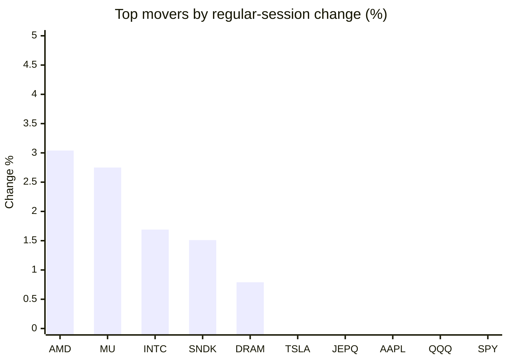
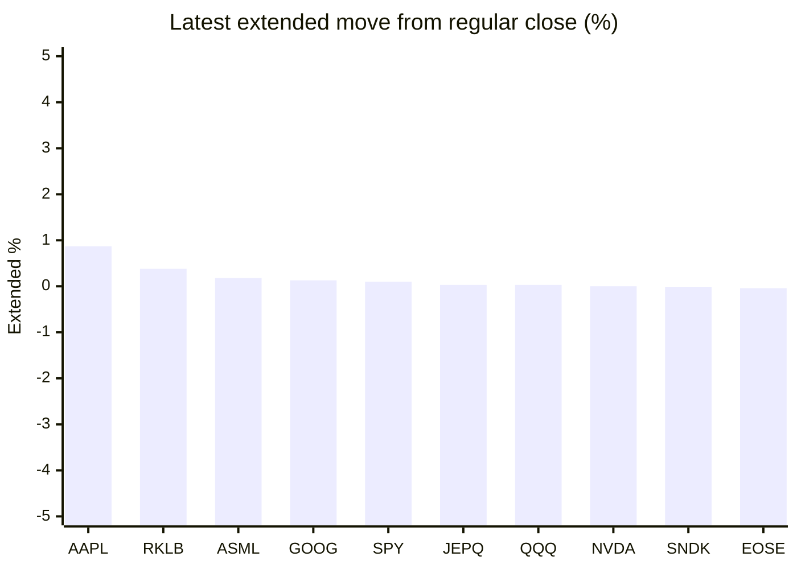

# Stock Brief - 2026-09-10

Generated at 2026-09-10 14:08 +07 from `watchlist.md`.
Prices are snapshots from Yahoo Finance public chart data. Extended/overnight is the latest available pre/post-market datapoint from the same feed.

## Market Snapshot

- SPY: close 762.40, latest extended 763.14, regular move -0.46%, extended move +0.10%
- QQQ: close 716.31, latest extended 716.49, regular move -0.29%, extended move +0.03%
- JEPQ: close 59.78, latest extended 59.80, regular move -0.12%, extended move +0.03%

## Watchlist Prices

| Ticker | Name | Regular close | Latest extended/overnight | Regular move | Extended move | Latest data time | Source |
|---|---|---:|---:|---:|---:|---|---|
| INTC | Intel Corporation | 106.24 USD | 105.58 USD | +1.69% | -0.62% | 2026-09-09 19:59 EDT | [Yahoo](https://finance.yahoo.com/quote/INTC/) |
| AVGO | Broadcom Inc. | 364.38 USD | 364.00 USD | -1.13% | -0.10% | 2026-09-09 19:59 EDT | [Yahoo](https://finance.yahoo.com/quote/AVGO/) |
| RKLB | Rocket Lab Corporation | 63.07 USD | 63.31 USD | -4.25% | +0.38% | 2026-09-09 19:59 EDT | [Yahoo](https://finance.yahoo.com/quote/RKLB/) |
| AAPL | Apple Inc. | 315.34 USD | 318.10 USD | -0.28% | +0.87% | 2026-09-09 19:59 EDT | [Yahoo](https://finance.yahoo.com/quote/AAPL/) |
| NVDA | NVIDIA Corporation | 223.67 USD | 223.67 USD | -0.91% | -0.00% | 2026-09-09 19:59 EDT | [Yahoo](https://finance.yahoo.com/quote/NVDA/) |
| TSLA | Tesla, Inc. | 367.81 USD | 367.22 USD | -0.10% | -0.16% | 2026-09-09 19:59 EDT | [Yahoo](https://finance.yahoo.com/quote/TSLA/) |
| SNDK | Sandisk Corporation | 1,764.17 USD | 1,763.99 USD | +1.51% | -0.01% | 2026-09-09 19:59 EDT | [Yahoo](https://finance.yahoo.com/quote/SNDK/) |
| QQQ | Invesco QQQ Trust, Series 1 | 716.31 USD | 716.49 USD | -0.29% | +0.03% | 2026-09-09 19:59 EDT | [Yahoo](https://finance.yahoo.com/quote/QQQ/) |
| SPY | State Street SPDR S&P 500 ETF T | 762.40 USD | 763.14 USD | -0.46% | +0.10% | 2026-09-09 19:59 EDT | [Yahoo](https://finance.yahoo.com/quote/SPY/) |
| JEPQ | JPMorgan Nasdaq Equity Premium  | 59.78 USD | 59.80 USD | -0.12% | +0.03% | 2026-09-09 19:58 EDT | [Yahoo](https://finance.yahoo.com/quote/JEPQ/) |
| ASTS | AST SpaceMobile, Inc. | 62.42 USD | 62.30 USD | -5.60% | -0.19% | 2026-09-09 19:59 EDT | [Yahoo](https://finance.yahoo.com/quote/ASTS/) |
| MU | Micron Technology, Inc. | 1,027.77 USD | 1,026.15 USD | +2.75% | -0.16% | 2026-09-09 19:59 EDT | [Yahoo](https://finance.yahoo.com/quote/MU/) |
| IREN | IREN LIMITED | 45.37 USD | 45.22 USD | -3.32% | -0.33% | 2026-09-09 19:59 EDT | [Yahoo](https://finance.yahoo.com/quote/IREN/) |
| EOSE | Eos Energy Enterprises, Inc. | 4.15 USD | 4.15 USD | -3.49% | -0.04% | 2026-09-09 19:58 EDT | [Yahoo](https://finance.yahoo.com/quote/EOSE/) |
| GOOG | Alphabet Inc. | 328.38 USD | 328.80 USD | -2.09% | +0.13% | 2026-09-09 19:59 EDT | [Yahoo](https://finance.yahoo.com/quote/GOOG/) |
| DRAM | Roundhill Memory ETF | 61.58 USD | 61.43 USD | +0.79% | -0.25% | 2026-09-09 19:59 EDT | [Yahoo](https://finance.yahoo.com/quote/DRAM/) |
| AMD | Advanced Micro Devices, Inc. | 521.10 USD | 520.55 USD | +3.04% | -0.11% | 2026-09-09 19:59 EDT | [Yahoo](https://finance.yahoo.com/quote/AMD/) |
| ASML | ASML Holding N.V. - New York Re | 1,729.52 USD | 1,732.61 USD | -2.00% | +0.18% | 2026-09-09 19:59 EDT | [Yahoo](https://finance.yahoo.com/quote/ASML/) |

## Charts

### Top Movers - Regular Session

### Extended / Overnight Move

### Quick Heatmap

| Group | Names in watchlist | Avg regular move | Avg extended move |
|---|---|---:|---:|
| Mega-cap tech | AVGO, AAPL, NVDA, TSLA, GOOG | -0.90% | +0.15% |
| Semis / memory | INTC, SNDK, MU, DRAM, AMD, ASML | +1.30% | -0.16% |
| Space / high beta | RKLB, ASTS, IREN, EOSE | -4.16% | -0.04% |
| ETFs | QQQ, SPY, JEPQ | -0.29% | +0.05% |

## News Headlines

- [Here's How Much Money You Would Have Today If You Had Invested $10,000 in Apple Stock 10 Years Ago](https://www.fool.com/investing/2026/09/10/heres-how-much-money-you-would-have-today-if-you-h/?.tsrc=rss) (2026-09-10 13:02 Bangkok)
- [RKLB, ASTS, SPCX, PL In Focus: New Trump Task Force Targets 10,000 Annual Space Operations By 2035](https://stocktwits.com/news-articles/markets/equity/rklb-asts-spcx-pl-trump-task-force-10000-annual-space-operations-2035/cZt96DQRJCf?.tsrc=rss) (2026-09-10 12:42 Bangkok)
- [Tesla, Rivian In For A Rough Ride? Senator Warns Trump Could Let Chinese EV Makers Into America Under Xi Deal](https://stocktwits.com/news-articles/markets/equity/tesla-rivian-senator-trump-chinese-ev-america-xi-deal/cZt96PuRJCO?.tsrc=rss) (2026-09-10 12:12 Bangkok)
- [Intel stock surges 9% as surprising turnaround takes shape](https://www.thestreet.com/investing/stocks/intel-stock-surges-9-as-surprising-turnaround-takes-shape?.tsrc=rss) (2026-09-10 11:24 Bangkok)
- [TSLA Critic Gordon Johnson Rips Cybercab Launch After Elon Musk's ‘Storm of Cybercabs’ Promise: ‘The Robotaxi Story Was Never About Robotaxis'](https://finance.yahoo.com/markets/stocks/articles/tsla-critic-gordon-johnson-rips-033022550.html?.tsrc=rss) (2026-09-10 10:30 Bangkok)
- [Broadcom Is 26% Below Its High. What $10,000 Bought a Decade Ago, and When the Gains Landed.](https://www.fool.com/investing/2026/09/09/broadcom-is-26-below-its-high-what-usd10-000-bought-a-decade-ago-and-when-the-gains-landed/?.tsrc=rss) (2026-09-10 09:54 Bangkok)
- [I Tried Apple’s First Folding iPhone. Here Are 3 Takeaways.](https://finance.yahoo.com/video/tried-apple-first-folding-iphone-024400139.html?.tsrc=rss) (2026-09-10 09:44 Bangkok)
- [Gene Munster Says Apple Regained 'Device Design Mojo' With $1,999 iPhone Duo: 'They're Going to Sell More Than I Thought'](https://finance.yahoo.com/markets/stocks/articles/gene-munster-says-apple-regained-020629840.html?.tsrc=rss) (2026-09-10 09:06 Bangkok)

## Caveats

- This is not investment advice. Extended-hours prices can be thin and volatile.
- Yahoo public endpoints may lag official exchange data.
