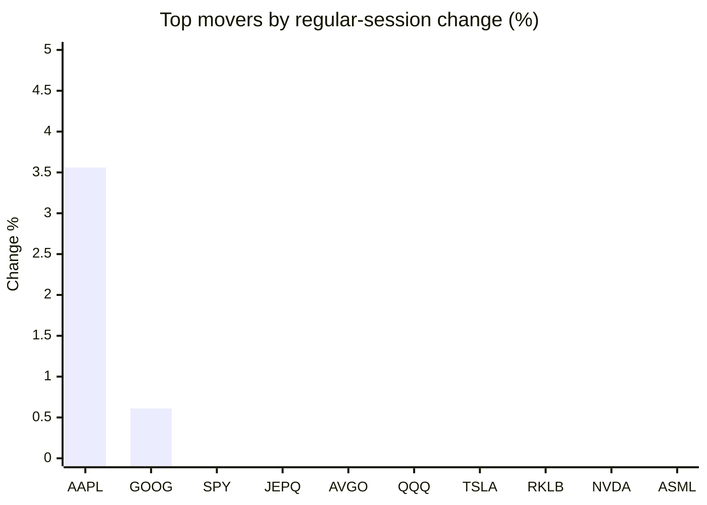
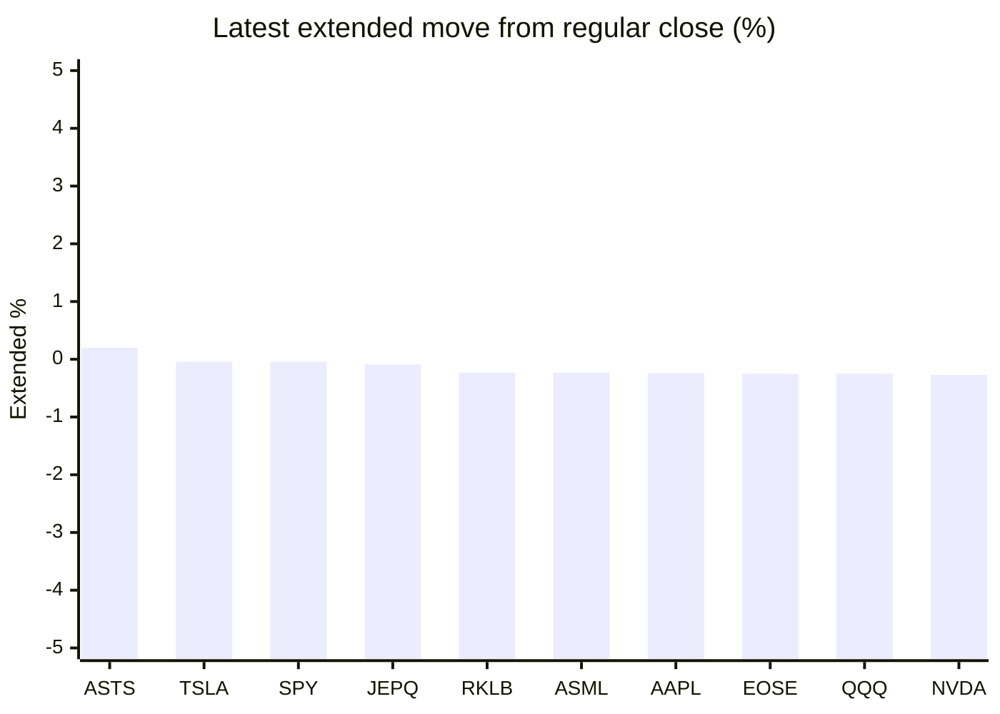

# Stock Brief - 2026-09-11

Generated at 2026-09-11 14:07 +07 from `watchlist.md`.
Prices are snapshots from Yahoo Finance public chart data. Extended/overnight is the latest available pre/post-market datapoint from the same feed.

## Market Snapshot

- SPY: close 757.83, latest extended 757.53, regular move -0.60%, extended move -0.04%
- QQQ: close 708.69, latest extended 706.90, regular move -1.06%, extended move -0.25%
- JEPQ: close 59.30, latest extended 59.25, regular move -0.80%, extended move -0.09%

## Watchlist Prices

| Ticker | Name | Regular close | Latest extended/overnight | Regular move | Extended move | Latest data time | Source |
|---|---|---:|---:|---:|---:|---|---|
| INTC | Intel Corporation | 100.32 USD | 99.18 USD | -5.57% | -1.14% | 2026-09-10 19:59 EDT | [Yahoo](https://finance.yahoo.com/quote/INTC/) |
| AVGO | Broadcom Inc. | 360.83 USD | 359.43 USD | -0.97% | -0.39% | 2026-09-10 19:59 EDT | [Yahoo](https://finance.yahoo.com/quote/AVGO/) |
| RKLB | Rocket Lab Corporation | 61.96 USD | 61.82 USD | -1.76% | -0.23% | 2026-09-10 19:59 EDT | [Yahoo](https://finance.yahoo.com/quote/RKLB/) |
| AAPL | Apple Inc. | 326.57 USD | 325.80 USD | +3.56% | -0.24% | 2026-09-10 19:59 EDT | [Yahoo](https://finance.yahoo.com/quote/AAPL/) |
| NVDA | NVIDIA Corporation | 218.36 USD | 217.76 USD | -2.37% | -0.27% | 2026-09-10 19:59 EDT | [Yahoo](https://finance.yahoo.com/quote/NVDA/) |
| TSLA | Tesla, Inc. | 363.56 USD | 363.42 USD | -1.16% | -0.04% | 2026-09-10 19:59 EDT | [Yahoo](https://finance.yahoo.com/quote/TSLA/) |
| SNDK | Sandisk Corporation | 1,692.59 USD | 1,676.81 USD | -4.06% | -0.93% | 2026-09-10 19:59 EDT | [Yahoo](https://finance.yahoo.com/quote/SNDK/) |
| QQQ | Invesco QQQ Trust, Series 1 | 708.69 USD | 706.90 USD | -1.06% | -0.25% | 2026-09-10 20:00 EDT | [Yahoo](https://finance.yahoo.com/quote/QQQ/) |
| SPY | State Street SPDR S&P 500 ETF T | 757.83 USD | 757.53 USD | -0.60% | -0.04% | 2026-09-10 19:59 EDT | [Yahoo](https://finance.yahoo.com/quote/SPY/) |
| JEPQ | JPMorgan Nasdaq Equity Premium  | 59.30 USD | 59.25 USD | -0.80% | -0.09% | 2026-09-10 19:59 EDT | [Yahoo](https://finance.yahoo.com/quote/JEPQ/) |
| ASTS | AST SpaceMobile, Inc. | 59.91 USD | 60.03 USD | -4.02% | +0.20% | 2026-09-10 19:59 EDT | [Yahoo](https://finance.yahoo.com/quote/ASTS/) |
| MU | Micron Technology, Inc. | 977.41 USD | 971.40 USD | -4.90% | -0.61% | 2026-09-10 19:59 EDT | [Yahoo](https://finance.yahoo.com/quote/MU/) |
| IREN | IREN LIMITED | 43.64 USD | 43.37 USD | -3.81% | -0.62% | 2026-09-10 19:59 EDT | [Yahoo](https://finance.yahoo.com/quote/IREN/) |
| EOSE | Eos Energy Enterprises, Inc. | 3.99 USD | 3.98 USD | -3.86% | -0.25% | 2026-09-10 19:57 EDT | [Yahoo](https://finance.yahoo.com/quote/EOSE/) |
| GOOG | Alphabet Inc. | 330.39 USD | 328.94 USD | +0.61% | -0.44% | 2026-09-10 19:59 EDT | [Yahoo](https://finance.yahoo.com/quote/GOOG/) |
| DRAM | Roundhill Memory ETF | 58.56 USD | 58.10 USD | -4.90% | -0.79% | 2026-09-10 19:59 EDT | [Yahoo](https://finance.yahoo.com/quote/DRAM/) |
| AMD | Advanced Micro Devices, Inc. | 503.60 USD | 502.02 USD | -3.36% | -0.31% | 2026-09-10 19:59 EDT | [Yahoo](https://finance.yahoo.com/quote/AMD/) |
| ASML | ASML Holding N.V. - New York Re | 1,687.43 USD | 1,683.55 USD | -2.43% | -0.23% | 2026-09-10 19:59 EDT | [Yahoo](https://finance.yahoo.com/quote/ASML/) |

## Charts

### Top Movers - Regular Session

### Extended / Overnight Move

### Quick Heatmap

| Group | Names in watchlist | Avg regular move | Avg extended move |
|---|---|---:|---:|
| Mega-cap tech | AVGO, AAPL, NVDA, TSLA, GOOG | -0.07% | -0.28% |
| Semis / memory | INTC, SNDK, MU, DRAM, AMD, ASML | -4.20% | -0.67% |
| Space / high beta | RKLB, ASTS, IREN, EOSE | -3.36% | -0.22% |
| ETFs | QQQ, SPY, JEPQ | -0.82% | -0.13% |

## News Headlines

- [3 High-Yield Energy Stocks to Buy in September](https://www.fool.com/investing/2026/09/11/3-high-yield-energy-stocks-to-buy-in-september/?.tsrc=rss) (2026-09-11 13:50 Bangkok)
- [OY Labs achieves a leading ARC-AGI-3 public score in its mission to build the world’s smartest AI](https://finance.yahoo.com/technology/ai/articles/oy-labs-achieves-leading-arc-060000947.html?.tsrc=rss) (2026-09-11 13:00 Bangkok)
- [Amazon Triples Its NVIDIA GPU Orders to 3 Million Chips as AI Demand Surges](https://finance.yahoo.com/technology/ai/articles/amazon-triples-nvidia-gpu-orders-050739503.html?.tsrc=rss) (2026-09-11 12:07 Bangkok)
- [Why Micron Stock Just Sank](https://www.fool.com/investing/2026/09/11/why-micron-stock-just-sank/?.tsrc=rss) (2026-09-11 11:54 Bangkok)
- [Rocket Lab Successfully Launches 16th Electron Mission Of The Year, Solidifies Status as World’s Leading Small Launch Provider](https://finance.yahoo.com/technology/articles/rocket-lab-successfully-launches-16th-044300963.html?.tsrc=rss) (2026-09-11 11:43 Bangkok)
- [Crypto Billionaire Finds iPhone Duo Pretty 'Good' For Gawking at  Financial Charts — Crypto Prediction Market is Already Betting on The Next Big Apple Gadget](https://www.benzinga.com/markets/prediction-markets/26/09/61731289/crypto-billionaire-iphone-duo-financial-charts-apple-gadget-prediction-market?utm_source=yahooFinance&utm_campaign=partner_feed&utm_medium=referral&.tsrc=rss) (2026-09-11 11:35 Bangkok)
- [Nvidia's Chinese Rival Enflame Soars Over 220% in Shanghai Debut As Investors Bet on Domestic AI Chips](https://finance.yahoo.com/markets/stocks/articles/nvidias-chinese-rival-enflame-soars-042513577.html?.tsrc=rss) (2026-09-11 11:25 Bangkok)
- [Rocket Lab CEO Warns ‘Piping Hot’ AI And Space Trades Could 'Go Pop' As SpaceX-Fueled Mania Sends Valuations Soaring](https://stocktwits.com/news-articles/markets/equity/rocketlab-ceo-ai-space-trades-go-pop-spacex-mania-valuations-soaring/cZtX5I4RBGG?.tsrc=rss) (2026-09-11 10:56 Bangkok)

## Caveats

- This is not investment advice. Extended-hours prices can be thin and volatile.
- Yahoo public endpoints may lag official exchange data.
