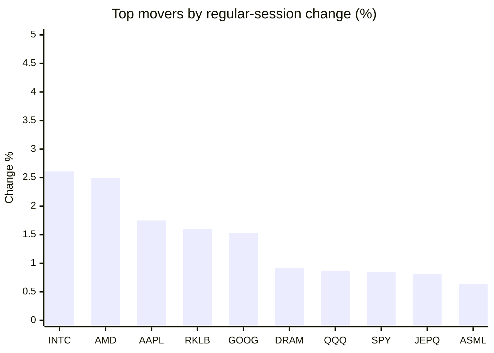
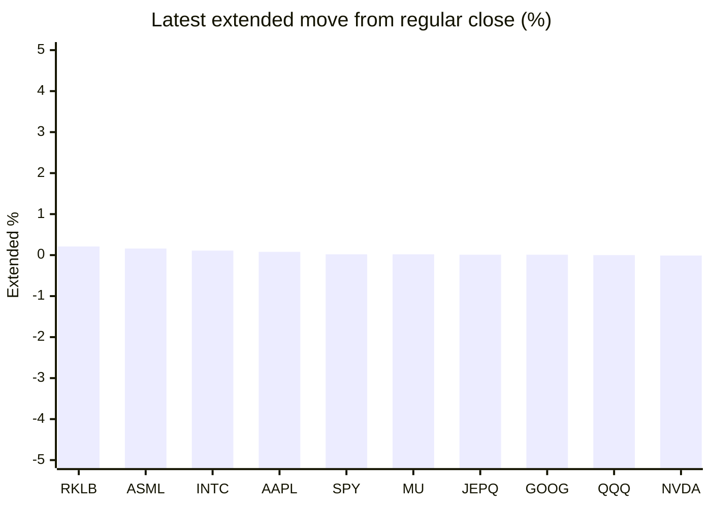

# Stock Brief - 2026-09-13

Generated at 2026-09-13 14:18 +07 from `watchlist.md`.
Prices are snapshots from Yahoo Finance public chart data. Extended/overnight is the latest available pre/post-market datapoint from the same feed.

## Market Snapshot

- SPY: close 764.29, latest extended 764.48, regular move +0.85%, extended move +0.02%
- QQQ: close 714.88, latest extended 714.89, regular move +0.87%, extended move +0.00%
- JEPQ: close 59.78, latest extended 59.79, regular move +0.81%, extended move +0.01%

## Watchlist Prices

| Ticker | Name | Regular close | Latest extended/overnight | Regular move | Extended move | Latest data time | Source |
|---|---|---:|---:|---:|---:|---|---|
| INTC | Intel Corporation | 102.94 USD | 103.05 USD | +2.61% | +0.11% | 2026-09-11 19:59 EDT | [Yahoo](https://finance.yahoo.com/quote/INTC/) |
| AVGO | Broadcom Inc. | 361.99 USD | 361.74 USD | +0.32% | -0.07% | 2026-09-11 19:59 EDT | [Yahoo](https://finance.yahoo.com/quote/AVGO/) |
| RKLB | Rocket Lab Corporation | 62.95 USD | 63.08 USD | +1.60% | +0.21% | 2026-09-11 19:59 EDT | [Yahoo](https://finance.yahoo.com/quote/RKLB/) |
| AAPL | Apple Inc. | 332.27 USD | 332.55 USD | +1.75% | +0.08% | 2026-09-11 19:59 EDT | [Yahoo](https://finance.yahoo.com/quote/AAPL/) |
| NVDA | NVIDIA Corporation | 218.29 USD | 218.26 USD | -0.03% | -0.01% | 2026-09-11 19:59 EDT | [Yahoo](https://finance.yahoo.com/quote/NVDA/) |
| TSLA | Tesla, Inc. | 365.44 USD | 365.25 USD | +0.52% | -0.05% | 2026-09-11 19:59 EDT | [Yahoo](https://finance.yahoo.com/quote/TSLA/) |
| SNDK | Sandisk Corporation | 1,633.35 USD | 1,631.08 USD | -3.50% | -0.14% | 2026-09-11 19:59 EDT | [Yahoo](https://finance.yahoo.com/quote/SNDK/) |
| QQQ | Invesco QQQ Trust, Series 1 | 714.88 USD | 714.89 USD | +0.87% | +0.00% | 2026-09-11 19:59 EDT | [Yahoo](https://finance.yahoo.com/quote/QQQ/) |
| SPY | State Street SPDR S&P 500 ETF T | 764.29 USD | 764.48 USD | +0.85% | +0.02% | 2026-09-11 19:59 EDT | [Yahoo](https://finance.yahoo.com/quote/SPY/) |
| JEPQ | JPMorgan Nasdaq Equity Premium  | 59.78 USD | 59.79 USD | +0.81% | +0.01% | 2026-09-11 19:58 EDT | [Yahoo](https://finance.yahoo.com/quote/JEPQ/) |
| ASTS | AST SpaceMobile, Inc. | 59.86 USD | 59.73 USD | -0.08% | -0.21% | 2026-09-11 19:59 EDT | [Yahoo](https://finance.yahoo.com/quote/ASTS/) |
| MU | Micron Technology, Inc. | 975.26 USD | 975.45 USD | -0.22% | +0.02% | 2026-09-11 19:59 EDT | [Yahoo](https://finance.yahoo.com/quote/MU/) |
| IREN | IREN LIMITED | 43.83 USD | 43.78 USD | +0.44% | -0.11% | 2026-09-11 19:59 EDT | [Yahoo](https://finance.yahoo.com/quote/IREN/) |
| EOSE | Eos Energy Enterprises, Inc. | 3.95 USD | 3.92 USD | -1.00% | -0.76% | 2026-09-11 19:58 EDT | [Yahoo](https://finance.yahoo.com/quote/EOSE/) |
| GOOG | Alphabet Inc. | 335.45 USD | 335.47 USD | +1.53% | +0.01% | 2026-09-11 19:59 EDT | [Yahoo](https://finance.yahoo.com/quote/GOOG/) |
| DRAM | Roundhill Memory ETF | 59.10 USD | 58.97 USD | +0.92% | -0.22% | 2026-09-11 19:59 EDT | [Yahoo](https://finance.yahoo.com/quote/DRAM/) |
| AMD | Advanced Micro Devices, Inc. | 516.13 USD | 515.78 USD | +2.49% | -0.07% | 2026-09-11 19:59 EDT | [Yahoo](https://finance.yahoo.com/quote/AMD/) |
| ASML | ASML Holding N.V. - New York Re | 1,698.30 USD | 1,701.00 USD | +0.64% | +0.16% | 2026-09-11 19:59 EDT | [Yahoo](https://finance.yahoo.com/quote/ASML/) |

## Charts

### Top Movers - Regular Session

### Extended / Overnight Move

### Quick Heatmap

| Group | Names in watchlist | Avg regular move | Avg extended move |
|---|---|---:|---:|
| Mega-cap tech | AVGO, AAPL, NVDA, TSLA, GOOG | +0.82% | -0.01% |
| Semis / memory | INTC, SNDK, MU, DRAM, AMD, ASML | +0.49% | -0.02% |
| Space / high beta | RKLB, ASTS, IREN, EOSE | +0.24% | -0.22% |
| ETFs | QQQ, SPY, JEPQ | +0.85% | +0.01% |

## News Headlines

- [Oracle's AI Chips Ran 97.9% Utilized Last Quarter. For Nvidia, That Is What a Shortage Looks Like.](https://www.fool.com/investing/2026/09/12/oracle-s-ai-chips-ran-97-9-utilized-last-quarter-for-nvidia-that-is-what-a-shortage-looks-like/?.tsrc=rss) (2026-09-13 10:38 Bangkok)
- [DeepSeek Cut Its KV-Cache HBM Need 75% and SSD Need 87.5%. Micron and Sandisk Investors Should Pay Attention](https://finance.yahoo.com/technology/ai/articles/deepseek-cut-kv-cache-hbm-011603128.html?.tsrc=rss) (2026-09-13 08:16 Bangkok)
- [You Can’t Spell SPY Without AI: How the Stock Market Became a 1-Way Bet on the Future](https://www.barchart.com/story/news/4576680/you-cant-spell-spy-without-ai-how-the-stock-market-became-a-1-way-bet-on-the-future?.tsrc=rss) (2026-09-13 08:00 Bangkok)
- [Forget the S&P 500: 3 Unloved Parts of the Market Are Winning in 2026 and These Vanguard ETFs Own Them Cheap](https://247wallst.com/investing/etf/2026/09/12/forget-the-sp-500-3-unloved-parts-of-the-market-are-winning-in-2026-and-these-vanguard-etfs-own-them-cheap/?.tsrc=rss) (2026-09-13 07:38 Bangkok)
- [SCHD's Stunning Reversal: Schwab's Flagship Dividend ETF Is Up 29% and Climbing](https://www.fool.com/investing/2026/09/13/schds-stunning-reversal-schwabs-flagship-dividend/?.tsrc=rss) (2026-09-13 13:50 Bangkok)
- [Is Kroger a Buy After Its Latest Earnings Report?](https://www.fool.com/investing/2026/09/13/is-kroger-a-buy-after-its-latest-earnings-report/?.tsrc=rss) (2026-09-13 13:41 Bangkok)
- [Prediction: $1,000 in NuScale Power Today Could Be Worth This Much by 2030](https://www.fool.com/investing/2026/09/13/prediction-1000-in-nuscale-power-today-could-be-wo/?.tsrc=rss) (2026-09-13 13:25 Bangkok)
- [Want to Thrive No Matter What the Market Does? Here's the One Move History Says You Must Make.](https://www.fool.com/investing/2026/09/13/want-to-thrive-no-matter-what-the-market-does-here/?.tsrc=rss) (2026-09-13 13:05 Bangkok)

## Caveats

- This is not investment advice. Extended-hours prices can be thin and volatile.
- Yahoo public endpoints may lag official exchange data.
