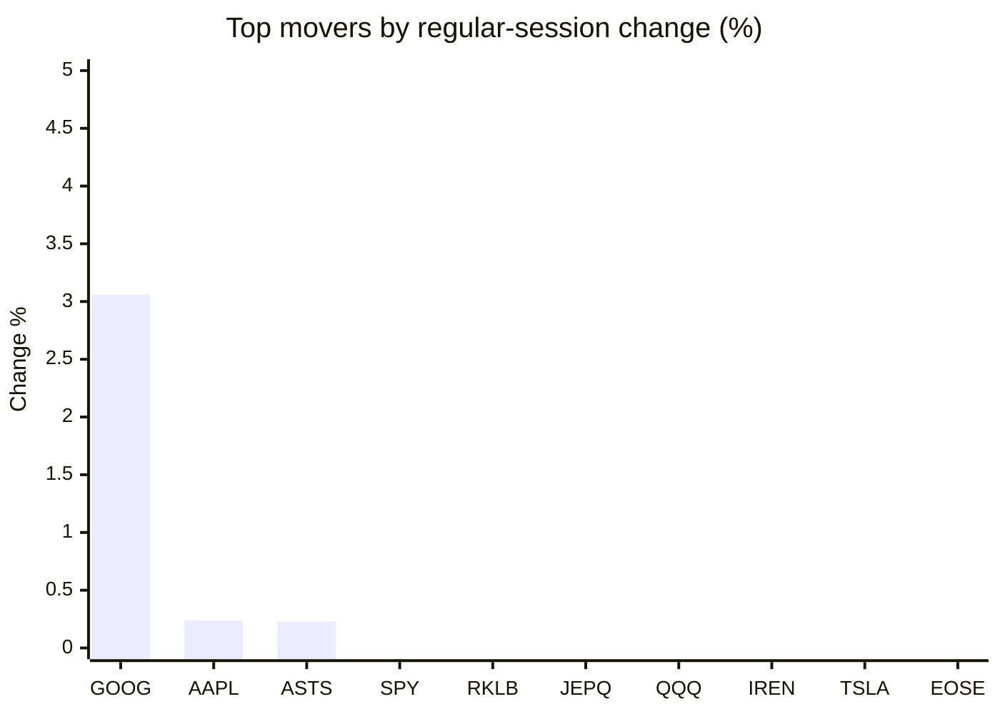
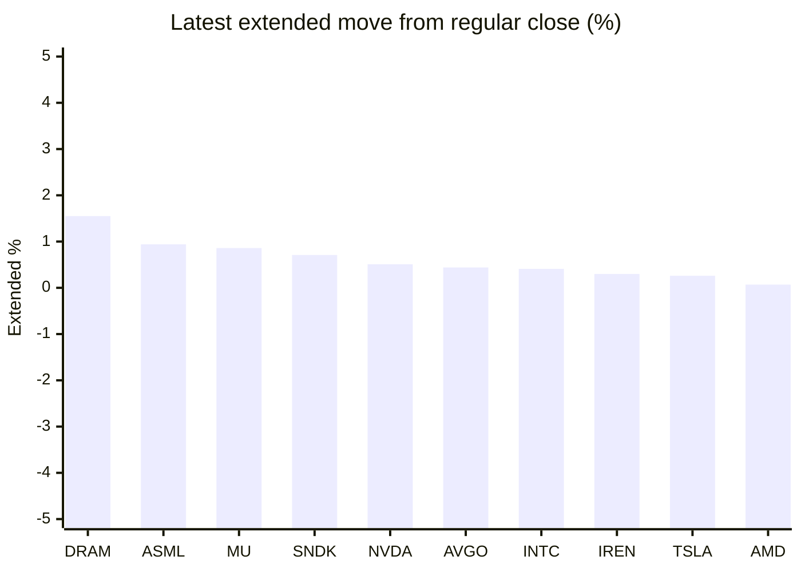

# Stock Brief - 2026-09-15

Generated at 2026-09-15 14:27 +07 from `watchlist.md`.
Prices are snapshots from Yahoo Finance public chart data. Extended/overnight is the latest available pre/post-market datapoint from the same feed.

## Market Snapshot

- SPY: close 760.88, latest extended 761.13, regular move -0.45%, extended move +0.03%
- QQQ: close 709.18, latest extended 709.61, regular move -0.80%, extended move +0.06%
- JEPQ: close 59.35, latest extended 59.37, regular move -0.72%, extended move +0.03%

## Watchlist Prices

| Ticker | Name | Regular close | Latest extended/overnight | Regular move | Extended move | Latest data time | Source |
|---|---|---:|---:|---:|---:|---|---|
| INTC | Intel Corporation | 97.19 USD | 97.59 USD | -5.59% | +0.41% | 2026-09-14 19:59 EDT | [Yahoo](https://finance.yahoo.com/quote/INTC/) |
| AVGO | Broadcom Inc. | 344.72 USD | 346.22 USD | -4.77% | +0.44% | 2026-09-14 19:59 EDT | [Yahoo](https://finance.yahoo.com/quote/AVGO/) |
| RKLB | Rocket Lab Corporation | 62.55 USD | 62.55 USD | -0.64% | +0.00% | 2026-09-14 19:59 EDT | [Yahoo](https://finance.yahoo.com/quote/RKLB/) |
| AAPL | Apple Inc. | 333.08 USD | 332.23 USD | +0.24% | -0.26% | 2026-09-14 19:59 EDT | [Yahoo](https://finance.yahoo.com/quote/AAPL/) |
| NVDA | NVIDIA Corporation | 210.96 USD | 212.04 USD | -3.36% | +0.51% | 2026-09-14 19:59 EDT | [Yahoo](https://finance.yahoo.com/quote/NVDA/) |
| TSLA | Tesla, Inc. | 358.97 USD | 359.89 USD | -1.77% | +0.26% | 2026-09-14 19:59 EDT | [Yahoo](https://finance.yahoo.com/quote/TSLA/) |
| SNDK | Sandisk Corporation | 1,551.99 USD | 1,563.00 USD | -4.98% | +0.71% | 2026-09-14 19:59 EDT | [Yahoo](https://finance.yahoo.com/quote/SNDK/) |
| QQQ | Invesco QQQ Trust, Series 1 | 709.18 USD | 709.61 USD | -0.80% | +0.06% | 2026-09-14 19:59 EDT | [Yahoo](https://finance.yahoo.com/quote/QQQ/) |
| SPY | State Street SPDR S&P 500 ETF T | 760.88 USD | 761.13 USD | -0.45% | +0.03% | 2026-09-14 19:59 EDT | [Yahoo](https://finance.yahoo.com/quote/SPY/) |
| JEPQ | JPMorgan Nasdaq Equity Premium  | 59.35 USD | 59.37 USD | -0.72% | +0.03% | 2026-09-14 19:58 EDT | [Yahoo](https://finance.yahoo.com/quote/JEPQ/) |
| ASTS | AST SpaceMobile, Inc. | 60.00 USD | 60.00 USD | +0.23% | +0.00% | 2026-09-14 19:59 EDT | [Yahoo](https://finance.yahoo.com/quote/ASTS/) |
| MU | Micron Technology, Inc. | 924.03 USD | 931.94 USD | -5.25% | +0.86% | 2026-09-14 19:59 EDT | [Yahoo](https://finance.yahoo.com/quote/MU/) |
| IREN | IREN LIMITED | 43.17 USD | 43.30 USD | -1.51% | +0.30% | 2026-09-14 19:59 EDT | [Yahoo](https://finance.yahoo.com/quote/IREN/) |
| EOSE | Eos Energy Enterprises, Inc. | 3.82 USD | 3.82 USD | -3.29% | +0.03% | 2026-09-14 19:54 EDT | [Yahoo](https://finance.yahoo.com/quote/EOSE/) |
| GOOG | Alphabet Inc. | 345.71 USD | 344.15 USD | +3.06% | -0.45% | 2026-09-14 19:59 EDT | [Yahoo](https://finance.yahoo.com/quote/GOOG/) |
| DRAM | Roundhill Memory ETF | 54.80 USD | 55.65 USD | -7.28% | +1.55% | 2026-09-14 19:59 EDT | [Yahoo](https://finance.yahoo.com/quote/DRAM/) |
| AMD | Advanced Micro Devices, Inc. | 493.41 USD | 493.78 USD | -4.40% | +0.07% | 2026-09-14 19:59 EDT | [Yahoo](https://finance.yahoo.com/quote/AMD/) |
| ASML | ASML Holding N.V. - New York Re | 1,575.15 USD | 1,589.93 USD | -7.25% | +0.94% | 2026-09-14 19:59 EDT | [Yahoo](https://finance.yahoo.com/quote/ASML/) |

## Charts

### Top Movers - Regular Session

### Extended / Overnight Move

### Quick Heatmap

| Group | Names in watchlist | Avg regular move | Avg extended move |
|---|---|---:|---:|
| Mega-cap tech | AVGO, AAPL, NVDA, TSLA, GOOG | -1.32% | +0.10% |
| Semis / memory | INTC, SNDK, MU, DRAM, AMD, ASML | -5.79% | +0.76% |
| Space / high beta | RKLB, ASTS, IREN, EOSE | -1.30% | +0.08% |
| ETFs | QQQ, SPY, JEPQ | -0.65% | +0.04% |

## News Headlines

- [Tesla, SpaceX Stocks Rise Overnight: Elon Musk Fuels Merger Speculation, ‘Hints’ At Action Amid ‘Close Collaboration’](https://stocktwits.com/news-articles/markets/equity/tesla-spacex-elon-musk-merger-speculation-hints-action-close-collaboration/cZtnRwSRBTo?.tsrc=rss) (2026-09-15 14:06 Bangkok)
- [Chip Stocks Sink on AI Slowdown Calls, But Analysts Doubt a Crash Is Near](https://beincrypto.com/chip-stocks-ai-slowdown-crash-risk/?.tsrc=rss) (2026-09-15 13:05 Bangkok)
- [Rocket Lab Expects Iridium Deal To Double Its Size ‘Overnight’ — CFO Says More Space Deals May Follow](https://stocktwits.com/news-articles/markets/equity/rocketlab-iridium-deal-double-overnight-cfo-more-space-deals/cZtVCEpRBTl?.tsrc=rss) (2026-09-15 12:25 Bangkok)
- [AST SpaceMobile (ASTS) Stock May Be Expensive Despite Its Huge 3 Year Run](https://finance.yahoo.com/markets/stocks/articles/ast-spacemobile-asts-stock-may-051737921.html?.tsrc=rss) (2026-09-15 12:17 Bangkok)
- [3 AI Robotics Stocks Worth Owning Over Tesla Right Now](https://www.fool.com/investing/2026/09/15/3-ai-robotics-stocks-worth-owning-over-tesla-right/?.tsrc=rss) (2026-09-15 11:35 Bangkok)
- [Prediction: Micron Stock Will Hit $1,250 After Sept. 30](https://www.fool.com/investing/2026/09/15/prediction-micron-stock-will-hit-1250-after-sept-3/?.tsrc=rss) (2026-09-15 11:20 Bangkok)
- [Amazon Could Buy Up to $60 Billion From Qualcomm Just as Apple Brings Modems In-House. Is the AI Pivot Real?](https://finance.yahoo.com/technology/ai/articles/amazon-could-buy-60-billion-041125286.html?.tsrc=rss) (2026-09-15 11:11 Bangkok)
- [Why Micron, Intel, AMD, and Other Chip Stocks Fell Today](https://www.fool.com/investing/2026/09/14/why-micron-intel-amd-chip-stocks-fell-today/?.tsrc=rss) (2026-09-15 10:28 Bangkok)

## Caveats

- This is not investment advice. Extended-hours prices can be thin and volatile.
- Yahoo public endpoints may lag official exchange data.
