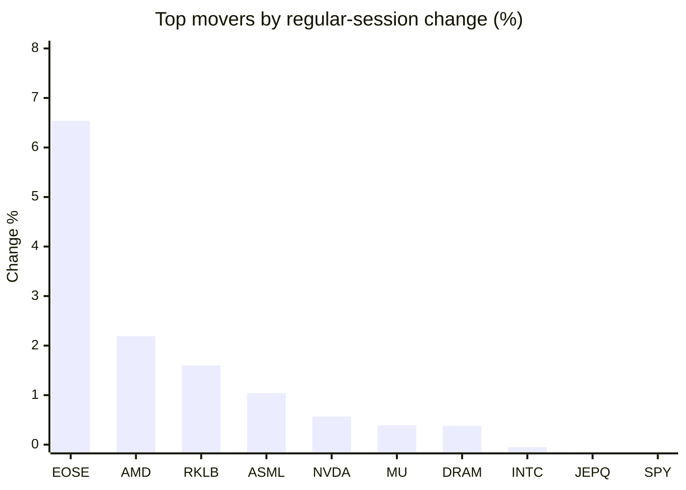
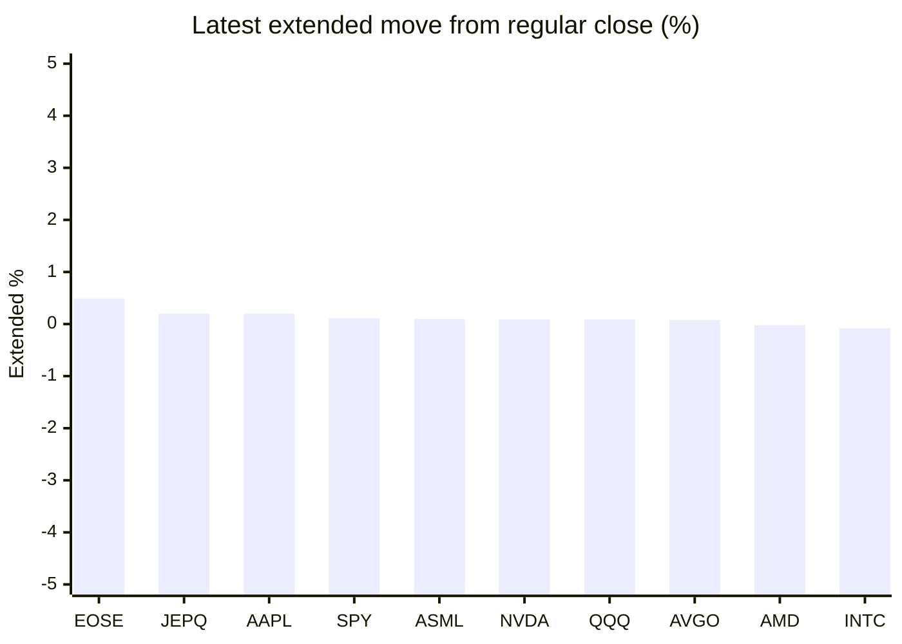

# Stock Brief - 2026-09-16

Generated at 2026-09-16 14:25 +07 from `watchlist.md`.
Prices are snapshots from Yahoo Finance public chart data. Extended/overnight is the latest available pre/post-market datapoint from the same feed.

## Market Snapshot

- SPY: close 757.39, latest extended 758.23, regular move -0.46%, extended move +0.11%
- QQQ: close 704.54, latest extended 705.19, regular move -0.65%, extended move +0.09%
- JEPQ: close 59.08, latest extended 59.20, regular move -0.45%, extended move +0.20%

## Watchlist Prices

| Ticker | Name | Regular close | Latest extended/overnight | Regular move | Extended move | Latest data time | Source |
|---|---|---:|---:|---:|---:|---|---|
| INTC | Intel Corporation | 97.14 USD | 97.06 USD | -0.05% | -0.08% | 2026-09-15 19:59 EDT | [Yahoo](https://finance.yahoo.com/quote/INTC/) |
| AVGO | Broadcom Inc. | 339.27 USD | 339.55 USD | -1.58% | +0.08% | 2026-09-15 19:59 EDT | [Yahoo](https://finance.yahoo.com/quote/AVGO/) |
| RKLB | Rocket Lab Corporation | 63.55 USD | 63.30 USD | +1.60% | -0.39% | 2026-09-15 19:59 EDT | [Yahoo](https://finance.yahoo.com/quote/RKLB/) |
| AAPL | Apple Inc. | 331.34 USD | 332.00 USD | -0.52% | +0.20% | 2026-09-15 19:59 EDT | [Yahoo](https://finance.yahoo.com/quote/AAPL/) |
| NVDA | NVIDIA Corporation | 212.17 USD | 212.37 USD | +0.57% | +0.09% | 2026-09-15 19:59 EDT | [Yahoo](https://finance.yahoo.com/quote/NVDA/) |
| TSLA | Tesla, Inc. | 356.58 USD | 355.85 USD | -0.67% | -0.20% | 2026-09-15 19:59 EDT | [Yahoo](https://finance.yahoo.com/quote/TSLA/) |
| SNDK | Sandisk Corporation | 1,530.90 USD | 1,526.56 USD | -1.36% | -0.28% | 2026-09-15 19:59 EDT | [Yahoo](https://finance.yahoo.com/quote/SNDK/) |
| QQQ | Invesco QQQ Trust, Series 1 | 704.54 USD | 705.19 USD | -0.65% | +0.09% | 2026-09-15 19:59 EDT | [Yahoo](https://finance.yahoo.com/quote/QQQ/) |
| SPY | State Street SPDR S&P 500 ETF T | 757.39 USD | 758.23 USD | -0.46% | +0.11% | 2026-09-15 19:59 EDT | [Yahoo](https://finance.yahoo.com/quote/SPY/) |
| JEPQ | JPMorgan Nasdaq Equity Premium  | 59.08 USD | 59.20 USD | -0.45% | +0.20% | 2026-09-15 19:59 EDT | [Yahoo](https://finance.yahoo.com/quote/JEPQ/) |
| ASTS | AST SpaceMobile, Inc. | 58.77 USD | 58.55 USD | -2.05% | -0.37% | 2026-09-15 19:59 EDT | [Yahoo](https://finance.yahoo.com/quote/ASTS/) |
| MU | Micron Technology, Inc. | 927.60 USD | 925.83 USD | +0.39% | -0.19% | 2026-09-15 19:59 EDT | [Yahoo](https://finance.yahoo.com/quote/MU/) |
| IREN | IREN LIMITED | 41.58 USD | 41.42 USD | -3.68% | -0.38% | 2026-09-15 19:59 EDT | [Yahoo](https://finance.yahoo.com/quote/IREN/) |
| EOSE | Eos Energy Enterprises, Inc. | 4.07 USD | 4.09 USD | +6.54% | +0.49% | 2026-09-15 19:59 EDT | [Yahoo](https://finance.yahoo.com/quote/EOSE/) |
| GOOG | Alphabet Inc. | 341.43 USD | 340.76 USD | -1.24% | -0.19% | 2026-09-15 19:59 EDT | [Yahoo](https://finance.yahoo.com/quote/GOOG/) |
| DRAM | Roundhill Memory ETF | 55.01 USD | 54.91 USD | +0.38% | -0.18% | 2026-09-15 19:59 EDT | [Yahoo](https://finance.yahoo.com/quote/DRAM/) |
| AMD | Advanced Micro Devices, Inc. | 504.20 USD | 504.10 USD | +2.19% | -0.02% | 2026-09-15 19:59 EDT | [Yahoo](https://finance.yahoo.com/quote/AMD/) |
| ASML | ASML Holding N.V. - New York Re | 1,591.48 USD | 1,593.00 USD | +1.04% | +0.10% | 2026-09-15 19:59 EDT | [Yahoo](https://finance.yahoo.com/quote/ASML/) |

## Charts

### Top Movers - Regular Session

### Extended / Overnight Move

### Quick Heatmap

| Group | Names in watchlist | Avg regular move | Avg extended move |
|---|---|---:|---:|
| Mega-cap tech | AVGO, AAPL, NVDA, TSLA, GOOG | -0.69% | -0.00% |
| Semis / memory | INTC, SNDK, MU, DRAM, AMD, ASML | +0.43% | -0.11% |
| Space / high beta | RKLB, ASTS, IREN, EOSE | +0.60% | -0.17% |
| ETFs | QQQ, SPY, JEPQ | -0.52% | +0.14% |

## News Headlines

- [Elon Musk Promised "Over a Million Robotaxis" by 2020. None Materialized, and a Dedicated Robotaxi Fleet Isn't Expected Until at Least 2027. Here's What That Track Record Means for Tesla's Valuation.](https://www.fool.com/investing/2026/09/16/elon-musk-promised-over-a-million-robotaxis-by-202/?.tsrc=rss) (2026-09-16 13:57 Bangkok)
- [Top "Magnificent Seven" Picks for Patient Long-Term Investors](https://www.fool.com/investing/2026/09/16/top-magnificent-seven-picks-for-patient-long-term/?.tsrc=rss) (2026-09-16 13:20 Bangkok)
- [Michael Burry Just Said 7 Words Dismissing AI After Slowdown Fears: "There Is Nothing AI to Slow Down." Should Investors Trust His Nvidia and Palantir Shorts?](https://www.fool.com/investing/2026/09/16/michael-burry-just-said-7-words-dismissing-ai-afte/?.tsrc=rss) (2026-09-16 12:55 Bangkok)
- [RKLB, ASTS, SPCX, RDW Stocks Set For A Boost? Pentagon Confirms Orbital Weapons Use, Ramps Up Golden Dome Plans](https://stocktwits.com/news-articles/markets/equity/rklb-asts-spcx-rdw-stocks-pentagon-orbital-weapons-golden-dome-plans/cZtYcxMRB2P?.tsrc=rss) (2026-09-16 10:17 Bangkok)
- [Trump, Xi Jinping Dinner to Include Nvidia's Jensen Huang Amid Chip War Tensions: Report](https://finance.yahoo.com/technology/articles/trump-xi-jinping-dinner-nvidias-031140184.html?.tsrc=rss) (2026-09-16 10:11 Bangkok)
- [Bank of America makes bold chip call after AI sell-off](https://www.thestreet.com/investing/stocks/bank-of-america-makes-bold-chip-call-after-ai-sell-off?.tsrc=rss) (2026-09-16 10:07 Bangkok)
- [Where Will Palantir Stock Be in 5 Years?](https://www.fool.com/investing/2026/09/16/where-will-palantir-stock-be-in-5-years/?.tsrc=rss) (2026-09-16 14:15 Bangkok)
- [Why is European money financing the American AI boom?](https://www.euronews.com/2026/09/16/why-is-european-money-financing-the-american-ai-boom?.tsrc=rss) (2026-09-16 12:11 Bangkok)

## Caveats

- This is not investment advice. Extended-hours prices can be thin and volatile.
- Yahoo public endpoints may lag official exchange data.
