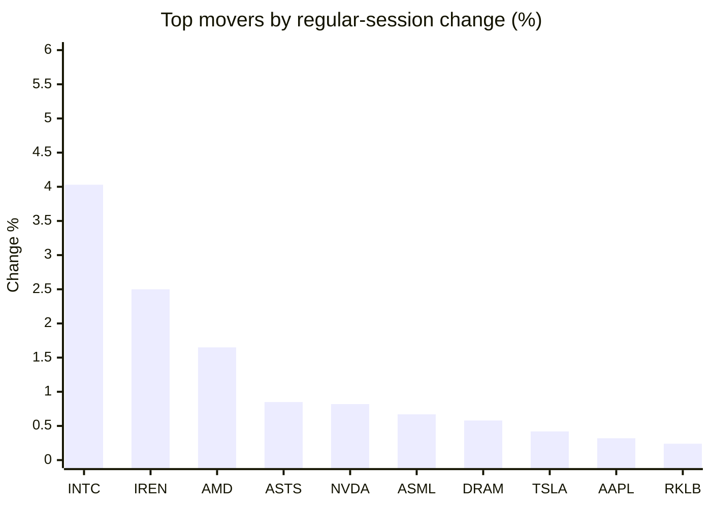
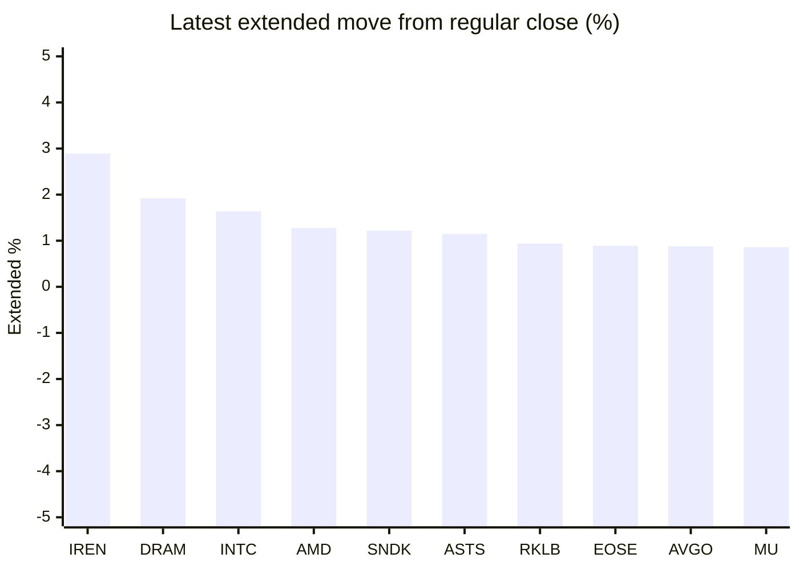

# Stock Brief - 2026-09-17

Generated at 2026-09-17 14:22 +07 from `watchlist.md`.
Prices are snapshots from Yahoo Finance public chart data. Extended/overnight is the latest available pre/post-market datapoint from the same feed.

## Market Snapshot

- SPY: close 754.05, latest extended 757.47, regular move -0.44%, extended move +0.45%
- QQQ: close 704.72, latest extended 709.46, regular move +0.03%, extended move +0.67%
- JEPQ: close 59.09, latest extended 59.39, regular move +0.02%, extended move +0.51%

## Watchlist Prices

| Ticker | Name | Regular close | Latest extended/overnight | Regular move | Extended move | Latest data time | Source |
|---|---|---:|---:|---:|---:|---|---|
| INTC | Intel Corporation | 101.05 USD | 102.71 USD | +4.03% | +1.64% | 2026-09-16 19:59 EDT | [Yahoo](https://finance.yahoo.com/quote/INTC/) |
| AVGO | Broadcom Inc. | 339.51 USD | 342.50 USD | +0.07% | +0.88% | 2026-09-16 19:59 EDT | [Yahoo](https://finance.yahoo.com/quote/AVGO/) |
| RKLB | Rocket Lab Corporation | 63.70 USD | 64.30 USD | +0.24% | +0.94% | 2026-09-16 19:59 EDT | [Yahoo](https://finance.yahoo.com/quote/RKLB/) |
| AAPL | Apple Inc. | 332.41 USD | 333.43 USD | +0.32% | +0.31% | 2026-09-16 19:59 EDT | [Yahoo](https://finance.yahoo.com/quote/AAPL/) |
| NVDA | NVIDIA Corporation | 213.90 USD | 215.68 USD | +0.82% | +0.83% | 2026-09-16 19:59 EDT | [Yahoo](https://finance.yahoo.com/quote/NVDA/) |
| TSLA | Tesla, Inc. | 358.08 USD | 359.86 USD | +0.42% | +0.50% | 2026-09-16 19:59 EDT | [Yahoo](https://finance.yahoo.com/quote/TSLA/) |
| SNDK | Sandisk Corporation | 1,519.97 USD | 1,538.49 USD | -0.71% | +1.22% | 2026-09-16 19:59 EDT | [Yahoo](https://finance.yahoo.com/quote/SNDK/) |
| QQQ | Invesco QQQ Trust, Series 1 | 704.72 USD | 709.46 USD | +0.03% | +0.67% | 2026-09-16 19:59 EDT | [Yahoo](https://finance.yahoo.com/quote/QQQ/) |
| SPY | State Street SPDR S&P 500 ETF T | 754.05 USD | 757.47 USD | -0.44% | +0.45% | 2026-09-16 19:59 EDT | [Yahoo](https://finance.yahoo.com/quote/SPY/) |
| JEPQ | JPMorgan Nasdaq Equity Premium  | 59.09 USD | 59.39 USD | +0.02% | +0.51% | 2026-09-16 19:58 EDT | [Yahoo](https://finance.yahoo.com/quote/JEPQ/) |
| ASTS | AST SpaceMobile, Inc. | 59.27 USD | 59.95 USD | +0.85% | +1.15% | 2026-09-16 19:59 EDT | [Yahoo](https://finance.yahoo.com/quote/ASTS/) |
| MU | Micron Technology, Inc. | 926.55 USD | 934.50 USD | -0.11% | +0.86% | 2026-09-16 19:59 EDT | [Yahoo](https://finance.yahoo.com/quote/MU/) |
| IREN | IREN LIMITED | 42.62 USD | 43.85 USD | +2.50% | +2.89% | 2026-09-16 19:59 EDT | [Yahoo](https://finance.yahoo.com/quote/IREN/) |
| EOSE | Eos Energy Enterprises, Inc. | 3.93 USD | 3.97 USD | -3.32% | +0.89% | 2026-09-16 19:59 EDT | [Yahoo](https://finance.yahoo.com/quote/EOSE/) |
| GOOG | Alphabet Inc. | 339.36 USD | 341.88 USD | -0.61% | +0.74% | 2026-09-16 19:59 EDT | [Yahoo](https://finance.yahoo.com/quote/GOOG/) |
| DRAM | Roundhill Memory ETF | 55.33 USD | 56.39 USD | +0.58% | +1.92% | 2026-09-16 19:59 EDT | [Yahoo](https://finance.yahoo.com/quote/DRAM/) |
| AMD | Advanced Micro Devices, Inc. | 512.50 USD | 519.05 USD | +1.65% | +1.28% | 2026-09-16 19:59 EDT | [Yahoo](https://finance.yahoo.com/quote/AMD/) |
| ASML | ASML Holding N.V. - New York Re | 1,602.22 USD | 1,615.05 USD | +0.67% | +0.80% | 2026-09-16 19:59 EDT | [Yahoo](https://finance.yahoo.com/quote/ASML/) |

## Charts

### Top Movers - Regular Session

### Extended / Overnight Move

### Quick Heatmap

| Group | Names in watchlist | Avg regular move | Avg extended move |
|---|---|---:|---:|
| Mega-cap tech | AVGO, AAPL, NVDA, TSLA, GOOG | +0.20% | +0.65% |
| Semis / memory | INTC, SNDK, MU, DRAM, AMD, ASML | +1.02% | +1.29% |
| Space / high beta | RKLB, ASTS, IREN, EOSE | +0.07% | +1.47% |
| ETFs | QQQ, SPY, JEPQ | -0.13% | +0.54% |

## News Headlines

- [Zacks Investment Ideas feature highlights: SpaceX's and Tesla](https://finance.yahoo.com/markets/stocks/articles/zacks-investment-ideas-feature-highlights-070500470.html?.tsrc=rss) (2026-09-17 14:05 Bangkok)
- [Zacks Earnings Trends Highlights: Micron  and Nvidia](https://finance.yahoo.com/markets/stocks/articles/zacks-earnings-trends-highlights-micron-070100921.html?.tsrc=rss) (2026-09-17 14:01 Bangkok)
- [Nvidia Has Returned $46 Billion to Shareholders This Year, and Another Major Dividend Hike Could Be Coming](https://www.fool.com/investing/2026/09/17/nvidia-has-returned-46-billion-to-shareholders-thi/?.tsrc=rss) (2026-09-17 13:25 Bangkok)
- [Could SpaceX Buy Tesla? Ron Baron Says He Gave Elon Musk Reasons For And Against A Blockbuster Deal](https://stocktwits.com/news-articles/markets/equity/could-spacex-buy-tesla-ron-baron-elon-musk-reasons-for-against-deal/cZtrX9jRB5J?.tsrc=rss) (2026-09-17 12:18 Bangkok)
- [If the Pace of AI Is Slowed, Investors Can Turn to Quantum Computing. 4 Quantum Stocks to Buy Now.](https://www.fool.com/investing/2026/09/17/if-the-pace-of-ai-is-slowed-investors-can-turn-to/?.tsrc=rss) (2026-09-17 11:20 Bangkok)
- [Snowflake Surging to All-Time Highs](https://www.fool.com/investing/2026/09/16/snowflake-surging-to-all-time-highs/?.tsrc=rss) (2026-09-17 10:43 Bangkok)
- [RKLB Stock Eyes Ending 5-Week Slide: Iridium Deal Clears First FCC Hurdle, VC Backer Hails Solar Breakthrough](https://stocktwits.com/news-articles/markets/equity/rklb-stock-iridium-deal-fcc-hurdle-vc-backer-solar-breakthrough/cZtr9VxRB53?.tsrc=rss) (2026-09-17 10:39 Bangkok)
- [The Competition's Response to Tesla Robotaxi Day](https://www.fool.com/investing/2026/09/16/the-competition-s-response-to-tesla-robotaxi-day/?.tsrc=rss) (2026-09-17 10:31 Bangkok)

## Caveats

- This is not investment advice. Extended-hours prices can be thin and volatile.
- Yahoo public endpoints may lag official exchange data.
